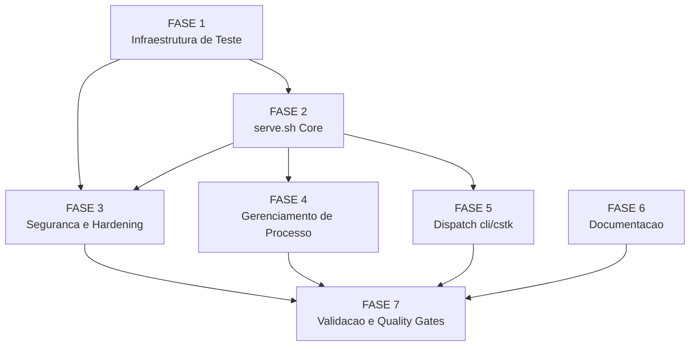

# Backlog: panel-installer

**Feature**: `cstk serve [--port 5173] [--host 127.0.0.1] [--reinstall]`
**Spec**: [spec.md](./spec.md) | **Plan**: [plan.md](./plan.md)
**Date**: 2026-05-26 | **Status**: planejado

---

## Legendas

### Status de Subtarefa
| Simbolo | Significado |
|---------|-------------|
| `[ ]` | pendente |
| `[x]` | concluida |
| `[~]` | em progresso |
| `[!]` | bloqueada |

### Criticidade de Tarefa
| Tag | Criterio |
|-----|----------|
| `[C]` | critico — impacto de seguranca, integridade ou violacao de constitution |
| `[A]` | alto — funcionalidade core sem a qual `cstk serve` nao opera |
| `[M]` | medio — necessario mas adiavel sem impactar o core |

---

## FASE 1 — Infraestrutura de Teste e Fixtures

> Preparar o harness de teste antes de implementar qualquer logica. Permite
> validar cada funcao de `serve.sh` incrementalmente sem rede real.
> Ref: spec.md §Success Criteria, plan.md §Testing, contracts/serve-sh.md §Testabilidade.

### 1.1 Estrutura do arquivo de teste `tests/cstk/test_serve.sh` [A]

> Ref: CLAUDE.md regra-de-ouro (--check-coverage falha sem test_serve.sh),
> contracts/serve-sh.md §Testabilidade.

- [x] 1.1.1 Criar `tests/cstk/test_serve.sh` com cabecalho padrao do harness
      (`#!/bin/sh`, `set -eu`, sourcing de `tests/helpers.sh` ou equivalente)
- [x] 1.1.2 Adicionar stub `_setup_serve_env`: cria `CSTK_PANEL_DIR` em tmpdir
      privado e define `CSTK_LIB` apontando para `cli/lib/`
- [x] 1.1.3 Adicionar stub `_stub_curl_ok`: coloca no PATH um script `curl` que
      retorna fixture JSON da GitHub API (tag + tarball_url) sem tocar a rede
- [x] 1.1.4 Adicionar stub `_stub_npm_ok`: coloca no PATH um `npm` que ignora
      `install`/`run start` e sai com exit 0 (dummy sem execucao real)
- [x] 1.1.5 Adicionar stub `_stub_curl_absent` / `_stub_npm_absent`: remove as
      ferramentas do PATH para testar prereq-check
- [x] 1.1.6 Criar fixture de tarball minimo (`tests/cstk/fixtures/serve/`):
      tarball `.tar.gz` com `package.json` minimo (1 nivel de strip) para testar
      extracao sem baixar o cstk-panel real
- [x] 1.1.7 Verificar que `./tests/run.sh --check-coverage` passa apos criacao
      do arquivo (sem scenarios ainda; so a existencia conta)

---

### 1.2 Leitura e documentacao dos helpers reutilizados [M]

> Ref: plan.md §Primary Dependencies, contracts/serve-sh.md §Helpers internos.

- [x] 1.2.1 Ler `cli/lib/http.sh`: documentar assinatura exata de `http_download`
      e `http_check_url` (args, exit codes, stderr/stdout) em comentario no topo
      de `serve.sh` (futuro)
- [x] 1.2.2 Ler `cli/lib/compat.sh`: documentar assinatura de `sha256_file`
      (arg path, stdout hash, exit code)
- [x] 1.2.3 Confirmar que `cli/lib/tarball.sh::download_and_verify` NAO sera
      reutilizado (exige `sha256_url`; registrar decisao inline como comentario
      no `serve.sh` — research.md D2)
- [x] 1.2.4 Ler dispatch em `cli/cstk`: identificar o padrao exato de sourcear
      lib e chamar `<cmd>_main` para replicar em `serve`

---

## FASE 2 — Helper `cli/lib/serve.sh` — Core

> Implementar o helper POSIX que e o coracao da feature. Logica: parse de flags,
> pre-req check, deteccao de instalacao e lazy-install.
> Ref: spec.md FR-001 a FR-008 e FR-011, contracts/serve-sh.md §serve_main,
> data-model.md §PainelInstalado/ReleaseGitHub.

### 2.1 Estrutura do arquivo e parse de flags [A]

> Ref: spec.md FR-004 e FR-011, contracts/cli-serve.md §Flags e §Exit codes.

- [x] 2.1.1 Criar `cli/lib/serve.sh` com shebang comentado e bloco source-guard
      POSIX (`[ "${_SERVE_LOADED:-}" = "1" ] && return 0; _SERVE_LOADED=1`)
- [x] 2.1.2 Implementar parser de flags POSIX (`while`/`case`/`shift`): `--port`,
      `--host`, `--reinstall`, `--help`, flag desconhecida → exit 2
- [x] 2.1.3 Implementar validacao de porta: inteiro 1-65535 com regex POSIX
      (`expr "$port" : '^[0-9]*$'`); porta invalida → mensagem stderr + exit 2
      (CSTK_EXIT_USAGE; FR-004)
- [x] 2.1.4 Implementar logica de aviso para `--host != 127.0.0.1` (FR-004):
      imprimir mensagem de aviso em stdout; prosseguir normalmente
- [x] 2.1.5 Implementar `--help`: imprimir sinopse (conforme contracts/cli-serve.md)
      e sair com exit 0
- [x] 2.1.6 Implementar resolucao de `panel_dir`:
      `${CSTK_PANEL_DIR:-$HOME/.local/share/cstk/panel}` (FR-007)
- [x] 2.1.7 Escrever cenarios de teste em `test_serve.sh`:
      porta invalida → exit 2; flag desconhecida → exit 2; `--help` → exit 0 +
      texto; `--host 0.0.0.0` → aviso no stdout + prossegue

---

### 2.2 Verificacao de pre-requisitos (`curl`, `npm`) [A]

> Ref: spec.md FR-006, contracts/cli-serve.md §Erros, research.md D5.

- [x] 2.2.1 Implementar pre-req check com `command -v curl` → ausente: mensagem
      stderr padrao + exit 1 (CSTK_EXIT_ERROR)
- [x] 2.2.2 Implementar pre-req check com `command -v npm` → ausente: mensagem
      stderr com URL nodejs.org + exit 1
- [x] 2.2.3 Garantir que prereq check ocorre ANTES de qualquer consulta de rede
      ou operacao de filesystem (ordem: parse flags → prereq → detect-install)
- [x] 2.2.4 Escrever cenarios de teste: `curl` ausente → exit 1 + mensagem
      esperada; `npm` ausente → exit 1 + mensagem esperada (stubs de PATH)

---

### 2.3 Deteccao de instalacao existente (lazy-install check) [A]

> Ref: spec.md FR-002, data-model.md §PainelInstalado State transitions, research.md D4.

- [x] 2.3.1 Implementar funcao `_serve_is_installed`: retorna 0 se
      `"$panel_dir/package.json"` existe e legivel, 1 caso contrario
- [x] 2.3.2 Implementar deteccao de instalacao corrompida: `[ -d "$panel_dir" ]`
      mas `package.json` ausente → mensagem + exit 1 com sugestao `--reinstall`
- [x] 2.3.3 Implementar tratamento de `--reinstall`: `rm -rf -- "$panel_dir"`
      antes do check, entao prosseguir como primeira execucao (FR-005)
- [x] 2.3.4 Garantir que invocacao subsequente (panel_dir valido, sem `--reinstall`)
      NAO faz nenhuma chamada de rede (pula totalmente a logica de download)
- [x] 2.3.5 Escrever cenarios de teste: panel valido → sem curl chamado;
      panel corrompido → exit 1 + mensagem; `--reinstall` → rm + reinstala

---

### 2.4 Download e instalacao (lazy-install — primeira execucao) [A]

> Ref: spec.md FR-001/FR-008, contracts/serve-sh.md §serve_main passos 6-9,
> research.md D1/D2, data-model.md §ReleaseGitHub.

- [x] 2.4.1 Implementar consulta a GitHub API: `http_check_url` (HEAD) + request
      GET para `https://api.github.com/repos/JotJunior/cstk-panel/releases/latest`;
      erro HTTP (4xx/5xx) → mensagem + exit 1 (CHK-R26)
- [x] 2.4.2 Implementar extracao de `tag_name` e `tarball_url` da resposta via
      `grep`/`sed` POSIX (sem jq); campos ausentes → exit 1 com mensagem acionavel
- [x] 2.4.3 Implementar pre-check de prerelease/draft: se a resposta JSON indicar
      `"prerelease":true` ou `"draft":true`, exibir mensagem e sair com exit 1
      (CHK-R02 — so usar full releases)
- [x] 2.4.4 Implementar pre-check de timeout: todas as chamadas de curl via
      `http_download` usam `--connect-timeout 30 --max-time 120` (CHK-R03);
      confirmar que `http.sh` repassa esses flags ou adicionar em `serve.sh`
- [x] 2.4.5 Implementar download do tarball via `http_download "$tarball_url"
      "$tmp/archive.tar.gz"` (tmpdir privado via `mktemp -d`); falha → exit 1
- [x] 2.4.6 Implementar integridade best-effort: tentar localizar asset `.sha256`;
      se presente → verificar via `sha256_file`; mismatch → exit 1; ausente →
      AVISO em stdout e prosseguir (FR-008 — NAO bloquear)
- [x] 2.4.7 Verificar tamanho minimo do tarball antes de extrair (ex: `wc -c`
      vs threshold ~1KB); tarball vazio/truncado → exit 1 com mensagem (CHK-R23)
- [x] 2.4.8 Implementar extracao: `tar -xzf "$tmp/archive.tar.gz"
      --strip-components 1 -C "$tmp/extracted"`; falha → exit 1 com mensagem
      de disco (spec P1 edge case)
- [x] 2.4.9 Implementar `npm install` no diretorio extraido; falha → exit 1;
      exibir mensagem de progresso em stdout
- [x] 2.4.10 Implementar move atomico: `mv "$tmp/extracted" "$panel_dir"` apos
      extracao + npm install bem-sucedidos; gravar `.panel-version` com `tag_name`
- [x] 2.4.11 Garantir cleanup do tmpdir em caso de falha (via `trap '...' EXIT`)
- [x] 2.4.12 Escrever cenarios de teste: fixture de tarball local + stub curl;
      extracao bem-sucedida → `package.json` presente + `.panel-version` gravado;
      tarball corrompido → exit 1; npm install falha → exit 1; `package.json`
      ausente apos extracao → exit 1

---

## FASE 3 — Seguranca e Hardening

> Implementar os requisitos de seguranca derivados do security review (S1-S5)
> e dos gaps do checklist (CHK-S03/S04/S05, CHK-R12). Todos os itens sao [C]
> — violacoes sao surface de ataque ou violacao do Principio II.
> Ref: plan.md §Security Review, spec.md FR-011, contracts/serve-sh.md §Requisitos.

### 3.1 SSRF host-allowlist (S2 / CHK-S03) [C]

> Ref: plan.md §S2, spec.md FR-001/FR-012, research.md D1.

- [x] 3.1.1 Implementar validacao de host de `tarball_url` via `case` glob POSIX:
      permitidos `github.com`, `codeload.github.com`, `objects.githubusercontent.com`,
      `api.github.com`; fora da allowlist → exit 1 com mensagem descrevendo o host
      rejeitado (FR-012 / S2)
- [x] 3.1.2 Implementar validacao de schema HTTPS-only: checar que `tarball_url`
      comeca com `https://`; schema `http://` → exit 1 (CHK-S04)
- [x] 3.1.3 Posicionar o host-allowlist check ANTES de qualquer chamada a
      `http_download` (fail-fast: nao baixar URL nao-autorizada)
- [x] 3.1.4 Escrever cenarios de teste: URL com host fora da allowlist → exit 1;
      URL com schema `http://` → exit 1; URL valida (github.com) → prossegue

---

### 3.2 POSIX puro e quoting (S5 / CHK-S05 / FR-011) [C]

> Ref: spec.md FR-011, plan.md §S5, contracts/serve-sh.md §Requisitos de conformidade.

- [x] 3.2.1 Auditar todo o `serve.sh` procurando Bash-isms: arrays, `[[ ]]`,
      `$((...))` fora de `expr`, `local` sem `set -e`, `source` (usar `.`),
      herestrings `<<<`; corrigir todos os encontrados
- [x] 3.2.2 Garantir que `PORT` e exportada com valor ja validado (inteiro puro,
      sem interpolacao de input do usuario no comando `npm run start`); verificar
      que `npm run start` usa args FIXOS sem expansao de variavel no comando base
- [x] 3.2.3 Verificar que ZERO `eval` existe no arquivo (grep como verificacao
      automatizada no proprio teste)
- [x] 3.2.4 Auditar quoting de todas as variaveis de path e URL com aspas duplas:
      `"$panel_dir"`, `"$tarball_url"`, `"$tmp"`, etc.
- [x] 3.2.5 Executar `shellcheck --shell=sh cli/lib/serve.sh` (advisory; zero
      findings em SC2006/SC2039/SC2148) — se shellcheck disponivel; anotar
      resultado no comentario da PR
- [x] 3.2.6 Escrever cenario de teste: `grep -c 'eval' cli/lib/serve.sh` deve
      retornar 0 (assertion no proprio `test_serve.sh`)

---

### 3.3 Porta privilegiada < 1024 (CHK-R12) [C]

> Ref: spec.md FR-004 §Edge Cases, contracts/cli-serve.md §Exit codes.

- [x] 3.3.1 Implementar deteccao de porta < 1024: se `port < 1024`, exibir
      mensagem informativa em stderr ("porta <N> requer privilegio de root no
      Linux; tente --port 5173 ou porta acima de 1024") e sair com exit 1
      (decisao do orquestrador: exit 1 com aviso, NAO exit 2 — erro de ambiente,
      nao de uso incorreto)
- [x] 3.3.2 Garantir que validacao de porta ocorre na seguinte ordem:
      (1) inteiro? nao → exit 2; (2) 1-65535? nao → exit 2; (3) < 1024? → exit 1
      com aviso
- [x] 3.3.3 Escrever cenarios de teste: porta 80 → exit 1 + mensagem de privilegio;
      porta 0 → exit 2; porta 65536 → exit 2; porta 65535 → aceita; porta 5173 → aceita

---

## FASE 4 — Gerenciamento de Processo

> Implementar o ciclo de vida do processo `npm run start`: start em foreground,
> trap SIGINT/SIGTERM com grace period, deteccao de saida espontanea do filho.
> Ref: spec.md FR-009 e FR-013-INFRA-PROC, contracts/cli-serve.md §Encerramento.

### 4.1 Start em foreground e entrega de porta [A]

> Ref: spec.md FR-003/FR-004/FR-013-INFRA-PROC, research.md D6.

- [x] 4.1.1 Implementar exportacao de `PORT`: `export PORT="$port"` (valor
      resolvido e validado); confirmar que SEMPRE e exportado (nunca omitido)
- [x] 4.1.2 Implementar `cd "$panel_dir"` seguido de `npm run start` em
      foreground; exibir mensagem com URL antes de subir
      (`"cstk serve: iniciando painel em http://127.0.0.1:$port  (Ctrl+C para encerrar)"`)
- [x] 4.1.3 Garantir que o `npm run start` e invocado com args FIXOS (sem
      interpolacao de input do usuario no nome do comando ou nos args — S5)
- [x] 4.1.4 Exibir mensagem de versao instalada quando `.panel-version` presente:
      `"cstk serve: usando painel ja instalado (<tag>)."` (contracts/cli-serve.md)
- [x] 4.1.5 Escrever cenario de teste: stub de `npm` que imprime stdout esperado e
      sai com 0; verificar mensagem de URL e exit 0 de `serve_main`

---

### 4.2 Trap SIGINT/SIGTERM com grace period e SIGKILL [A]

> Ref: spec.md FR-009, contracts/cli-serve.md §Encerramento, CHK-R06.

- [x] 4.2.1 Implementar `trap '_serve_shutdown' INT TERM` antes de executar `npm
      run start`; capturar o PID do filho (`npm run start & _npm_pid=$!`)
- [x] 4.2.2 Implementar `_serve_shutdown`: (1) imprimir mensagem de encerramento;
      (2) `kill -TERM "$_npm_pid"` 2>/dev/null; (3) aguardar ate 5 segundos; (4)
      se filho ainda vivo → `kill -KILL "$_npm_pid"` 2>/dev/null (CHK-R06 grace
      period SIGKILL)
- [x] 4.2.3 Implementar `wait "$_npm_pid"` em foreground apos registrar trap;
      capturar exit code do filho e propagar via `exit $?`
- [x] 4.2.4 Escrever cenario de teste: stub de `npm` que sai espontaneamente com
      exit 2; verificar que `serve_main` propaga exit 2 (CHK-R07)
- [ ] 4.2.5 Escrever cenario de teste (simulado): `npm` que ignora SIGTERM;
      verificar que apos 5s o processo recebe SIGKILL e o wrapper sai com exit 0
      (pode ser simplificado com timeout curto via variavel de teste)

---

### 4.3 Deteccao de saida espontanea do filho (CHK-R07) [A]

> Ref: spec.md FR-009 §Edge Cases implicitly, CHK-R07.

- [x] 4.3.1 Garantir que `wait "$_npm_pid"` captura o exit code correto quando o
      filho sai espontaneamente (sem SIGINT do operador)
- [x] 4.3.2 Implementar mensagem ao detectar saida espontanea com exit != 0:
      `"cstk serve: painel encerrou inesperadamente (exit $exit_code)."` em stderr
- [x] 4.3.3 Escrever cenario de teste: stub de `npm` que sai com exit 1 imediatamente;
      verificar mensagem de encerramento inesperado + propagacao de exit 1

---

## FASE 5 — Dispatch e Integracao no `cli/cstk`

> Conectar o helper ao binario `cstk`: adicionar case no dispatch, bloco de help,
> e garantir que nenhum outro subcomando e afetado.
> Ref: plan.md §Project Structure, contracts/cli-serve.md, CLAUDE.md §Architecture.

### 5.1 Dispatch `serve` no binario `cli/cstk` [A]

> Ref: plan.md §Project Structure §Source Code, research.md D3 (convencao dispatch).

- [x] 5.1.1 Ler o `cli/cstk` atual e identificar o `case "$_cmd" in ... esac`
      de dispatch de subcomandos
- [x] 5.1.2 Adicionar case `serve)`:
      `. "$CSTK_LIB/serve.sh"; serve_main "$@"` seguindo o padrao exato dos
      outros subcomandos
- [x] 5.1.3 Garantir que o bloco `serve)` e adicionado ANTES do `*)` (default/
      unknown command) e DEPOIS dos subcomandos existentes (sem quebrar ordem
      lexicografica dos demais)
- [x] 5.1.4 Verificar que `cstk --help` (ou ajuda global) menciona `serve` na
      lista de subcomandos disponivel; adicionar linha se ausente
- [x] 5.1.5 Escrever cenario de teste de smoke: `cstk serve --help` → exit 0 +
      texto de ajuda esperado (usando o harness existente de `test_cstk-main.sh`
      ou analogo)

---

### 5.2 Help text integrado [M]

> Ref: contracts/cli-serve.md §Sinopse, CLAUDE.md §Architecture.

- [x] 5.2.1 Implementar texto de ajuda dentro de `serve_main --help`: sinopse,
      flags com defaults, exit codes, exemplos de uso (ao menos 3)
- [x] 5.2.2 Garantir que a ajuda esta em ingles (CLAUDE.md — identificadores e
      mensagens de ajuda em ingles; mensagens de erro em portugues sao aceitaveis
      para UX mas help text segue o padrao do repo)
- [x] 5.2.3 Escrever cenario de teste: `serve_main --help` imprime as flags
      `--port`, `--host`, `--reinstall` no stdout

---

## FASE 6 — Documentacao e Changelog

> Atualizar documentacao do usuario para refletir o novo subcomando.
> Ref: CLAUDE.md §Architecture, contracts/cli-serve.md.

### 6.1 Atualizacao do README e quickstart [M]

> Ref: docs/specs/panel-installer/quickstart.md ja existe como artefato de spec.

- [ ] 6.1.1 Verificar se existe `README.md` na raiz do repo ou em `cli/`; se
      houver secao de subcomandos, adicionar `serve` com descricao de 1 linha e
      exemplo basico
- [ ] 6.1.2 Verificar se o `quickstart.md` da spec precisa ser integrado ao
      `docs/` do projeto ou permanece so em `docs/specs/panel-installer/`
      (decisao: manter em specs para agora; pode ser promovido por operacao separada)
- [ ] 6.1.3 Adicionar entrada em `CHANGELOG.md` (se existir) ou anotar no commit
      message: `feat(cli): add cstk serve subcommand (panel-installer)`

---

### 6.2 Atualizacao do CLAUDE.md (se aplicavel) [M]

> Ref: CLAUDE.md §Architecture §Commands, regra de ouro de scripts.

- [ ] 6.2.1 Verificar se o CLAUDE.md lista subcomandos do `cstk`; se sim, adicionar
      `cstk serve` com descricao
- [ ] 6.2.2 Verificar se alguma secao de "Como testar scripts" precisa atualizar
      o mapeamento `cli/lib/serve.sh` → `tests/cstk/test_serve.sh`
      (a secao ja e generica o suficiente; se nao precisar de update, anotar como
      validado)

---

## FASE 7 — Validacao e Quality Gates

> Executar os gates de qualidade e corrigir qualquer finding antes de marcar a
> feature como concluida.
> Ref: plan.md §Constitution Check, CLAUDE.md §Como testar scripts shell.

### 7.1 Cobertura de testes automatizados [A]

> Ref: CLAUDE.md regra-de-ouro, contracts/serve-sh.md §Testabilidade.

- [x] 7.1.1 Executar `./tests/run.sh tests/cstk/test_serve.sh` e garantir que todos
      os cenarios passam
- [x] 7.1.2 Executar `./tests/run.sh --check-coverage` e verificar que
      `cli/lib/serve.sh` tem correspondente `tests/cstk/test_serve.sh` (sem orphan)
- [x] 7.1.3 Executar a suite completa `./tests/run.sh` para garantir que nenhum
      teste existente foi quebrado (regressao zero)
- [x] 7.1.4 Verificar cobertura minima de cenarios do `test_serve.sh` contra a
      lista de contratos: parse-flags, prereq-curl, prereq-npm, porta-invalida,
      porta-privilegiada, primeira-exec-ok, primeira-exec-tarball-corrompido,
      exec-subsequente-sem-rede, host-allowlist-reject, https-only-reject,
      reinstall-ok, eval-ausente, saida-espontanea-filho

---

### 7.2 Verificacao de constitution e blast-radius [C]

> Ref: spec.md FR-011/FR-012, plan.md §Constitution Check.

- [x] 7.2.1 Executar `grep -rn 'npm\|node\|npm run start'
      cli/ tests/ --include="*.sh" | grep -v 'serve.sh\|test_serve.sh\|#'`
      e verificar que nenhuma referencia a `npm`/`node` existe fora de
      `cli/lib/serve.sh` e seus testes (confinamento do carve-out Principio II)
- [x] 7.2.2 Verificar que `cli/lib/serve.sh` e `#!/bin/sh` (nao `#!/bin/bash`):
      `head -1 cli/lib/serve.sh | grep -q '/sh'`
- [x] 7.2.3 Verificar que o `cstk serve` nao introduz nenhuma URL externa alem
      das ja na whitelist do state (`api.github.com`, `objects.githubusercontent.com`,
      `github.com`, `codeload.github.com`): `grep -n 'https://' cli/lib/serve.sh`
      e revisar manualmente
- [x] 7.2.4 Executar `./tests/run.sh tests/cstk/test_cstk-main.sh` (ou analogo)
      para verificar que o dispatch `serve` nao quebrou nenhum subcomando existente

---

### 7.3 Smoke test de integracao (com rede real — opcional, sem CI) [M]

> Ref: spec.md §Success Criteria (60s first run / 10s reuse).

- [ ] 7.3.1 Em ambiente com `curl` + `npm` reais, executar `CSTK_PANEL_DIR=/tmp/panel-test cstk serve --port 5174`
      e verificar que o painel sobe em < 60s (primeira execucao)
- [ ] 7.3.2 Executar novamente sem remover `CSTK_PANEL_DIR`; verificar que o
      painel sobe em < 10s sem requisicao de rede
- [ ] 7.3.3 Verificar mensagens de output: tag_name exibida; URL exibida; aviso de
      integridade indisponivel; saida graceful com Ctrl+C

---

## Matriz de Dependencias

**Caminho critico**: F1 → F2 → F3 → F7 (seguranca deve estar verde antes do merge)

---

## Resumo Quantitativo

| Fase | Tarefas | Subtarefas | Criticas [C] | Altas [A] | Medias [M] |
|------|---------|------------|--------------|-----------|------------|
| FASE 1 — Infraestrutura de Teste | 2 | 11 | 0 | 1 | 1 |
| FASE 2 — serve.sh Core | 4 | 30 | 0 | 4 | 0 |
| FASE 3 — Seguranca e Hardening | 3 | 14 | 3 | 0 | 0 |
| FASE 4 — Gerenciamento de Processo | 3 | 13 | 0 | 3 | 0 |
| FASE 5 — Dispatch e Integracao | 2 | 8 | 0 | 1 | 1 |
| FASE 6 — Documentacao e Changelog | 2 | 5 | 0 | 0 | 2 |
| FASE 7 — Validacao e Quality Gates | 3 | 14 | 1 | 1 | 1 |
| **TOTAL** | **19** | **95** | **4** | **10** | **5** |

---

## Escopo Coberto

- `cli/lib/serve.sh`: helper POSIX completo (parse, prereq, lazy-install, process-mgmt, security)
- `tests/cstk/test_serve.sh`: suite de testes sem rede real (todos os cenarios da spec)
- Dispatch `serve` em `cli/cstk`
- Todos os gaps do checklist promovidos a tasks: CHK-S03 (host-allowlist), CHK-S04
  (HTTPS-only), CHK-R02 (prerelease/draft), CHK-R03 (timeout curl), CHK-R06
  (grace SIGKILL), CHK-R07 (filho sai sozinho), CHK-R12 (porta <1024), CHK-R23
  (tarball corrompido), CHK-R26 (API 403/5xx), CHK-S05 (quoting/eval)
- Todos os FRs da spec: FR-001 a FR-015 (inclusive FR-013-INFRA-PROC,
  FR-014-INFRA-LOCK, FR-015-INFRA-SCHED)
- Documentacao minima (README/CHANGELOG update, quickstart ja em specs/)

## Escopo Excluido

- Gerenciamento de multiplas versoes do painel / pin de versao (FR-010 — sem versioning por design)
- Modo daemon / PID file (FR-013-INFRA-PROC — foreground por design)
- Lock de instancia unica (FR-014-INFRA-LOCK — multiplas instancias ok em portas diferentes)
- Verificacao de integridade por GPG/sigstore (research.md D2 — upstream nao assina; out of scope)
- Interface web de configuracao do painel (escopo do cstk-panel, nao do cstk serve)
- Auto-update do painel (--reinstall e o mecanismo; update automatico nao foi solicitado)
- Suporte a `--host != 127.0.0.1` com efeito real no backend (limitacao do cstk-panel; forward-compat aceita a flag, mas sem efeito ate o upstream suportar)
- Smoke test com rede real em CI (7.3 e opcional/manual; CI usa apenas mocks)
