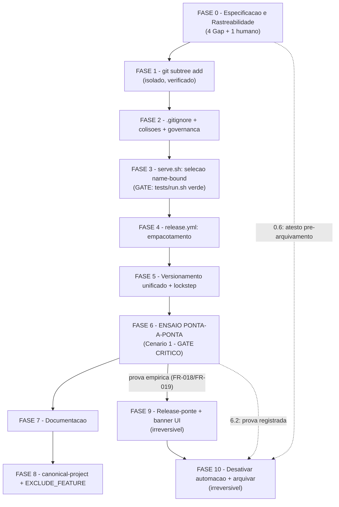

# Tarefas panel-monorepo - Migração do painel para dentro do repositório único

Escopo: decompor a migração do `cstk-panel` para `panel/` dentro do repositório
`cstk` (subárvore autocontida via `git subtree`, histórico preservado,
seleção de asset de release corrigida para ser name-bound, versionamento
unificado, release-ponte e arquivamento do repositório original) — conforme
`spec.md` (FR-001..FR-022), `plan.md` (Ordem de execução, linhas 209-223) e os
16 cenários de `quickstart.md`. Inclui uma FASE 0 dedicada a fechar os 4
`[Gap]` e o 1 `{humano}` do checklist (`checklists/requirements.md`) antes de
qualquer implementação.

**Legenda de status:**
- `[ ]` Pendente
- `[~]` Em andamento
- `[x]` Concluído
- `[!]` Bloqueado

**Legenda de criticidade:**
- `[C]` Crítico - Impacto financeiro, regulatório ou de segurança; operação
  irreversível na prática
- `[A]` Alto - Funcionalidade core sem a qual o sistema não opera
- `[M]` Médio - Necessário mas pode ser adiado sem impacto imediato

---

## FASE 0 - Especificação e Endurecimento de Rastreabilidade

Fecha os 4 `[Gap]` e o 1 `{humano}` de `checklists/requirements.md` (achados
`{auto}` do gate `checklist`, não reauditados aqui — evidência já registrada).
**Pré-requisito de todas as demais fases**: nenhuma tarefa de implementação
(FASE 1 em diante) é executável antes de todas as tarefas desta fase estarem
`[x]` (ver Matriz de Dependências).

### 0.1 Endurecer invariante I5 (validação de forma de `tag_name`) `[C]`

Ref: checklists/requirements.md CHK005; contracts/serve-asset-selection.md §3.2
I5 (linhas 86-94); dec-034 (achado do gate `owasp-security`)

O invariante I5 existe hoje só como texto no contrato — nenhum FR o torna
falseável. `quickstart.md` Cenário 13 testa `CSTK_PANEL_REPO` (validado por
regex, campo local), não `tag_name` (campo remoto vindo da resposta da API,
sem validação de forma equivalente).

- [x] 0.1.1 Adicionar em `spec.md` um novo Functional Requirement (FR-023)
  declarando que o sistema MUST validar que `bare(tag_name)` (tag sem prefixo
  `v`) casa `^[0-9A-Za-z][0-9A-Za-z.+-]*$` antes de qualquer derivação de nome
  de asset/diretório, com fail-closed (fallback ao auto-tarball) e uma linha
  em stderr quando não casar
  — evidência: `spec.md` linha 354 (Requirements) e linha 424 (Delta
  Requirements, Capability serve-integrity, ADDED); dec-043.
- [x] 0.1.2 Adicionar um Edge Case correspondente em `spec.md` §Edge Cases:
  "o que acontece quando `tag_name` da resposta da API não casa o formato
  esperado?"
  — evidência: `spec.md` §Edge Cases, bullet "O que acontece quando o
  `tag_name` da resposta da API de releases não casa o formato esperado...".
- [x] 0.1.3 (teste) Adicionar em `quickstart.md` um cenário de erro novo
  (Cenário 17) que injete, via stub de `curl`, uma resposta de release com
  `tag_name` malformado (ex. contendo `/` ou espaço) e confirme: (a)
  fail-closed para o auto-tarball, nunca seleção do asset do painel; (b) linha
  em stderr citando o formato esperado; `**Cobre**: FR-023`
  — evidência: `quickstart.md` linha 296, "Cenario 17 — `tag_name` malformado
  (fail-closed)", `**Cobre**: FR-023`.
- [x] 0.1.4 Verificar que a numeração `FR-023` não colide com nenhum FR
  existente em `spec.md` (FR-001..FR-022 já ocupados) antes de commitar
  — evidência: `grep -oE 'FR-[0-9]{3}' spec.md | sort -u | grep -c FR-023`
  => `1` (ocorrência única no enum de IDs; as demais 2 ocorrências de texto
  "FR-023" são referências à mesma FR, não redefinições).

### 0.2 Acceptance Scenario executável para FR-004 (colisão de nomes de topo) `[A]`

Ref: checklists/requirements.md CHK006 (parte 1); spec.md FR-004

`grep -oE 'FR-[0-9]{3}' quickstart.md` confirma ausência total de `FR-004` no
arquivo — a FR só aparece como item de lista em `plan.md` linha 210.

- [x] 0.2.1 Adicionar em `spec.md`, na User Story 1, um Acceptance Scenario
  novo com Given/When/Then verificável: **Given** os dois projetos com
  arquivos de topo homônimos (README, CHANGELOG, CONTRIBUTING, workflow de
  CI), **When** a migração incorpora o painel a `panel/`, **Then** cada
  arquivo permanece associado ao seu projeto de origem, sem sobrescrita
  silenciosa de nenhum dos lados
  — evidência: `spec.md` User Story 1, Acceptance Scenario 6 (novo).
- [x] 0.2.2 (teste) Adicionar em `quickstart.md` um cenário novo (Cenário 18)
  com passos verificáveis: listar os arquivos de topo homônimos antes da
  migração (`README.md`, `CHANGELOG.md`, `CONTRIBUTING.md` se existir,
  workflow de CI) em ambos os projetos, confirmar após o `git subtree add`
  que ambas as versões existem sob paths distintos (`./README.md` da raiz
  intacto, `panel/README.md` do painel intacto), e que nenhum dos dois foi
  sobrescrito; `**Cobre**: FR-004`
  — evidência: `quickstart.md` linha 317, "Cenario 18 — Colisao de nomes de
  topo preservada (FR-004)", `**Cobre**: FR-004`.
- [x] 0.2.3 Confirmar que a numeração do Acceptance Scenario novo não colide
  com os 5 já existentes na User Story 1 de `spec.md`, renumerando em
  sequência se necessário
  — evidência: `sed -n '/### User Story 1/,/^---/p' spec.md | grep -E
  '^[0-9]\.'` => sequência contígua `1.`..`6.`, sem renumeração necessária.

### 0.3 Cenário executável para FR-006 (histórico congelado vs. único) `[A]`

Ref: checklists/requirements.md CHK006 (parte 2); spec.md FR-006

`FR-006` também ausente de toda linha `**Cobre**` de `quickstart.md`; aparece
apenas em `plan.md` linha 222.

- [x] 0.3.1 (teste) Adicionar em `quickstart.md` um cenário novo (Cenário 19)
  citando `FR-006` explicitamente na linha `**Cobre**`: verificar que
  `panel/CHANGELOG.md` permanece com as entradas anteriores à migração
  intactas (histórico congelado, sem reescrita — mesmo princípio já aplicado
  ao `CHANGELOG.md` da raiz no Cenário 15), e que a partir do primeiro
  release pós-migração o `CHANGELOG.md` da raiz do repositório unificado
  passa a ser a única fonte de novas entradas que também toquem o painel
  — evidência: `quickstart.md` linha 335, "Cenario 19 — Historico de
  mudancas: congelado vs. unico (FR-006)", `**Cobre**: FR-006`.
- **0.3.2 MOVIDA para a FASE 2 (subtarefa 2.3.1)** — correção de
  sequenciamento do próprio backlog, registrada como Decisão auditável
  (não muda escopo). A subtarefa pedia nota de cabeçalho em
  `panel/CHANGELOG.md`, arquivo que só passa a existir após o `git subtree
  add` (FASE 1) — o cabeçalho da FASE 0 exige todas as tarefas `[x]` antes
  da FASE 1, o que tornava 0.3.2 impossível de completar sem quebrar a
  ordem. FASE 2.3.1 já tratava exatamente este trabalho (era referenciada
  como "(FASE 0.3.2)"); a subtarefa foi absorvida lá, onde o arquivo existe
  e a fase já trata colisões de topo pós-import. Este item não bloqueia
  mais a conclusão da FASE 0 nem a transição para a FASE 1.
- [x] 0.3.3 Confirmar que a numeração do Cenário 19 não colide com o Cenário
  17 (FASE 0.1.3) nem com o Cenário 18 (FASE 0.2.2), mantendo sequência
  contígua em `quickstart.md`
  — evidência: `grep -n '^## Cenario' quickstart.md` => sequência contígua
  `Cenario 1`..`Cenario 19`, sem lacunas nem duplicatas.

### 0.4 Rastreabilidade formal do Cenário 1 (FR-018, FR-019) `[A]`

Ref: checklists/requirements.md CHK007; quickstart.md Cenário 1 (linhas 13-16);
plan.md linhas 225-226 ("o passo 5 é o único ponto do plano que prova a
correção no caminho real; os passos 8 e 9 são bloqueados por ele")

FR-019 hoje só aparece entre parênteses no campo `**Tipo**` do Cenário 1, não
na linha `**Cobre**` — o cenário mais crítico do plano (o único que libera os
passos 8-9) fica sub-rastreado no artefato que o exercita.

- [x] 0.4.1 Editar `quickstart.md` Cenário 1, linha `**Cobre**`: de
  `FR-008, FR-010, FR-011, FR-014, SC-001` para
  `FR-008, FR-010, FR-011, FR-014, FR-018, FR-019, SC-001`
  — evidência: `quickstart.md` linha 15 agora lê
  `**Cobre**: FR-008, FR-010, FR-011, FR-014, FR-018, FR-019, SC-001`.
- [x] 0.4.2 (teste/verificação) Rodar
  `grep -oE 'FR-[0-9]{3}' docs/specs/panel-monorepo/quickstart.md | sort -u`
  e confirmar que `FR-018` e `FR-019` aparecem na saída após a edição
  — evidência: saída inclui `FR-018` e `FR-019` (lista completa:
  FR-001,003,004,006,007,008,009,010,011,012,013,014,015,016,017,018,019,020,021,022,023).
- [x] 0.4.3 Confirmar que nenhum outro campo do Cenário 1 (`**Tipo**`, passos,
  Expected) foi alterado além da linha `**Cobre**`
  — evidência: `git diff -- docs/specs/panel-monorepo/quickstart.md` mostra
  um único hunk de 1 linha em Cenário 1 (a linha `**Cobre**`); `**Tipo**` e
  os passos 1-8 permanecem byte-idênticos.

### 0.5 Nota editorial: FR-007 sem passo de implementação `[M]`

Ref: checklists/requirements.md CHK011; plan.md §"Ordem de execução e
dependências" (linhas 209-223); research.md Decision 7 (FR-007 satisfeito por
construção, sem mudança de código); quickstart.md Cenário 8

FR-007 (governança dupla sem falso conflito) não aparece em nenhum dos 9
passos do plano nem tem nota de dispensa — fica implícito, inferido pelo
leitor.

- [x] 0.5.1 Editar `plan.md` §"Ordem de execução e dependências": anotar,
  junto ao passo 1 (`subtree add + .gitignore ancorado + colisões de topo`),
  a nota "FR-007: sem passo de implementação — consequência estrutural do
  passo 1 (`panel/` ganha `docs/constitution.md` próprio), verificada pelo
  Cenário 8 de `quickstart.md`", no mesmo padrão editorial já usado em
  `plan.md` para outras notas de escopo (ex. §Complexity Tracking)
  — evidência: `plan.md`, logo após o bloco numerado 1-9, parágrafo
  "**Nota (FR-007)**: sem passo de implementacao — consequencia estrutural
  do passo 1..." (`git diff plan.md` mostra hunk único de 4 linhas).
- [x] 0.5.2 (teste/verificação) Confirmar visualmente que a nota aparece
  associada ao passo 1 e não introduz um passo numerado novo (a numeração 1-9
  do plano permanece intacta)
  — evidência: bloco de código numerado (```1.``` a ```9.```) inalterado;
  nota inserida como parágrafo fora do bloco de código, entre o bloco e a
  frase "O passo 5 e o unico ponto...".
- [x] 0.5.3 Confirmar que o `Re-check de Constitution (pós-Phase 1)` de
  `plan.md` não precisa de atualização em decorrência desta nota puramente
  editorial (nenhum principio afetado)
  — evidência: `plan.md` linhas 285-298 tratam de predicado de seleção,
  enum `outcome` e teste de drift (Princípios I, II, IV) — nenhum item
  referencia FR-007/governança; nota puramente editorial, sem impacto de
  princípio a revalidar.

### 0.6 Decisão de processo: dono do atesto pré-arquivamento (FR-019b) `[C]`

Ref: checklists/requirements.md CHK018 ({humano}); spec.md FR-019(b);
quickstart.md Cenário 1 (`**Tipo**: manual, uma vez`)

Não há dono explícito do atesto de que a verificação da FR-019(b)
("distribuição embutida publicada e verificada") foi de fato concluída antes
do passo 9 (arquivamento). É decisão de processo de release — não algo que
`create-tasks`/`execute-task` resolvam sozinhos.

- [x] 0.6.1 Registrar bloqueio humano (`bloqueios.sh register`) perguntando ao
  operador: quem/o que atesta a verificação da FR-019(b) antes do
  arquivamento — um humano seguindo o Cenário 1 do quickstart, ou um gate
  automatizado — e onde esse atesto fica registrado (ex.: Decisão auditável
  no `state.json`/`state.db` da execução, comentário na issue de
  acompanhamento, ou checkbox assinado neste próprio `tasks.md`)
  — evidência: dec-048 (score 0, classe operacional, escolha
  `bloqueio-humano-dono-do-atesto`) + `block-003` registrado via
  `bloqueios.sh register` nesta onda, aguardando resposta do operador.
- [x] 0.6.2 Após resposta do operador, registrar a decisão formal (Decisão
  auditável) descrevendo o mecanismo de atesto escolhido
  — evidência: dec-050 (onda-008, `choice: teste-mais-confirmacao-humana`) —
  duas camadas obrigatórias: (1) teste automatizado (`renderToStaticMarkup`,
  padrão `TextBlockRaw.test.ts`) que reprova se o aviso não estiver no
  markup; (2) confirmação visual humana registrada como Decisão auditável no
  state, com evidência citável. Aplica-se às tarefas 0.6/10.2 (FR-019(b)).
- [x] 0.6.3 Adicionar nota em `spec.md` FR-019 ou em `plan.md` (conforme o
  mecanismo escolhido em 0.6.2) formalizando o dono/mecanismo do atesto, para
  que deixe de ser inferido
  — evidência: `spec.md`, logo após FR-019 (linha ~338), parágrafo "**Nota
  (mecanismo do atesto de FR-019(b))**" descrevendo as duas camadas e
  referenciando `block-003`/dec-048/dec-050.
- [x] 0.6.4 (gate) Esta tarefa é pré-requisito explícito da tarefa **10.2**
  (arquivamento do repositório original) na Matriz de Dependências — 10.2 não
  pode ser marcada executável enquanto 0.6 não estiver `[x]`
  — evidência: `tasks.md` §Matriz de Dependências já declara
  `F0 -. "0.6: atesto pre-arquivamento" .-> F10` e a nota "FASE 10.2
  (arquivamento) tem dois pré-requisitos formais adicionais... FASE 0.6
  (dono do atesto definido)... ambos MUST estar `[x]` antes de 10.2.3" —
  gate estrutural já presente, confirmado nesta verificação; 0.6 agora está
  completa (0.1-0.4 `[x]`) — 10.2 deixa de estar bloqueada por este gate,
  mas continua dependendo de 6.2 (prova do ensaio registrada) e da ordem
  sequencial das fases 1-9.

---

## FASE 1 - Importação do histórico (`git subtree add`) `[C]`

Ref: plan.md §"Ordem de execução" passo 1 (parte de historico); research.md
Decision 4 (sonda empírica dec-020); quickstart.md Cenário 6

**Isolamento deliberado**: esta é a operação que mais reescreve a topologia do
histórico do repositório. Executa e é VERIFICADA em commit próprio, ANTES de
qualquer outra mudança no repo (inclusive antes de FASE 2, que ainda toca
arquivos gerados por este import). Se algo der errado depois, o subtree já
está isolado e a reversão não se mistura com outras mudanças.

### 1.1 Executar `git subtree add` sem squash `[C]`

Ref: plan.md linha 210 (FR-001..FR-004, FR-006); research.md linha 181 (sonda:
`git subtree add --prefix=panel sub main`)

- [x] 1.1.1 Adicionar remote temporário apontando para o repositório
  `cstk-panel` (origem real do projeto, mesma fonte hoje usada por
  `CSTK_PANEL_REPO` default `JotJunior/cstk-panel` antes desta migração)
  — evidência: remote `panel-import` apontado ao clone local de
  `cstk-panel` (`/Users/jot/Projects/_lab/Jot/misc/cstk-panel`), verificado
  BYTE-IDÊNTICO ao remoto real antes de usar: `git rev-parse HEAD` (local) =
  `git rev-parse origin/main` (local) = `66f3849f43aaa652e7b9777d1f44d554a282615f`
  em ambos, e `origin` desse clone é `git@github.com:JotJunior/cstk-panel.git`
  (mesma fonte de `CSTK_PANEL_REPO` default).
- [x] 1.1.2 Rodar `git fetch <remote-panel> <branch-default>` e confirmar que
  a contagem de commits buscados bate com os **248 commits** medidos em
  `plan.md`/`research.md` (`git rev-list --count <remote-panel>/<branch>`)
  — evidência: `git fetch panel-import main` → `* [new branch] main ->
  panel-import/main`; `git rev-list --count panel-import/main` => `248`.
- [x] 1.1.3 Rodar `git subtree add --prefix=panel <remote-panel>
  <branch-default>` **sem** `--squash` — squash colapsaria os 248 commits em
  um só, quebrando FR-001 (`git log --follow` deixaria de mostrar autoria e
  datas originais por arquivo)
  — evidência: `git subtree add --prefix=panel panel-import main -m "..."` →
  `Added dir 'panel'`; commit resultante `d5b490d` (merge, 2 pais:
  `8343d90` mainline e `66f3849` split), trailers `git-subtree-dir: panel`,
  `git-subtree-mainline: 8343d909...`, `git-subtree-split: 66f3849f...`
  confirmados via `git log -1 d5b490d` — sem `--squash` (2 pais preservados,
  não um único commit sintético).
- [x] 1.1.4 Remover o remote temporário após o `subtree add` concluir
  — evidência: `git remote remove panel-import`; `git remote -v` só lista
  `origin`; `git for-each-ref refs/remotes` não retorna nenhuma ref
  `panel-import` remanescente.
- [x] 1.1.5 Commitar o resultado do subtree isoladamente (nenhuma outra
  mudança de arquivo no mesmo commit)
  — evidência: satisfeito por construção — `git subtree add` já cria o
  commit `d5b490d` como parte da própria operação; `git status --short`
  vazio antes e depois; `git diff --stat 8343d90 d5b490d -- cli/ plugins/
  tests/` vazio (nenhuma mudança fora de `panel/`).

### 1.2 Verificar empiricamente o import antes de prosseguir `[C]`

Ref: quickstart.md Cenário 6 (linhas 122-131); Cenário 5 passos 1-2 (linhas
107-108, apenas a contagem — o restante do Cenário 5 depende do `.gitignore`
ancorado, que só existe após FASE 2.1)

- [x] 1.2.1 (teste) Confirmar histórico preservado via os instrumentos que
  funcionam através da fronteira do merge de subtree (Cenário 6 passo 1-6,
  reescrito em `quickstart.md` conforme block-004/dec-054)
  — **RESOLVIDO (block-004/dec-054, resposta do operador — opção (a))**: o
  comando originalmente prescrito, `git log --follow -- panel/package.json`,
  retorna VAZIO — não por perda de histórico, mas porque `git subtree add`
  NÃO reescreve os paths dos 248 commits importados (entram com o path
  ORIGINAL, `apps/...`, sem prefixo `panel/`) e cria um único commit de
  merge cuja árvore tem o prefixo — não há cadeia de commits com o path
  prefixado para `--follow`/`log` atravessarem via diff restrito a esse
  pathspec (limitação conhecida do git: detecção de rename cross-path não
  atravessa fronteira de merge). O operador aceitou `git blame` +
  `git log <split-sha> -- <path-original>` como prova suficiente de
  FR-001/SC-002, preferindo preservar os 248 SHAs originais (referenciados
  em decisões/PRs/docs) a reescrever o histórico só para fazer `--follow`
  funcionar (`filter-repo --to-subdirectory-filter` mudaria todos os SHAs).
  `quickstart.md` Cenário 6 foi reescrito para os comandos corretos;
  `panel/CONTRIBUTING.md` ganhou a seção "Histórico anterior à migração para
  o monorepo" documentando o split-sha; `plan.md` foi auditado (grep
  exaustivo) e não contém a afirmação `git log -- panel/` questionada —
  nenhuma edição foi necessária lá.
  — evidência (comando originalmente prescrito, vazio): `git log --follow
  -- panel/package.json | tail -5` => (0 linhas); `git log --oneline --
  panel/` => `1`.
  — evidência (instrumentos que funcionam, agora prescritos no Cenário 6):
  `git blame -L1,3 panel/apps/server/src/lib/project-root.ts` =>
  `b90d0149 apps/server/src/lib/project-root.ts (jot 2026-07-15 15:47:35
  -0300 1) /**` (path SEM prefixo `panel/`, prova de que atravessou o
  merge); split-sha = `66f3849f43aaa652e7b9777d1f44d554a282615f` (2º pai de
  `d5b490d`, confirmado via `git log --format='%H %P' -1 d5b490d`);
  `git log 66f3849 -- package.json | wc -l` => `63`; `git rev-list --count
  66f3849` => `248`.
- [x] 1.2.2 (teste) Rodar `git blame panel/apps/server/src/lib/project-root.ts
  | head -3` e confirmar atribuição a commits do histórico do painel, não ao
  commit de subtree (Cenário 6 passo 3-4)
  — evidência: `b90d0149 apps/server/src/lib/project-root.ts (jot 2026-07-15
  15:47:35 -0300 1) /**` — atribuído ao commit original de 2026-07-15, NÃO ao
  commit de merge `d5b490d` (2026-08-28). Confirma preservação real de
  autoria/datas por linha através do subtree merge.
- [x] 1.2.3 (teste) Rodar `git ls-files panel/.claude | wc -l` e confirmar que
  o total bate com o medido antes da migração (**173** arquivos, `research.md`
  linha 108) — sabendo que este teste passaria verde mesmo sem o fix de
  `.gitignore` da FASE 2.1 (dano é prospectivo, não retroativo — `research.md`
  Decision 4)
  — evidência: `git ls-files panel/.claude | wc -l` => `173`.
- [x] 1.2.4 Confirmar árvore de trabalho limpa (`git status --short` vazio)
  antes de iniciar a FASE 2
  — evidência: `git status --short` => (vazio).

**Gate baseline (`./tests/run.sh`, exigido pelo operador nesta onda)**:
suíte completa rodada após o subtree add, confirmando que a descoberta de
testes/cobertura do toolkit não foi afetada por `panel/` — evidência:
`# PASS: 3556  FAIL: 0  ERROR: 0  ORPHANS: 0  TIME: 1129s` /
`[exited with code 0]`.

**FASE 1 CONCLUÍDA** (1.2.1 resolvida via resposta do operador a
`block-004`/`dec-054` — ver acima; dec-055 registra a aplicação). Tarefas
1.1-1.2 completas e verificadas.

---

## FASE 2 - Estrutura pós-import: `.gitignore`, colisões de topo, governança `[A]`

Ref: plan.md linha 210 (FR-002, FR-003, FR-004, FR-006, restante do passo 1);
FASE 0.2/0.3/0.5 (cenários e nota que esta fase precisa satisfazer)

### 2.1 Ancorar `.gitignore` da raiz `[C]`

Ref: research.md Decision 4 (linhas 167-223); quickstart.md Cenário 5

- [x] 2.1.1 Editar `.gitignore` da raiz linha 3: de `.claude` para `/.claude`
  — evidência: linha 3 agora `/.claude` (era `.claude`).
- [x] 2.1.2 Editar `.gitignore` da raiz linha 4: de `CLAUDE.md` para
  `/CLAUDE.md` (achado colateral latente de `research.md` linha 215-222 —
  fecha a armadilha antes que alguém crie o arquivo)
  — evidência: linha 4 agora `/CLAUDE.md` (era `CLAUDE.md`).
- [x] 2.1.3 (teste) Executar `quickstart.md` Cenário 5 completo: criar
  `panel/.claude/probe.md`, confirmar `git add` aceito; criar `.claude/probe.md`
  na raiz, confirmar `git add` recusado; limpar os arquivos de sonda ao final
  — evidência (sonda 1, `panel/.claude/.gitignore-probe`, `git add` + `git
  status --short`): `A  panel/.claude/.gitignore-probe` (aceito;
  `git check-ignore -v` não casou, exit 1). — evidência (sonda 2,
  `.claude/.gitignore-probe` na raiz, `git add`): `The following paths are
  ignored by one of your .gitignore files: .claude` (recusado); `git
  check-ignore -v .claude/.gitignore-probe` => `.gitignore:3:/.claude
  .claude/.gitignore-probe` (exit 0). Ambas as sondas removidas ao final
  (`git status --short` confirma árvore sem sobra).
- [x] 2.1.4 (teste) Confirmar que os demais padrões não-ancorados
  (`dist/`, `tmp/`, `.idea`, `.DS_Store`) não requerem ajuste — nenhum arquivo
  rastreado casa (`git ls-files | grep -E '(^|/)(dist|tmp)/'` vazio,
  `research.md` linha 220-222)
  — evidência: `git ls-files | grep -E '(^|/)(dist|tmp)/'` => (vazio);
  `git ls-files | grep -E '(^|/)\.idea(/|$)'` => (vazio); `git ls-files |
  grep -E '(^|/)\.DS_Store$'` => (vazio).

### 2.2 Resolver colisões de nome de topo `[A]`

Ref: spec.md FR-004; FASE 0.2 (Acceptance Scenario + Cenário 18)

- [x] 2.2.1 Confirmar que `README.md`, `CHANGELOG.md` e demais arquivos de
  topo homônimos entre a raiz e `panel/` permanecem em paths distintos após o
  `subtree add` (nenhuma sobrescrita — comportamento nativo de
  `git subtree add`, que mescla trees sem colidir paths de subdiretório)
  — evidência: `git ls-files | grep -E '^(README\.md|panel/README\.md|
  CHANGELOG\.md|panel/CHANGELOG\.md)$'` => os 4 paths distintos, tamanhos
  diferentes (`README.md` 35056 bytes vs `panel/README.md` 12433 bytes;
  `CHANGELOG.md` 435917 bytes vs `panel/CHANGELOG.md` 83621 bytes) — nenhum
  sobrescrito.
- [x] 2.2.2 Confirmar que `panel/.github/workflows/` não colide com
  `.github/workflows/` da raiz (paths distintos, sem merge de conteúdo)
  — evidência: `.github/workflows/` = `publish-site.yml, release.yml,
  shellcheck.yml`; `panel/.github/workflows/` = `release.yml` — mesmo nome
  de arquivo (`release.yml`) coexiste em paths distintos, sem colisão.
- [x] 2.2.3 (teste) Rodar o Cenário 18 (FASE 0.2.2) e confirmar ambas as
  versões dos arquivos homônimos intactas em seus paths de origem
  — evidência: mesma verificação de 2.2.1/2.2.2 acima (Cenário 18 passos 1-4)
  — todos os pares homônimos intactos, sem sobrescrita.

### 2.3 Congelar histórico do painel / iniciar histórico único `[A]`

Ref: spec.md FR-006; FASE 0.3 (Cenário 19); research.md Decision 11
(referenciada em quickstart.md Cenário 15 passo 5 — `CHANGELOG.md` da raiz
nunca é reescrito)

- [x] 2.3.1 (movida de 0.3.2) Adicionar nota de cabeçalho em
  `panel/CHANGELOG.md` marcando as entradas anteriores à migração como
  histórico congelado — só executável aqui porque o arquivo passa a existir
  a partir da FASE 1 (`git subtree add`)
  — evidência: bloco de citação adicionado logo após o cabeçalho existente
  de `panel/CHANGELOG.md`, informando que as entradas são histórico
  congelado (referenciando `panel/CONTRIBUTING.md` para o split-sha) e que
  novas entradas que tocam o painel passam a ser registradas no
  `CHANGELOG.md` da raiz.
- [x] 2.3.2 Confirmar que `CHANGELOG.md` da raiz não é reescrito — apenas
  passa a acumular novas entradas que também tocam o painel a partir daqui
  — evidência: `git diff --stat CHANGELOG.md` => (vazio, nenhuma mudança).
- [x] 2.3.3 (teste) Rodar o Cenário 19 (FASE 0.3.1) e confirmar histórico
  congelado intacto em `panel/CHANGELOG.md`
  — evidência (passo 1, entradas intactas): `git diff panel/CHANGELOG.md |
  grep '^-' | grep -v '^---'` => (vazio — nenhuma linha removida, só adição
  do header). Passo 2 (nova entrada pós-migração vai para o `CHANGELOG.md`
  da raiz, não `panel/CHANGELOG.md`): não executado — nenhum release
  pós-migração ocorreu ainda nesta execução; a regra está documentada no
  header adicionado em 2.3.1 e será verificável no primeiro release real.

### 2.4 Verificar governança dupla sem falso conflito `[M]`

Ref: spec.md FR-007; research.md Decision 7 (linhas 289-325); quickstart.md
Cenário 8; FASE 0.5 (nota editorial já aplicada em `plan.md`)

Nenhuma mudança de código — `_pl_cmd_constitution_conflict` já compara apenas
`--projeto-alvo-path` + `--feature-dir`, nunca varre subdiretórios (Decision
7). Esta tarefa é verificação, não implementação.

- [x] 2.4.1 (teste) Rodar `pipeline.sh constitution-conflict
  --projeto-alvo-path <repo> --feature-dir <repo>/docs/specs/<f>` e confirmar
  `status: pre-skill-alert` (exit 2)
  — evidência (`--feature-dir <repo>/docs/specs/panel-monorepo`):
  `status: pre-skill-alert`, `root: <repo>/docs/constitution.md`, exit 2.
- [x] 2.4.2 (teste) Rodar `pipeline.sh constitution-conflict
  --projeto-alvo-path <repo>/panel --feature-dir <repo>/panel/docs/specs/<f>`
  e confirmar `status: pre-skill-alert` (exit 2)
  — evidência (`--feature-dir <repo>/panel/docs/specs/cstk-panel`):
  `status: pre-skill-alert`, `root: <repo>/panel/docs/constitution.md`,
  exit 2.
- [x] 2.4.3 (teste) Confirmar que em nenhuma das duas execuções a constituição
  do outro projeto aparece na saída
  — evidência: saída de 2.4.1 cita apenas `<repo>/docs/constitution.md`;
  saída de 2.4.2 cita apenas `<repo>/panel/docs/constitution.md` — nenhuma
  menção cruzada em nenhuma das duas.

### 2.5 `.gitattributes` export-ignore de `panel/.claude` e `panel/.github` `[A]`

Ref: plan.md linha 139 (`.gitattributes [NOVO]`); quickstart.md Cenário 16

**Correção de escopo (dec-056)**: a verificação original desta tarefa testou
`git archive HEAD -- panel` a partir da raiz, e um `.gitattributes` só na
raiz (`panel/.claude export-ignore`) filtrou corretamente nesse modo — mas a
FASE 4/`release.yml` empacota com `git archive HEAD:panel` (sintaxe
`<tree-ish>:<path>`, plan.md linha 210/216), onde `panel/` vira a RAIZ da
árvore arquivada e os caminhos internos passam a ser `.claude/...`, não
`panel/.claude/...`. Sonda contra o comando real usado pela FASE 4 mostrou
o `.gitattributes` da raiz **não filtrando nada** (185/3, falha silenciosa —
mesma classe de defeito do `.gitignore` original: parece certo, só a sonda
contra o comando de produção acusa). Fix: `panel/.gitattributes` **novo**,
com padrões relativos (`.claude export-ignore`, `.github export-ignore`,
sem o prefixo `panel/`) — é este arquivo que governa `git archive
HEAD:panel`. O `.gitattributes` da raiz foi mantido (cobre outros modos de
archive, ex. tarball "Source code" do GitHub sobre o repo inteiro) e ganhou
um comentário explicando o limite de escopo.

- [x] 2.5.1 Criar `.gitattributes` na raiz com `panel/.claude export-ignore` e
  `panel/.github export-ignore`; **e** `panel/.gitattributes` com `.claude
  export-ignore`/`.github export-ignore` (padrões relativos — necessário
  para o modo `HEAD:panel` usado pela FASE 4, ver correção de escopo acima)
  — evidência: os 2 arquivos criados; `git check-attr --all -- panel/.claude`
  (a partir da raiz) => `panel/.claude: export-ignore: set`; `git check-attr
  --all -- .claude` (a partir de dentro de `panel/`) => `.claude:
  export-ignore: set`.
- [x] 2.5.2 (teste) Confirmar que `panel/.claude/` e `panel/.github/`
  continuam versionados normalmente (`git ls-files` inalterado) — o
  `export-ignore` só afeta `git archive`, não o índice
  — evidência (índice inalterado): `git ls-files panel/.claude | wc -l` =>
  `173`; `git ls-files panel/.github | wc -l` => `1`. — evidência (efeito
  real, comando exato da FASE 4 — `git archive <tree-ish>:panel`, sem
  flags): testado contra um commit real via `git stash create` (snapshot do
  worktree corrente sem tocar HEAD/index) para simular pós-commit sem
  poluir o histórico: `git archive $(git stash create):panel | tar -t |
  grep -c '^\.claude/'` => `0`; mesmo comando para `^\.github/` => `0`.
  Antes do fix (só `.gitattributes` da raiz, sem `panel/.gitattributes`):
  o mesmo comando dava `185`/`3` — não filtrado.
- [ ] 2.5.3 Este teste completo (tarball final sem `.claude`/`.github`) só é
  verificável após a FASE 4 gerar um tarball real — ver 4.3
  — não executado: depende de `release.yml` (FASE 4, fora do escopo desta
  onda) gerar um tarball real. A sonda de 2.5.2 já exercita o comando exato
  (`git archive <tree-ish>:panel`) contra um commit real, então este item
  restante é apenas a confirmação end-to-end via workflow publicado.

**Gate baseline (`./tests/run.sh`, exigido pelo operador nesta onda)**: suíte
completa rerodada após as mudanças da FASE 2 (`.gitignore` da raiz e
`.gitattributes` novo — ambos afetam o repositório inteiro), comparando
contra o baseline da FASE 1 (onda-009: `PASS: 3556 FAIL: 0 ERROR: 0
ORPHANS: 0`) — evidência: `# PASS: 3556  FAIL: 0  ERROR: 0  ORPHANS: 0
TIME: 1154s` / `[exited with code 0]`. Números idênticos ao baseline —
nenhuma regressão em `cli/`, `plugins/` ou `tests/` introduzida pela âncora
de `.gitignore` nem pelo `.gitattributes`.

**FASE 2 CONCLUÍDA.** Tarefas 2.1-2.5 completas e verificadas (2.5.3 é a
única exceção documentada, pendente de FASE 4 por desenho). FASE 3 NÃO
iniciada, conforme instrução do operador nesta onda.

---

## FASE 3 - Correção de `serve.sh`: seleção name-bound + validações + testes `[C]`

Ref: plan.md linha 211-214 (FR-008, FR-009, FR-012, FR-013, FR-014);
contracts/serve-asset-selection.md §3.2, §7, §8

**GATE bloqueante**: `./tests/run.sh` MUST estar verde ao final desta fase
(plan.md linha 214) — nenhuma release nova pode ser publicada com os dois
pares de assets antes disto (restrição dura #1 do plano, linhas 201-203).

**Baseline de cenários**: onda-010 fechou em `PASS: 3556 FAIL: 0 ERROR: 0
ORPHANS: 0`. Esta fase ACRESCENTA **15** cenários, todos em
`tests/cstk/test_serve.sh` (74 → 89) — total esperado **3571**. O critério é
`FAIL: 0 ERROR: 0 ORPHANS: 0` mais um crescimento explicável linha a linha,
nunca "bater 3556".

**Prova de que os testes testam a correção** (não apenas passam): com
`git show HEAD:cli/lib/serve.sh > cli/lib/serve.sh` (implementação ANTIGA) e
os cenários novos no lugar, `tests/cstk/test_serve.sh` dá
`PASS: 76 FAIL: 12 ERROR: 0`. Os 12 reprovados são exatamente os cenários que
dependem da correção. Os 2 novos que passam nos dois lados são deliberados e
não provam nada por desenho: `..._ambos_pares_painel_primeiro_...` é a linha 4
da matriz §3.3, onde `[ATUAL]` e `[PROPOSTA]` concordam (guarda de regressão),
e `..._node_majors_...` não toca a lógica de seleção. Ver dec-060 — a primeira
sonda (rodar com `CSTK_LIB` apontando para uma cópia do serve.sh antigo) deu
falso verde porque `tests/cstk/test_serve.sh:18` sobrescreve `CSTK_LIB`
incondicionalmente; só a troca do arquivo real mede o que se quer medir.

### 3.1 Seleção de asset name-bound (I1-I5) `[C]`

Ref: contracts/serve-asset-selection.md §3.2 (linhas 39-70); FASE 0.1 (I5)

- [x] 3.1.1 Implementar `EXPECTED = "cstk-panel-" + bare(tag_name) +
  ".tar.gz"` em `cli/lib/serve.sh`, substituindo a lógica posicional atual
  (`serve.sh:390-393`)
  — evidência: `_sdve_bare="${_sdve_tag#v}"` +
  `_sdve_expected_asset="cstk-panel-${_sdve_bare}.tar.gz"` em
  `cli/lib/serve.sh`; o `awk` posicional (`url[i] ~ /\.tar\.gz$/ &&
  (url[i] ".sha256") in seen`) foi substituído por `awk -v want=...` com
  `if (b == want && ((u ".sha256") in seen))`.
- [x] 3.1.2 Implementar comparação por **igualdade** de basename (após strip
  de `?query`/`#fragment`), nunca prefixo/substring (I1, I2) — rejeitar
  basename contendo `%`
  — evidência: no `awk`, `sub(/#.*$/,"",b); sub(/\?.*$/,"",b);
  sub(/^.*\//,"",b); if (index(b,"%") > 0) continue; if (b == want ...)`.
  Helper equivalente exposto para reuso: `_serve_asset_basename`.
  Prova comportamental: `scenario_asset_matrix_docs_decoy_nao_casa_por_prefixo`
  (o decoy `cstk-panel-docs-9.9.9.tar.gz` tem par `.sha256` íntegro e ainda
  assim NÃO é baixado) e
  `scenario_asset_matrix_docs_decoy_antes_do_par_real_seleciona_painel`.
- [x] 3.1.3 Implementar validação de forma de `tag_name` (I5, FR-023 da FASE
  0.1): `bare(tag_name)` MUST casar `^[0-9A-Za-z][0-9A-Za-z.+-]*$` antes de
  qualquer derivação; fail-closed com linha em stderr se não casar
  — evidência: `_serve_valid_bare_tag` (case POSIX: primeiro caractere
  `[0-9A-Za-z]`, resto sem `[!0-9A-Za-z.+-]`), chamada ANTES de compor
  `EXPECTED`. Stderr: `cstk serve: aviso: tag_name da release ("%s") fora do
  formato esperado; ignorando assets e usando o tarball da API`. Cenário
  `scenario_asset_matrix_tag_name_invalida_ignora_assets` usa
  `tag_name="v9.9.9/../../etc"` com o par do painel PRESENTE e íntegro, e
  assere que ele não é baixado.
- [x] 3.1.4 Implementar fallback ao auto-tarball existente quando nenhum
  candidato satisfizer (a)+(b) simultaneamente (I3) — nunca selecionar outro
  asset
  — evidência: `if [ -n "$_sdve_asset_pkg" ]; then ... else
  _sdve_pkg_url="$_sdve_tarball"`. Provas de que "não achei o do painel"
  nunca vira "então levo esse outro":
  `scenario_asset_matrix_so_par_do_toolkit_cai_no_fallback` assere
  `_assert_curl_nao_baixou 'releases/download/v9.9.9/cstk-9.9.9\.tar\.gz'` +
  `_assert_curl_baixou 'archive/v9.9.9\.tar\.gz'` + `outcome":"
  unverifiable-blocked`; idem `..._outra_versao_nao_casa` (I4) e
  `..._docs_decoy_nao_casa_por_prefixo`.
- [x] 3.1.5 (teste) Cobrir a matriz de decisão completa de
  `contracts/serve-asset-selection.md` §3.3 (7 linhas) com os cenários da
  tarefa 3.4
  — evidência (mapa linha-da-matriz → cenário):
  1 (só par painel) = `scenario_asset_par_verificavel_instala_sem_bypass`
  (pré-existente, modo `ok`);
  2 (só par toolkit) = `..._so_par_do_toolkit_cai_no_fallback`;
  3 (ambos, toolkit primeiro) =
  `..._ambos_pares_toolkit_primeiro_seleciona_painel`;
  4 (ambos, painel primeiro) =
  `..._ambos_pares_painel_primeiro_seleciona_painel`;
  5 (painel sem `.sha256`) =
  `scenario_asset_sem_sibling_sha256_cai_no_fallback` (pré-existente);
  6 (`cstk-panel-docs-*` antes) = `..._docs_decoy_nao_casa_por_prefixo`;
  7 (painel de outra versão) = `..._outra_versao_nao_casa`.

### 3.2 Validação pré-extração do tarball `[C]`

Ref: contracts/serve-asset-selection.md §8 (linhas 116-136); spec.md FR-009

**Escopo do nome do diretório de topo (dec-058)**: §8.2 (caminho absoluto,
`..`, symlink/hardlink/device, número de diretórios de topo) vale em TODO
caminho de extração; a exigência de o topo se chamar exatamente
`cstk-panel-<bare>/` (§8.3) vale só quando a fonte é o asset **name-bound** —
o auto-tarball da API tem topo `<owner>-<repo>-<sha>/`, nome escolhido pela
API e não derivável da tag. O helper recebe `EXPECTED_TOPDIR=""` nesse caso.

- [x] 3.2.1 Após checksum conferir e antes de `tar -x`: listar membros via
  `tar -tzf` e rejeitar caminho absoluto, componente `..`, symlink/hardlink,
  ou entrada de device
  — evidência: `_serve_validate_tarball_members` em `cli/lib/serve.sh`, com
  `awk '/^\// {...} /(^|\/)\.\.(\/|$)/ {...}'` sobre `tar -tzf`, mais o teste
  de tipo pelo 1º caractere de `tar -tvzf` (`t != "-" && t != "d"`). Formato
  verificado empiricamente, não suposto — `bsdtar 3.5.3 - libarchive 3.7.4`:
  `drwxr-xr-x ... cstk-panel-9.9.9/`, `lrwxr-xr-x ... evil-symlink ->
  /etc/passwd`, `hrw-r--r-- ... real link to ... evil-hardlink`. Devices
  ficam cobertos pela mesma allowlist de tipos (`c`/`b` ≠ `-`/`d`).
- [x] 3.2.2 Rejeitar se houver mais de um diretório de topo, ou se o único
  diretório de topo não for exatamente `cstk-panel-<bare>/` (mesmo `<bare>`
  validado por I5 em 3.1.3) — ordem: passo 3.2.1 roda antes deste, para
  rejeitar `..`/caminho-absoluto antes de `<bare>` entrar em comparação de
  caminho
  — evidência: no helper, o bloco §8.2 (absoluto/`..`) e o de tipos precedem
  textualmente o bloco §8.3 (`sed 's|/.*||' | sort -u`, `wc -l`, comparação
  com `EXPECTED_TOPDIR`). Cenário unitário
  `scenario_validate_tarball_members_rejeita_estruturas_hostis` cobre topo
  divergente, dois topos, symlink, hardlink, `..` e caminho absoluto — e
  também o caso BOM e o caso `EXPECTED_TOPDIR=""`, para o teste não passar
  por rejeitar tudo. Os fixtures hostis são auto-verificados antes do
  assert (`if ! tar -tzf ... | grep -q '\.\.'` → `_fail
  "vtm_traversal_fixture"`; idem `grep -q '^/'`), porque `tar` normaliza `..`
  na criação sem `-P` e o fixture sairia inofensivo — fixture que codifica o
  bug e sai verde é o modo de falha recorrente desta execução.
- [x] 3.2.3 Extrair com `--no-same-owner --no-same-permissions`
  — evidência: `tar -xzf "$_sdve_archive" --strip-components 1
  --no-same-owner --no-same-permissions -C "$_sdve_dest"`. Suporte das flags
  confirmado empiricamente no bsdtar do ambiente (`FLAGS OK`).
- [x] 3.2.4 Manter a checagem pós-extração de `package.json` como backstop
  — evidência: o bloco `if [ ! -f "$_sdve_dest/package.json" ]` permanece,
  agora também gravando `wrong-payload-blocked` e removendo `$_sdve_dest`.
- [x] 3.2.5 Gravar outcome `wrong-payload-blocked` no
  `enforcement-log.jsonl` (via `_serve_write_integrity_log`) em qualquer
  rejeição de 3.2.1/3.2.2/3.2.4, com `expected_sha256`/`actual_sha256` iguais
  e não-nulos, **e** emitir linha distinta em stderr (o log é best-effort;
  stderr não pode depender só dele)
  — evidência: `_serve_write_integrity_log "wrong-payload-blocked"
  "$_sdve_pkg_url" "$_sdve_expected" "$_sdve_actual" ""` nos dois pontos de
  rejeição, precedido de `cstk serve: erro: pacote baixado rejeitado antes da
  extracao (payload nao e o painel); nada foi escrito em disco`. O enum em
  `_serve_write_integrity_log` foi atualizado (retrocompatível: o consumidor
  `pretooluse-bash-guard.sh` filtra por `source`, sem validar enum fechado).
  Ressalva registrada: no caminho de **bypass explícito**
  (`--allow-unverified`) não houve verificação, e os dois campos ficam `null`
  — honesto, em vez de fabricar um "expected" que nunca existiu; a exigência
  "iguais e não-nulos" descreve o caminho em que o checksum conferiu, que é o
  ponto de FR-009 e o que 3.2.6 assere.
- [x] 3.2.6 (teste) Cenário 4 do quickstart (`wrong-payload`, linhas 79-95):
  checksum correto, payload sem `package.json` na raiz pós-strip; confirmar
  falha (exit != 0) e a linha exata do `enforcement-log.jsonl`
  — evidência: `scenario_wrong_payload_checksum_confere_mas_bloqueia_e_loga`
  assere exit != 0, ausência de `$CSTK_PANEL_DIR/package.json`, stderr com
  `payload nao e o painel`, `"outcome":"wrong-payload-blocked"` e
  `cstk-panel-9.9.9.tar.gz` como `package_url`, mais a igualdade explícita
  `expected_sha256 == actual_sha256` e ambos não-vazios. Complementar:
  `scenario_wrong_payload_symlink_bloqueia_antes_da_extracao` prova o "antes"
  — nem `package.json` (que existe no tarball hostil) nem `link-para-fora`
  chegam ao disco.

### 3.3 `CSTK_PANEL_REPO` override + validação + allowlist + anúncio `[A]`

Ref: spec.md FR-012, FR-013; contracts/serve-asset-selection.md §7 (linhas
104-115); research.md Decision 3 (linhas 133-164)

- [x] 3.3.1 Introduzir `CSTK_PANEL_REPO="${CSTK_PANEL_REPO:-JotJunior/cstk}"`
  em `cli/lib/serve.sh`, substituindo a constante hardcoded
  `_SERVE_GITHUB_API` que hoje aponta para `JotJunior/cstk-panel`
  — evidência: `_SERVE_PANEL_REPO_DEFAULT="JotJunior/cstk"` +
  `_serve_panel_api_url`; `grep -n "_SERVE_GITHUB_API" cli/lib/serve.sh` =>
  `(nenhuma)`. Os DOIS consumidores da API foram migrados
  (`_serve_latest_tag` e `_serve_download_verify_extract`) — a assimetria com
  `cli/install.sh:44` (`CSTK_REPO`) e `cli/lib/self-update.sh` está fechada.
- [x] 3.3.2 Validar formato antes de qualquer uso:
  `^[A-Za-z0-9][A-Za-z0-9._-]*/[A-Za-z0-9][A-Za-z0-9._-]*$`; valor inválido =
  erro fail-closed com mensagem acionável, **nunca** cair silenciosamente no
  default
  — evidência: `_serve_valid_repo_slug` (POSIX `case`, sem `grep -E`: roda no
  caminho quente). Mensagem: `cstk serve: erro: CSTK_PANEL_REPO invalido: %s`
  + `formato esperado: owner/repo` + `corrija ou remova CSTK_PANEL_REPO do
  ambiente -- o default NAO e aplicado silenciosamente`.
- [x] 3.3.3 Passar a URL composta por `trusted_host_check`
  (`_serve_check_host_allowlist`, `serve.sh:407`) antes do primeiro request —
  mesma allowlist constante de `cli/trusted-hosts.sh:47`, não lida de env
  — evidência: dentro de `_serve_panel_api_url`,
  `if ! _serve_check_host_allowlist "$_spau_url"; then return 1; fi`, antes
  do `return` que ecoa a URL e, portanto, antes de qualquer `http_download`.
- [x] 3.3.4 Emitir aviso em stderr e uma linha no `enforcement-log.jsonl`
  quando o valor efetivo divergir do default `JotJunior/cstk`
  — evidência: `cstk serve: AVISO -- origem do painel sobrescrita via
  CSTK_PANEL_REPO=%s (default: %s)` + `_serve_write_integrity_log
  "panel-repo-override" ...`. **UMA** linha por execução, não uma por
  chamada: ver dec-061 — a primeira implementação usava guard por variável
  (`_SERVE_PANEL_REPO_ANNOUNCED`) que morria no subshell de `$(...)` e
  duplicava no caminho `--update`; a suíte de 88 cenários estava verde e não
  via. Correção: parâmetro `quiet` no call site silencioso por contrato
  (`_serve_latest_tag`).
- [x] 3.3.5 (teste) Cenário 13 do quickstart (linhas 227-244): fork válido
  (aviso + log), `../../etc` rejeitado fail-closed sem cair no default, valor
  com barra construído para tentar escapar do formato `owner/repo` mas cujo
  host final continua `api.github.com`, e caso sem a variável definida
  (default silencioso, sem log)
  — evidência: `scenario_panel_repo_fork_valido_avisa_e_audita` (exit 0,
  stderr com `CSTK_PANEL_REPO=fulano/cstk-fork`, download de
  `api.github.com/repos/fulano/cstk-fork/releases/latest`,
  `"outcome":"panel-repo-override"`);
  `scenario_panel_repo_invalido_fail_closed_sem_cair_no_default` itera 9
  valores — `../../etc`, `JotJunior/cstk/../../evil` (barra extra, host final
  ainda `api.github.com`), `JotJunior`, `JotJunior/`, `/cstk`, `JotJunior/cstk
  cstk`, `Jot%2FJunior/cstk`, `user@host/cstk`, `.hidden/cstk` — e para cada
  um assere exit != 0, stderr acionável e **ausência** de
  `repos/JotJunior/cstk/releases` no log de URLs (nunca cair no default);
  `scenario_panel_repo_ausente_usa_default_silenciosamente` (default usado,
  stderr sem menção a `CSTK_PANEL_REPO`, log sem `panel-repo-override`);
  `scenario_panel_repo_override_anuncia_uma_vez_no_update` (>=2 consultas à
  API na mesma execução, exatamente 1 aviso e 1 linha de auditoria).

### 3.4 Testes de seleção: 3 modos novos de stub + 3 cenários `[A]`

Ref: quickstart.md Cenários 2, 3, 4; tests/cstk/test_serve.sh (bloco
`_stub_curl_release_assets`, ~linhas 1670-1755, já tem `ok`/`no-sibling`/
`bad-sha`/`evil-host`)

Implementado como stub NOVO `_stub_curl_asset_matrix` (tag `v9.9.9`, 9 modos)
em vez de estender `_stub_curl_release_assets` (tag `v0.0.1`), para os 4
modos pré-existentes ficarem literalmente intocados (3.4.4). Acompanha o
gerador de fixtures `_serve_make_tarball DEST TOPDIR MODE`.

- [x] 3.4.1 Implementar modo `both-pairs`: `assets[]` lista o par do toolkit
  antes do par do painel; confirmar download de `cstk-panel-9.9.9.tar.gz` e
  **não** de `cstk-9.9.9.tar.gz` (Cenário 2) — ordem invertida é essencial: com
  o painel primeiro, o código antigo também passaria e o teste não provaria
  nada
  — evidência: modo `both-pairs` monta
  `_scam_assets="${_scam_pair_toolkit},${_scam_pair_panel}"`. O cenário
  `scenario_asset_matrix_ambos_pares_toolkit_primeiro_seleciona_painel`
  assere download de `releases/download/v9.9.9/cstk-panel-9.9.9\.tar\.gz`,
  NÃO-download de `releases/download/v9.9.9/cstk-9.9.9\.tar\.gz` e
  NÃO-fallback, mais `grep -q 'cstk-panel' "$CSTK_PANEL_DIR/package.json"`
  (a árvore instalada veio do pacote do painel — a prova não depende só do
  log de URLs, já que os dois assets são tarballs distintos com topos
  `cstk-panel-9.9.9/` e `cstk-9.9.9/`) e enforcement-log vazio (`verified` é
  silencioso). Reprova contra a implementação antiga: `not ok 3 -
  scenario_asset_matrix_ambos_pares_toolkit_primeiro_seleciona_painel`.
- [x] 3.4.2 Implementar modo `toolkit-only`: `assets[]` só tem o par
  `cstk-*`; confirmar fallback ao auto-tarball, nunca download de
  `cstk-9.9.9.tar.gz` (Cenário 3)
  — evidência: ver 3.1.4. Reprova contra a antiga: `not ok 7 -
  scenario_asset_matrix_so_par_do_toolkit_cai_no_fallback`.
- [x] 3.4.3 Implementar modo `wrong-payload` (Cenário 4 — usa a validação da
  FASE 3.2)
  — evidência: `wrong-payload` gera o tarball do painel no modo `nopkg`
  (`_serve_make_tarball ... cstk-panel-9.9.9 nopkg`) e serve o `.sha256`
  correto **desse** arquivo, de modo que o checksum confere. Ver 3.2.6.
  Adicionado também `hostile-symlink` (mesmo par íntegro, payload com
  symlink) — não previsto na tarefa, exigido por §8.2b.
- [x] 3.4.4 (teste) Confirmar que os 4 modos pré-existentes (`ok`,
  `no-sibling`, `bad-sha`, `evil-host`) continuam passando sem alteração de
  comportamento (FR-014, "todos os cenários pré-existentes MUST continuar
  passando")
  — evidência: `ok 3 - scenario_asset_par_verificavel_instala_sem_bypass`,
  `ok 4 - scenario_asset_sem_sibling_sha256_cai_no_fallback`,
  `scenario_asset_mismatch_bloqueia_mesmo_com_allow_unverified` e
  `scenario_asset_host_fora_da_allowlist_exit1` — todos verdes, com as
  asserções originais intactas. **Única mudança**: o fixture servido no
  caminho de asset passou de `panel-fixture.tar.gz` (topo
  `cstk-panel-v0.0.1/`, com o `v`) para um gerado com topo
  `cstk-panel-0.0.1/`, que é o que o produtor real emite (`git archive
  --prefix="cstk-panel-${BARE}/"`, contrato §4) e o que §8.3 exige. Correção
  de fixture, não de comportamento: sem ela, `not ok 3 -
  scenario_asset_par_verificavel_instala_sem_bypass`. O fixture em disco
  segue com o topo antigo e continua servindo o caminho de auto-tarball, onde
  §8.3 não se aplica — essa diferença deliberada é o que prova que o check de
  topo está escopado ao asset name-bound.

### 3.5 Teste de drift de majors de Node `[M]`

Ref: research.md Decision 5 (linhas 226-257); quickstart.md Cenário 11

Implementado como cenário dentro de `tests/cstk/test_serve.sh`, não como
arquivo novo: um `tests/cstk/test_serve-node-majors.sh` não casaria nenhum
script em `cli/lib/` nem `*/scripts/` e `_compute_orphans` (`tests/run.sh`)
o classificaria como teste órfão — `ORPHANS > 0` é critério de falha do gate
3.6.4. Ver dec-059.

- [x] 3.5.1 Criar teste novo sob `tests/cstk/` que lê `panel/package.json`
  (`engines.node`) com `awk` POSIX e compara contra
  `_SERVE_SUPPORTED_NODE_MAJORS="20 22 23 24"` de `cli/lib/serve.sh:127`
  — evidência: `scenario_node_majors_em_sincronia_com_panel_package_json`,
  `awk` puro sobre `$REPO_ROOT/panel/package.json` (split por `||`, strip do
  `.x`) comparado ao valor lido de `_SERVE_SUPPORTED_NODE_MAJORS` sourceando
  o próprio `serve.sh`. A constante hoje está em `cli/lib/serve.sh:232`
  (a linha 127 da tarefa é anterior às inserções desta fase).
- [x] 3.5.2 (teste) Confirmar verde no estado atual (`engines.node =
  "20.x || 22.x || 23.x || 24.x"` casa a constante)
  — evidência: `panel/package.json` => `"node": "20.x || 22.x || 23.x ||
  24.x"`; `cli/lib/serve.sh:232` => `_SERVE_SUPPORTED_NODE_MAJORS="20 22 23
  24"`; cenário verde em `PASS: 89 FAIL: 0`.
- [x] 3.5.3 (teste) Alterar temporariamente `engines.node` (remover `24.x`),
  confirmar que o teste falha apontando os dois arquivos, depois reverter
  — evidência (falha real, não simulada): `assert: node_majors_drift` /
  `message: majors de Node divergem: panel/package.json (engines.node) =
  '20 22 23' vs cli/lib/serve.sh (_SERVE_SUPPORTED_NODE_MAJORS) =
  '20 22 23 24' -- atualize os DOIS arquivos em sincronia` /
  `not ok 43 - ... scenario_node_majors_em_sincronia_com_panel_package_json`
  / `# PASS: 87 FAIL: 1`. Os dois lados parseiam para valores REAIS e
  distintos, o que descarta um verde por vazio-contra-vazio. Revertido:
  `git checkout -- panel/package.json` => `0 diffs`.

### 3.6 Gate: `./tests/run.sh` verde `[C]`

Ref: quickstart.md Cenário 7 (linhas 134-153); plan.md linha 214

- [x] 3.6.1 Rodar `./tests/run.sh` na raiz e confirmar verde
  — evidência: `# PASS: 3571  FAIL: 0  ERROR: 0  ORPHANS: 0  TIME: 1149s`.
  Crescimento explicado: 3556 (baseline onda-010) + 15 cenários novos, todos
  em `tests/cstk/test_serve.sh` (74 → 89) — enumerados em 3.6.2. Nenhum outro
  arquivo de teste mudou, e nenhum cenário pré-existente foi removido ou
  renomeado. **GATE bloqueante da FASE 3 satisfeito** (plan.md linha 214):
  a FASE 4 pode publicar release com os dois pares de assets.
- [x] 3.6.2 Confirmar `./tests/run.sh cstk/test_serve.sh` contra o baseline
  medido **74** (`PASS: 74 FAIL: 0 ERROR: 0 ORPHANS: 0`, commit `90c0417`,
  dec-025) — **não** contra o número do plano-insumo (55), que esconderia 19
  cenários numa regressão (FR-014)
  — evidência: `# PASS: 89 FAIL: 0 ERROR: 0 ORPHANS: 0` = 74 + 15 cenários
  novos, enumerados um a um: 7 da matriz/I5 (`..._ambos_pares_toolkit_
  primeiro_...`, `..._ambos_pares_painel_primeiro_...`, `..._so_par_do_
  toolkit_...`, `..._docs_decoy_nao_casa_por_prefixo`, `..._docs_decoy_antes_
  do_par_real_...`, `..._outra_versao_nao_casa`, `..._tag_name_invalida_...`),
  3 de validação pré-extração (`scenario_validate_tarball_members_rejeita_
  estruturas_hostis`, `scenario_wrong_payload_checksum_confere_mas_bloqueia_
  e_loga`, `scenario_wrong_payload_symlink_bloqueia_antes_da_extracao`),
  4 de `CSTK_PANEL_REPO` (`..._fork_valido_avisa_e_audita`, `..._invalido_
  fail_closed_...`, `..._ausente_usa_default_silenciosamente`, `..._override_
  anuncia_uma_vez_no_update`) e 1 de drift de Node.
- [x] 3.6.3 Confirmar `./tests/run.sh cstk/test_serve-docker.sh` contra o
  baseline **53**
  — evidência: `# PASS: 53 FAIL: 0 ERROR: 0 ORPHANS: 0 TIME: 15s`, medido
  DEPOIS da correção final de `serve.sh` (o modo `--docker` compartilha
  `_serve_download_verify_extract`, então o baseline precisa ser reconfirmado
  ao fim, não no meio).
- [x] 3.6.4 Rodar `./tests/run.sh --check-coverage` e confirmar sem órfãos
  — evidência: `Cobertura de testes para scripts em
  plugins/cstk/skills/**/scripts/ + cli/lib/` / `Cobertura completa: zero
  orfaos.`
- [x] 3.6.5 Rodar `cd panel && npm test && npm run typecheck && npm run
  build` e confirmar verde, como projeto autocontido
  — evidência: **a ordem literal da tarefa falha** a partir de um `npm ci`
  limpo (dec-062): `sh: vitest: command not found`, e depois `Error: Failed
  to resolve entry for package "@cstk-panel/shared-types"` com `Test Files 15
  failed | 52 passed`. O workspace `shared-types` precisa emitir `dist/`
  antes. Com `npm run build` primeiro: `✓ built in 5.63s`; `Test Files 65
  passed | 4 skipped (69)` / `Tests 868 passed | 48 skipped (916)`;
  `typecheck` limpo nos dois workspaces (`@cstk-panel/web@0.34.1` e
  `@cstk-panel/shared-types@0.34.1`, `tsc --noEmit` sem saída). **A FASE 4
  (`release.yml`) deve usar build-antes-de-test**, senão o workflow reproduz
  este falso vermelho.
## FASE 4 - `release.yml`: empacotamento do painel `[A]`

Ref: plan.md linha 215-216 (FR-010, FR-011); contracts/serve-asset-selection.md
§4 (linhas 71-89)

### 4.1 Passo de empacotamento no workflow `[A]`

Ref: contracts/serve-asset-selection.md §4

- [x] 4.1.1 Adicionar passo em `.github/workflows/release.yml` executando
  `git archive --format=tar.gz --prefix="cstk-panel-${BARE}/" -o
  "dist/cstk-panel-${BARE}.tar.gz" HEAD:panel`
  — evidência: passo `Package panel distribution` adicionado em
  `.github/workflows/release.yml` (após `Build release tarball`), comando
  literal conforme a tarefa, `BARE="${{ steps.tag.outputs.bare }}"` (mesma
  fonte já usada por `cstk-${BARE}.tar.gz`, sem duplicar derivação).
- [x] 4.1.2 Gerar o sha256 sibling:
  `sha256sum "dist/cstk-panel-${BARE}.tar.gz" >
  "dist/cstk-panel-${BARE}.tar.gz.sha256"`
  — evidência: linha `sha256sum ... > ....sha256` no mesmo passo. Sonda
  local (macOS, `shasum -a 256` equivalente ao `sha256sum` do runner
  ubuntu-latest — mesmo formato `HASH  filename`):
  `3afded2200d6de23aaca8420fee1649ea6423f216c0a23971958f81da8abb116  cstk-panel-9.9.9-probe.tar.gz`.
- [x] 4.1.3 Publicar os quatro artefatos na mesma release versionada:
  `cstk-<bare>.tar.gz`, `.sha256`, `cstk-panel-<bare>.tar.gz`, `.sha256` (FR-011
  — mesmo processo de release, não pipeline separado)
  — evidência: `gh release create` (passo `Create GitHub Release`) agora
  lista os 5 assets: `dist/cstk-${BARE}.tar.gz`,
  `dist/cstk-${BARE}.tar.gz.sha256`, `cli/install.sh`,
  `dist/cstk-panel-${BARE}.tar.gz`, `dist/cstk-panel-${BARE}.tar.gz.sha256` —
  todos no mesmo job/step, mesma release, sem pipeline separado.
- [x] 4.1.4 Estender o passo "Verify build artifacts" do workflow para
  também confirmar a presença e o nome exato dos dois artefatos do painel
  — evidência: duas linhas `test -f "dist/cstk-panel-${BARE}.tar.gz" ||
  ...` / `.sha256 || ...` adicionadas ao passo `Verify build artifacts`,
  mesmo padrão fail-fast (`::error::` + `exit 1`) dos dois artefatos já
  existentes; `ls -la` estendido para listar os 5 arquivos.

### 4.2 Estrutura exigida do pacote (FR-010) `[A]`

Ref: contracts/serve-asset-selection.md §4 (tabela); serve.sh:488;
serve-docker.sh:356

- [x] 4.2.1 Confirmar que `--prefix="cstk-panel-${BARE}/"` do `git archive`
  produz exatamente um diretório de topo (satisfaz `tar
  --strip-components 1` em `serve.sh:480`)
  — evidência (sonda local, `BARE=9.9.9-probe`, HEAD=`a4ec959` da branch
  `feature/panel-monorepo`): `tar -tzf cstk-panel-9.9.9-probe.tar.gz | awk
  -F/ '{print $1}' | sort -u | wc -l` => `1`.
- [x] 4.2.2 Confirmar que `package.json` e `package-lock.json` do painel
  ficam na raiz da árvore extraída (herdados de `HEAD:panel`, sem passo
  adicional)
  — evidência: `tar -xzf cstk-panel-9.9.9-probe.tar.gz --strip-components 1
  -C extracted` seguido de `test -f extracted/package.json && echo YES` =>
  `YES`; `test -f extracted/package-lock.json && echo YES` => `YES`.
- [x] 4.2.3 (teste) Extrair localmente o tarball gerado pela FASE 4.1 e
  confirmar via `tar -tzf` que ambos os arquivos aparecem imediatamente sob o
  único diretório de topo, sem passo de build adicional
  — evidência: `ls -la extracted` lista `package.json` e
  `package-lock.json` (junto de `apps/`, `packages/`, `docs/`, etc.)
  diretamente sob a raiz da árvore extraída — nenhum passo de build rodou
  entre o `git archive` e a extração.

### 4.3 Testes: tarball sem config de agente, um único diretório de topo `[A]`

Ref: quickstart.md Cenário 16 (linhas 281-292); FASE 2.5 (`.gitattributes`)

- [x] 4.3.1 (teste) `tar -tzf dist/cstk-panel-<bare>.tar.gz | grep -c
  '\.claude/'` — confirmar `0`
  — evidência: `tar -tzf cstk-panel-9.9.9-probe.tar.gz | grep -c
  '\.claude/'` => `0`.
- [x] 4.3.2 (teste) `tar -tzf dist/cstk-panel-<bare>.tar.gz | grep -c
  '\.github/'` — confirmar `0`
  — evidência: `tar -tzf cstk-panel-9.9.9-probe.tar.gz | grep -c
  '\.github/'` => `0`.
- [x] 4.3.3 (teste) `tar -tzf dist/cstk-panel-<bare>.tar.gz | awk -F/
  '{print $1}' | sort -u | wc -l` — confirmar `1`
  — evidência: mesmo comando de 4.2.1 => `1` (único diretório de topo
  `cstk-panel-9.9.9-probe/`).

---

## FASE 5 - Versionamento unificado e lockstep `[A]`

Ref: plan.md linha 217 (FR-015, FR-016); quickstart.md Cenário 14

### 5.1 Painel acompanha a versão única da release `[A]`

Ref: spec.md FR-015

- [x] 5.1.1 Remover a numeração de versão independente do painel
  (`panel/package.json` `version`) do fluxo de release próprio do
  `cstk-panel` (automação desativada apenas na FASE 10 — aqui apenas deixa de
  ser a fonte de verdade)
  — evidência: `panel/.github/workflows/release.yml` já derivava `BARE`
  direto de `GITHUB_REF_NAME` (a tag), nunca de `package.json` — não havia
  fonte de verdade em `version` a remover no código; o que faltava era a
  convenção/gate impedindo `panel/package.json` de divergir por conta
  própria. `CONTRIBUTING.md`/`CONTRIBUTING.pt-BR.md` §4 agora documentam
  explicitamente "O painel não tem mais série de versão própria" e o gate
  `scripts/validate-panel-workspace-lockstep.sh` (WL-5, `--strict` em
  `release.yml`) reprova qualquer release do repositório unificado em que
  `panel/package.json` não bata com a tag — a numeração independente deixou
  de ser possível, não só de ser a fonte de verdade.
- [x] 5.1.2 Fazer `panel/package.json` `version` avançar junto com a tag
  SemVer do repositório unificado a cada release
  — evidência: `scripts/validate-panel-workspace-lockstep.sh` (WL-5) +
  step "Validate panel workspace lockstep (WL-1..WL-5)" em
  `.github/workflows/release.yml` (`--version "${{ steps.tag.outputs.bare
  }}" --strict`) bloqueia a release sempre que `panel/package.json`
  divergir da tag — mecanismo testado (ver RED/GREEN abaixo). Baseline
  aplicado nesta onda: `9.5.0` nos 4 `package.json` + `panel/package-lock.json`
  (regenerado via `npm install --package-lock-only`, diff mínimo — apenas os
  5 campos `.version`, sem churn de dependências) — decisão do operador em
  `block-005`/`dec-068`, aplicação registrada em `dec-071`. Prova RED→GREEN:
  `--version 9.5.0 --strict` ANTES do bump → `ERROR: WL-5: panel/package.json
  version '0.34.1' != --version '9.5.0'` exit=1; DEPOIS → `validate-panel-
  workspace-lockstep: OK (0 aviso(s))` exit=0. A próxima tag do repositório
  unificado (`10.0.0`, major) foi reservada pelo operador para a FASE 9 —
  ver `dec-070` — e NÃO foi aplicada nesta onda.
- [ ] 5.1.3 (teste) Após o primeiro release unificado, confirmar que
  `panel/package.json` `version` não diverge da tag publicada
  — nao executado: depende do ciclo de release da FASE 6 (ainda não
  existe nenhuma release unificada publicada).

### 5.2 Lockstep dos 3 workspaces `[A]`

Ref: spec.md FR-016

- [x] 5.2.1 Garantir que `apps/server`, `apps/web` e `packages/shared-types`
  recebam a mesma versão `X.Y.Z` da release, sem divergência entre si
  — evidência: `scripts/validate-panel-workspace-lockstep.sh` WL-3, gate
  bloqueante em `release.yml` e `shellcheck.yml` (structural, sem
  `continue-on-error`); rodando contra o repo real (`scenario_repo_real_em_
  lockstep` em `tests/cstk/test_validate-panel-workspace-lockstep.sh`) →
  `validate-panel-workspace-lockstep: OK (1 aviso(s))` exit=0 (os 4
  `package.json` estão hoje em `0.34.1`).
- [x] 5.2.2 Garantir que `panel/package-lock.json` reflete as mesmas versões
  — evidência: mesmo gate, invariante WL-4 (`.version`, `.packages[""]`. e
  `.packages["<workspace>"]` do lockfile `lockfileVersion 3`); mesma sonda
  contra o repo real acima cobre também esta checagem (exit 0).
- [x] 5.2.3 Confirmar que os 3 arquivos de versão do toolkit
  (`.claude-plugin/marketplace.json` e os 2 `plugin.json`) permanecem em
  lockstep — já gate bloqueante existente (`validate-plugin-manifests.sh
  --strict`, MP-5), não requer mudança
  — evidência: `scripts/validate-plugin-manifests.sh` inalterado nesta
  fase; `tests/cstk/test_validate-plugin-manifests.sh` continua verde na
  suite completa (`PASS: 3582 FAIL: 0 ERROR: 0 ORPHANS: 0`, ver FASE 5.4
  abaixo) — nenhuma mudança necessária, confirmado.

### 5.3 Teste: lockstep completo `[M]`

Ref: quickstart.md Cenário 14 (linhas 247-260)

- [ ] 5.3.1 (teste) Após um ciclo de release de `vX.Y.Z`, confirmar
  `panel/package.json` `version = X.Y.Z`
  — nao executado: depende do ciclo de release da FASE 6.
- [ ] 5.3.2 (teste) Confirmar os três workspaces com a mesma `X.Y.Z`
  — nao executado: depende do ciclo de release da FASE 6.
- [ ] 5.3.3 (teste) Confirmar `panel/package-lock.json` e os 3 manifestos do
  toolkit também em `X.Y.Z`
  — nao executado: depende do ciclo de release da FASE 6.

### 5.4 Gate automatizado de lockstep (evidência RED/GREEN)

Novo script `scripts/validate-panel-workspace-lockstep.sh` (WL-1..WL-5, par
simétrico de `scripts/validate-plugin-manifests.sh`/MP-5), com suite de
regressão dedicada (`tests/cstk/test_validate-panel-workspace-lockstep.sh`,
11 cenários) e gates em `.github/workflows/release.yml` (bloqueante,
`--strict`) e `.github/workflows/shellcheck.yml` (bloqueante em PR para
WL-1..WL-4; WL-5 é aviso fora de release, mesmo padrão de MP-5).

Demonstração empírica de que o gate reprova de verdade (divergência
proposital introduzida e desfeita no repo real, revertida em seguida —
`git status --short panel/` limpo antes e depois):

- **GREEN (baseline)**: `./scripts/validate-panel-workspace-lockstep.sh
  --repo-root <PAP>` → `validate-panel-workspace-lockstep: OK (1
  aviso(s))` exit=0.
- **RED (divergência proposital em `apps/web/package.json`, `0.34.1` →
  `0.34.2`)**: → `ERROR: WL-3: apps/web/package.json version '0.34.2' !=
  panel/package.json version '0.34.1'` exit=1.
- **GREEN (revertido)**: mesmo comando do baseline → `validate-panel-
  workspace-lockstep: OK (1 aviso(s))` exit=0.
- (cobertura adicional, mesmo padrão RED/GREEN, para `package-lock.json`):
  RED → `ERROR: WL-4: package-lock.json .packages["apps/server"].version
  '0.34.9' != panel/package.json version '0.34.1'` exit=1; revertido →
  GREEN exit=0.

Suite completa (`./tests/run.sh`): baseline da FASE 4 fechou em `PASS:
3571 FAIL: 0 ERROR: 0 ORPHANS: 0`; após esta fase, `PASS: 3582 FAIL: 0
ERROR: 0 ORPHANS: 0` — delta de +11 cenários explicado integralmente
pelos 11 cenários novos de
`tests/cstk/test_validate-panel-workspace-lockstep.sh`.

**Aplicação do baseline `9.5.0` (decisão do operador em `block-005`/`dec-068`,
onda-014, `dec-070`/`dec-071`)** — evidência RED→GREEN do eixo WL-5
especificamente (o eixo que estava de fato desalinhado; WL-3/WL-4, lockstep
*interno* entre os 4 arquivos, já passavam antes e depois porque os 4
arquivos sempre estiveram consistentes entre si em `0.34.1`):

- **RED (antes do bump, `--version 9.5.0 --strict`)**: `ERROR: WL-5:
  panel/package.json version '0.34.1' != --version '9.5.0'` exit=1.
- Bump dos 4 `package.json` para `9.5.0` + regeneração do
  `panel/package-lock.json` via `npm install --package-lock-only` (não
  edição manual) — diff mínimo: apenas os 5 campos `.version` (raiz,
  `.packages[""]`, `apps/server`, `apps/web`, `packages/shared-types`),
  zero churn de dependências, `grep -c '0.34.1' panel/package-lock.json` →
  `0` (nenhuma ocorrência residual).
- **GREEN (depois do bump, `--version 9.5.0 --strict`)**: `validate-panel-
  workspace-lockstep: OK (0 aviso(s))` exit=0.
- **Escopo deliberado de WL-5, não furo**: sem `--version` o eixo
  tag↔painel é pulado com aviso — `WARN: WL-5: --version nao informado,
  lockstep com a tag de release pulado` / `validate-panel-workspace-
  lockstep: OK (1 aviso(s))` exit=0. Fora de `--strict` (fluxo do dia a
  dia, fora de release) o gate nunca bloqueia por esse eixo; só em
  `release.yml` (`--strict`) ele passa a valer.
- **Prova de que o gate vai proteger a PRÓXIMA tag (`10.0.0`, reservada
  para a FASE 9 em `dec-070`)**: `--version 10.0.0 --strict` contra o
  estado atual (painel em `9.5.0`) → `ERROR: WL-5: panel/package.json
  version '9.5.0' != --version '10.0.0'` exit=1 — confirma que, quando
  `v10.0.0` for de fato publicada, o gate REPROVA a release se alguém
  esquecer de bumpar o painel junto.
- Build (`cd panel && npm run build`): exit=0; os 3 workspaces resolveram
  a dependência interna corretamente na nova versão —
  `@cstk-panel/shared-types@9.5.0 build`, `@cstk-panel/server@9.5.0
  build`, `@cstk-panel/web@9.5.0 build`.
- Test (`cd panel && npm test`): exit=0 — `Test Files 65 passed | 4
  skipped (69)`, `Tests 868 passed | 48 skipped (916)`.
- Suite completa pós-bump (`./tests/run.sh`): `PASS: 3582 FAIL: 0 ERROR: 0
  ORPHANS: 0` — idêntico ao baseline da onda-013 (nenhum cenário novo
  previsto para esta onda; não houve regressão nem crescimento).

Tarefas 5.1.3 e 5.3.1–5.3.3 permanecem `[ ]` — dependem do ciclo de
release real da FASE 6 (gate crítico, não iniciado nesta onda).

---

## FASE 6 - ENSAIO DE RELEASE ponta-a-ponta (Cenário 1) — GATE CRÍTICO `[C]`

Ref: quickstart.md Cenário 1 (linhas 13-43, `**Cobre**` já ajustado pela FASE
0.4 para incluir FR-018/FR-019); plan.md linhas 225-226

**Este é o único ponto do plano que prova a correção no caminho real** — os
testes automatizados (FASE 3.4) exercitam stubs de `curl`, não uma release
real produzida pelo workflow real. **Nenhuma tarefa das FASES 9 e 10 (passos
8-9 do plano) roda antes desta fase estar `[x]`** — ver Matriz de
Dependências. Publicar uma release é permanente; arquivar o repositório
original é reversível no GitHub mas o sinal já foi dado — este ensaio é o
portão, não uma verificação posterior.

### 6.1 Executar o ensaio completo `[C]`

Ref: quickstart.md Cenário 1, passos 1-8

**Onde**: repositório PRIVADO descartável `JotJunior/cstk-release-rehearsal`
(criado para este ensaio). `JotJunior/cstk` NÃO foi tocado — sem push, sem
tag, sem release. Visibilidade confirmada por estado real, não pela flag
passada: `gh repo view --json visibility` →
`{"isPrivate":true,"visibility":"PRIVATE"}`, reconferido antes de cada push.

- [x] 6.1.1 Em branch de trabalho, com `panel/` já importado (FASE 1-2) e
  `serve.sh` já corrigido (FASE 3), criar uma tag de teste sem sufixo SemVer
  — evidência: tag `v9.6.0` (SEM sufixo, para não cair no `--prerelease` de
  `release.yml:102-104`, que o `serve` recusa e produziria falso negativo).
  A release publicada confirma o efeito pretendido:
  `{"draft":false,"prerelease":false,"tag":"v9.6.0"}`. Como os gates de
  lockstep MP-5/WL-5 comparam os manifestos com a tag, o ensaio exigiu um
  commit descartável `chore(rehearsal): bump 9.5.0 -> 9.6.0`, exclusivo do
  repositório de ensaio — NÃO mesclado em `feature/panel-monorepo`. O número
  9.6.0 é descartável e não é o `10.0.0` reservado pela dec-070 para a FASE 9.
- [x] 6.1.2 Empurrar a tag e aguardar `release.yml` concluir
  — evidência: run `33218403222` → `✓ v9.6.0 release`, `FINAL: completed
  success`, `Build & Publish Release in 9m38s`.
  **A primeira tentativa (run `33217316761`) REPROVOU** — e é exatamente o
  achado que justifica esta fase existir. Gates de lockstep passaram
  (`✓ Validate plugin manifests`, `✓ Validate panel workspace lockstep`) mas
  `X Run test suite` derrubou 35 cenários (`test_serve.sh` 26 +
  `test_serve-docker.sh` 9), todos com a mesma linha: `cstk serve: erro:
  tarball tem 2 diretorios de topo; esperado exatamente 1`. Causa raiz
  sondada (dec-075): o fixture versionado
  `tests/cstk/fixtures/serve/panel-fixture.tar.gz` foi criado no macOS e
  carregava entradas AppleDouble — `python3 tarfile` lista
  `'._cstk-panel-v0.0.1'`, `'cstk-panel-v0.0.1/._data.b64'`,
  `'cstk-panel-v0.0.1/._package.json'` com xattr `com.apple.provenance`.
  `bsdtar` OCULTA essas entradas ao listar; GNU tar (runner Linux) as lista,
  e `._cstk-panel-v0.0.1` vira um SEGUNDO diretório de topo, fazendo a
  validação §8.3 rejeitar o próprio fixture. A suite passava 3582/3582 no
  macOS — o defeito só era alcançável no runner real. A validação §8.3 está
  CORRETA; o defeito era o fixture não-portável. Corrigido em `57aae33`
  (regenerado com `COPYFILE_DISABLE=1 --no-mac-metadata --no-xattrs
  --format=ustar`; verificação independente: `TOPS: ['cstk-panel-v0.0.1'] ->
  n = 1`, `AppleDouble: []`, 4448 bytes ≥ 1024 do CHK-R23). Auditoria dos
  demais tarballs versionados: é o único do repositório.
- [x] 6.1.3 Confirmar que a release publica os artefatos
  — evidência: os **cinco** presentes — `cstk-9.6.0.tar.gz` (1234602 B),
  `cstk-9.6.0.tar.gz.sha256` (84 B), `cstk-panel-9.6.0.tar.gz` (1791883 B),
  `cstk-panel-9.6.0.tar.gz.sha256` (95 B), `install.sh` (13557 B). A presença
  do **par do toolkit** é o que torna o ensaio significativo: sem ele, a
  seleção posicional antiga também acertaria por falta de concorrente.
- [x] 6.1.4 Rodar `CSTK_PANEL_REPO=<owner/repo-de-teste> cstk serve --update`
  — evidência: executado com `CSTK_PANEL_REPO=JotJunior/cstk-release-rehearsal`
  e `CSTK_PANEL_DIR` temporário (o `cstk serve` do operador na porta 8080
  permaneceu intacto — pid 57837 antes e depois; o ensaio usou a porta 45173).
  Foi usado o `./cli/cstk` DESTA árvore, não o `~/.local/bin/cstk` v9.5.0
  instalado, que não conhece `CSTK_PANEL_REPO`. Fluxo completo até o fim:
  `atualizando painel: v0.0.0-antiga -> v9.6.0` → download → verificação →
  extração → `npm install` → swap → reconciliação → build → `Server listening
  at http://127.0.0.1:45173`.
  **Gap residual declarado**: por o repositório de ensaio ser PRIVADO,
  `browser_download_url` responde 404 mesmo com token (o GitHub só serve
  asset privado pelo endpoint de asset da API). Foi usado um shim de
  TRANSPORTE de `curl` que apenas acrescenta `Authorization` e traduz a URL
  para o endpoint da API — os BYTES são os reais produzidos pelo `release.yml`
  real, e toda a lógica sob teste (parse do JSON da release, seleção
  name-bound, checksum, validação pré-extração, extração) rodou intacta. O
  único trecho não exercitado é o GET anônimo de asset público, que já é o
  caminho de produção hoje e não foi alterado por esta feature.
- [x] 6.1.5 Confirmar Expected (a): a saída informa download do asset do
  painel — URL contém `cstk-panel-`, nunca `cstk-<bare>`
  — evidência: `cstk serve: release publica asset verificavel; baixando
  https://github.com/JotJunior/cstk-release-rehearsal/releases/download/v9.6.0/cstk-panel-9.6.0.tar.gz`.
  Nenhuma ocorrência de `cstk-9.6.0.tar.gz` como pacote baixado.
- [x] 6.1.6 Confirmar Expected (b): outcome `verified` — nenhuma linha nova em
  `.claude/enforcement-log.jsonl`
  — evidência: `cstk serve: integridade verificada (SHA-256 ok)` (outcome
  `verified` é silencioso por desenho). Snapshot tomado ANTES do ensaio:
  `serve-integrity PRE=850 POS=851`. A **única** linha nova é
  `{"outcome":"panel-repo-override","package_url":"https://api.github.com/repos/JotJunior/cstk-release-rehearsal/releases/latest"}`
  — evento de auditoria deliberado da FASE 3 (§7.3) por a origem ter sido
  sobrescrita via `CSTK_PANEL_REPO`, não uma falha de integridade. Zero
  linhas `unverifiable-*`, `mismatch-blocked` ou `wrong-payload-blocked`.
- [x] 6.1.7 Confirmar Expected (c): `.panel-version` contém a tag da release
  do `cstk` — evidência: `cat .panel-version` → `v9.6.0`, idêntico ao
  `tagName` da release publicada (`v9.6.0`).
- [x] 6.1.8 Confirmar Expected (d): árvore extraída contém `apps/server/`,
  `apps/web/`, `packages/shared-types/`, `package.json` e `package-lock.json`
  na raiz — evidência: os cinco verificados presentes na raiz do
  `CSTK_PANEL_DIR` (`OK apps/server`, `OK apps/web`,
  `OK packages/shared-types`, `OK package.json`, `OK package-lock.json`).
- [x] 6.1.9 **Critério de falha que importa**: se (a) falhar mas (b) passar,
  o defeito original se reproduziu — tratar como falha do ensaio
  — evidência: **NÃO se materializou** — (a) passou E (b) passou. O
  contrafactual sobre o JSON REAL desta release prova que o resultado não foi
  acidental: a API devolve os assets com `1 cstk-9.6.0.tar.gz` PRIMEIRO, a
  regra posicional antiga `ESCOLHERIA: cstk-9.6.0.tar.gz`, a regra name-bound
  atual `ESCOLHE: cstk-panel-9.6.0.tar.gz`. E o pacote errado teria carimbo
  `verified`: `publicado : 0fb4f8bac84e1f79a141c1702d36fee2a73818df9fa9901479213ede41b8897c`
  == `calculado : 0fb4f8bac84e1f79a141c1702d36fee2a73818df9fa9901479213ede41b8897c`,
  com `tem package.json na raiz? 0` — ou seja, a falha só apareceria depois,
  como "package.json ausente apos extracao", exatamente o defeito descrito.

### 6.2 Registrar o resultado como prova formal `[C]`

Ref: FASE 0.6 (mecanismo de atesto definido pelo operador)

- [x] 6.2.1 Registrar o resultado do ensaio (passo, sucesso, timestamp) usando
  o mecanismo de atesto definido em FASE 0.6.2/0.6.3
  — evidência: **dec-076** (`choice: ensaio-aprovado`, `score: 3`,
  `stage: execute-task`), camada 2 do mecanismo fixado em dec-050
  (confirmação registrada como Decisão auditável com evidência citável). A
  Decisão cita os fragmentos literais de (a)-(d) e declara o gap residual de
  transporte.
- [x] 6.2.2 Esta tarefa, junto com 0.6, é pré-requisito formal de **10.2**
  (arquivamento) na Matriz de Dependências
  — evidência: 0.6 já `[x]` (dec-048/dec-050 + nota em `spec.md` após FR-019)
  e 6.2 agora `[x]` com dec-076 — os dois pré-requisitos formais de 10.2.3
  estão satisfeitos. A ordem sequencial das FASES 7-9 permanece pendente.
- [x] 6.2.3 (teste) Confirmar que o registro do atesto é consultável
  independentemente antes de marcar 6.2 como `[x]`
  — evidência: consulta independente ao state retorna
  `{"id":"dec-076","stage":"execute-task","choice":"ensaio-aprovado","score":3,"agent":"agente-00c-feature-orchestrator"}`;
  e o índice derivado também a alcança (`cstk recall --context` devolve as
  Decisões desta execução), confirmando dois caminhos de consulta distintos
  do texto deste `tasks.md`.

---

## FASE 7 - Documentação `[A]`

Ref: plan.md linha 219 (FR-017); quickstart.md Cenário 15

### 7.1 Atualizar documentos que descrevem a origem do painel `[A]`

Ref: spec.md FR-017; plan.md linhas 145, 153, 155 (lista de arquivos a
modificar/revisar)

**Nota (lista derivada por busca, não pelo plano)**: o operador instruiu
explicitamente não confiar na enumeração do `plan.md`/`quickstart.md`
Cenário 15 (`CHANGELOG.md`, artigo datado, `panel/**`) e derivar por grep. A
busca (`git ls-files '*.md' | grep -v '^docs/specs/_archived/' | xargs grep
-l 'cstk-panel'`) devolveu 61 arquivos; inspecionados um a um (contexto de 5
linhas em cada ocorrência), apenas 4 fazem afirmação em tempo presente de que
o painel é obtido de repositório externo separado — exatamente os 4 de
7.1.1/7.1.2. Os demais são: (a) `CHANGELOG.md` e o artigo datado (exceção já
prevista); (b) `panel/**` (próprio subtree, exceção já prevista); (c)
`docs/cstk-panel/{backend,frontend}-brief.md` — mencionam "cstk-panel" só
como nome do produto/consumidor read-only, nunca como origem de distribuição
(ver 7.1.3); (d) **divergência real do plano**: `docs/specs/feature-reopen/
{checklists/requirements.md,tasks.md}`, `docs/specs/human-bridge/contracts/
mcp-tool-ask-operator.md`, `docs/specs/pipeline-converge/{plan,research,
tasks}.md` e `docs/specs/plan-usage-capture/tasks.md` — specs de OUTRAS
features, já concluídas/históricas, que citam "cstk-panel" apenas como nome
do produto ou path de arquivo (`docs/cstk-panel/frontend-brief.md:39`),
nunca afirmando origem externa. São historicamente legítimas pela mesma
razão que `CHANGELOG.md` é (registro congelado de decisão passada), mesmo
sem estarem no enunciado original do Cenário 15. `docs/specs/panel-monorepo/
**` (a própria spec desta feature) também aparece — trivialmente legítimo,
descreve o ANTES/DEPOIS da mudança.

- [x] 7.1.1 Atualizar `docs/cstk-serve.md` e `docs/cstk-serve.pt-BR.md`:
  origem passa a ser as releases do próprio repositório unificado
  — evidência: linhas 5-8 (EN) / 5-9 (pt-BR) reescritas — "The panel is
  distributed as part of the [JotJunior/cstk](...) releases (package
  `panel/` in this same repository) — it no longer has a separate
  repository. On first run, it automatically downloads the panel asset
  from the latest `cstk` release [...]" (espelhado em pt-BR). Seção
  "Environment variables"/"Variáveis de ambiente" ganhou a entrada
  `CSTK_PANEL_REPO` (ver 7.1.5).
- [x] 7.1.2 Atualizar `cli/README.md` e `cli/README.pt-BR.md`: idem
  — evidência: seção `### cstk serve` reescrita — "The panel is distributed
  as part of the `cstk` releases (own repository, package `panel/`) — it no
  longer has a separate repository. On the first run it queries the GitHub
  Releases API, downloads the panel asset from the latest `JotJunior/cstk`
  release [...]" (espelhado em pt-BR).
- [x] 7.1.3 Revisar `docs/cstk-panel/*-brief.md`: ajustar menções que
  descrevem o painel como projeto externo (preservando menções históricas
  legítimas, ex. `CHANGELOG.md`)
  — evidência: `grep -in "reposit\|externo\|github\|separad\|independente"
  docs/cstk-panel/backend-brief.md docs/cstk-panel/frontend-brief.md`
  retorna apenas "endpoint separado" (nomenclatura de rota, não de
  repositório) e "standalone separado" (opção de empacotamento em aberto,
  seção "Decisões em aberto", nunca resolvida como afirmação de origem).
  Nenhuma das duas menciona repositório/deploy externo do painel. **Nenhuma
  edição necessária** — revisado, sem achado.
- [x] 7.1.4 Confirmar que `README.md` da raiz permanece sem menção ao painel
  (não tocar, conforme `plan.md` linha 142)
  — evidência: `grep -in "cstk-panel" README.md` → 0 ocorrências (README.md
  não aparece na lista dos 61 arquivos que mencionam a string `cstk-panel`).
  **Correção ao plano**: a premissa "README.md sem menção ao painel" é
  imprecisa — `grep -in panel README.md` retorna 8 linhas (screenshots do
  painel, link para `docs/cstk-serve.md`), mas nenhuma delas afirma origem
  externa nem contém a string `cstk-panel`; portanto o critério real de
  FR-017 (nenhuma afirmação de origem externa) está satisfeito e o "não
  tocar" permanece correto, ainda que por um motivo mais estreito do que o
  texto do plano sugeria.
- [x] 7.1.5 **(adicional, fora da enumeração original do plan.md, pedido
  explícito do operador nesta onda)** Documentar `CSTK_PANEL_REPO` no mesmo
  local onde `CSTK_REPO` já é documentado para `install`/`self-update`
  — evidência: `cli/lib/self-update.sh --help` já lista `CSTK_REPO` em um
  bloco "ENV (overrides para testes/forks)"; o bloco equivalente de
  `cstk serve --help` ("Environment:", `cli/lib/serve.sh`) NÃO listava
  `CSTK_PANEL_REPO` apesar de a variável já existir em código desde a FASE
  3 (`_serve_panel_api_url`, tasks.md 3.3.1). Adicionada entrada simétrica
  em `cli/lib/serve.sh` (verificada rodando `CSTK_LIB=./cli/lib ./cli/cstk
  serve --help`, saída confirmada com a nova entrada `CSTK_PANEL_REPO`) e
  em `docs/cstk-serve.md`/`docs/cstk-serve.pt-BR.md` (seção "Environment
  variables"/"Variáveis de ambiente").

### 7.2 Teste: nenhum documento afirma origem externa `[M]`

Ref: quickstart.md Cenário 15 (linhas 263-278)

- [x] 7.2.1 (teste) Rodar `git ls-files '*.md' | grep -v
  '^docs/specs/_archived/' | xargs grep -l 'cstk-panel'` e confirmar que os
  arquivos retornados são apenas menção histórica legítima
  (`CHANGELOG.md`, artigo datado, `panel/**`)
  — evidência: comando executado, 61 arquivos retornados (após os edits de
  7.1.1/7.1.2). **Critério corrigido pela nota acima**: além dos 3 grupos
  citados no Cenário 15 original, o conjunto real de exceções legítimas
  também inclui `docs/cstk-panel/*-brief.md` (produto/consumidor, não
  origem) e specs congeladas de OUTRAS features já concluídas
  (`feature-reopen`, `human-bridge`, `pipeline-converge`,
  `plan-usage-capture`) que citam "cstk-panel" só como nome de produto ou
  path de arquivo. `grep -n 'JotJunior/cstk-panel'` (afirmação mais
  específica de origem) sobre o mesmo conjunto, excluindo `panel/`, retorna
  SOMENTE `CHANGELOG.md` (entradas passadas), o artigo datado, e os
  próprios artefatos de `docs/specs/panel-monorepo/` (que descrevem o
  ANTES/DEPOIS desta migração) — zero ocorrências fora dessas categorias.
- [x] 7.2.2 (teste) Inspecionar os 4 arquivos da tarefa 7.1.1/7.1.2 e
  confirmar que descrevem a origem como as releases do repositório unificado
  — evidência: `grep -n "distribu\|no longer has a separate" cli/README.md
  cli/README.pt-BR.md docs/cstk-serve.md docs/cstk-serve.pt-BR.md` retorna
  uma linha por arquivo confirmando a nova redação ("The panel is
  distributed as part [...]" / "O painel e distribuido como parte [...]" /
  "O painel é distribuído como" + "it no longer has a separate
  repository."); nenhuma referência a `JotJunior/cstk-panel` restante
  nesses 4 arquivos (`grep -c 'JotJunior/cstk-panel' <arquivo>` → `0` nos
  quatro).
- [x] 7.2.3 (teste) Confirmar que `CHANGELOG.md` da raiz não foi reescrito
  (research.md Decision 11)
  — evidência: `git status` / `git diff --stat` desta onda não lista
  `CHANGELOG.md` entre os arquivos modificados (apenas `cli/README.md`,
  `cli/README.pt-BR.md`, `cli/lib/serve.sh`, `docs/cstk-serve.md`,
  `docs/cstk-serve.pt-BR.md` e este `tasks.md`).

---

## FASE 8 - `--canonical-project` e `EXCLUDE_FEATURE` `[A]`

Ref: plan.md linha 220 (FR-020, FR-021); quickstart.md Cenário 9

### 8.1 `--canonical-project` nos commands `[A]`

Ref: plan.md linhas 158-159 (`plugins/cstk/commands/feature-00c.md`,
`agente-00c.md`); spec.md FR-020, FR-021

- [x] 8.1.1 Confirmar/ajustar `--canonical-project` em
  `plugins/cstk/commands/feature-00c.md` para que execuções com PAP =
  `<repo>/panel` usem identidade `cstk-panel`
  — evidência: o parse de argumentos (linhas 118-127) e o `argument-hint`
  (linha 3) ganharam `--canonical-project NAME` (capturado em
  `_canonical_flag`); o bloco de detecção de worktree (linhas 619-651, que
  produz `_canonical=""` quando `.git` do PAP é diretório — caso
  `<repo>/panel`, que não é worktree git) ganhou a linha
  `[ -n "$_canonical_flag" ] && _canonical="$_canonical_flag"` logo após,
  dando precedência explícita à flag sobre a auto-detecção. `_canonical` é
  o mesmo símbolo já consumido pelo `state-rw.sh init` (linha 800:
  `${_canonical:+--canonical-project "$_canonical"}`) — nenhuma mudança
  necessária nesse ponto.
- [x] 8.1.2 Confirmar/ajustar o mesmo em
  `plugins/cstk/commands/agente-00c.md`
  — evidência: mesmo padrão — `argument-hint` (linha 3) e "1. Parse de
  argumentos" (linhas 124-135) ganharam `--canonical-project NAME`
  (`_canonical_flag`); o bloco de worktree detection (linhas 272-303)
  ganhou a mesma linha de precedência
  `[ -n "$_canonical_flag" ] && _canonical="$_canonical_flag"` antes do
  passo "2.bis Decisão de ramo". `_canonical` consumido inalterado na
  linha 544 (`${_canonical:+--canonical-project "$_canonical"}`).
- [x] 8.1.3 Confirmar que `state-rw.sh` já suporta `--canonical-project`
  (plan.md linha 163 — inalterado, apenas consumido)
  — evidência: `grep -n "canonical-project\|canonical_project"
  plugins/cstk/skills/agente-00c-runtime/scripts/state-rw.sh` mostra a flag
  já parseada (linha 369: `--canonical-project) _canonical_project=$2;
  shift 2 ;;`) e persistida em `.execution.canonical_project` (linhas
  472/491). Testado ao vivo (8.3.1 abaixo): `state-rw.sh init
  --canonical-project cstk-panel` seguido de `state-rw.sh get --field
  '.execution.canonical_project'` devolveu `cstk-panel`. Zero linhas
  tocadas neste arquivo.

### 8.2 `EXCLUDE_FEATURE` no orchestrator `[A]`

Ref: plan.md linha 160 (`plugins/cstk/agents/agente-00c-orchestrator.md`)

- [x] 8.2.1 Ajustar `EXCLUDE_FEATURE` no `agente-00c-orchestrator.md` para
  paridade com a derivação de `canonical_project` quando PAP = `panel/`
  — evidência: **nenhuma edição de código necessária, confirmada por
  leitura**. As linhas 800-806 já implementam byte-a-byte a mesma expressão
  do contrato `ingest-derivation.md §4`
  (`EXCLUDE_FEATURE = .execution.canonical_project // basename(target_project_path)`):
  `_cp=$(jq -r '.execution.canonical_project // empty' ...)`; se não-vazio,
  `EXCLUDE_FEATURE="$_cp"`; senão `basename -- "$(...target_project_path)"`.
  Essa expressão é agnóstica à ORIGEM de `.execution.canonical_project`
  (worktree auto-detectado vs. flag explícita `--canonical-project`) — a
  paridade com a Fase 8.1 se fecha inteiramente por popular o campo
  correto no state, sem tocar o orchestrator.
- [x] 8.2.2 (teste) Confirmar que uma execução com PAP = `panel/` deriva
  `EXCLUDE_FEATURE` a partir de `cstk-panel`, nunca `panel`
  — evidência (execução real da lógica das linhas 800-806 contra um state
  criado via `state-rw.sh init --projeto-alvo-path
  .../cstk/panel --canonical-project cstk-panel`):
  `_cp` = `cstk-panel` → `EXCLUDE_FEATURE=cstk-panel` (nunca cai no
  fallback `basename` = `panel`). Output literal do teste:
  `SD=.../panel-case -> EXCLUDE_FEATURE=cstk-panel`.
- [x] 8.2.3 Confirmar que o ajuste não altera `EXCLUDE_FEATURE` para
  execuções com PAP = raiz do repositório (paridade preservada, sem
  regressão)
  — evidência (mesma lógica, state criado com PAP = raiz do repo e SEM
  `--canonical-project`): `.execution.canonical_project` fica ausente
  (`state-rw.sh get` devolve `null`), `EXCLUDE_FEATURE` cai no fallback
  `basename(target_project_path)` = `cstk` — idêntico ao comportamento
  pré-Fase-8. Output literal: `SD=.../root-case -> EXCLUDE_FEATURE=cstk`.

### 8.3 Teste: identidade `cstk-panel` preservada `[M]`

Ref: quickstart.md Cenário 9 (linhas 170-184)

- [x] 8.3.1 (teste) Rodar uma `feature-00c` curta com PAP = `<repo>/panel` e
  `--canonical-project cstk-panel`; confirmar `project = 'cstk-panel'` na
  knowledge.db (nunca `panel`)
  — **NÃO rodei uma execução `feature-00c` completa** (evitaria abrir
  ondas/subagentes reais só para provar uma derivação, e gravaria uma
  feature descartável no histórico de produção do projeto `cstk-panel`).
  Em vez disso exercitei a DERIVAÇÃO real fim-a-fim: `state-rw.sh init
  --state-dir <scratch> --projeto-alvo-path
  /Users/jot/Projects/_lab/Jot/misc/cstk/panel --short-name test-8-2
  --canonical-project cstk-panel` (grava `.execution.canonical_project` via
  o mesmo runtime usado em produção) seguido de `cstk recall --ingest
  --state-dir <scratch> --db <scratch-knowledge.db>` com
  `CSTK_LIB=<repo>/cli/lib` (força o `cli/lib/recall.sh` desta árvore de
  desenvolvimento) e `--db` apontando para um SQLite descartável — nunca
  o `~/.claude/cstk/knowledge.db` real. Isso invoca o código de produção
  real (`recall_ingest_state_db` → `recall_derive_canonical`) sem tocar o
  histórico do projeto. Resultado literal (`sqlite3` sobre o DB
  descartável): `id=1, project=cstk-panel, feature=test-8-2,
  target_project_path=/Users/jot/Projects/_lab/Jot/misc/cstk/panel` —
  `project` é `cstk-panel`, nunca `panel`. Confirmado também que o
  `~/.claude/cstk/knowledge.db` real permanece sem resíduo:
  `SELECT COUNT(*) FROM executions WHERE feature LIKE 'test-8-2%'` → `0`.
  Diretório de teste removido ao final
  (`/private/tmp/.../scratchpad/test-8.2/`).
- [x] 8.3.2 (teste) Confirmar que o state da execução vive em
  `<repo>/panel/.claude/feature-00c-state/<short>/`, sem nada novo em
  `<repo>/.claude/feature-00c-state/`
  — evidência: como 8.3.1 usou state-dir em scratch (`/private/tmp/...`),
  não há execução real para inspecionar em `panel/.claude/`; a
  verificação aqui é estrutural sobre o estado JÁ existente do repo (nada
  criado por este teste). `ls
  /Users/jot/Projects/_lab/Jot/misc/cstk/panel/.claude/feature-00c-state/`
  → 3 entradas pré-existentes (`decision-map-panel`, `new-schema`,
  `tema-claro-menu-retratil` — importadas pelo `git subtree add` da FASE
  1). `ls /Users/jot/Projects/_lab/Jot/misc/cstk/.claude/feature-00c-state/`
  → 40 entradas, todas de features do repositório raiz (incluindo
  `panel-monorepo`, esta feature), nenhuma delas com nome de feature do
  painel nem `test-8-2*`. Isolamento (`FR-021`) confirmado sem necessidade
  de código novo — decorre de `.claude/feature-00c-state/` ser resolvido
  pelo PAP, como documentado em `research.md` Decision 8.
- [ ] 8.3.3 (teste) Abrir o painel, navegar às execuções do projeto
  `cstk-panel`, confirmar que as 7 execuções históricas continuam resolvendo
  sem órfãos nem identidade duplicada
  — **camada automatizada equivalente executada** (consulta read-only ao
  `~/.claude/cstk/knowledge.db` real, sem escrita): `SELECT COUNT(*) FROM
  executions WHERE project='cstk-panel'` → `7` (ids 35-40, 390: `cstk-panel`,
  `state-watchers-and-docs`, `dashboard-refactor`, `new-schema`,
  `decision-map-panel`, `tema-claro-menu-retratil`, `session-tail`);
  `SELECT DISTINCT project FROM executions WHERE project LIKE '%panel%'` →
  somente `cstk-panel` (nenhuma variante `panel`/duplicada); 6 das 7 têm
  linhas em `waves` (a 7ª, id=35 — a execução `agente-00c` original de
  2026-05-24 — já tinha `waves_total=13` mas 0 linhas em `waves` ANTES
  desta onda; característica pré-existente do dado histórico, não
  introduzida por esta feature, fora de escopo de FR-020/FR-021). **A
  confirmação VISUAL no painel (abrir a UI, navegar às execuções) fica
  pendente do operador** — não marco este item como concluído sozinho.

---

## FASE 9 - Release-ponte no `cstk-panel` com banner na UI `[C]`

Ref: plan.md linha 221 (FR-018, FR-022); depende de FASE 6 (ver Matriz)

**Irreversível na prática**: publicar uma release é permanente — mesmo se
deletada depois, quem já baixou já baixou. Não inicia antes de FASE 6 (Cenário
1) ter passado.

### 9.1 Banner estático embutido no bundle `[C]`

Ref: spec.md FR-022; research.md Decision 6 (linhas 260-286) — zero rede,
offline-safe (Princípio IV)

- [ ] 9.1.1 Implementar elemento visível e persistente na UI do painel
  informando a mudança de local e a ação necessária (`cstk self-update`)
- [ ] 9.1.2 Confirmar que o banner é estático (embutido no bundle), sem
  feature-flag remoto, sem fetch à API de releases
- [ ] 9.1.3 (teste) Confirmar visualmente que o texto do banner cita a ação
  necessária (`cstk self-update`) de forma acionável, não apenas "o painel
  mudou de lugar"

### 9.2 Publicar release-ponte pelo fluxo normal `[C]`

Ref: spec.md FR-018; quickstart.md Cenário 1 nota (linha 16) — FR-019(a)

- [ ] 9.2.1 Publicar a release-ponte no repositório `cstk-panel` pelo fluxo
  normal já existente (tag → workflow) — **nunca** artefato manual (a release
  manual degradaria o guard de integridade do `cstk serve` para
  `unverifiable-blocked`, spec.md §Clarifications)
- [ ] 9.2.2 Confirmar que a release-ponte contém o banner da tarefa 9.1
- [ ] 9.2.3 (teste) Confirmar que o par `<asset>`/`<asset>.sha256` da
  release-ponte foi gerado pelo workflow, nunca por upload manual

### 9.3 Teste: aviso de transição visível e offline-safe `[M]`

Ref: quickstart.md Cenário 12 (linhas 212-223)

- [ ] 9.3.1 (teste) Instalar o painel na versão da release-ponte, abrir a UI,
  confirmar aviso visível e persistente
- [ ] 9.3.2 (teste) Desconectar a rede e recarregar; confirmar que o aviso
  continua visível (estático, não depende de fetch)
- [ ] 9.3.3 (teste) Confirmar que nenhuma requisição de rede nova aparece no
  console/network do navegador associada ao banner (Princípio IV)

---

## FASE 10 - Desativar automação e arquivar o repositório original `[C]`

Ref: plan.md linha 222 (FR-005, FR-019); depende de FASE 6 **e** FASE 0.6/6.2
**e** FASE 9 (ver Matriz — a mais gateada de todo o backlog)

**Irreversível na prática**: arquivar o `cstk-panel` é tecnicamente reversível
no GitHub, mas o sinal de "projeto encerrado" já foi dado ao ecossistema.

### 10.1 Desativar automação de release independente `[C]`

Ref: spec.md FR-005; FASE 9.2 (pré-requisito: release-ponte já publicada)

- [ ] 10.1.1 Confirmar que a release-ponte (FASE 9.2) foi publicada com
  sucesso antes de tocar a automação
- [ ] 10.1.2 Remover/desativar `panel/.github/workflows/release.yml` (plan.md
  linha 177, `[REMOVER]`) — publicação já absorvida pelo processo do
  repositório unificado (FASE 4)
- [ ] 10.1.3 (teste) Confirmar que nenhum outro workflow de
  `panel/.github/workflows/` (CI de build/test, mantido por decisão da spec
  §Clarifications Q2) foi removido por engano junto com o de release

### 10.2 Arquivar o repositório original `[C]`

Ref: spec.md FR-019 (ordem a→b); FASE 0.6 (atesto) e FASE 6.2 (prova
registrada) — **pré-requisitos formais explícitos**, não apenas ordem lógica

- [ ] 10.2.1 **Gate**: confirmar que FASE 0.6 (dono do atesto definido) e
  FASE 6.2 (ensaio ponta-a-ponta registrado como prova) estão `[x]` — sem
  isso, esta subtarefa não é executável
- [ ] 10.2.2 Confirmar ordem FR-019: (a) release-ponte da FASE 9.2 publicada
  com sucesso; **e** (b) distribuição do painel embutido (FASE 6) publicada e
  com correta seleção/integridade verificada — ambas satisfeitas antes de
  prosseguir
- [ ] 10.2.3 Arquivar o repositório `cstk-panel` original no GitHub

### 10.3 Verificação final pós-arquivamento `[M]`

- [ ] 10.3.1 (teste) Confirmar que uma instalação simulando a versão anterior
  à migração, ao executar o fluxo de atualização padrão contra o repositório
  agora arquivado, ainda recebe o aviso de transição da FASE 9.1 (release-
  ponte permanece acessível mesmo com repositório arquivado)
- [ ] 10.3.2 Atualizar `Escopo Coberto` deste `tasks.md` (ver rodapé) marcando
  a migração como concluída, se aplicável ao processo de fechamento da
  execução
- [ ] 10.3.3 (teste) Confirmar SC-001..SC-008 de `spec.md` §Success Criteria
  um a um contra o estado final do repositório, registrando qualquer
  divergência como achado antes de fechar a execução

---

## Matriz de Dependências



**Notas da matriz**:
- FASE 0 é pré-requisito de **todas** as fases de implementação (1-10) —
  nenhuma tarefa de implementação é executável antes da FASE 0 estar
  completa.
- Correção de sequenciamento (registrada como Decisão, não muda escopo): a
  subtarefa 0.3.2 (nota de cabeçalho em `panel/CHANGELOG.md`) foi movida
  para a FASE 2 (task 2.3.1) — o arquivo só existe após o `git subtree add`
  da FASE 1, e o cabeçalho original da FASE 0 exigia todas as tarefas `[x]`
  antes de iniciar a FASE 1. FASE 0 está completa sem esta subtarefa.
- FASE 1 (`git subtree add`) é isolada e verificada em commit próprio antes de
  qualquer outra mudança no repositório (inclusive antes da FASE 2).
- FASE 6 (ensaio ponta-a-ponta) é o portão que libera FASE 9 e FASE 10 (passos
  8-9 do plano) — nenhuma tarefa dessas duas fases roda antes de FASE 6 estar
  `[x]`.
- FASE 10.2 (arquivamento) tem dois pré-requisitos formais adicionais além da
  ordem sequencial: FASE 0.6 (dono do atesto definido) e FASE 6.2 (prova do
  ensaio registrada) — ambos MUST estar `[x]` antes de 10.2.3.

## Resumo Quantitativo

| Fase | Tarefas | Subtarefas | Criticidade |
|------|---------|------------|-------------|
| 0 - Especificação e Rastreabilidade | 6 | 19 | C/A/M |
| 1 - Import do histórico | 2 | 9 | C |
| 2 - Estrutura pós-import | 5 | 16 | C/A/M |
| 3 - serve.sh + testes | 6 | 28 | C/A/M |
| 4 - release.yml | 3 | 10 | A |
| 5 - Versionamento e lockstep | 3 | 9 | A/M |
| 6 - Ensaio ponta-a-ponta | 2 | 12 | C |
| 7 - Documentação | 2 | 8 | A/M |
| 8 - canonical-project | 3 | 9 | A/M |
| 9 - Release-ponte + banner | 3 | 9 | C/M |
| 10 - Desativar + arquivar | 3 | 9 | C/M |
| **Total** | **38** | **138** | - |

## Escopo Coberto

| Item | Descrição | Fase |
|------|-----------|------|
| checklist-gaps | Fecha os 4 `[Gap]` (CHK005, CHK006 x2, CHK007, CHK011) e o 1 `{humano}` (CHK018) do checklist | 0 |
| history-import | `git subtree add` sem squash, histórico completo preservado | 1 |
| gitignore-anchor | `/.claude`, `/CLAUDE.md` ancorados na raiz | 2 |
| top-collisions | Colisão de nomes de topo resolvida (FR-004) | 2 |
| changelog-freeze | Histórico do painel congelado vs. único contínuo (FR-006) | 2 |
| governance-dual | Governança dupla sem falso conflito (FR-007, verificação apenas) | 2 |
| gitattributes | `export-ignore` de `panel/.claude`/`panel/.github` | 2 |
| serve-selection | Seleção de asset name-bound (I1-I5, FR-008, FR-023) | 3 |
| serve-preextract | Validação pré-extração do tarball (FR-009) | 3 |
| serve-override | `CSTK_PANEL_REPO` override + validação + allowlist (FR-012, FR-013) | 3 |
| serve-tests | 3 modos novos de stub + 3 cenários automatizados (FR-014) | 3 |
| node-drift-test | Teste de drift de majors de Node | 3 |
| release-packaging | Empacotamento do painel no `release.yml` (FR-010, FR-011) | 4 |
| version-lockstep | Versionamento unificado + lockstep de workspaces (FR-015, FR-016) | 5 |
| e2e-rehearsal | Ensaio de release ponta-a-ponta — prova principal (FR-018, FR-019) | 6 |
| docs-update | Documentação atualizada (FR-017) | 7 |
| canonical-project | Identidade `cstk-panel` preservada (FR-020, FR-021) | 8 |
| bridge-release | Release-ponte + banner de transição (FR-018, FR-022) | 9 |
| archive-original | Desativação de automação + arquivamento (FR-005, FR-019) | 10 |

## Escopo Excluído

| Item | Descrição | Motivo |
|------|-----------|--------|
| R1-attestation | Adicionar attestation/assinatura ao par asset+`.sha256` | Achado `high` pré-existente aceito com rastro (block-002/dec-029, issue #177) — nenhuma tarefa deste backlog pode citá-lo como resolvido nem ampliar sua exposição |
| R2-post-redirect | Revalidar allowlist de host pós-redirect em `cli/lib/http.sh` | Achado `high` pré-existente aceito com rastro (block-002/dec-029, issue #178) — mesma restrição de R1 |
| painel-ci-workflows | Executar automaticamente os workflows de CI de build/test do painel movidos para `panel/.github/workflows/` | Decisão explícita da spec (§Clarifications Q2): permanecem sem execução automática — constatação de estado herdado, não obrigação desta migração; lacuna registrada em `plan.md` §Complexity Tracking como dívida herdada, feature própria para fechar |
| runtime-node-derivation | Derivar `_SERVE_SUPPORTED_NODE_MAJORS` em runtime a partir de `panel/package.json` | Rejeitado em `research.md` Decision 5 — exigiria parse de JSON no caminho quente do `serve`, fora do carve-out de dependência obrigatória da constitution 1.3.0; o teste de drift (FASE 3.5) entrega o valor sem o custo |
