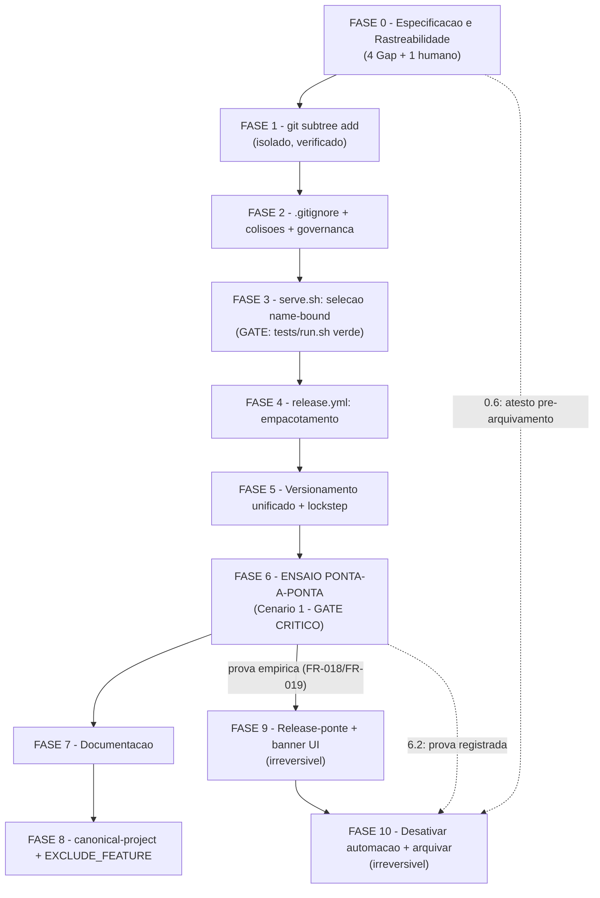

# Tarefas panel-monorepo - Migração do painel para dentro do repositório único

Escopo: decompor a migração do `cstk-panel` para `panel/` dentro do repositório
`cstk` (subárvore autocontida via `git subtree`, histórico preservado,
seleção de asset de release corrigida para ser name-bound, versionamento
unificado, release-ponte e arquivamento do repositório original) — conforme
`spec.md` (FR-001..FR-022), `plan.md` (Ordem de execução, linhas 209-223) e os
16 cenários de `quickstart.md`. Inclui uma FASE 0 dedicada a fechar os 4
`[Gap]` e o 1 `{humano}` do checklist (`checklists/requirements.md`) antes de
qualquer implementação.

**Legenda de status:**
- `[ ]` Pendente
- `[~]` Em andamento
- `[x]` Concluído
- `[!]` Bloqueado

**Legenda de criticidade:**
- `[C]` Crítico - Impacto financeiro, regulatório ou de segurança; operação
  irreversível na prática
- `[A]` Alto - Funcionalidade core sem a qual o sistema não opera
- `[M]` Médio - Necessário mas pode ser adiado sem impacto imediato

---

## FASE 0 - Especificação e Endurecimento de Rastreabilidade

Fecha os 4 `[Gap]` e o 1 `{humano}` de `checklists/requirements.md` (achados
`{auto}` do gate `checklist`, não reauditados aqui — evidência já registrada).
**Pré-requisito de todas as demais fases**: nenhuma tarefa de implementação
(FASE 1 em diante) é executável antes de todas as tarefas desta fase estarem
`[x]` (ver Matriz de Dependências).

### 0.1 Endurecer invariante I5 (validação de forma de `tag_name`) `[C]`

Ref: checklists/requirements.md CHK005; contracts/serve-asset-selection.md §3.2
I5 (linhas 86-94); dec-034 (achado do gate `owasp-security`)

O invariante I5 existe hoje só como texto no contrato — nenhum FR o torna
falseável. `quickstart.md` Cenário 13 testa `CSTK_PANEL_REPO` (validado por
regex, campo local), não `tag_name` (campo remoto vindo da resposta da API,
sem validação de forma equivalente).

- [x] 0.1.1 Adicionar em `spec.md` um novo Functional Requirement (FR-023)
  declarando que o sistema MUST validar que `bare(tag_name)` (tag sem prefixo
  `v`) casa `^[0-9A-Za-z][0-9A-Za-z.+-]*$` antes de qualquer derivação de nome
  de asset/diretório, com fail-closed (fallback ao auto-tarball) e uma linha
  em stderr quando não casar
  — evidência: `spec.md` linha 354 (Requirements) e linha 424 (Delta
  Requirements, Capability serve-integrity, ADDED); dec-043.
- [x] 0.1.2 Adicionar um Edge Case correspondente em `spec.md` §Edge Cases:
  "o que acontece quando `tag_name` da resposta da API não casa o formato
  esperado?"
  — evidência: `spec.md` §Edge Cases, bullet "O que acontece quando o
  `tag_name` da resposta da API de releases não casa o formato esperado...".
- [x] 0.1.3 (teste) Adicionar em `quickstart.md` um cenário de erro novo
  (Cenário 17) que injete, via stub de `curl`, uma resposta de release com
  `tag_name` malformado (ex. contendo `/` ou espaço) e confirme: (a)
  fail-closed para o auto-tarball, nunca seleção do asset do painel; (b) linha
  em stderr citando o formato esperado; `**Cobre**: FR-023`
  — evidência: `quickstart.md` linha 296, "Cenario 17 — `tag_name` malformado
  (fail-closed)", `**Cobre**: FR-023`.
- [x] 0.1.4 Verificar que a numeração `FR-023` não colide com nenhum FR
  existente em `spec.md` (FR-001..FR-022 já ocupados) antes de commitar
  — evidência: `grep -oE 'FR-[0-9]{3}' spec.md | sort -u | grep -c FR-023`
  => `1` (ocorrência única no enum de IDs; as demais 2 ocorrências de texto
  "FR-023" são referências à mesma FR, não redefinições).

### 0.2 Acceptance Scenario executável para FR-004 (colisão de nomes de topo) `[A]`

Ref: checklists/requirements.md CHK006 (parte 1); spec.md FR-004

`grep -oE 'FR-[0-9]{3}' quickstart.md` confirma ausência total de `FR-004` no
arquivo — a FR só aparece como item de lista em `plan.md` linha 210.

- [x] 0.2.1 Adicionar em `spec.md`, na User Story 1, um Acceptance Scenario
  novo com Given/When/Then verificável: **Given** os dois projetos com
  arquivos de topo homônimos (README, CHANGELOG, CONTRIBUTING, workflow de
  CI), **When** a migração incorpora o painel a `panel/`, **Then** cada
  arquivo permanece associado ao seu projeto de origem, sem sobrescrita
  silenciosa de nenhum dos lados
  — evidência: `spec.md` User Story 1, Acceptance Scenario 6 (novo).
- [x] 0.2.2 (teste) Adicionar em `quickstart.md` um cenário novo (Cenário 18)
  com passos verificáveis: listar os arquivos de topo homônimos antes da
  migração (`README.md`, `CHANGELOG.md`, `CONTRIBUTING.md` se existir,
  workflow de CI) em ambos os projetos, confirmar após o `git subtree add`
  que ambas as versões existem sob paths distintos (`./README.md` da raiz
  intacto, `panel/README.md` do painel intacto), e que nenhum dos dois foi
  sobrescrito; `**Cobre**: FR-004`
  — evidência: `quickstart.md` linha 317, "Cenario 18 — Colisao de nomes de
  topo preservada (FR-004)", `**Cobre**: FR-004`.
- [x] 0.2.3 Confirmar que a numeração do Acceptance Scenario novo não colide
  com os 5 já existentes na User Story 1 de `spec.md`, renumerando em
  sequência se necessário
  — evidência: `sed -n '/### User Story 1/,/^---/p' spec.md | grep -E
  '^[0-9]\.'` => sequência contígua `1.`..`6.`, sem renumeração necessária.

### 0.3 Cenário executável para FR-006 (histórico congelado vs. único) `[A]`

Ref: checklists/requirements.md CHK006 (parte 2); spec.md FR-006

`FR-006` também ausente de toda linha `**Cobre**` de `quickstart.md`; aparece
apenas em `plan.md` linha 222.

- [x] 0.3.1 (teste) Adicionar em `quickstart.md` um cenário novo (Cenário 19)
  citando `FR-006` explicitamente na linha `**Cobre**`: verificar que
  `panel/CHANGELOG.md` permanece com as entradas anteriores à migração
  intactas (histórico congelado, sem reescrita — mesmo princípio já aplicado
  ao `CHANGELOG.md` da raiz no Cenário 15), e que a partir do primeiro
  release pós-migração o `CHANGELOG.md` da raiz do repositório unificado
  passa a ser a única fonte de novas entradas que também toquem o painel
  — evidência: `quickstart.md` linha 335, "Cenario 19 — Historico de
  mudancas: congelado vs. unico (FR-006)", `**Cobre**: FR-006`.
- [ ] 0.3.2 Adicionar nota curta em `panel/CHANGELOG.md` (cabeçalho, quando a
  FASE 2 tocar o arquivo) apontando que entradas anteriores à migração são
  histórico congelado — precondição verificada pelo cenário acima
  — não executado: `panel/CHANGELOG.md` ainda não existe nesta árvore
  (`git subtree add` é FASE 1, ainda não rodou — `ls panel` confirma
  "No such file or directory"). O próprio texto da subtarefa deferi a edição
  para "quando a FASE 2 tocar o arquivo"; permanece pendente até lá
  (dec-045 registra esta constatação).
- [x] 0.3.3 Confirmar que a numeração do Cenário 19 não colide com o Cenário
  17 (FASE 0.1.3) nem com o Cenário 18 (FASE 0.2.2), mantendo sequência
  contígua em `quickstart.md`
  — evidência: `grep -n '^## Cenario' quickstart.md` => sequência contígua
  `Cenario 1`..`Cenario 19`, sem lacunas nem duplicatas.

### 0.4 Rastreabilidade formal do Cenário 1 (FR-018, FR-019) `[A]`

Ref: checklists/requirements.md CHK007; quickstart.md Cenário 1 (linhas 13-16);
plan.md linhas 225-226 ("o passo 5 é o único ponto do plano que prova a
correção no caminho real; os passos 8 e 9 são bloqueados por ele")

FR-019 hoje só aparece entre parênteses no campo `**Tipo**` do Cenário 1, não
na linha `**Cobre**` — o cenário mais crítico do plano (o único que libera os
passos 8-9) fica sub-rastreado no artefato que o exercita.

- [x] 0.4.1 Editar `quickstart.md` Cenário 1, linha `**Cobre**`: de
  `FR-008, FR-010, FR-011, FR-014, SC-001` para
  `FR-008, FR-010, FR-011, FR-014, FR-018, FR-019, SC-001`
  — evidência: `quickstart.md` linha 15 agora lê
  `**Cobre**: FR-008, FR-010, FR-011, FR-014, FR-018, FR-019, SC-001`.
- [x] 0.4.2 (teste/verificação) Rodar
  `grep -oE 'FR-[0-9]{3}' docs/specs/panel-monorepo/quickstart.md | sort -u`
  e confirmar que `FR-018` e `FR-019` aparecem na saída após a edição
  — evidência: saída inclui `FR-018` e `FR-019` (lista completa:
  FR-001,003,004,006,007,008,009,010,011,012,013,014,015,016,017,018,019,020,021,022,023).
- [x] 0.4.3 Confirmar que nenhum outro campo do Cenário 1 (`**Tipo**`, passos,
  Expected) foi alterado além da linha `**Cobre**`
  — evidência: `git diff -- docs/specs/panel-monorepo/quickstart.md` mostra
  um único hunk de 1 linha em Cenário 1 (a linha `**Cobre**`); `**Tipo**` e
  os passos 1-8 permanecem byte-idênticos.

### 0.5 Nota editorial: FR-007 sem passo de implementação `[M]`

Ref: checklists/requirements.md CHK011; plan.md §"Ordem de execução e
dependências" (linhas 209-223); research.md Decision 7 (FR-007 satisfeito por
construção, sem mudança de código); quickstart.md Cenário 8

FR-007 (governança dupla sem falso conflito) não aparece em nenhum dos 9
passos do plano nem tem nota de dispensa — fica implícito, inferido pelo
leitor.

- [x] 0.5.1 Editar `plan.md` §"Ordem de execução e dependências": anotar,
  junto ao passo 1 (`subtree add + .gitignore ancorado + colisões de topo`),
  a nota "FR-007: sem passo de implementação — consequência estrutural do
  passo 1 (`panel/` ganha `docs/constitution.md` próprio), verificada pelo
  Cenário 8 de `quickstart.md`", no mesmo padrão editorial já usado em
  `plan.md` para outras notas de escopo (ex. §Complexity Tracking)
  — evidência: `plan.md`, logo após o bloco numerado 1-9, parágrafo
  "**Nota (FR-007)**: sem passo de implementacao — consequencia estrutural
  do passo 1..." (`git diff plan.md` mostra hunk único de 4 linhas).
- [x] 0.5.2 (teste/verificação) Confirmar visualmente que a nota aparece
  associada ao passo 1 e não introduz um passo numerado novo (a numeração 1-9
  do plano permanece intacta)
  — evidência: bloco de código numerado (```1.``` a ```9.```) inalterado;
  nota inserida como parágrafo fora do bloco de código, entre o bloco e a
  frase "O passo 5 e o unico ponto...".
- [x] 0.5.3 Confirmar que o `Re-check de Constitution (pós-Phase 1)` de
  `plan.md` não precisa de atualização em decorrência desta nota puramente
  editorial (nenhum principio afetado)
  — evidência: `plan.md` linhas 285-298 tratam de predicado de seleção,
  enum `outcome` e teste de drift (Princípios I, II, IV) — nenhum item
  referencia FR-007/governança; nota puramente editorial, sem impacto de
  princípio a revalidar.

### 0.6 Decisão de processo: dono do atesto pré-arquivamento (FR-019b) `[C]`

Ref: checklists/requirements.md CHK018 ({humano}); spec.md FR-019(b);
quickstart.md Cenário 1 (`**Tipo**: manual, uma vez`)

Não há dono explícito do atesto de que a verificação da FR-019(b)
("distribuição embutida publicada e verificada") foi de fato concluída antes
do passo 9 (arquivamento). É decisão de processo de release — não algo que
`create-tasks`/`execute-task` resolvam sozinhos.

- [x] 0.6.1 Registrar bloqueio humano (`bloqueios.sh register`) perguntando ao
  operador: quem/o que atesta a verificação da FR-019(b) antes do
  arquivamento — um humano seguindo o Cenário 1 do quickstart, ou um gate
  automatizado — e onde esse atesto fica registrado (ex.: Decisão auditável
  no `state.json`/`state.db` da execução, comentário na issue de
  acompanhamento, ou checkbox assinado neste próprio `tasks.md`)
  — evidência: dec-048 (score 0, classe operacional, escolha
  `bloqueio-humano-dono-do-atesto`) + `block-003` registrado via
  `bloqueios.sh register` nesta onda, aguardando resposta do operador.
- [ ] 0.6.2 Após resposta do operador, registrar a decisão formal (Decisão
  auditável) descrevendo o mecanismo de atesto escolhido
  — não executado: aguarda resposta do operador a `block-003`.
- [ ] 0.6.3 Adicionar nota em `spec.md` FR-019 ou em `plan.md` (conforme o
  mecanismo escolhido em 0.6.2) formalizando o dono/mecanismo do atesto, para
  que deixe de ser inferido
  — não executado: aguarda resposta do operador a `block-003` (depende de
  0.6.2, que define o mecanismo a formalizar).
- [x] 0.6.4 (gate) Esta tarefa é pré-requisito explícito da tarefa **10.2**
  (arquivamento do repositório original) na Matriz de Dependências — 10.2 não
  pode ser marcada executável enquanto 0.6 não estiver `[x]`
  — evidência: `tasks.md` §Matriz de Dependências já declara
  `F0 -. "0.6: atesto pre-arquivamento" .-> F10` e a nota "FASE 10.2
  (arquivamento) tem dois pré-requisitos formais adicionais... FASE 0.6
  (dono do atesto definido)... ambos MUST estar `[x]` antes de 10.2.3" —
  gate estrutural já presente, confirmado nesta verificação; 0.6 permanece
  `[ ]` (0.6.2/0.6.3 pendentes) e portanto continua bloqueando 10.2.

---

## FASE 1 - Importação do histórico (`git subtree add`) `[C]`

Ref: plan.md §"Ordem de execução" passo 1 (parte de historico); research.md
Decision 4 (sonda empírica dec-020); quickstart.md Cenário 6

**Isolamento deliberado**: esta é a operação que mais reescreve a topologia do
histórico do repositório. Executa e é VERIFICADA em commit próprio, ANTES de
qualquer outra mudança no repo (inclusive antes de FASE 2, que ainda toca
arquivos gerados por este import). Se algo der errado depois, o subtree já
está isolado e a reversão não se mistura com outras mudanças.

### 1.1 Executar `git subtree add` sem squash `[C]`

Ref: plan.md linha 210 (FR-001..FR-004, FR-006); research.md linha 181 (sonda:
`git subtree add --prefix=panel sub main`)

- [ ] 1.1.1 Adicionar remote temporário apontando para o repositório
  `cstk-panel` (origem real do projeto, mesma fonte hoje usada por
  `CSTK_PANEL_REPO` default `JotJunior/cstk-panel` antes desta migração)
- [ ] 1.1.2 Rodar `git fetch <remote-panel> <branch-default>` e confirmar que
  a contagem de commits buscados bate com os **248 commits** medidos em
  `plan.md`/`research.md` (`git rev-list --count <remote-panel>/<branch>`)
- [ ] 1.1.3 Rodar `git subtree add --prefix=panel <remote-panel>
  <branch-default>` **sem** `--squash` — squash colapsaria os 248 commits em
  um só, quebrando FR-001 (`git log --follow` deixaria de mostrar autoria e
  datas originais por arquivo)
- [ ] 1.1.4 Remover o remote temporário após o `subtree add` concluir
- [ ] 1.1.5 Commitar o resultado do subtree isoladamente (nenhuma outra
  mudança de arquivo no mesmo commit)

### 1.2 Verificar empiricamente o import antes de prosseguir `[C]`

Ref: quickstart.md Cenário 6 (linhas 122-131); Cenário 5 passos 1-2 (linhas
107-108, apenas a contagem — o restante do Cenário 5 depende do `.gitignore`
ancorado, que só existe após FASE 2.1)

- [ ] 1.2.1 (teste) Rodar `git log --follow -- panel/package.json | tail -5` e
  confirmar commits anteriores à migração, com autoria/datas originais
  (Cenário 6 passo 1-2)
- [ ] 1.2.2 (teste) Rodar `git blame panel/apps/server/src/lib/project-root.ts
  | head -3` e confirmar atribuição a commits do histórico do painel, não ao
  commit de subtree (Cenário 6 passo 3-4)
- [ ] 1.2.3 (teste) Rodar `git ls-files panel/.claude | wc -l` e confirmar que
  o total bate com o medido antes da migração (**173** arquivos, `research.md`
  linha 108) — sabendo que este teste passaria verde mesmo sem o fix de
  `.gitignore` da FASE 2.1 (dano é prospectivo, não retroativo — `research.md`
  Decision 4)
- [ ] 1.2.4 Confirmar árvore de trabalho limpa (`git status --short` vazio)
  antes de iniciar a FASE 2

---

## FASE 2 - Estrutura pós-import: `.gitignore`, colisões de topo, governança `[A]`

Ref: plan.md linha 210 (FR-002, FR-003, FR-004, FR-006, restante do passo 1);
FASE 0.2/0.3/0.5 (cenários e nota que esta fase precisa satisfazer)

### 2.1 Ancorar `.gitignore` da raiz `[C]`

Ref: research.md Decision 4 (linhas 167-223); quickstart.md Cenário 5

- [ ] 2.1.1 Editar `.gitignore` da raiz linha 3: de `.claude` para `/.claude`
- [ ] 2.1.2 Editar `.gitignore` da raiz linha 4: de `CLAUDE.md` para
  `/CLAUDE.md` (achado colateral latente de `research.md` linha 215-222 —
  fecha a armadilha antes que alguém crie o arquivo)
- [ ] 2.1.3 (teste) Executar `quickstart.md` Cenário 5 completo: criar
  `panel/.claude/probe.md`, confirmar `git add` aceito; criar `.claude/probe.md`
  na raiz, confirmar `git add` recusado; limpar os arquivos de sonda ao final
- [ ] 2.1.4 (teste) Confirmar que os demais padrões não-ancorados
  (`dist/`, `tmp/`, `.idea`, `.DS_Store`) não requerem ajuste — nenhum arquivo
  rastreado casa (`git ls-files | grep -E '(^|/)(dist|tmp)/'` vazio,
  `research.md` linha 220-222)

### 2.2 Resolver colisões de nome de topo `[A]`

Ref: spec.md FR-004; FASE 0.2 (Acceptance Scenario + Cenário 18)

- [ ] 2.2.1 Confirmar que `README.md`, `CHANGELOG.md` e demais arquivos de
  topo homônimos entre a raiz e `panel/` permanecem em paths distintos após o
  `subtree add` (nenhuma sobrescrita — comportamento nativo de
  `git subtree add`, que mescla trees sem colidir paths de subdiretório)
- [ ] 2.2.2 Confirmar que `panel/.github/workflows/` não colide com
  `.github/workflows/` da raiz (paths distintos, sem merge de conteúdo)
- [ ] 2.2.3 (teste) Rodar o Cenário 18 (FASE 0.2.2) e confirmar ambas as
  versões dos arquivos homônimos intactas em seus paths de origem

### 2.3 Congelar histórico do painel / iniciar histórico único `[A]`

Ref: spec.md FR-006; FASE 0.3 (Cenário 19); research.md Decision 11
(referenciada em quickstart.md Cenário 15 passo 5 — `CHANGELOG.md` da raiz
nunca é reescrito)

- [ ] 2.3.1 Adicionar nota de cabeçalho em `panel/CHANGELOG.md` marcando as
  entradas anteriores à migração como histórico congelado (FASE 0.3.2)
- [ ] 2.3.2 Confirmar que `CHANGELOG.md` da raiz não é reescrito — apenas
  passa a acumular novas entradas que também tocam o painel a partir daqui
- [ ] 2.3.3 (teste) Rodar o Cenário 19 (FASE 0.3.1) e confirmar histórico
  congelado intacto em `panel/CHANGELOG.md`

### 2.4 Verificar governança dupla sem falso conflito `[M]`

Ref: spec.md FR-007; research.md Decision 7 (linhas 289-325); quickstart.md
Cenário 8; FASE 0.5 (nota editorial já aplicada em `plan.md`)

Nenhuma mudança de código — `_pl_cmd_constitution_conflict` já compara apenas
`--projeto-alvo-path` + `--feature-dir`, nunca varre subdiretórios (Decision
7). Esta tarefa é verificação, não implementação.

- [ ] 2.4.1 (teste) Rodar `pipeline.sh constitution-conflict
  --projeto-alvo-path <repo> --feature-dir <repo>/docs/specs/<f>` e confirmar
  `status: pre-skill-alert` (exit 2)
- [ ] 2.4.2 (teste) Rodar `pipeline.sh constitution-conflict
  --projeto-alvo-path <repo>/panel --feature-dir <repo>/panel/docs/specs/<f>`
  e confirmar `status: pre-skill-alert` (exit 2)
- [ ] 2.4.3 (teste) Confirmar que em nenhuma das duas execuções a constituição
  do outro projeto aparece na saída

### 2.5 `.gitattributes` export-ignore de `panel/.claude` e `panel/.github` `[A]`

Ref: plan.md linha 139 (`.gitattributes [NOVO]`); quickstart.md Cenário 16

- [ ] 2.5.1 Criar `.gitattributes` na raiz com `panel/.claude export-ignore` e
  `panel/.github export-ignore`
- [ ] 2.5.2 (teste) Confirmar que `panel/.claude/` e `panel/.github/`
  continuam versionados normalmente (`git ls-files` inalterado) — o
  `export-ignore` só afeta `git archive`, não o índice
- [ ] 2.5.3 Este teste completo (tarball final sem `.claude`/`.github`) só é
  verificável após a FASE 4 gerar um tarball real — ver 4.3

---

## FASE 3 - Correção de `serve.sh`: seleção name-bound + validações + testes `[C]`

Ref: plan.md linha 211-214 (FR-008, FR-009, FR-012, FR-013, FR-014);
contracts/serve-asset-selection.md §3.2, §7, §8

**GATE bloqueante**: `./tests/run.sh` MUST estar verde ao final desta fase
(plan.md linha 214) — nenhuma release nova pode ser publicada com os dois
pares de assets antes disto (restrição dura #1 do plano, linhas 201-203).

### 3.1 Seleção de asset name-bound (I1-I5) `[C]`

Ref: contracts/serve-asset-selection.md §3.2 (linhas 39-70); FASE 0.1 (I5)

- [ ] 3.1.1 Implementar `EXPECTED = "cstk-panel-" + bare(tag_name) +
  ".tar.gz"` em `cli/lib/serve.sh`, substituindo a lógica posicional atual
  (`serve.sh:390-393`)
- [ ] 3.1.2 Implementar comparação por **igualdade** de basename (após strip
  de `?query`/`#fragment`), nunca prefixo/substring (I1, I2) — rejeitar
  basename contendo `%`
- [ ] 3.1.3 Implementar validação de forma de `tag_name` (I5, FR-023 da FASE
  0.1): `bare(tag_name)` MUST casar `^[0-9A-Za-z][0-9A-Za-z.+-]*$` antes de
  qualquer derivação; fail-closed com linha em stderr se não casar
- [ ] 3.1.4 Implementar fallback ao auto-tarball existente quando nenhum
  candidato satisfizer (a)+(b) simultaneamente (I3) — nunca selecionar outro
  asset
- [ ] 3.1.5 (teste) Cobrir a matriz de decisão completa de
  `contracts/serve-asset-selection.md` §3.3 (7 linhas) com os cenários da
  tarefa 3.4

### 3.2 Validação pré-extração do tarball `[C]`

Ref: contracts/serve-asset-selection.md §8 (linhas 116-136); spec.md FR-009

- [ ] 3.2.1 Após checksum conferir e antes de `tar -x`: listar membros via
  `tar -tzf` e rejeitar caminho absoluto, componente `..`, symlink/hardlink,
  ou entrada de device
- [ ] 3.2.2 Rejeitar se houver mais de um diretório de topo, ou se o único
  diretório de topo não for exatamente `cstk-panel-<bare>/` (mesmo `<bare>`
  validado por I5 em 3.1.3) — ordem: passo 3.2.1 roda antes deste, para
  rejeitar `..`/caminho-absoluto antes de `<bare>` entrar em comparação de
  caminho
- [ ] 3.2.3 Extrair com `--no-same-owner --no-same-permissions`
- [ ] 3.2.4 Manter a checagem pós-extração de `package.json` como backstop
- [ ] 3.2.5 Gravar outcome `wrong-payload-blocked` no
  `enforcement-log.jsonl` (via `_serve_write_integrity_log`) em qualquer
  rejeição de 3.2.1/3.2.2/3.2.4, com `expected_sha256`/`actual_sha256` iguais
  e não-nulos, **e** emitir linha distinta em stderr (o log é best-effort;
  stderr não pode depender só dele)
- [ ] 3.2.6 (teste) Cenário 4 do quickstart (`wrong-payload`, linhas 79-95):
  checksum correto, payload sem `package.json` na raiz pós-strip; confirmar
  falha (exit != 0) e a linha exata do `enforcement-log.jsonl`

### 3.3 `CSTK_PANEL_REPO` override + validação + allowlist + anúncio `[A]`

Ref: spec.md FR-012, FR-013; contracts/serve-asset-selection.md §7 (linhas
104-115); research.md Decision 3 (linhas 133-164)

- [ ] 3.3.1 Introduzir `CSTK_PANEL_REPO="${CSTK_PANEL_REPO:-JotJunior/cstk}"`
  em `cli/lib/serve.sh`, substituindo a constante hardcoded
  `_SERVE_GITHUB_API` que hoje aponta para `JotJunior/cstk-panel`
- [ ] 3.3.2 Validar formato antes de qualquer uso:
  `^[A-Za-z0-9][A-Za-z0-9._-]*/[A-Za-z0-9][A-Za-z0-9._-]*$`; valor inválido =
  erro fail-closed com mensagem acionável, **nunca** cair silenciosamente no
  default
- [ ] 3.3.3 Passar a URL composta por `trusted_host_check`
  (`_serve_check_host_allowlist`, `serve.sh:407`) antes do primeiro request —
  mesma allowlist constante de `cli/lib/trusted-hosts.sh:47`, não lida de env
- [ ] 3.3.4 Emitir aviso em stderr e uma linha no `enforcement-log.jsonl`
  quando o valor efetivo divergir do default `JotJunior/cstk`
- [ ] 3.3.5 (teste) Cenário 13 do quickstart (linhas 227-244): fork válido
  (aviso + log), `../../etc` rejeitado fail-closed sem cair no default, valor
  com barra construído para tentar escapar do formato `owner/repo` mas cujo
  host final continua `api.github.com`, e caso sem a variável definida
  (default silencioso, sem log)

### 3.4 Testes de seleção: 3 modos novos de stub + 3 cenários `[A]`

Ref: quickstart.md Cenários 2, 3, 4; tests/cstk/test_serve.sh (bloco
`_stub_curl_release_assets`, ~linhas 1670-1755, já tem `ok`/`no-sibling`/
`bad-sha`/`evil-host`)

- [ ] 3.4.1 Implementar modo `both-pairs`: `assets[]` lista o par do toolkit
  antes do par do painel; confirmar download de `cstk-panel-9.9.9.tar.gz` e
  **não** de `cstk-9.9.9.tar.gz` (Cenário 2) — ordem invertida é essencial: com
  o painel primeiro, o código antigo também passaria e o teste não provaria
  nada
- [ ] 3.4.2 Implementar modo `toolkit-only`: `assets[]` só tem o par
  `cstk-*`; confirmar fallback ao auto-tarball, nunca download de
  `cstk-9.9.9.tar.gz` (Cenário 3)
- [ ] 3.4.3 Implementar modo `wrong-payload` (Cenário 4 — usa a validação da
  FASE 3.2)
- [ ] 3.4.4 (teste) Confirmar que os 4 modos pré-existentes (`ok`,
  `no-sibling`, `bad-sha`, `evil-host`) continuam passando sem alteração de
  comportamento (FR-014, "todos os cenários pré-existentes MUST continuar
  passando")

### 3.5 Teste de drift de majors de Node `[M]`

Ref: research.md Decision 5 (linhas 226-257); quickstart.md Cenário 11

- [ ] 3.5.1 Criar teste novo sob `tests/cstk/` que lê `panel/package.json`
  (`engines.node`) com `awk` POSIX e compara contra
  `_SERVE_SUPPORTED_NODE_MAJORS="20 22 23 24"` de `cli/lib/serve.sh:127`
- [ ] 3.5.2 (teste) Confirmar verde no estado atual (`engines.node =
  "20.x || 22.x || 23.x || 24.x"` casa a constante)
- [ ] 3.5.3 (teste) Alterar temporariamente `engines.node` (remover `24.x`),
  confirmar que o teste falha apontando os dois arquivos, depois reverter

### 3.6 Gate: `./tests/run.sh` verde `[C]`

Ref: quickstart.md Cenário 7 (linhas 134-153); plan.md linha 214

- [ ] 3.6.1 Rodar `./tests/run.sh` na raiz e confirmar verde
- [ ] 3.6.2 Confirmar `./tests/run.sh cstk/test_serve.sh` contra o baseline
  medido **74** (`PASS: 74 FAIL: 0 ERROR: 0 ORPHANS: 0`, commit `90c0417`,
  dec-025) — **não** contra o número do plano-insumo (55), que esconderia 19
  cenários numa regressão (FR-014)
- [ ] 3.6.3 Confirmar `./tests/run.sh cstk/test_serve-docker.sh` contra o
  baseline **53**
- [ ] 3.6.4 Rodar `./tests/run.sh --check-coverage` e confirmar sem órfãos
- [ ] 3.6.5 Rodar `cd panel && npm test && npm run typecheck && npm run
  build` e confirmar verde, como projeto autocontido

---

## FASE 4 - `release.yml`: empacotamento do painel `[A]`

Ref: plan.md linha 215-216 (FR-010, FR-011); contracts/serve-asset-selection.md
§4 (linhas 71-89)

### 4.1 Passo de empacotamento no workflow `[A]`

Ref: contracts/serve-asset-selection.md §4

- [ ] 4.1.1 Adicionar passo em `.github/workflows/release.yml` executando
  `git archive --format=tar.gz --prefix="cstk-panel-${BARE}/" -o
  "dist/cstk-panel-${BARE}.tar.gz" HEAD:panel`
- [ ] 4.1.2 Gerar o sha256 sibling:
  `sha256sum "dist/cstk-panel-${BARE}.tar.gz" >
  "dist/cstk-panel-${BARE}.tar.gz.sha256"`
- [ ] 4.1.3 Publicar os quatro artefatos na mesma release versionada:
  `cstk-<bare>.tar.gz`, `.sha256`, `cstk-panel-<bare>.tar.gz`, `.sha256` (FR-011
  — mesmo processo de release, não pipeline separado)
- [ ] 4.1.4 Estender o passo "Verify build artifacts" do workflow para
  também confirmar a presença e o nome exato dos dois artefatos do painel

### 4.2 Estrutura exigida do pacote (FR-010) `[A]`

Ref: contracts/serve-asset-selection.md §4 (tabela); serve.sh:488;
serve-docker.sh:356

- [ ] 4.2.1 Confirmar que `--prefix="cstk-panel-${BARE}/"` do `git archive`
  produz exatamente um diretório de topo (satisfaz `tar
  --strip-components 1` em `serve.sh:480`)
- [ ] 4.2.2 Confirmar que `package.json` e `package-lock.json` do painel
  ficam na raiz da árvore extraída (herdados de `HEAD:panel`, sem passo
  adicional)
- [ ] 4.2.3 (teste) Extrair localmente o tarball gerado pela FASE 4.1 e
  confirmar via `tar -tzf` que ambos os arquivos aparecem imediatamente sob o
  único diretório de topo, sem passo de build adicional

### 4.3 Testes: tarball sem config de agente, um único diretório de topo `[A]`

Ref: quickstart.md Cenário 16 (linhas 281-292); FASE 2.5 (`.gitattributes`)

- [ ] 4.3.1 (teste) `tar -tzf dist/cstk-panel-<bare>.tar.gz | grep -c
  '\.claude/'` — confirmar `0`
- [ ] 4.3.2 (teste) `tar -tzf dist/cstk-panel-<bare>.tar.gz | grep -c
  '\.github/'` — confirmar `0`
- [ ] 4.3.3 (teste) `tar -tzf dist/cstk-panel-<bare>.tar.gz | awk -F/
  '{print $1}' | sort -u | wc -l` — confirmar `1`

---

## FASE 5 - Versionamento unificado e lockstep `[A]`

Ref: plan.md linha 217 (FR-015, FR-016); quickstart.md Cenário 14

### 5.1 Painel acompanha a versão única da release `[A]`

Ref: spec.md FR-015

- [ ] 5.1.1 Remover a numeração de versão independente do painel
  (`panel/package.json` `version`) do fluxo de release próprio do
  `cstk-panel` (automação desativada apenas na FASE 10 — aqui apenas deixa de
  ser a fonte de verdade)
- [ ] 5.1.2 Fazer `panel/package.json` `version` avançar junto com a tag
  SemVer do repositório unificado a cada release
- [ ] 5.1.3 (teste) Após o primeiro release unificado, confirmar que
  `panel/package.json` `version` não diverge da tag publicada

### 5.2 Lockstep dos 3 workspaces `[A]`

Ref: spec.md FR-016

- [ ] 5.2.1 Garantir que `apps/server`, `apps/web` e `packages/shared-types`
  recebam a mesma versão `X.Y.Z` da release, sem divergência entre si
- [ ] 5.2.2 Garantir que `panel/package-lock.json` reflete as mesmas versões
- [ ] 5.2.3 Confirmar que os 3 arquivos de versão do toolkit
  (`.claude-plugin/marketplace.json` e os 2 `plugin.json`) permanecem em
  lockstep — já gate bloqueante existente (`validate-plugin-manifests.sh
  --strict`, MP-5), não requer mudança

### 5.3 Teste: lockstep completo `[M]`

Ref: quickstart.md Cenário 14 (linhas 247-260)

- [ ] 5.3.1 (teste) Após um ciclo de release de `vX.Y.Z`, confirmar
  `panel/package.json` `version = X.Y.Z`
- [ ] 5.3.2 (teste) Confirmar os três workspaces com a mesma `X.Y.Z`
- [ ] 5.3.3 (teste) Confirmar `panel/package-lock.json` e os 3 manifestos do
  toolkit também em `X.Y.Z`

---

## FASE 6 - ENSAIO DE RELEASE ponta-a-ponta (Cenário 1) — GATE CRÍTICO `[C]`

Ref: quickstart.md Cenário 1 (linhas 13-43, `**Cobre**` já ajustado pela FASE
0.4 para incluir FR-018/FR-019); plan.md linhas 225-226

**Este é o único ponto do plano que prova a correção no caminho real** — os
testes automatizados (FASE 3.4) exercitam stubs de `curl`, não uma release
real produzida pelo workflow real. **Nenhuma tarefa das FASES 9 e 10 (passos
8-9 do plano) roda antes desta fase estar `[x]`** — ver Matriz de
Dependências. Publicar uma release é permanente; arquivar o repositório
original é reversível no GitHub mas o sinal já foi dado — este ensaio é o
portão, não uma verificação posterior.

### 6.1 Executar o ensaio completo `[C]`

Ref: quickstart.md Cenário 1, passos 1-8

- [ ] 6.1.1 Em branch de trabalho, com `panel/` já importado (FASE 1-2) e
  `serve.sh` já corrigido (FASE 3), criar uma tag de teste sem sufixo SemVer
  (ex. `v9.6.0-rc1` tratado como não-prerelease — `release.yml:102-104` marca
  `--prerelease` para tags com sufixo; usar tag sem sufixo ou marcar a release
  de teste como não-prerelease manualmente, senão o `serve` recusa e produz
  falso negativo)
- [ ] 6.1.2 Empurrar a tag e aguardar `release.yml` concluir
- [ ] 6.1.3 Confirmar que a release publica os quatro artefatos:
  `cstk-<bare>.tar.gz`, `.sha256`, `cstk-panel-<bare>.tar.gz`, `.sha256` (mais
  `cli/install.sh`)
- [ ] 6.1.4 Rodar `CSTK_PANEL_REPO=<owner/repo-de-teste> cstk serve --update`
  apontando para essa release
- [ ] 6.1.5 Confirmar Expected (a): a saída informa download do asset do
  painel — URL impressa em `serve.sh:399` contém `cstk-panel-`, nunca
  `cstk-<bare>`
- [ ] 6.1.6 Confirmar Expected (b): outcome `verified` — nenhuma linha nova em
  `.claude/enforcement-log.jsonl`
- [ ] 6.1.7 Confirmar Expected (c): `.panel-version` contém a tag da release
  do `cstk`
- [ ] 6.1.8 Confirmar Expected (d): árvore extraída contém `apps/server/`,
  `apps/web/`, `packages/shared-types/`, `package.json` e `package-lock.json`
  na raiz
- [ ] 6.1.9 **Critério de falha que importa**: se (a) falhar mas (b) passar,
  o defeito original se reproduziu — carimbo de integridade sobre o pacote
  errado; tratar como falha do ensaio, não prosseguir para FASE 9/10

### 6.2 Registrar o resultado como prova formal `[C]`

Ref: FASE 0.6 (mecanismo de atesto definido pelo operador)

- [ ] 6.2.1 Registrar o resultado do ensaio (passo, sucesso, timestamp) usando
  o mecanismo de atesto definido em FASE 0.6.2/0.6.3
- [ ] 6.2.2 Esta tarefa, junto com 0.6, é pré-requisito formal de **10.2**
  (arquivamento) na Matriz de Dependências
- [ ] 6.2.3 (teste) Confirmar que o registro do atesto é consultável
  independentemente (Decisão auditável, comentário de issue ou checkbox
  assinado) antes de marcar 6.2 como `[x]`

---

## FASE 7 - Documentação `[A]`

Ref: plan.md linha 219 (FR-017); quickstart.md Cenário 15

### 7.1 Atualizar documentos que descrevem a origem do painel `[A]`

Ref: spec.md FR-017; plan.md linhas 145, 153, 155 (lista de arquivos a
modificar/revisar)

- [ ] 7.1.1 Atualizar `docs/cstk-serve.md` e `docs/cstk-serve.pt-BR.md`:
  origem passa a ser as releases do próprio repositório unificado
- [ ] 7.1.2 Atualizar `cli/README.md` e `cli/README.pt-BR.md`: idem
- [ ] 7.1.3 Revisar `docs/cstk-panel/*-brief.md`: ajustar menções que
  descrevem o painel como projeto externo (preservando menções históricas
  legítimas, ex. `CHANGELOG.md`)
- [ ] 7.1.4 Confirmar que `README.md` da raiz permanece sem menção ao painel
  (não tocar, conforme `plan.md` linha 142)

### 7.2 Teste: nenhum documento afirma origem externa `[M]`

Ref: quickstart.md Cenário 15 (linhas 263-278)

- [ ] 7.2.1 (teste) Rodar `git ls-files '*.md' | grep -v
  '^docs/specs/_archived/' | xargs grep -l 'cstk-panel'` e confirmar que os
  arquivos retornados são apenas menção histórica legítima
  (`CHANGELOG.md`, artigo datado, `panel/**`)
- [ ] 7.2.2 (teste) Inspecionar os 4 arquivos da tarefa 7.1.1/7.1.2 e
  confirmar que descrevem a origem como as releases do repositório unificado
- [ ] 7.2.3 (teste) Confirmar que `CHANGELOG.md` da raiz não foi reescrito
  (research.md Decision 11)

---

## FASE 8 - `--canonical-project` e `EXCLUDE_FEATURE` `[A]`

Ref: plan.md linha 220 (FR-020, FR-021); quickstart.md Cenário 9

### 8.1 `--canonical-project` nos commands `[A]`

Ref: plan.md linhas 158-159 (`plugins/cstk/commands/feature-00c.md`,
`agente-00c.md`); spec.md FR-020, FR-021

- [ ] 8.1.1 Confirmar/ajustar `--canonical-project` em
  `plugins/cstk/commands/feature-00c.md` para que execuções com PAP =
  `<repo>/panel` usem identidade `cstk-panel`
- [ ] 8.1.2 Confirmar/ajustar o mesmo em
  `plugins/cstk/commands/agente-00c.md`
- [ ] 8.1.3 Confirmar que `state-rw.sh` já suporta `--canonical-project`
  (plan.md linha 163 — inalterado, apenas consumido)

### 8.2 `EXCLUDE_FEATURE` no orchestrator `[A]`

Ref: plan.md linha 160 (`plugins/cstk/agents/agente-00c-orchestrator.md`)

- [ ] 8.2.1 Ajustar `EXCLUDE_FEATURE` no `agente-00c-orchestrator.md` para
  paridade com a derivação de `canonical_project` quando PAP = `panel/`
- [ ] 8.2.2 (teste) Confirmar que uma execução com PAP = `panel/` deriva
  `EXCLUDE_FEATURE` a partir de `cstk-panel`, nunca `panel`
- [ ] 8.2.3 Confirmar que o ajuste não altera `EXCLUDE_FEATURE` para
  execuções com PAP = raiz do repositório (paridade preservada, sem
  regressão)

### 8.3 Teste: identidade `cstk-panel` preservada `[M]`

Ref: quickstart.md Cenário 9 (linhas 170-184)

- [ ] 8.3.1 (teste) Rodar uma `feature-00c` curta com PAP = `<repo>/panel` e
  `--canonical-project cstk-panel`; confirmar `project = 'cstk-panel'` na
  knowledge.db (nunca `panel`)
- [ ] 8.3.2 (teste) Confirmar que o state da execução vive em
  `<repo>/panel/.claude/feature-00c-state/<short>/`, sem nada novo em
  `<repo>/.claude/feature-00c-state/`
- [ ] 8.3.3 (teste) Abrir o painel, navegar às execuções do projeto
  `cstk-panel`, confirmar que as 7 execuções históricas continuam resolvendo
  sem órfãos nem identidade duplicada

---

## FASE 9 - Release-ponte no `cstk-panel` com banner na UI `[C]`

Ref: plan.md linha 221 (FR-018, FR-022); depende de FASE 6 (ver Matriz)

**Irreversível na prática**: publicar uma release é permanente — mesmo se
deletada depois, quem já baixou já baixou. Não inicia antes de FASE 6 (Cenário
1) ter passado.

### 9.1 Banner estático embutido no bundle `[C]`

Ref: spec.md FR-022; research.md Decision 6 (linhas 260-286) — zero rede,
offline-safe (Princípio IV)

- [ ] 9.1.1 Implementar elemento visível e persistente na UI do painel
  informando a mudança de local e a ação necessária (`cstk self-update`)
- [ ] 9.1.2 Confirmar que o banner é estático (embutido no bundle), sem
  feature-flag remoto, sem fetch à API de releases
- [ ] 9.1.3 (teste) Confirmar visualmente que o texto do banner cita a ação
  necessária (`cstk self-update`) de forma acionável, não apenas "o painel
  mudou de lugar"

### 9.2 Publicar release-ponte pelo fluxo normal `[C]`

Ref: spec.md FR-018; quickstart.md Cenário 1 nota (linha 16) — FR-019(a)

- [ ] 9.2.1 Publicar a release-ponte no repositório `cstk-panel` pelo fluxo
  normal já existente (tag → workflow) — **nunca** artefato manual (a release
  manual degradaria o guard de integridade do `cstk serve` para
  `unverifiable-blocked`, spec.md §Clarifications)
- [ ] 9.2.2 Confirmar que a release-ponte contém o banner da tarefa 9.1
- [ ] 9.2.3 (teste) Confirmar que o par `<asset>`/`<asset>.sha256` da
  release-ponte foi gerado pelo workflow, nunca por upload manual

### 9.3 Teste: aviso de transição visível e offline-safe `[M]`

Ref: quickstart.md Cenário 12 (linhas 212-223)

- [ ] 9.3.1 (teste) Instalar o painel na versão da release-ponte, abrir a UI,
  confirmar aviso visível e persistente
- [ ] 9.3.2 (teste) Desconectar a rede e recarregar; confirmar que o aviso
  continua visível (estático, não depende de fetch)
- [ ] 9.3.3 (teste) Confirmar que nenhuma requisição de rede nova aparece no
  console/network do navegador associada ao banner (Princípio IV)

---

## FASE 10 - Desativar automação e arquivar o repositório original `[C]`

Ref: plan.md linha 222 (FR-005, FR-019); depende de FASE 6 **e** FASE 0.6/6.2
**e** FASE 9 (ver Matriz — a mais gateada de todo o backlog)

**Irreversível na prática**: arquivar o `cstk-panel` é tecnicamente reversível
no GitHub, mas o sinal de "projeto encerrado" já foi dado ao ecossistema.

### 10.1 Desativar automação de release independente `[C]`

Ref: spec.md FR-005; FASE 9.2 (pré-requisito: release-ponte já publicada)

- [ ] 10.1.1 Confirmar que a release-ponte (FASE 9.2) foi publicada com
  sucesso antes de tocar a automação
- [ ] 10.1.2 Remover/desativar `panel/.github/workflows/release.yml` (plan.md
  linha 177, `[REMOVER]`) — publicação já absorvida pelo processo do
  repositório unificado (FASE 4)
- [ ] 10.1.3 (teste) Confirmar que nenhum outro workflow de
  `panel/.github/workflows/` (CI de build/test, mantido por decisão da spec
  §Clarifications Q2) foi removido por engano junto com o de release

### 10.2 Arquivar o repositório original `[C]`

Ref: spec.md FR-019 (ordem a→b); FASE 0.6 (atesto) e FASE 6.2 (prova
registrada) — **pré-requisitos formais explícitos**, não apenas ordem lógica

- [ ] 10.2.1 **Gate**: confirmar que FASE 0.6 (dono do atesto definido) e
  FASE 6.2 (ensaio ponta-a-ponta registrado como prova) estão `[x]` — sem
  isso, esta subtarefa não é executável
- [ ] 10.2.2 Confirmar ordem FR-019: (a) release-ponte da FASE 9.2 publicada
  com sucesso; **e** (b) distribuição do painel embutido (FASE 6) publicada e
  com correta seleção/integridade verificada — ambas satisfeitas antes de
  prosseguir
- [ ] 10.2.3 Arquivar o repositório `cstk-panel` original no GitHub

### 10.3 Verificação final pós-arquivamento `[M]`

- [ ] 10.3.1 (teste) Confirmar que uma instalação simulando a versão anterior
  à migração, ao executar o fluxo de atualização padrão contra o repositório
  agora arquivado, ainda recebe o aviso de transição da FASE 9.1 (release-
  ponte permanece acessível mesmo com repositório arquivado)
- [ ] 10.3.2 Atualizar `Escopo Coberto` deste `tasks.md` (ver rodapé) marcando
  a migração como concluída, se aplicável ao processo de fechamento da
  execução
- [ ] 10.3.3 (teste) Confirmar SC-001..SC-008 de `spec.md` §Success Criteria
  um a um contra o estado final do repositório, registrando qualquer
  divergência como achado antes de fechar a execução

---

## Matriz de Dependências



**Notas da matriz**:
- FASE 0 é pré-requisito de **todas** as fases de implementação (1-10) —
  nenhuma tarefa de implementação é executável antes da FASE 0 estar
  completa.
- FASE 1 (`git subtree add`) é isolada e verificada em commit próprio antes de
  qualquer outra mudança no repositório (inclusive antes da FASE 2).
- FASE 6 (ensaio ponta-a-ponta) é o portão que libera FASE 9 e FASE 10 (passos
  8-9 do plano) — nenhuma tarefa dessas duas fases roda antes de FASE 6 estar
  `[x]`.
- FASE 10.2 (arquivamento) tem dois pré-requisitos formais adicionais além da
  ordem sequencial: FASE 0.6 (dono do atesto definido) e FASE 6.2 (prova do
  ensaio registrada) — ambos MUST estar `[x]` antes de 10.2.3.

## Resumo Quantitativo

| Fase | Tarefas | Subtarefas | Criticidade |
|------|---------|------------|-------------|
| 0 - Especificação e Rastreabilidade | 6 | 20 | C/A/M |
| 1 - Import do histórico | 2 | 9 | C |
| 2 - Estrutura pós-import | 5 | 16 | C/A/M |
| 3 - serve.sh + testes | 6 | 28 | C/A/M |
| 4 - release.yml | 3 | 10 | A |
| 5 - Versionamento e lockstep | 3 | 9 | A/M |
| 6 - Ensaio ponta-a-ponta | 2 | 12 | C |
| 7 - Documentação | 2 | 7 | A/M |
| 8 - canonical-project | 3 | 9 | A/M |
| 9 - Release-ponte + banner | 3 | 9 | C/M |
| 10 - Desativar + arquivar | 3 | 9 | C/M |
| **Total** | **38** | **138** | - |

## Escopo Coberto

| Item | Descrição | Fase |
|------|-----------|------|
| checklist-gaps | Fecha os 4 `[Gap]` (CHK005, CHK006 x2, CHK007, CHK011) e o 1 `{humano}` (CHK018) do checklist | 0 |
| history-import | `git subtree add` sem squash, histórico completo preservado | 1 |
| gitignore-anchor | `/.claude`, `/CLAUDE.md` ancorados na raiz | 2 |
| top-collisions | Colisão de nomes de topo resolvida (FR-004) | 2 |
| changelog-freeze | Histórico do painel congelado vs. único contínuo (FR-006) | 2 |
| governance-dual | Governança dupla sem falso conflito (FR-007, verificação apenas) | 2 |
| gitattributes | `export-ignore` de `panel/.claude`/`panel/.github` | 2 |
| serve-selection | Seleção de asset name-bound (I1-I5, FR-008, FR-023) | 3 |
| serve-preextract | Validação pré-extração do tarball (FR-009) | 3 |
| serve-override | `CSTK_PANEL_REPO` override + validação + allowlist (FR-012, FR-013) | 3 |
| serve-tests | 3 modos novos de stub + 3 cenários automatizados (FR-014) | 3 |
| node-drift-test | Teste de drift de majors de Node | 3 |
| release-packaging | Empacotamento do painel no `release.yml` (FR-010, FR-011) | 4 |
| version-lockstep | Versionamento unificado + lockstep de workspaces (FR-015, FR-016) | 5 |
| e2e-rehearsal | Ensaio de release ponta-a-ponta — prova principal (FR-018, FR-019) | 6 |
| docs-update | Documentação atualizada (FR-017) | 7 |
| canonical-project | Identidade `cstk-panel` preservada (FR-020, FR-021) | 8 |
| bridge-release | Release-ponte + banner de transição (FR-018, FR-022) | 9 |
| archive-original | Desativação de automação + arquivamento (FR-005, FR-019) | 10 |

## Escopo Excluído

| Item | Descrição | Motivo |
|------|-----------|--------|
| R1-attestation | Adicionar attestation/assinatura ao par asset+`.sha256` | Achado `high` pré-existente aceito com rastro (block-002/dec-029, issue #177) — nenhuma tarefa deste backlog pode citá-lo como resolvido nem ampliar sua exposição |
| R2-post-redirect | Revalidar allowlist de host pós-redirect em `cli/lib/http.sh` | Achado `high` pré-existente aceito com rastro (block-002/dec-029, issue #178) — mesma restrição de R1 |
| painel-ci-workflows | Executar automaticamente os workflows de CI de build/test do painel movidos para `panel/.github/workflows/` | Decisão explícita da spec (§Clarifications Q2): permanecem sem execução automática — constatação de estado herdado, não obrigação desta migração; lacuna registrada em `plan.md` §Complexity Tracking como dívida herdada, feature própria para fechar |
| runtime-node-derivation | Derivar `_SERVE_SUPPORTED_NODE_MAJORS` em runtime a partir de `panel/package.json` | Rejeitado em `research.md` Decision 5 — exigiria parse de JSON no caminho quente do `serve`, fora do carve-out de dependência obrigatória da constitution 1.3.0; o teste de drift (FASE 3.5) entrega o valor sem o custo |
