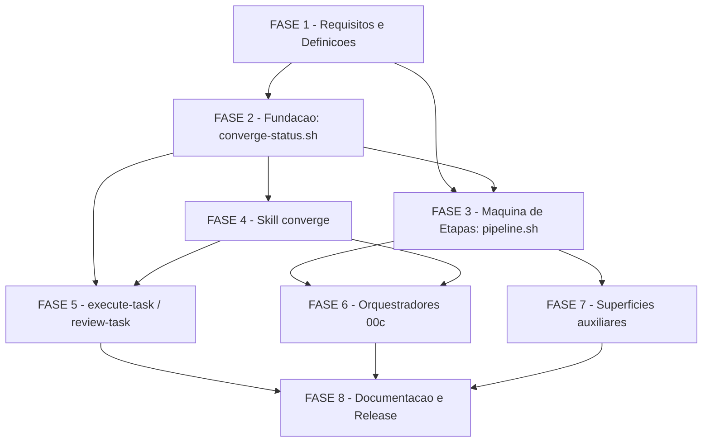

# Tarefas pipeline-converge - Etapa `converge` na pipeline SDD oficial

Escopo: emancipar a convergencia (skill `converge`) de comportamento embutido
na prosa dos orquestradores para etapa nomeada e ordenada da pipeline SDD,
entre `execute-task` e `review-task`, valendo para execucao autonoma
(`agente-00c`/`feature-00c`) e manual. Baseado em `spec.md` (10 FRs, 4 SCs),
`plan.md` (faseamento F1-F7 + 8 findings de seguranca ja mitigados no
desenho) e nos gaps `{auto}` abertos de `checklists/requirements.md`
(CHK002, CHK004, CHK016, CHK024).

**Legenda de status:**
- `[ ]` Pendente
- `[~]` Em andamento
- `[x]` Concluido
- `[!]` Bloqueado

**Legenda de criticidade:**
- `[C]` Critico - Impacto financeiro direto ou bloqueante (aqui: componentes
  que decidem avanco de etapa e cujo modo de falha errado e fail-open num
  gate de seguranca — plan.md §Revisao de seguranca F1/F2/F8)
- `[A]` Alto - Funcionalidade core sem a qual a etapa nao opera
- `[M]` Medio - Necessario mas adiavel sem bloquear a feature

---

## FASE 1 - Requisitos e Definicoes de Design (fecha gaps do checklist)

### 1.1 Definir semantica de `actionable` para achados `unrequested`-only `[A]`

Ref: `checklists/requirements.md` CHK002; `data-model.md` campo `actionable`;
skill `converge` SKILL.md ETAPA 6 (comportamento pre-existente)

- [x] 1.1.1 Ler `plugins/cstk/skills/converge/SKILL.md` ETAPA 6 e confirmar,
      no codigo/prosa existente, como `unrequested` e hoje diferenciado de
      `missing`/`partial`/`contradicts`
- [x] 1.1.2 Registrar a decisao no `data-model.md` (campo `actionable` do
      `ConvergenceStatusRecord`): achados classificados **so** como
      `unrequested` NAO contam em `actionable` nem impedem `outcome=clean`
      — `unrequested` e achado de revisao, nunca acionavel na definicao de
      FR-003/FR-004
- [x] 1.1.3 Atualizar `contracts/converge-status-cli.md` (subcomando
      `record`) citando explicitamente a regra acima
- [x] 1.1.4 Ref cruzada: marcar CHK002 como fechado em
      `checklists/requirements.md` apos a atualizacao dos artefatos

### 1.2 Definir `tasks.md` vazio vs ausente para `detect-completion`/`check` `[A]`

Ref: `checklists/requirements.md` CHK004; `contracts/pipeline-stage-machine.md`
§D2; `contracts/converge-status-cli.md` subcomando `check`

- [x] 1.2.1 Decidir a regra: `tasks.md` presente mas sem nenhuma linha de
      tarefa (0 checkboxes) e tratado **igual** a `tasks.md` ausente — etapa
      `converge` nao se aplica (FR-005), mesmo veredito `not-applicable`
- [x] 1.2.2 Atualizar `contracts/pipeline-stage-machine.md` §D2, linha
      "`DIR/tasks.md` ausente" -> "`DIR/tasks.md` ausente OU sem nenhuma
      linha de tarefa"
- [x] 1.2.3 Atualizar `contracts/converge-status-cli.md` tabela de `check`
      na mesma linha, mantendo consistencia entre os dois contratos
- [x] 1.2.4 Ref cruzada: marcar CHK004 como fechado apos a atualizacao

### 1.3 Especificar mecanismo de auditoria agregada para SC-002/SC-003 `[M]`

Ref: `checklists/requirements.md` CHK016; spec.md SC-002/SC-003

- [x] 1.3.1 Especificar subcomando novo `converge-status.sh audit
      --specs-root DIR [--json]`: para cada `DIR/<feature>/tasks.md`
      totalmente concluido (zero linhas `- [ ]`/`- [~]`), verifica se ha
      registro `outcome=clean|risk-accepted` com `tasks-digest` batendo o
      atual; agrega contagem conforme/nao-conforme e emite exit 1 se houver
      pelo menos um nao-conforme (mecanismo objetivo e automatizavel,
      fechando o gap "aspiracional sem instrumento" do CHK016)
- [x] 1.3.2 Adicionar a secao `audit` em `contracts/converge-status-cli.md`
      com a tabela de exit codes/stdout, no mesmo padrao das demais
- [x] 1.3.3 Adicionar cenario de validacao dedicado em `quickstart.md`
      (Cenario 21) exercitando `audit` sobre um conjunto sintetico de
      features conformes e nao-conformes
- [x] 1.3.4 Ref cruzada: marcar CHK016 como fechado apos a atualizacao

---

## FASE 2 - Fundacao: `converge-status.sh`

### 2.1 Implementar `converge-status.sh` (record/latest/check/accept-risk/audit) `[C]`

Ref: `contracts/converge-status-cli.md`; `data-model.md`
`ConvergenceStatusRecord`; plan.md Faseamento F1; plan.md §Revisao de
seguranca F1-F8

- [x] 2.1.1 Criar `plugins/cstk/skills/converge/scripts/converge-status.sh`
      (`#!/bin/sh`, `set -eu`), dispatch de subcomandos
      `record|latest|check|accept-risk|audit`, sem `jq` (Constitution II)
- [x] 2.1.2 Implementar `record`: valida coerencia `outcome=clean` <=>
      `actionable=0` e `outcome=actionable` <=> `actionable>=1`; calcula
      `at` (UTC `%Y-%m-%dT%H:%M:%SZ`) e `tasks-digest` reusando o helper
      `sha256-12` ja usado por `converge-tasks.sh gap-key`
- [x] 2.1.3 Implementar escrita atomica: `mktemp -- "<DIR>/converge-report.md.XXXXXX"`
      no MESMO diretorio do destino + `mv -f` (mesmo padrao de
      `converge-tasks.sh:303`), preservando integralmente o conteudo anterior
- [x] 2.1.4 Implementar contencao de `--feature-dir` reusando
      `plugins/cstk/skills/converge/scripts/path-contains.sh` (F3) — fora da
      raiz do repo ⇒ exit 2, sem escrita
- [x] 2.1.5 Implementar rejeicao de destino-symlink (F6): `converge-report.md`
      existente e symlink ⇒ exit 2, sem escrita
- [x] 2.1.6 Implementar rejeicao de metacaracteres do formato (F7): valor de
      qualquer campo (`--note`, `--justificativa`) contendo `;`, `-->` ou
      newline ⇒ exit 2; valores sempre por argv, nunca `eval`
- [x] 2.1.7 Implementar `latest`: imprime a ultima linha literal do arquivo
      (exit 0 com registro, exit 1 sem arquivo/sem registro)
- [x] 2.1.8 Implementar `check`: parse ancorado por regex
      `^<!-- converge-status: .* -->$` (F2, ignora toda prosa do arquivo),
      vocabulario de saida fechado (`converged`/`risk-accepted`/
      `pending actionable=N`/`stale`/`never`/`not-applicable`), aplicando a
      regra do 1.2 para `tasks.md` ausente/vazio
- [x] 2.1.9 Implementar `accept-risk`: grava `outcome=risk-accepted` com
      `tasks-digest` corrente; exige `--justificativa` OU `--decisao-id`
      (nunca aceite mudo); documentar no cabecalho do script que a
      invocacao e sempre do OPERADOR (F8) — nenhum outro consumidor deste
      script deve chamar este subcomando por conta propria
- [x] 2.1.10 Implementar `audit` conforme especificado na tarefa 1.3.1

### 2.2 Testes de `converge-status.sh` `[C]`

Ref: regra de ouro `CLAUDE.md` (todo `.sh` novo em `plugins/cstk/skills/*/scripts/`
exige `tests/test_<nome>.sh`); `quickstart.md` Cenarios 10, 16, 17, 18, 19, 20, 21

- [x] 2.2.1 Criar `tests/test_converge-status.sh` cobrindo `record` (clean,
      actionable, risk-accepted, e as 4 rejeicoes de coerencia/formato da
      tabela do contrato)
- [x] 2.2.2 Cobrir `check` nos 6 vereditos de `data-model.md` §State
      transitions (nunca convergiu, pending, clean+digest-bate,
      clean+digest-diverge/stale, risk-accepted+digest-bate,
      risk-accepted+digest-diverge/stale)
- [x] 2.2.3 Cobrir seguranca: contencao de path traversal (Cenario 16),
      rejeicao de `;`/`-->`/newline (Cenario 17), prosa hostil no arquivo
      ignorada pelo parse ancorado (Cenario 18), destino-symlink recusado
      (Cenario 19)
- [x] 2.2.4 Cobrir Cenario 20 (aceite de risco so via chamada explicita a
      `accept-risk`, nunca inferido de outro subcomando) e o novo
      subcomando `audit` (Cenario 21, tarefa 1.3.3)
- [x] 2.2.5 Rodar `./tests/run.sh --check-coverage` confirmando o teste
      mapeado corretamente (sem orfaos)

---

## FASE 3 - Maquina de Etapas: `pipeline.sh`

### 3.1 Alargar `_PL_STAGES_LIST` (10 -> 11 etapas) `[C]`

Ref: `contracts/pipeline-stage-machine.md` §D1;
`plugins/cstk/skills/agente-00c-runtime/scripts/pipeline.sh:96`

- [x] 3.1.1 Inserir `converge` entre `execute-task` e `review-task` em
      `_PL_STAGES_LIST` (linha 96)
- [x] 3.1.2 Reescrever os comentarios de `~linha 147` e `~490-492` para
      afirmar exatamente o que e verdade — `--mode` nao altera a lista
      global — em vez de sugerir imutabilidade permanente do conteudo
- [x] 3.1.3 Confirmar (leitura + teste manual) que `--mode roadmap` continua
      devolvendo literalmente `briefing constitution roadmap`

### 3.2 Implementar `detect-completion --stage converge` `[C]`

Ref: `contracts/pipeline-stage-machine.md` §D2 (com a extensao da tarefa
1.2 para `tasks.md` vazio); plan.md §Revisao de seguranca F1

- [x] 3.2.1 `tasks.md` ausente OU sem nenhuma linha de tarefa ⇒ exit 0
      (etapa nao se aplica, FR-005 + regra da tarefa 1.2)
- [x] 3.2.2 skill `converge` **nao instalada** (`skills/converge/` ausente)
      ⇒ exit 0 + aviso em stderr (degradacao aceitavel, catalogo parcial)
- [x] 3.2.3 skill instalada mas `converge-status.sh` ausente/nao-executavel/
      falho ⇒ **exit 1 (fail-closed)** + diagnostico em stderr (F1 —
      catalogo corrompido nao pode virar "converge concluida" silenciosa)
- [x] 3.2.4 skill instalada e script ok ⇒ delega a `converge-status.sh check`
      e propaga o exit code (0 convergida/risk-accepted, 1 pendente/stale)

### 3.3 Testes de `pipeline.sh` `[A]`

Ref: plan.md `tests/test_pipeline.sh` ALTERADO; `quickstart.md` Cenarios 1, 2, 14

- [x] 3.3.1 Atualizar `tests/test_pipeline.sh`: `stages`/`next-stage`/
      `prev-stage` de 10 para 11 etapas
- [x] 3.3.2 Adicionar cenario: `next-stage --current execute-task` ==
      `converge`; `next-stage --current converge` == `review-task`;
      `prev-stage --current review-task` == `converge`
- [x] 3.3.3 Adicionar Cenario 14: distinguir skill-nao-instalada (exit 0)
      de script-corrompido-em-skill-instalada (exit 1 fail-closed)
- [x] 3.3.4 Regressao Cenario 2: `--mode roadmap` continua com exatamente 3
      etapas, inalterado

---

## FASE 4 - Skill `converge`: gravacao de status + proveniencia

### 4.1 Atualizar `SKILL.md` da skill `converge` `[A]`

Ref: plan.md `skills/converge/SKILL.md` ALTERADO; `research.md` Decision 9;
plan.md §Revisao de seguranca F8

- [x] 4.1.1 Adicionar flag `--provenance gate|standalone` (default
      `standalone`) a invocacao documentada da skill — parametro explicito,
      nunca inferido de variavel de ambiente (Decision 9)
- [x] 4.1.2 Apos a ETAPA 6 (classificacao de achados), invocar
      `converge-status.sh record` com `outcome` derivado (`clean` quando
      zero achados acionaveis pela regra da tarefa 1.1; `actionable` caso
      contrario) e `--provenance` recebido
- [x] 4.1.3 Aplicar a regra da tarefa 1.1 (CHK002): achados classificados
      so como `unrequested` NAO elevam `outcome` para `actionable`
- [x] 4.1.4 Documentar Gotcha no `SKILL.md`: aceite de risco e SEMPRE do
      OPERADOR (F8) — a skill `converge` nunca invoca `accept-risk` por
      conta propria, mesmo em modo autonomo

### 4.2 Testes/validacao da skill `converge` atualizada `[A]`

Ref: `quickstart.md` Cenario 11

- [x] 4.2.1 Estender `tests/test_converge-status.sh` (ou fixture dedicada)
      cobrindo a integracao: apos classificacao de achados, `record` e
      chamado com o `outcome` correto
- [x] 4.2.2 Validar Cenario 11 (proveniencia gate vs avulsa): uma invocacao
      com `--provenance gate` e outra `standalone`, confirmando o campo
      gravado no marcador
- [x] 4.2.3 Validar a regra da tarefa 1.1.2: fixture com achados
      exclusivamente `unrequested` confirma `outcome=clean`

---

## FASE 5 - Integracao `execute-task` / `review-task`

### 5.1 `execute-task`: proximos passos apontam para `converge` `[A]`

Ref: plan.md `execute-task/SKILL.md` ALTERADO; `quickstart.md` Cenario 3; FR-002

- [x] 5.1.1 Atualizar secao "Proximos passos" de
      `plugins/cstk/skills/execute-task/SKILL.md`: ao esgotar o backlog
      (todas as tarefas concluidas), orientar o operador a rodar `converge`
      — nao mais `review-task` diretamente
- [x] 5.1.2 Preservar o comportamento atual para FR-005 (feature sem
      `tasks.md`/backlog vazio): nenhuma orientacao nova nesse caso

### 5.2 `review-task`: soft gate de convergencia pendente `[A]`

Ref: plan.md `review-task/SKILL.md` ALTERADO; `research.md` Decision 8;
`quickstart.md` Cenarios 4, 5, 6, 7, 8; FR-004

- [x] 5.2.1 Invocar `converge-status.sh check --feature-dir DIR` no inicio
      do relatorio de `review-task`
- [x] 5.2.2 Veredito `pending`/`stale` (com `tasks.md` nao-vazio) ⇒ finding
      `converge-pending` no relatorio; **nunca bloqueia** (soft gate, FR-004
      — a clarificacao da spec fixou isso explicitamente)
- [x] 5.2.3 Instruir o aceite de risco pelo caminho correto: execucao
      autonoma ⇒ `state-decisions.sh register` + `converge-status.sh
      accept-risk --decisao-id <dec-NNN>`; execucao manual ⇒
      `converge-status.sh accept-risk --justificativa "..."` apenas
- [x] 5.2.4 Documentar Gotcha F8 no `SKILL.md`: o orquestrador NUNCA invoca
      `accept-risk` sozinho — sempre emite bloqueio humano e so registra
      apos resposta

### 5.3 Testes de `execute-task`/`review-task` `[A]`

- [x] 5.3.1 Cenario 4: convergencia limpa libera a revisao (fixture com
      `outcome=clean`, finding `converge-pending` ausente do relatorio)
- [x] 5.3.2 Cenario 5: divergencia reconduz a execucao (fase residual
      apendada por `converge`, `current_stage` retorna a `execute-task`)
- [x] 5.3.3 Cenario 6: soft gate nunca bloqueia (relatorio de `review-task`
      completa normalmente mesmo com finding `converge-pending` presente)
- [x] 5.3.4 Cenarios 7 e 8: aceite de risco explicito libera a revisao, e
      caduca automaticamente quando o `tasks-digest` diverge apos edicao do
      backlog

---

## FASE 6 - Orquestradores 00c: etapa regular

### 6.1 `agente-00c-orchestrator.md` e `agente-00c-feature-orchestrator.md` `[A]`

Ref: plan.md ambos ALTERADO; `research.md` Decision 9; FR-006

- [x] 6.1.1 Remover o bloco especial "Gate incondicional `convergence`" da
      prosa dos dois orquestradores (FR-006) — `converge` passa a ser etapa
      regular do Loop principal, registrada com o mesmo nivel de
      auditoria/rastreabilidade das demais (`state-decisions.sh register` +
      `state-ondas.sh record-skill`)
- [x] 6.1.2 Ajustar a prosa do Loop principal: apos esgotar o backlog de
      `execute-task`, `state-ondas.sh end --advance` avanca automaticamente
      para `converge` (via `pipeline.sh next-stage`, sem logica nova)
- [x] 6.1.3 Documentar `record-skill --skill converge --kind gate` quando
      disparado pela fronteira `execute-task -> review-task`, e `--kind
      skill` (default) quando avulso (Decision 9)

### 6.2 `reconcile-wave` hold para `converge` `[A]`

Ref: `research.md` Decision 14 "Verificacao pendente na implementacao";
`state-ondas.sh:1675`

- [x] 6.2.1 Avaliar a necessidade de um hold simetrico ao ja existente para
      `execute-task` — sem ele, `reconcile-wave` avancaria
      `converge -> review-task` mesmo com convergencia pendente
- [x] 6.2.2 Se necessario, implementar o hold consultando
      `converge-status.sh check` antes de `reconcile-wave` avancar de
      `converge` para `review-task` (soft — so registra aviso; o soft gate
      de `review-task` permanece como rede)
- [x] 6.2.3 Documentar a decisao tomada (hold implementado ou dispensado,
      com justificativa) em `research.md`/`CHANGELOG.md`

### 6.3 Testes de orquestradores `[A]`

Ref: plan.md `test_state-ondas.sh`, `test_converge-orchestrator-gate.sh` ALTERADOS;
`quickstart.md` Cenario 13

- [x] 6.3.1 Atualizar `tests/test_state-ondas.sh`: cenarios `end_advance_*`/
      reconcile contemplando `converge` na sequencia
- [x] 6.3.2 Atualizar `tests/test_converge-orchestrator-gate.sh`: regex da
      fronteira ajustada a nova prosa (sem o bloco "incondicional" antigo)
- [x] 6.3.3 Cenario 13: execucao autonoma trata `converge` como etapa
      regular — `state.json`/`state.db` mostra Decisao + `skills_invoked`
      para `converge` no mesmo padrao das demais etapas

---

## FASE 7 - Superficies auxiliares

### 7.1 `phase-model-map.txt` `[M]`

Ref: `research.md` Decision 10

- [x] 7.1.1 Adicionar linha `converge|profunda|opus` a
      `plugins/cstk/skills/agente-00c-runtime/references/phase-model-map.txt`
- [x] 7.1.2 Atualizar o comentario de enum do arquivo de "(11)" para "(12)"
- [x] 7.1.3 Confirmar via `model-routing.sh phase-model-lookup --stage
      converge` que o lookup retorna `opus`

### 7.2 `commit-mode.sh` e `show-tip.sh` `[M]`

Ref: `research.md` Decision 16

- [x] 7.2.1 `commit-mode.sh:527-538`: adicionar `converge) _scope="converge"`
      explicito no `case` stage->scope (hoje cai no fallback `*)`)
- [x] 7.2.2 `show-tip.sh:320-331` `_st_phase_to_skill()`: adicionar
      `converge` ao `case` fechado (hoje cai no fallback de dica aleatoria)
- [x] 7.2.3 `show-tip.sh --help` (`:559-560`): adicionar `converge` ao texto
      de fases suportadas

### 7.3 Testes de superficies auxiliares `[M]`

Ref: plan.md `test_model-routing.sh` ALTERADO (`_PML_EXPECTED` 11 -> 12)

- [x] 7.3.1 Atualizar `tests/test_model-routing.sh`: `_PML_EXPECTED` de 11
      para 12
- [x] 7.3.2 Adicionar cenario de cobertura para `commit-mode.sh` com
      `stage=converge`
- [x] 7.3.3 Adicionar cenario de cobertura para `show-tip.sh --phase
      converge`

---

## FASE 8 - Documentacao e Release (SC-004)

### 8.1 Documentacao tecnica e de usuario `[M]`

Ref: plan.md §Project Structure (lista completa de superficies); FR-009; SC-004

- [x] 8.1.1 `docs/sdd-pipeline.md` + `.pt-BR.md`: diagrama e tabela com
      `converge` entre `execute-task` e `review-task`
- [x] 8.1.2 `docs/agente-00c.md` + `.pt-BR.md`: sequencia atualizada
- [x] 8.1.3 `docs/fluxo-orquestradores-00c.md`: texto + os 2 blocos mermaid
- [x] 8.1.4 `docs/cstk-panel/frontend-brief.md`: sequencia de `feature-00c`
- [x] 8.1.5 `docs-site/index.md` e `docs-site/manual/{fluxo-sdd.md,profiles.md}`:
      "10 etapas" -> "11 etapas"
- [x] 8.1.6 `README.md` / `README.pt-BR.md`: mover `converge` da secao
      "Complementary" para a sequencia SDD oficial
- [x] 8.1.7 `CONTRIBUTING.md` / `CONTRIBUTING.pt-BR.md`: atualizar o
      diagrama mermaid
- [x] 8.1.8 `CLAUDE.md` (deste repo): bloco "SDD Pipeline" atualizado com
      11 etapas

### 8.2 Normalizar divergencia pre-existente do `analyze` (CHK024) `[M]`

Ref: `research.md` Decision 15; `checklists/requirements.md` CHK024

- [x] 8.2.1 Em cada superficie tocada na tarefa 8.1 que menciona `analyze`,
      normalizar para a forma "cross-check read-only lateral" ja adotada em
      `CONTRIBUTING.md:61-63` (`analyze -. read-only cross-check .-> specify`)
- [x] 8.2.2 Verificar via `grep` que nenhuma superficie tocada em 8.1 lista
      `analyze` como etapa sequencial numerada junto das demais
- [x] 8.2.3 Registrar no `CHANGELOG.md` que a divergencia geral do
      `analyze` (fora das superficies tocadas nesta feature) permanece como
      achado conhecido, sem expandir o escopo para reclassifica-lo
      (Decision 15) — Ref: CHK024

### 8.3 Versionamento e CHANGELOG `[C]`

Ref: Constitution I (bump obrigatorio por mudanca de contrato de skill);
plan.md §Complexity Tracking

- [x] 8.3.1 Definir e aplicar bump de versao (mudanca de contrato de
      `converge`/`execute-task`/`review-task`/`pipeline.sh` e BREAKING para
      qualquer consumidor que hardcode 10 etapas)
- [x] 8.3.2 Entrada no `CHANGELOG.md`: nova etapa `converge` na pipeline
      oficial, revogando explicitamente a Decision 5 da feature
      `skill-converge` (que a manteve fora da `_PL_STAGES_LIST`)
- [x] 8.3.3 Adicionar o link de referencia da nova versao no rodape do
      `CHANGELOG.md` (ver `CLAUDE.md` §"CHANGELOG: link de referencia por
      versao")
- [x] 8.3.4 Atualizar manifests de plugin
      (`plugins/cstk/.claude-plugin/plugin.json`, `.claude-plugin/marketplace.json`
      se versionado) conforme padrao do repo

### 8.4 Validacao final (SC-004 automatizavel) `[A]`

Ref: `research.md` Decision 11 ("verificavel por `grep`")

- [x] 8.4.1 Rodar `grep` de verificacao cruzada nas superficies tocadas em
      8.1, confirmando lista identica (mesma ordem, mesmos nomes) em todos
      os pontos
- [x] 8.4.2 Rodar `./tests/run.sh --check-coverage` (script novo
      `converge-status.sh` mapeado ao teste correspondente, sem orfaos)
- [ ] 8.4.3 Rodar `./tests/run.sh` completo (gate de release)
- [ ] 8.4.4 Rodar `validate-tasks-template.sh` e a skill
      `validate-docs-rendered` sobre este `tasks.md` e sobre a documentacao
      alterada (pre-gates ja usados pelos orquestradores 00c)

---

## Matriz de Dependencias

## Resumo Quantitativo

| Fase | Tarefas | Subtarefas | Criticidade |
|------|---------|------------|-------------|
| 1 - Requisitos e Definicoes | 3 | 12 | A/M |
| 2 - Fundacao: converge-status.sh | 2 | 15 | C |
| 3 - Maquina de Etapas: pipeline.sh | 3 | 11 | C/A |
| 4 - Skill converge | 2 | 7 | A |
| 5 - execute-task / review-task | 3 | 10 | A |
| 6 - Orquestradores 00c | 3 | 9 | A |
| 7 - Superficies auxiliares | 3 | 9 | M |
| 8 - Documentacao e Release | 4 | 19 | M/C/A |
| **Total** | **23** | **92** | - |

## Escopo Coberto

| Item | Descricao | Fase |
|------|-----------|------|
| FR-001 | `converge` reconhecida como etapa nomeada/ordenada da pipeline | 3 |
| FR-002 | orientacao a rodar `converge` ao esgotar backlog (autonomo/manual) | 5 |
| FR-003 | divergencia acionavel apenda fase residual e reconduz a `execute-task` | 4, 5 |
| FR-004 | soft gate em `review-task` + aceite de risco auditavel do operador | 5 |
| FR-005 | feature sem `tasks.md` mantem comportamento atual (`not-applicable`) | 2, 3 |
| FR-006 | `converge`, em execucao autonoma, e etapa regular do historico | 6 |
| FR-007 | exigencia aplicada tambem a reabertura de feature (invalidacao por digest) | 2 |
| FR-008 | invocacao avulsa continua permitida a qualquer momento | 4 |
| FR-009 | documentacao de usuario reflete `converge` como etapa oficial | 8 |
| FR-010 | proveniencia gate-vs-avulsa registrada por invocacao | 4, 6 |
| CHK002 | semantica de `actionable` para achados `unrequested`-only definida | 1 |
| CHK004 | caso-fronteira `tasks.md` vazio vs ausente definido | 1 |
| CHK016 | mecanismo de auditoria agregada (`audit`) para SC-002/SC-003 | 1, 2 |
| CHK024 | normalizacao da representacao de `analyze` nas superficies tocadas | 8 |

## Escopo Excluido

| Item | Descricao | Motivo |
|------|-----------|--------|
| CHK010 | "mesmo nivel de rastreabilidade/auditoria" como criterio quantificavel | `{humano}` — julgamento comparativo do dono do produto, fora desta decomposicao |
| CHK015 | "numa unica leitura" (SC-001) como criterio objetivo de clareza de texto | `{humano}` — julgamento de UX do dono do produto |
| CHK019 | cenario de `quickstart.md` dedicado para "backlog concluido + zero paths de codigo" | `{humano}` — decisao do dono do produto se vale a pena um Cenario extra alem dos 4/9 existentes |
| `tips/catalog.md` entrada `skill: converge` | aditivo opcional citado em `research.md` Decision 16 | nao e pre-requisito da feature (gap pre-existente, todas as superficies tem fallback) |
| Reclassificacao arquitetural de `analyze` (inclui-lo em `_PL_STAGES_LIST`) | decisao arquitetural nova, sem respaldo em requisito desta spec | fora do escopo (`research.md` Decision 15) — so a REPRESENTACAO nas superficies tocadas e normalizada (FASE 8), nao o papel do `analyze` |
| Fases de infraestrutura de producao (dashboards, SLO/SLI, autoescala) | divisao binaria por `delivery_tier` (create-tasks §FR-006) | N/A — feature-00c nao propaga tier nos `args`; plan.md confirma que a feature nao introduz infra de producao alguma |
