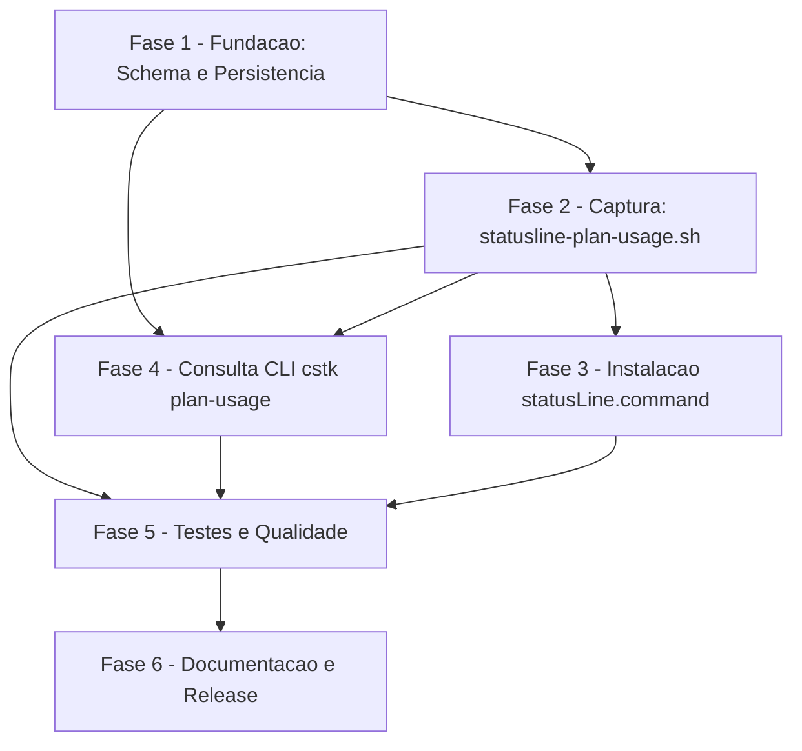

# Tarefas Plan Usage Capture - Captura de uso do plano via statusline

Escopo: implementar a captura do gauge `/usage` (`rate_limits.five_hour`/
`seven_day`) a partir do payload da statusline do Claude Code, persistir em
tabela nova `plan_usage` no `knowledge.db` (migracao aditiva v13->v14), e
expor consulta via `cstk plan-usage`/`cstk plan-usage history` — sem
credencial OAuth, 100% local (Constitution IV).

**Legenda de status:**
- `[ ]` Pendente
- `[~]` Em andamento
- `[x]` Concluido
- `[!]` Bloqueado

**Legenda de criticidade:**
- `[C]` Critico - Impacto financeiro direto ou bloqueante (seguranca/injection, veracidade de dado)
- `[A]` Alto - Funcionalidade essencial (captura, persistencia, consulta)
- `[M]` Medio - Necessario mas sem urgencia imediata (docs, gaps de completude)

---

## FASE 1 - Fundacao: Schema e Camada de Persistencia

### 1.1 Migracao de schema `plan_usage` `[A]`

Ref: spec.md FR-009/FR-014, data-model.md (tabela `plan_usage`, §Migracao),
plan.md §Summary item 2, research.md Decision 7

- [x] 1.1.1 Bump `RECALL_SCHEMA_VERSION` de `13` para `14` em
      `cli/lib/recall.sh` (linha 136) <!-- verificado: grep RECALL_SCHEMA_VERSION cli/lib/recall.sh -> RECALL_SCHEMA_VERSION=14 -->
- [x] 1.1.2 Adicionar `CREATE TABLE IF NOT EXISTS plan_usage (...)` em
      `recall_schema_ddl`, seguindo o schema de data-model.md (colunas
      `id`, `project`, `project_path`, `session_id`, `scope` com
      `CHECK IN ('five_hour','seven_day')`, `used_percentage` REAL
      NULLABLE, `resets_at` INTEGER NULLABLE, `captured_at` TEXT NOT NULL,
      `ingested_at` TEXT NOT NULL) — sem `ALTER`/`DROP`, mesmo precedente
      literal de `loose_usage` (linha 647) <!-- verificado empiricamente: recall_apply_schema em DB novo gera sqlite_master.sql identico ao DDL declarado (ver evidencia da Decisao) -->
- [x] 1.1.3 Sem `UNIQUE` de chave natural (data-model.md linhas 34-41) —
      confirmar que a DDL nao introduz constraint indevida <!-- confirmado por leitura direta do DDL: nenhum UNIQUE presente -->
- [x] 1.1.4 Teste: migracao aditiva pura — banco com schema v13 existente
      recebe a migracao e ganha a tabela `plan_usage` sem perder nenhuma
      linha das tabelas existentes (`waves`, `wave_model_usage`,
      `loose_usage`) <!-- tests/cstk/test_recall.sh scenario_pu2_migracao_v13_v14_real_idempotente -->
- [x] 1.1.5 Teste: `schema_meta.schema_version` reflete `14` apos a
      migracao <!-- tests/cstk/test_recall.sh scenario_pu1_fresh_db_tabela_e_versao + scenario_pu2 -->

### 1.2 Helper de escrita `plan_usage` (INSERT seguro) `[C]`

Ref: plan.md §Revisao de Seguranca (gate owasp-security, achado A05
Injection/SQL — MANDATORIO), spec.md FR-002/FR-009

- [x] 1.2.1 Implementar `recall_plan_usage_insert()` em `cli/lib/recall.sh`
      (paridade com o helper equivalente de `loose_usage`), recebendo
      `project`, `project_path`, `session_id`, `scope`, `used_percentage`
      (pode ser vazio/NULL), `resets_at` (pode ser vazio/NULL),
      `captured_at`, `ingested_at` — os dois ultimos sao TEXT NOT NULL
      em data-model.md (FR-014) e devem ser calculados pelo CALLER (`cstk
      plan-usage ingest --stdin`, task 4.3.2) via `date -u
      +%Y-%m-%dT%H:%M:%SZ` e passados explicitos, mesmo padrao de
      `usage_map_sidecar_to_db()` em `cli/lib/usage.sh` (`_umd_captured`/
      `_umd_now` computados pelo caller antes do INSERT de
      `loose_usage`, linha ~255) — nao inferidos dentro do helper <!-- verificado empiricamente via chamada direta da funcao (ver evidencia da Decisao) -->
- [x] 1.2.2 **MANDATORIO**: escapar `session_id`/`project_path`/`project`
      via `sql_escape()` (linha 223) antes de compor qualquer `INSERT INTO
      plan_usage` — nenhum valor extraido do payload entra em SQL sem
      passar por `sql_escape` <!-- confirmado por leitura direta do codigo + teste de injecao (1.2.5) -->
- [x] 1.2.3 **MANDATORIO**: usar `recall_apply_sql_with_retry()` (linha
      2393) para o INSERT — mesmo caminho ja usado por `usage.sh` para
      `loose_usage`, nao um mecanismo novo <!-- confirmado por leitura direta do codigo -->
- [x] 1.2.4 `used_percentage`/`resets_at` ausentes (string vazia/nao
      fornecidos) viram literal `NULL` no SQL, nunca `0` ou string vazia
      (Constitution VI, dec-029 — caso de ausencia PARCIAL dentro de
      escopo presente; ver 2.2 para a decisao de NAO chamar este helper
      quando `rate_limits` esta ausente por completo) <!-- verificado empiricamente: SELECT (used_percentage IS NULL)||'|'||(resets_at IS NULL) -> '1|1' -->
- [x] 1.2.5 Teste de seguranca: payload com `session_id`/`project_path`
      contendo aspas simples, `;`, `--`, e fragmento tipo
      `'; DROP TABLE plan_usage; --` — confirmar que o INSERT nao quebra
      e o valor literal e persistido escapado (nao interpretado como SQL) <!-- tests/cstk/test_recall.sh scenario_pu3_injecao_no_insert; verificado tambem manualmente, tabela sobrevive e valor literal preservado -->
- [x] 1.2.6 Teste: INSERT com `used_percentage`/`resets_at` NULL persiste
      `NULL` real na coluna (nao string `"NULL"`, nao `0`) <!-- tests/cstk/test_recall.sh scenario_pu4_null_vs_valor_presente -->

**Nota de verificacao (task 1.2)**: cobertura automatizada adicionada em
`tests/cstk/test_recall.sh` (scenarios `pu1`-`pu4`). Execucao completa da
suite `test_recall.sh` (regressao + novos scenarios) iniciada em background
durante esta onda; resultado literal citado no relatorio de conclusao —
verificacao manual direta das funcoes (`recall_apply_schema`,
`recall_plan_usage_insert`) ja confirmou o comportamento esperado com
output literal (schema_version=14, tabela criada com DDL exato, INSERT
normal/NULL/injecao todos corretos).

### 1.3 Fechar gaps de documentacao do checklist `[M]`

Ref: checklists/requirements.md CHK002, CHK003, CHK004, CHK020, CHK022
(gaps nao-bloqueantes reavaliados na onda-005, nenhum CRITICAL/{humano})

- [x] 1.3.1 CHK002: editar `spec.md` FR-006 para listar explicitamente
      (ou referenciar `contracts/statusline-hook.md` §linhas 34-36) os 8
      campos excluidos (`.model`, `.cost`, `.context_window`,
      `.exceeds_200k_tokens`, `.thinking`, `.effort`, `.output_style`,
      `.version`), nao so os 3 que exigem OAuth
- [x] 1.3.2 CHK003: adicionar Edge Case em `spec.md` cobrindo o risco de
      sobrescrita de `statusLine.command` customizado (hoje so em
      `plan.md` §Riscos conhecidos), citando a mitigacao
      `CSTK_STATUSLINE_INNER_COMMAND`
- [x] 1.3.3 CHK004: adicionar FR ou Edge Case em `spec.md` declarando o
      comportamento fail-open/best-effort (jq ausente, sqlite3 ausente,
      payload malformado, nunca atrasar a statusline) como requisito
      testavel, hoje so em `contracts/statusline-hook.md`/`quickstart.md`
      Cenario 7 <!-- adicionado como FR-015 -->
- [x] 1.3.4 CHK020: decidir e documentar (spec.md Edge Case ou NOTE em
      `data-model.md`) o comportamento de concorrencia — duas invocacoes
      simultaneas de `statusline-plan-usage.sh` escrevendo em
      `plan_usage` ao mesmo tempo; `recall_apply_sql_with_retry` ja
      cobre retry de `SQLITE_BUSY`, documentar que isso e suficiente (ou
      justificar mecanismo adicional) <!-- data-model.md secao Concorrencia -->
- [x] 1.3.5 CHK022: adicionar numero/threshold verificavel de latencia
      adicional por render (ex.: "captura MUST adicionar no maximo Xms")
      em `contracts/statusline-hook.md`, substituindo a caracterizacao
      qualitativa atual ("throttle O(1)")

---

## FASE 2 - Captura: `statusline-plan-usage.sh`

### 2.1 Parse do payload e extracao de `rate_limits` `[A]`

Ref: contracts/statusline-hook.md §Contrato de entrada, research.md
Decision 1/3

- [x] 2.1.1 Criar
      `plugins/cstk/skills/agente-00c-runtime/hooks/statusline-plan-usage.sh`
      (shebang `#!/bin/sh`, Constitution II) lendo o payload JSON do
      stdin
- [x] 2.1.2 Extrair `.session_id`, `.workspace.current_dir` /
      `.workspace.project_dir` (fallback conforme contrato linha 29),
      `.rate_limits.five_hour.*`, `.rate_limits.seven_day.*` via `jq`
- [x] 2.1.3 `jq` ausente: captura pulada, pass-through preservado, exit
      sempre `0` (research.md Decision 3, reuso do carve-out de
      `cli/lib/recall.sh`/`cli/lib/usage.sh`)
- [x] 2.1.4 Payload malformado (JSON invalido): captura pulada,
      pass-through best-effort do stdin cru, exit `0`
- [x] 2.1.5 Teste: fixture com `rate_limits` completo extrai os 4 valores
      corretamente (paridade com o schema OBSERVADO na memoria
      `reference_statusline_usage_payload.md`)

### 2.2 Semantica de ausencia — dec-029 (core da feature) `[C]`

Ref: spec.md FR-002/Edge-Case/User-Story-3, data-model.md §Ausencia
explicita vs valor real, contracts/statusline-hook.md §Comportamento de
captura, Constitution VI (Zero Fabricacao)

- [x] 2.2.1 Quando a chave `.rate_limits` esta AUSENTE do payload
      inteiro: **NAO chamar** `recall_plan_usage_insert()` para nenhum
      escopo — nenhuma linha inserida (dec-029)
- [x] 2.2.2 Quando `.rate_limits.<scope>` esta presente mas
      `used_percentage`/`resets_at` vem ausente/nulo dentro do escopo:
      chamar `recall_plan_usage_insert()` para aquele escopo com `NULL`
      no(s) campo(s) faltante(s) — caso defensivo/malformado, nunca
      observado empiricamente mas a coluna permanece NULLABLE para isso
- [x] 2.2.3 Em NENHUM caminho persistir `0` como substituto de dado
      ausente (Constitution VI — validar com teste dedicado, nao so
      inspecao)
- [x] 2.2.4 Teste: fixture SEM `rate_limits` -> zero linhas novas em
      `plan_usage` apos a execucao (nao apenas "sem erro" — checar
      `SELECT COUNT(*)` antes/depois)
- [x] 2.2.5 Teste: fixture com `rate_limits.five_hour` presente e
      `rate_limits.seven_day` ausente -> uma linha nova so para
      `five_hour`, nenhuma para `seven_day`

### 2.3 Throttle (FR-010, dec-029/CHK010) `[A]`

Ref: spec.md FR-010, data-model.md §Migracao/Ausencia, checklists/
requirements.md CHK010 (residual documentado nesta onda)

- [x] 2.3.1 Antes de cada INSERT candidato, consultar o ULTIMO registro
      persistido daquele escopo (`SELECT ... ORDER BY id DESC LIMIT 1
      WHERE scope = ?`), sem janela temporal
- [x] 2.3.2 Descartar (nao inserir) quando `used_percentage` bate ate a
      2a casa decimal E `resets_at` e igual ao ultimo registro
- [x] 2.3.3 Persistir quando a diferenca ultrapassa a 2a casa decimal OU
      `resets_at` mudou
- [x] 2.3.4 **Decisao residual CHK010**: definir e implementar o
      comportamento quando o ULTIMO registro do escopo tem
      `used_percentage`/`resets_at` = `NULL` (ausencia parcial
      persistida, 2.2.2) e a nova captura do MESMO escopo TAMBEM chega
      com o campo ausente dentro do escopo presente — decidir via
      Decisao auditavel (nao inventar sem registro) se NULL-vs-NULL conta
      como "identico" (descarta) ou "sempre persiste" (nunca descarta
      ausencia); documentar a escolha em `data-model.md` apos decidir
- [x] 2.3.5 Teste: duas capturas identicas em sequencia -> so 1 linha
      nova; 3a captura com mudanca na 3a casa decimal apenas -> ainda
      descartada; 4a captura com mudanca na 2a casa decimal -> nova linha
      (paridade com quickstart.md Cenario 3)

### 2.4 Pass-through obrigatorio do stdout `[A]`

Ref: contracts/statusline-hook.md §Contrato de saida, research.md
Decision 2

- [x] 2.4.1 Se `CSTK_STATUSLINE_INNER_COMMAND` definida: reencaminhar o
      payload original (stdin intacto) para o comando dela, repassar
      stdout verbatim
- [x] 2.4.2 Senao: imprimir fallback minimo de 1 linha construido so a
      partir de `model.display_name` + (quando presente) `used_percentage`
      de `five_hour` desta mesma captura — nunca inventar outro campo
- [x] 2.4.3 Erros de captura (jq ausente, sqlite3 ausente, INSERT falho)
      NUNCA vao para stdout — descartados silenciosamente ou enviados so
      a stderr
- [x] 2.4.4 Teste: em NENHUM cenario (dep ausente, payload malformado,
      throttle, INSERT ok) o script sai com exit != `0`, nem imprime erro
      de diagnostico em stdout

### 2.5 `sqlite3`/`knowledge.db` indisponivel `[A]`

Ref: contracts/statusline-hook.md linha 64, research.md Decision 6

- [x] 2.5.1 `sqlite3` ausente OU `knowledge.db` sem permissao de escrita:
      captura pulada, pass-through intacto, exit `0`
- [x] 2.5.2 Confinar toda chamada a `sqlite3` a `cli/lib/recall.sh` —
      `statusline-plan-usage.sh` MUST NOT invocar `sqlite3` diretamente
      (mesmo confinamento de `loose-usage-capture`)
- [x] 2.5.3 Teste: simular `sqlite3` ausente no PATH -> pass-through
      normal, captura pulada, exit `0` (paridade quickstart.md Cenario 7)

---

## FASE 3 - Instalacao (`statusLine.command`)

### 3.1 Wiring de instalacao `[A]`

Ref: research.md Decision 2 (mecanismo exato deixado para esta fase),
plan.md §Riscos conhecidos

- [ ] 3.1.1 Decidir e implementar o mecanismo de instalacao: subcomando
      novo `cstk statusline install` (paralelo a `cstk hooks install`,
      linha equivalente em `cli/cstk` dispatch) que escreve/atualiza a
      chave `statusLine.command` do `settings.json` do harness
- [ ] 3.1.2 Se ja existir `statusLine.command` customizado: preservar o
      valor atual movendo-o para `CSTK_STATUSLINE_INNER_COMMAND` (nunca
      sobrescrever silenciosamente — mitigacao do risco documentado em
      `plan.md`)
- [ ] 3.1.3 Idempotencia: rodar a instalacao 2x seguidas produz o mesmo
      `settings.json` final (sem duplicar wrapper sobre wrapper)
- [ ] 3.1.4 `cstk statusline status`/`--help` reportando se a captura
      esta instalada e ativa (paridade com `cstk hooks status`, se
      existir precedente)
- [ ] 3.1.5 Teste: instalacao em `settings.json` sem `statusLine.command`
      previo -> chave criada apontando para
      `statusline-plan-usage.sh`
- [ ] 3.1.6 Teste: instalacao em `settings.json` com `statusLine.command`
      customizado previo -> valor original preservado em
      `CSTK_STATUSLINE_INNER_COMMAND`, nova chave aponta para o script
      desta feature

---

## FASE 4 - Consulta CLI (`cstk plan-usage`)

### 4.1 `cstk plan-usage` (uso mais recente) `[A]`

Ref: contracts/cli-plan-usage.md §`cstk plan-usage`, spec.md FR-007

- [x] 4.1.1 Registrar subcomando `plan-usage` no dispatch de `cli/cstk`
      (`case "$1"`), delegando a `plan_usage_main()` novo em
      `cli/lib/plan-usage.sh` (paridade com `usage_main()` de
      `cli/lib/usage.sh`)
- [ ] 4.1.2 Flags `--json`, `--db PATH` (paridade `cstk usage --db`)
- [ ] 4.1.3 Saida texto: percentual + horario de reset (local time na
      apresentacao; persistencia continua epoch) por escopo; campo sem
      medicao imprime `nao medido`, nunca `0` (FR-002/SC-002, dec-029)
- [ ] 4.1.4 Saida `--json`: `used_percentage`/`resets_at`/`captured_at`
      como `null` JSON quando o escopo nunca teve captura com
      `rate_limits` presente
- [ ] 4.1.5 `knowledge.db` ausente: aviso em stderr + `nao medido` para
      os 2 escopos, exit `0`
- [ ] 4.1.6 Tabela `plan_usage` vazia: `nao medido — nenhuma captura
      registrada ainda`, exit `0`
- [ ] 4.1.7 `sqlite3` ausente: aviso em stderr explicando a dep, exit `1`
- [ ] 4.1.8 Flag desconhecida: uso em stderr, exit `2`
- [ ] 4.1.9 Teste: os 8 subitens acima como casos de teste automatizados
      via fixture (sem sessao real — FR-012)

### 4.2 `cstk plan-usage history` (serie temporal) `[A]`

Ref: contracts/cli-plan-usage.md §`cstk plan-usage history`, spec.md
FR-008, dec-014

- [ ] 4.2.1 Flags `--scope five_hour|seven_day` (default: ambos,
      separados — FR-005), `--limit N` (default `20`, reuso literal de
      `cstk usage --limit`), `--since ISO` (reuso literal de `cstk usage
      --since`) — SEM inventar convencao nova de paginacao (dec-014)
- [ ] 4.2.2 Saida texto: uma secao por escopo, ate `--limit` linhas em
      ordem cronologica
- [ ] 4.2.3 Saida `--json`: chave presente so para escopo(s) pedido(s);
      array vazio (nao `null`) quando o escopo existe mas nao tem
      captura no filtro
- [ ] 4.2.4 Mesma tabela de comportamento sem dados de 4.1.5-4.1.8
- [ ] 4.2.5 Teste: 3 capturas crescentes -> historico em ordem
      cronologica (paridade quickstart.md Cenario 4)
- [ ] 4.2.6 Teste: `--since`/`--limit` filtram identico a `cstk usage`
      (mesmo parsing de flag, reuso de codigo se possivel)

### 4.3 `cstk plan-usage ingest --stdin` (interno) `[A]`

Ref: contracts/cli-plan-usage.md §`ingest --stdin`

- [x] 4.3.1 Subcomando interno (nao listado em `--help` publico,
      paridade com outros internos do dispatch) consumido exclusivamente
      por `statusline-plan-usage.sh`
- [x] 4.3.2 Recebe payload bruto via stdin, aplica throttle (2.3) e
      delega a `recall_plan_usage_insert()` (1.2) quando aplicavel
- [x] 4.3.3 Exit sempre `0` mesmo em erro interno — nunca propaga falha
      para a sessao do operador (FR-011/Principio IV)

---

## FASE 5 - Testes e Qualidade

### 5.1 Suite de testes da feature `[A]`

Ref: spec.md FR-012, research.md Decision 8, quickstart.md (7 cenarios)

- [ ] 5.1.1 Criar `tests/test_statusline-plan-usage.sh` seguindo o
      precedente de `tests/test_posttooluse-loose-usage.sh` — alimenta
      fixtures via stdin, nunca sessao `claude` real
- [ ] 5.1.2 Cobrir os 7 cenarios de `quickstart.md` como casos de teste
      nomeados (1 captura basica, 2 ausencia-nunca-zero, 3 throttle, 4
      evolucao temporal, 5 formato resets_at, 6 zero coleta remota, 7
      deps ausentes)
- [ ] 5.1.3 Criar `tests/test_cli-plan-usage.sh` cobrindo `cstk
      plan-usage`/`cstk plan-usage history` (FASE 4)
- [ ] 5.1.4 Rodar a suite completa local e confirmar 0 regressao nos
      testes existentes de `recall.sh`/`usage.sh` (migracao aditiva nao
      quebra nada)

### 5.2 Gates deterministicos pos-geracao `[M]`

Ref: create-tasks/scripts/validate-tasks-template.sh, template canonico

- [ ] 5.2.1 Rodar `validate-tasks-template.sh` sobre este `tasks.md` e
      confirmar exit `0` (conformante ao template)
- [ ] 5.2.2 Rodar `validate-docs-rendered` sobre os artefatos da feature
      (Mermaid da Matriz de Dependencias, links internos, frontmatter)

---

## FASE 6 - Documentacao e Release

### 6.1 CHANGELOG e nota de release `[A]`

Ref: plan.md §Constitution Check Principio I (SDD recursivo — "Contrato
de CLI novo exige nota no CHANGELOG, MINOR")

- [ ] 6.1.1 Adicionar entrada MINOR no CHANGELOG do `cstk` descrevendo a
      capacidade nova (`cstk plan-usage`, captura via statusline)
- [ ] 6.1.2 Atualizar contagem de subcomandos/docs afetados, se algum
      teste de contagem (`test_doc-counts.sh` ou equivalente) gateia
      README/docs

---

## Matriz de Dependencias

## Resumo Quantitativo

| Fase | Tarefas | Subtarefas | Criticidade |
|------|---------|------------|-------------|
| 1 - Fundacao: Schema e Persistencia | 3 | 16 | C/A/M |
| 2 - Captura: statusline-plan-usage.sh | 5 | 22 | C/A |
| 3 - Instalacao statusLine.command | 1 | 6 | A |
| 4 - Consulta CLI cstk plan-usage | 3 | 18 | A |
| 5 - Testes e Qualidade | 2 | 6 | A/M |
| 6 - Documentacao e Release | 1 | 2 | A |
| **Total** | **15** | **70** | - |

## Escopo Coberto

| Item | Descricao | Fase |
|------|-----------|------|
| Migracao de schema | `plan_usage` tabela nova, v13->v14 aditiva | 1 |
| INSERT seguro | `sql_escape` + `recall_apply_sql_with_retry` (owasp mandatario) | 1 |
| Captura via statusline | `statusline-plan-usage.sh`, pass-through obrigatorio | 2 |
| Semantica dec-029 | Ausencia total = nenhum INSERT; ausencia parcial = NULL | 2 |
| Throttle FR-010 | Comparacao contra ultimo registro, tolerancia 2 casas | 2 |
| Instalacao | `cstk statusline install`, preserva customizacao previa | 3 |
| Consulta CLI | `cstk plan-usage` + `history`, reuso de flags de `cstk usage` | 4 |
| Testes fixture-based | Sem sessao interativa real (FR-012) | 5 |
| Gaps de documentacao | CHK002/CHK003/CHK004/CHK020/CHK022 | 1 |

## Escopo Excluido

| Item | Descricao | Motivo |
|------|-----------|--------|
| `.cost`/`.context_window` e colunas correlatas (`session_cost_usd`, `session_input_tokens`, `session_output_tokens`, `cache_read_input_tokens`, `cache_creation_input_tokens`, `model_id`) | Custo/tokens de sessao do rascunho original do operador | Corte confirmado (dec-030, CHK026) — reservado para feature futura dedicada; regra MAX-nunca-SUM fica N/A |
| `seven_day_opus`, `seven_day_sonnet`, `extra_usage` (creditos) | Campos que so existem em `GET /api/oauth/usage` | Exigem credencial OAuth (FR-006) — fora do objetivo "sem OAuth" desta feature |
| Convencao de paginacao nova (cursor/offset) | Alternativa a `--limit`/`--since` | dec-014: reuso literal das flags ja existentes de `cstk usage`, sem inventar mecanismo novo |
| Dashboard/painel dedicado a `plan_usage` | Visualizacao grafica do historico | Fora do escopo da CLI; `cstk-panel` fica para decisao futura, se houver demanda |
