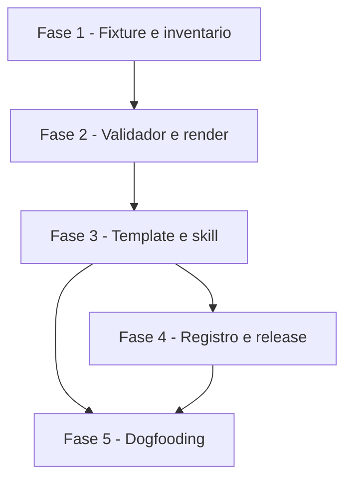

# Tarefas presentation - Apresentacao Narrativa do Projeto

Escopo: implementar a skill complementar `presentation` (scan
deterministico, validador, render awk, template visual autocontido,
references e SKILL.md), seus testes 1:1, o registro no pacote cstk e o
release 10.8.0, com dogfooding sobre o proprio repositorio.

**Legenda de status:**
- `[ ]` Pendente
- `[~]` Em andamento
- `[x]` Concluido
- `[!]` Bloqueado

**Legenda de criticidade:**
- `[C]` Critico - Impacto financeiro direto ou bloqueante
- `[A]` Alto - Funcionalidade essencial
- `[M]` Medio - Necessario mas sem urgencia imediata

---

## FASE 1 - Fundacao: Fixture e Inventario

### 1.1 Fixture de projeto minimo `[A]`

Ref: quickstart.md cenarios 1-10

- [x] 1.1.1 Criar `tests/fixtures/presentation/docs/` com briefing,
      constitution (3 principios, um NON-NEGOTIABLE), spec ativa com tasks
      parciais, spec arquivada datada com tasks completas e converge, spec
      viva em `specs/current/`
- [x] 1.1.2 Criar `tests/fixtures/presentation/story.md` valida cobrindo
      todos os tipos de slide

### 1.2 `scan-project-docs.sh` `[A]`

Ref: data-model.md §Inventario; contracts/cli-invocation.md

- [x] 1.2.1 Subcomando `inventory` com registros `project`, `briefing`,
      `constitution`, `principle`, `spec`, `totals` na ordem narrativa
- [x] 1.2.2 Subcomando `diff` classificando added/changed/removed/unchanged
- [x] 1.2.3 `tests/test_scan-project-docs.sh` (cenarios 1-4, uso invalido)

## FASE 2 - Validador e Render

### 2.1 `validate-presentation.sh` `[A]`

Ref: contracts/slide-grammar.md G-01..G-10

- [x] 2.1.1 Implementar as regras G-01 a G-10 com `FILE:LINHA: mensagem`
- [x] 2.1.2 `tests/test_validate-presentation.sh` (cenarios 5-7 e um
      cenario por regra)

### 2.2 `render-presentation.sh` `[A]`

Ref: contracts/slide-grammar.md R-01..R-05

- [x] 2.2.1 Conversao awk story → sections (layout por tipo, metricas,
      `@timeline`, `@sources`, rotulos pt-BR/en)
- [x] 2.2.2 Montagem do template com CSS/JS inline e escrita atomica
- [x] 2.2.3 `tests/test_render-presentation.sh` (cenarios 8-10, R-05)

## FASE 3 - Template Visual e Skill

### 3.1 Template `[A]`

Ref: spec.md §FR-010, §FR-011; research.md Decisions 4-5

- [x] 3.1.1 `templates/theme.css`: tokens claro/escuro, layouts por tipo,
      modo relatorio, `@media print`, responsivo, reduced-motion
- [x] 3.1.2 `templates/deck.js`: modo slides (escala 16:9, teclado,
      progresso, deep link), R/T/P, indice do relatorio
- [x] 3.1.3 `templates/presentation.html` e `templates/story.md`

### 3.2 Skill `[A]`

Ref: constitution Principio III

- [x] 3.2.1 `references/narrative-guide.md` e `references/source-mapping.md`
- [x] 3.2.2 `SKILL.md` com fluxo, argumentos, regras e `## Gotchas`
- [x] 3.2.3 `evals/triggers.jsonl` + negativos + casos gerados

## FASE 4 - Registro e Release

### 4.1 Registro no pacote `[A]`

Ref: spec.md §FR-017; CONTRIBUTING.md

- [x] 4.1.1 `scripts/profiles.txt.in`: `complementary:presentation`
- [x] 4.1.2 README.md e README.pt-BR.md (contagens, arvore, tabela)
- [x] 4.1.3 Help de `cli/lib/install.sh` e `docs-site/manual/profiles.md`

### 4.2 Release 10.8.0 `[M]`

- [x] 4.2.1 CHANGELOG.md
- [x] 4.2.2 Bump lockstep dos manifests e workspaces do panel

## FASE 5 - Dogfooding e Verificacao

### 5.1 Dogfooding no cstk `[A]`

Ref: quickstart.md cenarios 11-12; spec.md §SC-001..SC-005

- [x] 5.1.1 Gerar story completa do cstk (fora do repo) e validar com exit 0
- [x] 5.1.2 Render + Chromium offline: slides, relatorio, temas, 390px,
      console limpo, prints para o dono do produto
- [~] 5.1.3 Suite completa, `--check-coverage`, gates de manifest

---

## Matriz de Dependencias

## Resumo Quantitativo

| Fase | Tarefas | Subtarefas | Criticidade predominante |
|------|---------|------------|---------------------------|
| FASE 1 - Fixture e inventario | 2 | 5 | A |
| FASE 2 - Validador e render | 2 | 5 | A |
| FASE 3 - Template e skill | 2 | 6 | A |
| FASE 4 - Registro e release | 2 | 5 | A/M |
| FASE 5 - Dogfooding e verificacao | 1 | 3 | A |
| **Total** | **9** | **24** | A |

## Escopo Coberto

- Skill `presentation` completa (SKILL.md, templates, references, scripts,
  evals) no perfil `complementary`
- Tres scripts POSIX com teste 1:1 e fixture dedicada
- Template visual autocontido com modos slides, relatorio e impressao
- Registro no pacote (profiles, READMEs, help, site) e release 10.8.0
- Dogfooding sobre o proprio cstk com verificacao offline no Chromium

## Escopo Excluido

- Exportacao para `.pptx`/`.docx` (fora do pedido; `.gitignore` ja ignora
  esses formatos)
- Publicacao automatica do deck em qualquer servico (Principio IV)
- Commit do deck do proprio cstk em `docs/presentation/` (dogfooding fica
  fora do repo; decisao do dono do produto)
- CHK014 (`{humano}`): aprovacao estetica fica com o dono do produto
