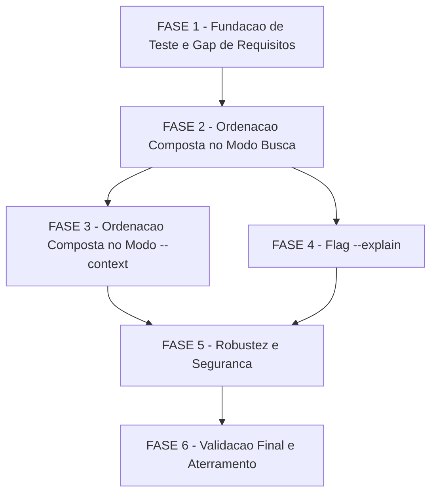

# Tarefas recall-ranking - Ranking Composto no cstk recall

Escopo: implementar o score composto (`bm25` + bonus de autoridade por tipo +
desconto de recencia) e a flag aditiva `--explain` no `cstk recall`, confinado
a **1 arquivo de producao** (`cli/lib/recall.sh`) e **1 arquivo de teste**
(`tests/cstk/test_recall.sh`), sem migracao/reindex e sem coluna/tabela nova
(`data-model.md`: nenhuma entidade persistida nova; `RECALL_SCHEMA_VERSION`
permanece `15`).

> **GOTCHA de validacao (RUNTIME, nao catalogo)**: `cli/lib/recall.sh` so
> surte efeito numa sessao real apos `cstk self-update --from
> "file://$PWD/dist/cstk-X.Y.Z-dev.tar.gz"`. `cstk install`/`cstk update`
> reportam "updated" sem tocar o arquivo — ver quickstart.md GOTCHA e
> CLAUDE.md "Installed vs Source Drift".

**Legenda de status:**
- `[ ]` Pendente
- `[~]` Em andamento
- `[x]` Concluido
- `[!]` Bloqueado

**Legenda de criticidade:**
- `[C]` Critico - Impacto financeiro direto ou bloqueante (aqui: findings de
  seguranca HIGH do gate `owasp-security` e gaps de checklist ligados a eles)
- `[A]` Alto - Funcionalidade essencial (o score composto em si, nos dois modos)
- `[M]` Medio - Necessario mas sem urgencia imediata (capacidade aditiva de
  auditoria, validacao final)

---

## FASE 1 - Fundacao de Teste e Gap de Requisitos

### 1.1 Helper de fixture com `source_ts` relativos ao relogio real `[A]`

Ref: quickstart.md "Fixture comum (Scenarios 1-7)"; contrato §3.1 (Opcao B
ratificada, dec-021 — sem override de relogio)

- [ ] 1.1.1 Implementar helper de deslocamento de data portavel em
      `tests/cstk/test_recall.sh`, testando as duas formas (BSD/macOS
      `date -u -v-Nd` e GNU `date -u -d 'N days ago'`) — paridade com o
      GOTCHA de `stat` GNU-first ja praticado no harness
- [ ] 1.1.2 Estender a fixture (`_write_state`, `_write_memory_dir`,
      `_write_suggestions_state`) para popular no minimo 1 `decision`, 1
      `block`, 1 `skill`, 1 `retro`, 1 `suggestion` e 1 `memory` casando o
      mesmo termo de busca, com corpos de comprimento comparavel (para
      manter `bm25()` proximo entre eles)
- [ ] 1.1.3 Gerar os `source_ts` como deslocamentos com **ordens de
      grandeza** de diferenca entre si (ex.: `now-5d`, `now-200d`,
      `now-400d`) — nunca timestamps absolutos hardcoded que envelhecem
- [ ] 1.1.4 Teste smoke: confirmar que a fixture nova nao quebra
      `scenario_04_limite_e_bm25` (asserção de **contagem**, nao de ordem —
      plan.md L139)

### 1.2 Fechar gap CHK020/CHK003 — teste do clamp de recencia contra `source_ts` futuro `[C]`

Ref: `checklists/requirements.md` CHK020; `checklists/security.md` CHK003
(mesmo achado); `spec.md` FR-009 (determinismo, base normativa citada pelo
checklist); `plan.md` §Riscos finding F2 (gate `owasp-security`, HIGH);
contrato §1.2 ("o `max(0.0, ...)` e **normativo**")

- [ ] 1.2.1 Escrever o Scenario 12 do quickstart em `test_recall.sh`:
      fixture com um `decision` (`source_ts` no passado) e um `skill`
      (`source_ts` `now+80d`), `bm25()` comparavel
- [ ] 1.2.2 Assertar que o `skill` futuro **nao** ultrapassa o `decision`
      e que, com `--explain`, `recencia=` fica dentro de `[0.0000, 0.1000]`
      — nunca acima do teto
- [ ] 1.2.3 Mutation test: comentario no proprio cenario registrando os
      valores medidos SEM o clamp (`-80d` -> bonus `0.9`; `-89.99d` ->
      `~900`) como evidencia de que o cenario de fato exercita o clamp —
      fecha CHK020/CHK003 (item [Gap] das duas checklists)

---

## FASE 2 - Ordenacao Composta no Modo Busca (`recall_mode_search`)

### 2.1 Implementar a expressao de score composto na consulta SQL do modo busca `[A]`

Ref: `plan.md` Summary; contrato §1.2; `cli/lib/recall.sh`
`recall_mode_search()` L2977, `ORDER BY bm25(knowledge_fts) LIMIT
$_se_limit` L3067; FR-001/FR-003/FR-008/FR-009/FR-010

- [ ] 2.1.1 Resolver `<instante_ref>` **uma unica vez** via
      `date -u +%Y-%m-%dT%H:%M:%SZ`, com fallback `1970-01-01T00:00:00Z`
      (paridade com L1273/L2203/L2803/L2866) — **nunca**
      `julianday('now')` inline na consulta (I-5)
- [ ] 2.1.2 Escapar o `<instante_ref>` via `sql_escape()` antes de
      interpolar (precedente L1384, `sql_escape "$_isj_now"` — contrato
      §3.1 "Escaping cumulativo do literal": todo valor interpolado passa
      por `sql_escape`, mesmo de origem interna)
- [ ] 2.1.3 Adicionar `<bonus_autoridade>`: `CASE type WHEN 'decision'
      THEN 0.30 WHEN 'block' THEN 0.30 WHEN 'memory' THEN 0.15 WHEN
      'retro' THEN 0.00 WHEN 'skill' THEN 0.00 ELSE 0.15 END`
- [ ] 2.1.4 Adicionar `<idade_dias>` com clamp `max(0.0,
      julianday(<instante_ref>) - julianday(nullif(source_ts,'')))` e
      `<bonus_recencia>` `coalesce(0.10 * (90.0 / (90.0 +
      <idade_dias>)), 0.0)` — `coalesce` **externo** ao produto inteiro,
      nunca dentro do denominador (contrato §1.2, nota normativa)
- [ ] 2.1.5 Substituir `ORDER BY bm25(knowledge_fts) LIMIT $_se_limit` por
      `ORDER BY <score> ASC, source_ts DESC, type ASC, source_id ASC
      LIMIT $_se_limit`, onde `<score> = bm25(knowledge_fts) -
      <bonus_autoridade> - <bonus_recencia>`
- [ ] 2.1.6 Teste: Scenario 1 (autoridade promove `decision`/`block`
      sobre `retro`/`skill` de relevancia comparavel — SC-001, FR-001)
- [ ] 2.1.7 Teste: Scenario 2 (tier intermediario de `memory`: ordem
      `decision` -> `memory` -> `skill`, FR-010)
- [ ] 2.1.8 Teste: Scenario 3 (recencia desempata dentro do mesmo tier —
      SC-003, FR-003)
- [ ] 2.1.9 Teste: Scenario 4 (recencia **nao** inverte autoridade — I-2
      do contrato, FR-003: teto de recencia `0.10` < menor degrau de
      autoridade `0.15`)
- [ ] 2.1.10 Teste: Scenario 5 (`source_ts` ausente nao quebra nem
      exclui — FR-008; com `--explain`, `recencia=0.0000`/`idade=n/d`)
- [ ] 2.1.11 Teste: Scenario 6 (determinismo — SC-006 parcial, FR-009:
      mesma consulta 2x com `<instante_ref>` avancando entre execucoes,
      stdout byte-identico; desempate total exercitado com 2 achados de
      score exatamente igual)

### 2.2 Ordem das colunas projetadas — contrato §1.2.bis `[C]`

Ref: contrato §1.2.bis; gate `owasp-security` finding F5 (`body`
falsificando a linha `score=`)

- [ ] 2.2.1 Quando `--explain` estiver ativo, projetar as colunas de
      score (`<score>`, `<bm25>`, `<bonus_autoridade>`, `<bonus_recencia>`,
      `<idade_dias>`) **antes** de `body` no `SELECT`
- [ ] 2.2.2 Manter `body` como **ultima** coluna em ambos os casos (com e
      sem `--explain`), preservando os indices fixos do
      `awk -F '\|@\|'` existente
- [ ] 2.2.3 Teste: Scenario 13 (`body` contendo o separador literal
      `|@|` nao falsifica a explicacao — a linha `score=` exibe numeros,
      a identidade `score = bm25 - autoridade - recencia` continua
      fechando)
- [ ] 2.2.4 Teste de regressao: sem `--explain`, o mesmo `body` com
      `|@|` continua produzindo apenas a truncagem visual ja existente
      hoje (comportamento inalterado)

---

## FASE 3 - Ordenacao Composta no Modo `--context` (`recall_mode_context`)

### 3.1 Aplicar a mesma expressao de score, preservando o formato do `--context` `[A]`

Ref: contrato §2.1/§2.2; `cli/lib/recall.sh` `recall_mode_context()`
L3106, `ORDER BY bm25(knowledge_fts) LIMIT $_cx_limit` L3216;
FR-002/FR-003/FR-004; SC-002

- [ ] 3.1.1 Replicar a mesma expressao de `<score>` e o mesmo desempate
      total (tarefa 2.1) no `ORDER BY` de `recall_mode_context` —
      duplicacao **deliberada** dentro do mesmo arquivo (`plan.md`
      Structure Decision: extrair um helper espalharia a dependencia de
      `sqlite3` para um 2o arquivo e quebraria o carve-out 1.1.0)
- [ ] 3.1.2 Confirmar que `--explain` continua rejeitada no modo
      `--context` (cai no ramo existente de flag invalida, exit 2) — zero
      mudanca de parser neste modo
- [ ] 3.1.3 Confirmar que nenhuma coluna de score e projetada nem aparece
      no bloco de contexto renderizado (I-8 do contrato)
- [ ] 3.1.4 Teste: Scenario 11 (cabecalho UNTRUSTED integral, formato de
      achado, teto `--max-bytes` e ordem por autoridade —
      `decision`/`block` antes de `retro`/`skill` de relevancia
      comparavel — SC-002, FR-004)
- [ ] 3.1.5 Teste de regressao: `K=0` continua stdout vazio/exit 0;
      `--max-bytes` pequeno demais para o 1o achado continua stdout
      vazio/exit 0 (contrato §2.2, comportamento [ATUAL] preservado)

---

## FASE 4 - Flag `--explain` (auditoria de ranking)

### 4.1 Parse e validacao da flag `--explain` `[M]`

Ref: contrato §1.1; `spec.md` FR-005/FR-006; `recall_usage()` L183

- [ ] 4.1.1 Adicionar `--explain` ao parser de `recall_mode_search`:
      booleana, nao consome o proximo argv, idempotente em repeticoes
- [ ] 4.1.2 Documentar `--explain` em `recall_usage()`
- [ ] 4.1.3 Teste: Scenario 9 partes 1 e 3 (`--explaain` — typo — vira
      exit 2 com mensagem em stderr; `--explain --limit abc` continua
      exit 2 pela validacao de `--limit` ja existente, que precede
      qualquer efeito da flag nova)
- [ ] 4.1.4 Teste: Scenario 9 parte 2 (`--context --explain` vira exit 2
      — coberto tambem por 3.1.2; referenciado aqui para completude do
      cenario de erro)

### 4.2 Renderizacao da linha de explicacao `[M]`

Ref: contrato §1.4; SC-004

- [ ] 4.2.1 Reusar a projecao de colunas de score da tarefa 2.2 quando
      `--explain` estiver presente
- [ ] 4.2.2 Renderizar a linha
      `  score=<S> = bm25=<B> - autoridade=<A> - recencia=<R>
      (idade=<D>d)` apos o `body`, com 2 espacos de indentacao e **sem**
      iniciar com `[` (C-2 do contrato — preserva `grep -c '^\['`)
- [ ] 4.2.3 Formatar `<S>`/`<B>` com 4 casas decimais, `<A>` com 2 casas,
      `<R>` com 4 casas, `<D>` com 1 casa ou `n/d` quando `source_ts`
      vazio
- [ ] 4.2.4 Teste: Scenario 7 (sem `--explain` nenhuma linha `score=`;
      com `--explain` exatamente 1 linha `score=` por resultado — 100%,
      SC-004; identidade `score = bm25 - autoridade - recencia` fecha —
      C-3; `grep -c '^\['` identico entre as duas execucoes — C-2)

---

## FASE 5 - Robustez e Seguranca (regressao)

### 5.1 Sinalizar falha de consulta distinta de "nenhum resultado" `[C]`

Ref: contrato §1.5 I-10; gate `owasp-security` finding F7

- [ ] 5.1.1 Capturar o exit code do `sqlite3` **separadamente** do
      resultado vazio (hoje `recall_query_sql` descarta stderr e ambos os
      callers mapeiam falha para string vazia via `|| _out=""`), sem
      alterar o contrato de stdout/exit 0 (I-7 preservada)
- [ ] 5.1.2 Emitir `log_warn` em **stderr** quando a consulta falhar,
      distinguindo "consulta falhou" de "nenhum resultado", nos dois
      modos (busca e `--context`)
- [ ] 5.1.3 Teste: Scenario 14 (forcar falha de consulta — ex.: `--db`
      apontando para um SQLite valido sem a tabela `knowledge_fts` —
      exit 0 nos dois modos, stdout inalterado, linha de aviso em stderr
      distinguindo os dois casos)

### 5.2 Degradacao graciosa preservada `[A]`

Ref: contrato §1.5 I-7; I-11 (revisada apos ratificacao dec-021)

- [ ] 5.2.1 Teste de regressao: Scenario 10 partes 1-2 (`--db`
      inexistente -> exit 0, aviso sugerindo `cstk recall --reindex`,
      stdout sem resultados)
- [ ] 5.2.2 Teste de regressao: Scenario 10 partes 3-4 (DB corrompido ->
      exit 0, aviso de indice ilegivel/corrompido)
- [ ] 5.2.3 Teste de regressao: Scenario 10 partes 5-6 (`sqlite3` ausente
      do `PATH` -> exit 0, aviso de memoria indisponivel)

### 5.3 Regressao de ausencia de superficie de override de relogio `[C]`

Ref: contrato §3.1/§3.3 I-12/I-13; `dec-021`/`block-002`; gate
`owasp-security` findings F1/F3/F4 (inaplicaveis por construcao apos a
Opcao B ratificada)

- [ ] 5.3.1 Teste: Scenario 15 parte 1 — `grep -oE 'CSTK_[A-Z_]+'
      cli/lib/recall.sh | sort -u` MUST retornar **exatamente**
      `CSTK_COMMON_LOADED`, `CSTK_KNOWLEDGE_DB`, `CSTK_LIB` (allowlist
      exata, **nao** padrao negativo — I-12)
- [ ] 5.3.2 Teste: Scenario 15 parte 2 — inspecao estatica confirmando
      que `julianday('now')` **nao** aparece na consulta (I-5)
- [ ] 5.3.3 Teste: Scenario 15 partes 3-4 — rodar a mesma consulta 2x, a
      2a com `CSTK_RECALL_REF_INSTANT`/`CSTK_RECALL_CLOCK` definidas no
      ambiente com payload de injecao; stdout **byte-identico**, exit 0
      nas duas, **nenhum** arquivo criado em `/tmp/evil.db`, nenhuma
      linha nova em stderr (as variaveis sao ignoradas porque nada as le)

---

## FASE 6 - Validacao Final e Aterramento

### 6.1 Aterramento contra o indice real e suite completa `[M]`

Ref: quickstart.md Scenario 8; contrato §4 (restricoes negativas
verificaveis); CLAUDE.md "Como testar scripts shell" / "Installed vs
Source Drift"

- [ ] 6.1.1 Buildar tarball local (`./scripts/build-release.sh
      X.Y.Z-dev`) e aplicar via `cstk self-update --from
      "file://$PWD/dist/cstk-X.Y.Z-dev.tar.gz"` (GOTCHA: `cstk
      install`/`cstk update` **nao** tocam `cli/lib/`)
- [ ] 6.1.2 Reproduzir manualmente as 2 consultas do Scenario 8 contra o
      indice real (`~/.claude/cstk/knowledge.db`): distribuicao de
      `length(source_ts)` (linha `20|<N>` e `0|1`) e dispersao de
      `bm25()` (`gap_medio` uma ordem de grandeza menor que `amplitude`)
- [ ] 6.1.3 Confirmar que a expressao de score completa executa sem erro
      contra o indice real e retorna resultados ordenados (nenhuma
      extensao `exp()`/`ln()` necessaria — research.md D6)
- [ ] 6.1.4 Rodar `bash skills/create-tasks/scripts/validate-tasks-template.sh
      docs/specs/recall-ranking/tasks.md --config
      skills/create-tasks/config.json` como pre-gate deterministico
      deste `tasks.md`
- [ ] 6.1.5 Rodar a suite completa `LC_ALL=C ./tests/run.sh test_recall`
      (locale importa — `pt_BR` produz FAIL falso) e confirmar 100%
      verde, incluindo os cenarios 1-15 novos e as asserções de formato
      pre-existentes (SC-002/SC-006) sem alteracao
- [ ] 6.1.6 Confirmar as restricoes negativas do contrato §4: nenhum
      arquivo alem de `cli/lib/recall.sh` e `tests/cstk/test_recall.sh`
      alterado; `RECALL_SCHEMA_VERSION` permanece `15`;
      `mcp/state-server/` intocado

---

## Matriz de Dependencias

## Resumo Quantitativo

| Fase | Tarefas | Subtarefas | Criticidade |
|------|---------|------------|-------------|
| 1 - Fundacao de Teste e Gap de Requisitos | 2 | 7 | C, A |
| 2 - Ordenacao Composta no Modo Busca | 2 | 15 | A, C |
| 3 - Ordenacao Composta no Modo --context | 1 | 5 | A |
| 4 - Flag --explain | 2 | 8 | M, M |
| 5 - Robustez e Seguranca | 3 | 9 | C, A, C |
| 6 - Validacao Final e Aterramento | 1 | 6 | M |
| **Total** | **11** | **50** | - |

## Escopo Coberto

| Item | Descricao | Fase |
|------|-----------|------|
| FR-001/FR-002 | Reforco de ranking por autoridade de tipo nos dois modos (busca e `--context`) | 2, 3 |
| FR-003 | Desconto de ranking por recencia nos dois modos | 2, 3 |
| FR-004/SC-002 | Formato e teto de tamanho do `--context` permanecem inalterados | 3 |
| FR-005/SC-004 | Flag `--explain` expondo os componentes de score por resultado | 4 |
| FR-006/SC-006 | Formato default do modo busca identico ao atual sem `--explain` | 4 |
| FR-007/SC-005 | Ranking funciona imediatamente sobre dados ja indexados, zero migracao/reindex | 2, 6 |
| FR-008 | `source_ts` ausente/vazio nunca exclui nem quebra o resultado | 2 |
| FR-009 | Determinismo — ordem estavel via desempate total | 2 |
| FR-010 | Tier intermediario proprio de `memory` na hierarquia de autoridade | 2 |
| CHK020/CHK003 | Clamp `max(0.0, ...)` de recencia contra `source_ts` futuro/clock skew | 1, 5 |
| I-10 / gate F7 | Falha de consulta distinguivel de "nenhum resultado" | 5 |
| I-12/I-13 / dec-021 | Ausencia verificavel de superficie de override do relogio de referencia | 5 |
| Aterramento (Constitution VI) | Reproducao da calibracao contra o indice de producao real | 6 |

## Escopo Excluido

| Item | Descricao | Motivo |
|------|-----------|--------|
| FR-011 | Fusao por reciprocal-rank (RRF) e ranking baseado em grafo de links entre achados | Deferido explicitamente a uma feature futura (`recall-hybrid-rrf`) — spec.md Edge Cases |
| FR-012 | Exposicao da nova capacidade de ranking ou da flag `--explain` via qualquer ferramenta MCP | Fora do escopo desta feature; `mcp/state-server/` permanece intocado |
| Migracao/reindex/coluna/tabela nova | Qualquer alteracao de DDL ou de `RECALL_SCHEMA_VERSION` | `data-model.md`: nenhuma entidade persistida nova; FR-007/SC-005 |
| Variavel de ambiente para override do relogio de teste | Mecanismo original (Opcao A) para fixar `<instante_ref>` em teste | Descartada na ratificacao de `block-002`/`dec-021` — gate `owasp-security` classificou como HIGH (F1/F3/F4); Opcao B adotada (fixture relativa ao relogio real) |
| Extracao de expressao de score para helper compartilhado | Fatorar a expressao SQL duplicada entre `recall_mode_search` e `recall_mode_context` num unico ponto | `plan.md` Structure Decision: espalharia a dependencia de `sqlite3` para um 2o arquivo, quebrando o carve-out 1.1.0 (condicao "dep confinada a um unico arquivo") |
| Correcao de `recall_query_sql()` abrir o DB em read-write | Migrar o caminho de leitura do modo busca/`--context` para `recall_query_sql_ro()` | Aspereza preexistente registrada em `research.md` D13 e contrato §3.2 como fora do escopo — esta feature nao agrava nem corrige |
