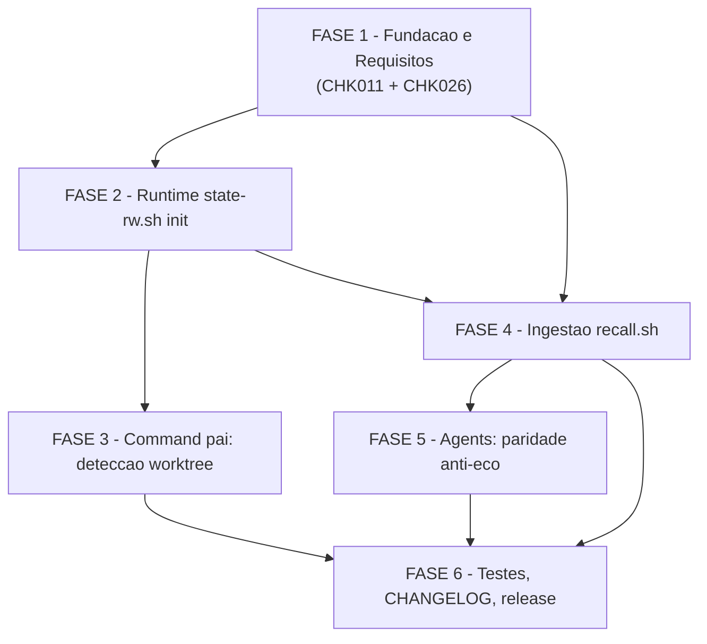

# Backlog de Tarefas: Recall Worktree Identity

**Feature**: `recall-worktree-identity`
**Spec**: [spec.md](./spec.md) | **Plan**: [plan.md](./plan.md)
**Data**: 2026-06-05
**Escopo**: Schema v7→v8 coluna `session`; campos `canonical_project`/`session_name` no
`state-rw.sh init`; derivacao 3 camadas em `recall.sh`; paridade anti-eco nos agents;
resolucao de gaps CHK011 e CHK026 do checklist.

---

## Legendas

### Legenda de status

| Simbolo | Significado |
|---------|-------------|
| `[ ]` | Pendente |
| `[x]` | Concluido |
| `[~]` | Em andamento |
| `[!]` | Bloqueado |

### Legenda de criticidade

| Tag | Criterio |
|-----|----------|
| `[C]` | Critico — impacto direto na corretude do indice de conhecimento; sem isso, knowledge.db permanece corrompido |
| `[A]` | Alto — funcionalidade core da feature sem a qual o objetivo nao e atingido |
| `[M]` | Medio — necessario para completude e qualidade mas nao bloqueia o caminho critico |

---

## FASE 1 - Fundacao e Requisitos

> Fechar gaps do checklist antes de implementar; sem isso a implementacao
> parte de requisito ambiguo.

### 1.1 Resolver CHK011 — Ambiguidade US3 AC2 na spec.md `[M]`

Ref: checklists/requirements.md CHK011 — `[Ambiguity]`

O US3 AC2 da spec diz "ambos validos" (omitir OU congelar `canonical_project`
em projeto raiz), mas o contrato `state-rw-init.md §passo 3` ja registrou a
escolha definitiva: OMITIR. A spec precisa refletir essa decisao para evitar
que implementadores futuros reabram a questao.

- [x] 1.1.1 Ler US3 AC2 em spec.md e o §passo 3 de contracts/state-rw-init.md para confirmar a escolha canonica (OMITIR)
- [x] 1.1.2 Editar spec.md §US3 AC2: substituir "ambos validos" pela frase definitiva — "o command NAO deve passar `--canonical-project` quando `.git` e diretorio (projeto raiz); estado minimo preservado" — com nota inline `<!-- CHK011 resolvido -->`
- [x] 1.1.3 Editar data-model.md §Regras de presenca (linha "Projeto raiz normal"): alinhar ao mesmo texto definitivo
- [x] 1.1.4 Verificar que nenhuma outra occorrencia de "ambos validos" permanece nos artefatos (`grep -r "ambos validos" docs/specs/recall-worktree-identity/`)

### 1.2 Resolver CHK026 — Cenario git common-dir relativo vs absoluto `[A]`

Ref: checklists/requirements.md CHK026 — `[Gap]`

O contracts/ingest-derivation.md §1 menciona "Camada 2 normaliza common-dir
relativo para absoluto antes do `dirname`", mas nenhum cenario de teste cobre
explicitamente esse sub-caso. Tarefa: adicionar o sub-cenario ao quickstart
e garantir que `tests/cstk/test_recall.sh` o cubra.

- [x] 1.2.1 Editar quickstart.md §Cenario 2a: adicionar sub-cenario "2a-rel — common-dir retornado como path RELATIVO" (ex: `../../../.git`) e documentar a normalizacao esperada para absoluto antes do `dirname`
- [x] 1.2.2 Documentar a normalizacao em contracts/ingest-derivation.md §1 com exemplo concreto: `COMMON=../../.git → PAP/$COMMON → realpath → dirname`
- [x] 1.2.3 Adicionar cenario de teste em `tests/cstk/test_recall.sh` cobrindo o sub-caso de common-dir relativo (fixture com `.git` arquivo cujo conteudo aponta para path relativo)
- [x] 1.2.4 Verificar que o cenario passa com exit 0 e `project` canonico correto (`./tests/run.sh test_recall`)

---

## FASE 2 - Runtime: state-rw.sh init estendido

> Implementar as flags `--canonical-project` e `--session-name` no
> `state-rw.sh init`. Touch point: runtime (instalado via `cstk self-update`).

### 2.1 Implementar flags novas em `state-rw.sh init` `[C]`

Ref: spec.md §FR-001/FR-002, contracts/state-rw-init.md §Assinatura estendida

- [x] 2.1.1 Ler `global/skills/agente-00c-runtime/scripts/state-rw.sh` — localizar a funcao `_sr_cmd_init` e o parser de flags (`--projeto-alvo-path`, `--execucao-id`, etc.)
- [x] 2.1.2 Adicionar tratamento de `--canonical-project NAME` ao parser: gravar em variavel local; quando nao-vazio, incluir `.execution.canonical_project` no JSON de init via `jq`
- [x] 2.1.3 Adicionar tratamento de `--session-name NAME` ao parser: gravar em variavel local; incluir `.execution.session_name` no JSON quando nao-vazio
- [x] 2.1.4 Implementar validacao: `--session-name` SEM `--canonical-project` → exit 2 com mensagem de uso em stderr (contrato §error case)
- [x] 2.1.5 Garantir que chamadas existentes (sem as flags) permanecem 100% identicas — nenhuma chave nova aparece no JSON quando flags omitidas (FR-010)
- [x] 2.1.6 Escrever testes em `tests/test_state-rw.sh` cobrindo os 4 cenarios do contrato (tabela §Comportamento): init com ambas as flags, sem flags, session-sem-canonical, git-ausente/fallback (ver memoria `feedback_test_printf_octal` para bytes crus em fixtures)
- [x] 2.1.7 Rodar `./tests/run.sh test_state-rw` e confirmar zero regressoes

### 2.2 Atualizar `state-validate.sh` para aceitar campos novos como opcionais `[A]`

Ref: contracts/state-rw-init.md §Compatibilidade

- [x] 2.2.1 Ler `global/skills/agente-00c-runtime/scripts/state-validate.sh` e identificar onde valida a schema do `execution`
- [x] 2.2.2 Garantir que `canonical_project` e `session_name` sao aceitos mas nao exigidos (opcionais) — states pre-feature continuam validos
- [x] 2.2.3 Adicionar teste em `tests/test_state-rw.sh` ou equivalente: state com campos novos passa a validacao; state sem eles tambem passa

---

## FASE 3 - Command pai: deteccao de worktree no init

> Os commands `/feature-00c` e `/agente-00c` precisam detectar worktree e
> passar as flags novas ao `state-rw.sh init`. Touch: catalogo (instalado via
> `cstk update`).

### 3.1 Adicionar deteccao de worktree ao `/feature-00c` `[C]`

Ref: contracts/state-rw-init.md §Contrato do chamador, spec.md §FR-001/FR-002/FR-008

- [x] 3.1.1 Ler `global/commands/feature-00c.md` — localizar o bloco de init do state.json (invocacao de `state-rw.sh init`)
- [x] 3.1.2 Inserir a sequencia de deteccao POSIX ANTES do init (passos 1-4 do contrato): `test -f "$PAP/.git"` → `git -C "$PAP" rev-parse --git-common-dir` → normalizar para absoluto → extrair `CANONICAL` e `SESSION`; toda falha = fallback silencioso (FR-008)
- [x] 3.1.3 Passar `--canonical-project "$CANONICAL"` e `--session-name "$SESSION"` ao `state-rw.sh init` somente quando nao-vazios
- [x] 3.1.4 Garantir que o bloco nao altera o fluxo em projetos normais (`.git` diretorio) — zero overhead visivel (US3 AC3)

### 3.2 Adicionar deteccao de worktree ao `/agente-00c` `[C]`

Ref: mesmos contratos que 3.1; paridade entre os dois commands

- [x] 3.2.1 Ler `global/commands/agente-00c.md` — localizar o bloco de init do state.json
- [x] 3.2.2 Inserir a mesma sequencia de deteccao POSIX do passo 3.1.2 (copiar e ajustar para o contexto agente-00c)
- [x] 3.2.3 Passar `--canonical-project`/`--session-name` ao init quando nao-vazios
- [x] 3.2.4 Verificar que a sequencia e identica entre os dois commands (diff do bloco novo — paridade e invariante da feature)

---

## FASE 4 - Ingestao: recall.sh com derivacao 3 camadas e schema v8

> Implementar `recall_derive_canonical`, schema v8 e paridade anti-eco.
> Touch: `cli/lib/recall.sh` (instalado via `cstk self-update`).

### 4.1 Bump de schema v7→v8: coluna `session` `[C]`

Ref: spec.md §FR-005/FR-009, contracts/ingest-derivation.md §3, data-model.md §coluna session

- [x] 4.1.1 Ler `cli/lib/recall.sh` — localizar `RECALL_SCHEMA_VERSION`, `recall_schema_ddl` e o bloco de migracao (`recall_apply_schema` + ALTERs `:638-648`)
- [x] 4.1.2 Incrementar `RECALL_SCHEMA_VERSION` de `7` para `8`
- [x] 4.1.3 Adicionar coluna `session TEXT` ao DDL fresco de `executions` e `waves` em `recall_schema_ddl`
- [x] 4.1.4 Adicionar ao bloco de migracao: para cada tabela `executions`/`waves`, checar via `PRAGMA table_info` se coluna `session` existe; se ausente, executar `ALTER TABLE <t> ADD COLUMN session TEXT` — idempotente, sem DROP (FR-009)
- [x] 4.1.5 Adicionar `session=excluded.session` ao `ON CONFLICT ... DO UPDATE SET` das duas tabelas nos upserts existentes
- [x] 4.1.6 Escrever teste em `tests/cstk/test_recall.sh`: fixture DB v7 → aplicar schema v8 → checar coluna presente, linhas pre-existentes intactas (cenario 4 do quickstart); re-executar schema → exit 0 sem erro de coluna duplicada

### 4.2 Implementar `recall_derive_canonical` — funcao de derivacao 3 camadas `[C]`

Ref: contracts/ingest-derivation.md §1, spec.md §FR-003/FR-004/FR-008

- [x] 4.2.1 Criar funcao POSIX `recall_derive_canonical STATE_JSON_PATH TARGET_PROJECT_PATH` em `recall.sh`: camada 1 = `.execution.canonical_project` via jq; camada 2 = `test -f "$TARGET_PROJECT_PATH/.git"` + `git -C "$TARGET_PROJECT_PATH" rev-parse --git-common-dir 2>/dev/null` + normalizar common-dir relativo para absoluto + `basename dirname`; camada 3 = `basename "$TARGET_PROJECT_PATH"`
- [x] 4.2.2 Garantir que a funcao NUNCA falha (toda subchamada com `2>/dev/null`; exit sempre 0; stdout sempre nao-vazio quando TARGET nao-vazio — FR-008)
- [x] 4.2.3 Implementar normalizacao de common-dir relativo para absoluto (CHK026 resolvido): se `COMMON` nao comecar com `/`, prefixar `"$TARGET_PROJECT_PATH/$COMMON"` antes do `dirname`
- [x] 4.2.4 Garantir que a invocacao de `git` segue o contrato de seguranca: `git -C "$PATH" rev-parse --git-common-dir` com variaveis quotadas, plumbing read-only, NUNCA via `eval` (contracts/ingest-derivation.md §2 — A05 Injection)
- [x] 4.2.5 Escrever testes em `tests/cstk/test_recall.sh` cobrindo: camada 1 (campo congelado), camada 2 (worktree fake com `.git` arquivo e common-dir relativo), camada 2 com git ausente no PATH (desacoplar via PATH stub sem esconder `/usr/bin/git` — memoria `feedback_test_path_stub_cannot_hide_usrbin`), camada 3 (fallback final), projeto normal sem regressao (FR-010)

### 4.3 Integrar `recall_derive_canonical` nos pontos de ingestao `[C]`

Ref: contracts/ingest-derivation.md §2, spec.md §FR-003/FR-004/FR-007

- [x] 4.3.1 Substituir a derivacao de `project` em `recall_ingest_state_json` pela chamada a `recall_derive_canonical`
- [x] 4.3.2 Para layout agente-00c: substituir a derivacao de `feature` (baseline `:775-778` — basename bruto) por `recall_derive_canonical` (paridade anti-eco — research Decision 7)
- [x] 4.3.3 Para layout feature-00c: `feature` permanece `short_name` (inalterado) — confirmar que nao e tocado
- [x] 4.3.4 Adicionar derivacao de `session`: `jq -r '.execution.session_name // empty'` do state.json; passar NULL ao SQL quando vazio
- [x] 4.3.5 Garantir que os tres valores novos passam por `sql_escape()` antes de entrar em literais SQL (mesmo padrao existente `:879`/`:928`) — A05 Injection
- [x] 4.3.6 Aplicar a mesma integracao em `recall_ingest_memories` (para o `project` das memorias — research Decision 8)
- [x] 4.3.7 Aplicar em `recall_mode_reindex` — garantir que `--reindex` usa `recall_derive_canonical` e produz resultado identico ao ingest ao vivo para states com campo congelado (FR-006/SC-003)

### 4.4 Testes de integracao de ingestao `[A]`

Ref: spec.md §SC-001/SC-002/SC-004/SC-005, quickstart.md cenarios 1-5/7

- [x] 4.4.1 Adicionar cenario 1 ao `tests/cstk/test_recall.sh`: roundtrip real — state com `canonical_project="cstk"` e `session_name="minha-feature"` → ingerir → checar `project='cstk'`, `feature='demo-feat'`, `session='minha-feature'` em `executions` e `waves` (SC-001)
- [x] 4.4.2 Adicionar cenario 2a/2b/2c/2d (fallback 3 camadas): state sem campo congelado + worktree viva → camada 2; state sem campo + path inexistente → camada 3; projeto normal → identico ao pre-feature; git ausente → camada 3 silenciosa (FR-008)
- [x] 4.4.3 Adicionar cenario 5 (anti-eco): execucao ingerida com `project='cstk'` → `--exclude-feature cstk` exclui; `--exclude-feature cstk-minha-feature` nao exclui (US4 AC1/AC2, FR-007)
- [x] 4.4.4 Adicionar cenario 7 (--reindex): state congelado, worktree removida, --reindex → `project='cstk'` identico ao ingest ao vivo (SC-003)
- [x] 4.4.5 Rodar `./tests/run.sh test_recall` e confirmar zero regressoes nos cenarios pre-existentes

---

## FASE 5 - Agents: paridade anti-eco

> Atualizar os dois agent docs para derivar `EXCLUDE_FEATURE` usando o
> campo `canonical_project` do state.json. Touch: catalogo (via `cstk update`).
> REGRA DURA: esta FASE deve chegar no mesmo commit de entrega que a FASE 4
> (contracts/ingest-derivation.md §4 — divergencia parcial quebra paridade).

### 5.1 Atualizar agente-00c-orchestrator.md — EXCLUDE_FEATURE paridade `[A]`

Ref: contracts/ingest-derivation.md §4, spec.md §FR-007, US4

- [x] 5.1.1 Ler `global/agents/agente-00c-orchestrator.md` — localizar o bloco do read-back loop §4.bis que define `EXCLUDE_FEATURE` (ou `--exclude-feature`)
- [x] 5.1.2 Atualizar a derivacao de `EXCLUDE_FEATURE` para: `jq -r '.execution.canonical_project // empty' "$SD/state.json"` com fallback para `basename "$PAP"` quando vazio — paridade com o que a ingestao produz para o layout agente-00c
- [x] 5.1.3 Adicionar nota inline explicando a paridade e o bug v4.7.2 como historico de motivacao

### 5.2 Atualizar agente-00c-feature-orchestrator.md — nota de paridade `[M]`

Ref: contracts/ingest-derivation.md §4, plan.md §Project Structure

- [x] 5.2.1 Ler `global/agents/agente-00c-feature-orchestrator.md` — localizar o §4.bis e a linha que define `--exclude-feature`
- [x] 5.2.2 Confirmar que `--exclude-feature <short_name>` permanece inalterado (feature-00c usa `short_name` como `feature` no ingest — paridade correta)
- [x] 5.2.3 Adicionar nota de paridade: "O `short_name` esta alinhado com o campo `feature` na knowledge.db para execucoes feature-00c; nao usar `canonical_project` aqui (esse valor e `project`, nao `feature`, para este layout)"

---

## FASE 6 - Testes finais, CHANGELOG e release

> Fechar a entrega: suite completa verde, CHANGELOG atualizado, bump de versao.

### 6.1 Executar suite completa e validar cobertura `[A]`

Ref: CLAUDE.md §"Como testar scripts shell", spec.md §SC-005

- [ ] 6.1.1 Rodar `./tests/run.sh --check-coverage` e confirmar zero scripts orfaos (regra de ouro: todo `.sh` em `global/skills/*/scripts/` e `cli/lib/` tem `test_<nome>.sh`)
- [ ] 6.1.2 Rodar `./tests/run.sh` (suite completa) e confirmar zero falhas
- [ ] 6.1.3 Verificar que os novos cenarios de worktree estao listados em `./tests/run.sh --list` (nao sao orfaos internos nem slowlist incorreta)

### 6.2 Atualizar CHANGELOG.md `[M]`

Ref: CLAUDE.md §"CHANGELOG: link de referencia por versao"

- [ ] 6.2.1 Determinar o proximo numero de versao (MINOR bump — aditivo; ver plan.md §Constitution Check Principio I)
- [ ] 6.2.2 Adicionar entry `## [X.Y.Z]` no topo do CHANGELOG com: `feat(recall): worktree identity — schema v8, canonical_project/session_name, derivacao 3 camadas, paridade anti-eco`; listar FR-001 a FR-010, SC-001 a SC-006 como entregues
- [ ] 6.2.3 Adicionar a reference link no rodape do CHANGELOG (`[X.Y.Z]: https://...`) — ordem decrescente, sem typo de tag (CLAUDE.md §link de referencia)
- [ ] 6.2.4 Verificar headers sem entry via `comm -23 <(grep -oE '^## \[[0-9.]+\]' CHANGELOG.md ...)` (comando completo no CLAUDE.md)

### 6.3 Atualizar README e contagens de skills se aplicavel `[M]`

Ref: CLAUDE.md §"Adicionar skill bumpa N skills globais no README", memoria `feedback_adding_skill_bumps_readme_count.md`

- [ ] 6.3.1 Verificar se esta feature adiciona nova skill (nao adiciona — mudancas em scripts de runtime e lib); se nao, pular 6.3.2
- [ ] 6.3.2 (se aplicavel) Atualizar contagem "N skills globais" no README; rodar `./tests/run.sh test_doc-counts` para confirmar

### 6.4 Validar entrega parcial do build (sanity check) `[M]`

Ref: CLAUDE.md §"Installed vs Source Drift"; Antes de commitar

- [ ] 6.4.1 Confirmar que `global/skills/agente-00c-runtime/scripts/state-rw.sh` (runtime) e `cli/lib/recall.sh` (cstk lib) foram editados e nao apenas lidos
- [ ] 6.4.2 Confirmar que commands (`global/commands/feature-00c.md`, `global/commands/agente-00c.md`) e agents (`global/agents/agente-00c-orchestrator.md`, `global/agents/agente-00c-feature-orchestrator.md`) foram editados
- [ ] 6.4.3 Rodar build local para smoke check: `./scripts/build-release.sh <X.Y.Z>-dev` e verificar que o tarball contem os arquivos modificados
- [ ] 6.4.4 Confirmar que nenhum arquivo sensivel (`.env`, credenciais) foi incluido no stage (regra global CLAUDE.md)

---

## Matriz de Dependencias

**Notas de dependencia**:

- FASE 1 nao bloqueia execucao tecnica (pode paralelizar com FASE 2+4), mas deve ser entregue antes do commit final para garantir que a spec reflete as decisoes implementadas
- FASE 2 (state-rw.sh) e pre-requisito de FASE 3 (commands precisam das flags novas para passa-las) e informa FASE 4 (ingest precisa saber que campos novos existem)
- FASE 4 e FASE 5 DEVEM ser entregues no MESMO commit (REGRA DURA: divergencia de paridade anti-eco = bug v4.7.2 revisitado)
- FASE 6 so pode fechar apos tudo verde

---

## Resumo Quantitativo

| FASE | Nome | Tarefas | Subtarefas | Criticas `[C]` | Altas `[A]` | Medias `[M]` |
|------|------|---------|------------|----------------|-------------|--------------|
| 1 | Fundacao e Requisitos | 2 | 8 | 0 | 1 | 1 |
| 2 | Runtime state-rw.sh init | 2 | 10 | 1 | 1 | 0 |
| 3 | Command pai: deteccao worktree | 2 | 8 | 2 | 0 | 0 |
| 4 | Ingestao recall.sh | 4 | 23 | 3 | 1 | 0 |
| 5 | Agents: paridade anti-eco | 2 | 6 | 0 | 1 | 1 |
| 6 | Testes, CHANGELOG, release | 4 | 16 | 0 | 1 | 3 |
| **Total** | | **16** | **71** | **6** | **5** | **5** |

**Caminho critico**: 1.2 → 2.1 → 3.1 → 4.1 → 4.2 → 4.3 → 4.4 → 5.1 → 6.1

---

## Escopo Coberto

- Implementacao completa das flags `--canonical-project` e `--session-name` no `state-rw.sh init`
- Deteccao de worktree POSIX nos commands `/feature-00c` e `/agente-00c` (command pai)
- Funcao `recall_derive_canonical` com fallback em 3 camadas em `cli/lib/recall.sh`
- Schema v7→v8 do knowledge.db com coluna `session` idempotente
- Paridade anti-eco nos dois agent docs (agente-00c e feature-00c)
- Cobertura de teste automatizada para todos os cenarios do quickstart (1-7)
- Fechamento dos gaps CHK011 e CHK026 do checklist
- Atualizacao de CHANGELOG com link de referencia

## Escopo Excluido

- Correcao dos EXCLUDES do `session.sh` para `feature-00c-state` (erratum C5 — escopo de outra feature; documentado em plan.md §Riscos)
- Reescrita retroativa de registros antigos no knowledge.db com nome fantasma (sem migracao de dados; `--reindex` sobre states existentes corrige progressivamente)
- Interface visual de sessao no cstk-panel (US2 AC3 satisfeito por coluna consultavel via SQL direto; UI e escopo do cstk-panel)
- Teste automatizado de atribuicao canonica de memorias de worktree (US5 — opcional per C2; documentado no quickstart cenario 8)
- Criacao de nova skill ou novo comando (nenhum arquivo novo de codigo — mudancas em arquivos existentes)
