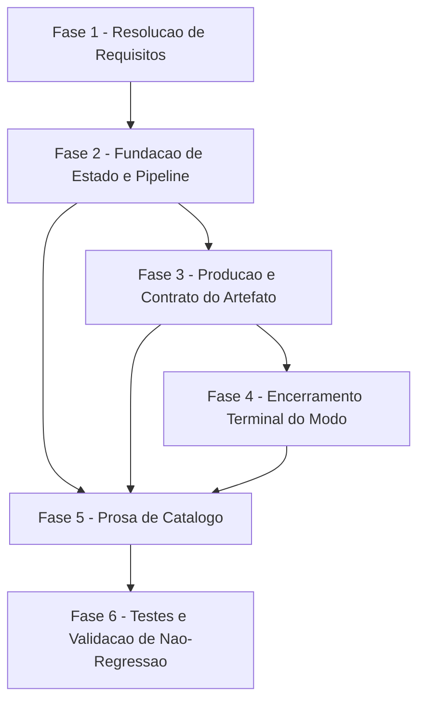

# Tarefas roadmap-mode - Modo roadmap do agente-00c

Escopo: introduzir no `/agente-00c` um modo opt-in que executa apenas
`briefing → constitution → roadmap` e encerra em estado terminal de
sucesso, produzindo `docs/roadmap.md` consumivel diretamente pelo
`/feature-00c`, e a secao de cruzamento roadmap x portfolio no
`review-features`.

**Legenda de status:**
- `[ ]` Pendente
- `[~]` Em andamento
- `[x]` Concluido
- `[!]` Bloqueado

**Legenda de criticidade:**
- `[C]` Critico - Impacto financeiro direto ou bloqueante (aqui: risco de seguranca)
- `[A]` Alto - Funcionalidade essencial
- `[M]` Medio - Necessario mas sem urgencia imediata

---

## FASE 1 - Resolucao de Requisitos (Gaps do Checklist)

Ref: `checklists/requirements.md` (onda-004) — 9 items `{auto}` marcados
`[Gap]`/`[Ambiguity]`/`[Conflict]` que precisam virar requisito explicito
ANTES de qualquer tarefa de implementacao que dependa deles. Os items
`{humano}` (CHK034-CHK037) NAO entram neste backlog — aguardam decisao
do operador (ver Escopo Excluido).

### 1.1 Definir dono da producao do artefato e normativa de filtragem de segredos `[A]`

Ref: `checklists/requirements.md` CHK006, CHK007; `spec.md` FR-003;
`plan.md` §Abordagem de implementacao; `contracts/roadmap-artifact.md` §9.4

- [x] 1.1.1 Adicionar a `spec.md` um requisito (extensao de FR-003 ou novo
  FR) atribuindo a producao/escrita de `docs/roadmap.md` a um componente
  dedicado, acionado ao concluir a etapa `roadmap`, e exigindo filtragem
  de segredos (`secrets-filter.sh`) ANTES da escrita, fail-closed
  <!-- FR-009 adicionado em spec.md (Functional Requirements + Delta Requirements) -->
- [x] 1.1.2 Acrescentar passo explicito em `plan.md` §Abordagem de
  implementacao (Fase B) nomeando o script gerador do artefato e seu
  gatilho, encerrando a hipotese aberta em `plan.md:52`
  <!-- plan.md Fase B passo 6: roadmap-write.sh [NOVO] + Project Structure atualizada -->
- [x] 1.1.3 Atualizar `checklists/requirements.md` marcando CHK006 e
  CHK007 como `[x]` com a evidencia (path:linha do novo requisito/passo)

### 1.2 Tornar SC-001 e SC-004 mensuraveis `[M]`

Ref: `checklists/requirements.md` CHK009, CHK014; `spec.md` §Success Criteria

- [x] 1.2.1 Reformular SC-001 em `spec.md` como criterio observavel
  independente de baseline (ex.: "a execucao em modo roadmap nunca
  registra etapa posterior a `roadmap`"), preservando a intencao original
- [x] 1.2.2 Reformular SC-004 em `spec.md` em termos de entradas
  preservadas (identidade/prosa), nao de "status" (que e derivado e
  nunca persistido, conforme `data-model.md`)
- [x] 1.2.3 Atualizar `checklists/requirements.md` marcando CHK009 e
  CHK014 como `[x]` com a evidencia

### 1.3 Fechar valor normativo de `termination_reason` `[A]`

Ref: `checklists/requirements.md` CHK012; `contracts/cli-roadmap-mode.md` §5.2

- [x] 1.3.1 Editar `contracts/cli-roadmap-mode.md` §5.2: remover "ex.:" e
  declarar `concluido_roadmap` como valor normativo (enum fechado) do
  `termination_reason` do modo roadmap
- [x] 1.3.2 Confirmar consistencia com `spec.md` FR-004 (encerramento
  terminal) e ajustar se necessario
  <!-- FR-004 agora referencia concluido_roadmap; §5 passo 2 do contrato
       corrigido de concluido para concluido_roadmap (era inconsistente
       com §5.2) -->
- [x] 1.3.3 Atualizar `checklists/requirements.md` marcando CHK012 como
  `[x]` com a evidencia

### 1.4 Definir gramatica de marcacao de entrada obsoleta e deteccao de alteracao deliberada `[A]`

Ref: `checklists/requirements.md` CHK018, CHK019;
`contracts/roadmap-artifact.md` §3, §8

- [x] 1.4.1 Projetar e documentar em `contracts/roadmap-artifact.md` §3
  um campo de metadado novo e opcional para marcacao de obsolescencia,
  DISTINTO do status de progresso de §2.2 (ex.: linha
  `- **marcada-obsoleta**: sim`), preservando a regra "status nunca
  persistido"
  <!-- §3.2.1: campo `- **marcada-obsoleta**: <motivo>`, quarto prefixo opcional -->
- [x] 1.4.2 Atualizar `contracts/roadmap-artifact.md` §8 para referenciar
  o campo novo na regra "entrada antiga considerada desnecessaria: nao
  apagar; marcar e reportar"
- [x] 1.4.3 Documentar em §8 a fonte de comparacao para detectar
  alteracao deliberada de Descricao/Justificativa (ex.: diff textual da
  entrada entre a leitura do artefato no INICIO da execucao corrente e a
  versao final antes da escrita, sem exigir versionamento novo)
  <!-- §8.1 novo -->
- [x] 1.4.4 Atualizar `checklists/requirements.md` marcando CHK018 e
  CHK019 como `[x]` com a evidencia
- [x] 1.4.5 (emergente, CHK035) Aplicar reducao do limite de entradas de
  200 para 50 em `contracts/roadmap-artifact.md` §9.3, conforme decisao
  do operador (dec-026) — mesmo contrato tocado por esta tarefa; a
  aplicacao no gate estrutural (§6) fica para a tarefa 1.5 (CHK025)

### 1.5 Completar o gate de validacao estrutural `[A]`

Ref: `checklists/requirements.md` CHK025, CHK026;
`contracts/roadmap-artifact.md` §6

- [x] 1.5.1 Acrescentar a `contracts/roadmap-artifact.md` §6 as regras
  faltantes: aciclicidade do grafo `depende-de`, compatibilidade
  `ordem(B) < ordem(A)` quando A depende de B, unicidade de `ordem`,
  limite de 50 entradas (CHK035, dec-026 — reduzido de 200), limite de
  64 caracteres em `short-name`
- [x] 1.5.2 Acrescentar a §6 a validacao das secoes obrigatorias de
  proveniencia (`**Gerado por**:`/`**Atualizado em**:`) e da secao
  `## Ordem sugerida`
- [x] 1.5.3 Atualizar `checklists/requirements.md` marcando CHK025 e
  CHK026 como `[x]` com a evidencia

---

## FASE 2 - Fundacao de Estado e Pipeline

Ref: `plan.md` §Abordagem de implementacao, Fase A

### 2.1 `state-rw.sh`: flag `--roadmap-mode` no `init` `[A]`

Ref: `plan.md` Fase A passo 1; `contracts/cli-roadmap-mode.md` §1

- [x] 2.1.1 Adicionar `--roadmap-mode true|false` ao loop de argumentos
  de `_sr_cmd_init` em `state-rw.sh`, espelhando `--atomic-commit`
  (mesma validacao, exit 2 se fora do dominio)
- [x] 2.1.2 Persistir `.roadmap_mode_enabled` no estado inicial
  (top-level sob backend JSON; `extra_fields` sob backend SQLite) com
  default `false`
- [x] 2.1.3 Atualizar o header do script listando `--roadmap-mode` e, na
  mesma passagem, `--atomic-commit` (hoje ausente)
- [x] 2.1.4 Escrever/estender `tests/test_state-rw.sh` cobrindo: default
  `false`, valor `true` persistido, valor invalido → exit 2

### 2.2 `roadmap-mode.sh` `[NOVO]`: `is-enabled`/`set-enabled` com trava write-once `[A]`

Ref: `plan.md` Fase A passo 2; `contracts/cli-roadmap-mode.md` §2

- [x] 2.2.1 Criar
  `plugins/cstk/skills/agente-00c-runtime/scripts/roadmap-mode.sh` com
  subcomando `is-enabled` (stdout `true|false`, exit 0 sempre, campo
  ausente/estado ilegivel/nao-booleano → `false`), espelhando
  `commit-mode.sh is-enabled`
- [x] 2.2.2 Implementar subcomando `set-enabled --value true|false`
  (exit 0/1/2) com trava write-once: recusa (exit 2, sem escrever)
  quando ja existe onda registrada em fase posterior a `constitution`
- [x] 2.2.3 Criar `tests/test_roadmap-mode.sh` `[NOVO]` cobrindo
  `is-enabled` (ausencia/true/false/estado ilegivel) e `set-enabled`
  (sucesso, valor invalido, trava write-once apos `constitution`)

### 2.3 `pipeline.sh`: flag `--mode` em `stages`/`next-stage`/`prev-stage` `[A]`

Ref: `plan.md` Fase A passo 3; `contracts/cli-roadmap-mode.md` §3;
`research.md` Decision 2

- [x] 2.3.1 Adicionar `--mode` (`default`|`roadmap`) a `stages`,
  `next-stage` e `prev-stage`, com lista escopada
  `briefing constitution roadmap` quando `--mode roadmap`; qualquer
  outro valor → exit 2
- [x] 2.3.2 Garantir que `_PL_STAGES_LIST` permanece INALTERADA (nenhuma
  edicao na lista global) e que `stages` sem `--mode` continua
  retornando as 10 etapas atuais, na ordem
- [x] 2.3.3 Implementar terminalidade: `next-stage --mode roadmap
  --current roadmap` → stdout vazio + exit 0
- [x] 2.3.4 Estender `tests/test_pipeline.sh` com a assercao de
  regressao das 10 etapas INTACTA (sem editar a assercao existente) +
  novos cenarios de `--mode roadmap`

### 2.4 `pipeline.sh`: `detect-completion --stage roadmap` `[A]`

Ref: `plan.md` Fase A passo 4; `contracts/cli-roadmap-mode.md` §3.1

- [x] 2.4.1 Adicionar arm `roadmap` ao `case` de `detect-completion`,
  localizando `docs/roadmap.md` via `--projeto-alvo-path` (mesmo
  fallback PAP de `briefing`/`constitution`)
- [x] 2.4.2 Invocar o validador estrutural (`_pl_validate_roadmap`) e
  propagar exit 0 (completo) / exit 1 (incompleto, diagnostico em
  stderr apontando a regra que falhou). NOTA DE ESCOPO (F2-->F3 na
  Matriz de Dependencias — o validador COMPLETO de §6/15 regras e
  produzido pela task 3.1, que ainda nao rodou nesta execucao):
  `_pl_validate_roadmap` cobre hoje as regras 1-3 (header, secao
  `## Features`, >=1 heading de entrada) com diagnostico real em
  stderr; a mecanica de invocacao/propagacao de exit code exigida por
  2.4.2 esta completa e testada, mas a COBERTURA de regras (4-15:
  metadado, short-name, dependencias/aciclicidade, limites,
  proveniencia, Ordem sugerida) fica para 3.1, que estende o mesmo
  corpo em vez de substituir a integracao
- [x] 2.4.3 Tornar a validacao de `--stage` ciente do modo: `--stage
  roadmap` so e aceito com `--mode roadmap`; SEM alargar a lista global
  de etapas (Decision 2)
- [x] 2.4.4 Estender `tests/test_pipeline.sh` com a assercao de
  regressao obrigatoria: `--stage roadmap` sem `--mode roadmap`
  continua invalido (exit 2)

### 2.5 `state-ondas.sh`: passthrough `--mode` em `end --advance` `[A]`

Ref: `plan.md` Fase A passo 5; `contracts/cli-roadmap-mode.md` §4;
`research.md` Decision 8

- [x] 2.5.1 Adicionar `--mode` opcional a `end`, repassado a
  `pipeline.sh next-stage` quando presente junto de `--advance`
- [x] 2.5.2 `--mode` sem `--advance` → exit 2 (mesma politica de
  `--terminal-phase` e `--advance-from`)
- [x] 2.5.3 Confirmar que `--terminal-phase roadmap` continua
  fail-closed (morre com erro de uso quando a fase corrente ja e
  `roadmap`) — sem regressao
- [x] 2.5.4 Estender `tests/test_state-ondas.sh` cobrindo passthrough
  `--mode`, exit 2 sem `--advance`, e o cenario de `--terminal-phase`
  intacto

---

## FASE 3 - Producao e Contrato do Artefato

Ref: `plan.md` §Abordagem de implementacao, Fase B

### 3.1 Implementar validador estrutural completo do artefato `[A]`

Ref: `contracts/roadmap-artifact.md` §6 (resolvido em 1.5); consumido
por 2.4.2

- [x] 3.1.1 Implementar as 8 regras originais de §6 (H1 `Roadmap`, secao
  `## Features`, >= 1 heading de entrada, 3 linhas de metadado,
  coincidencia short-name/ordem heading vs metadado, regex+unicidade de
  short-name, existencia de dependencias, ausencia de placeholder) em
  POSIX puro (`grep`/`sed`/`awk`)
- [x] 3.1.2 Implementar as regras adicionais fechadas em 1.5.1/1.5.2:
  aciclicidade do grafo `depende-de`, `ordem(B) < ordem(A)`, unicidade
  de `ordem`, limite de entradas (50 — contracts/roadmap-artifact.md §9.3
  reduziu de 200 para 50 em CHK035/1.4.5, antes desta redacao ser
  escrita; o contrato e a fonte de verdade), limite de 64 chars, secoes
  de proveniencia, secao `## Ordem sugerida`
- [x] 3.1.3 Emitir diagnostico em stderr apontando exatamente qual regra
  falhou, para uso por `detect-completion` (2.4.2)
- [x] 3.1.4 Escrever teste dedicado (fixture valida + fixtures invalidas,
  uma por regra) cobrindo as 13 regras do gate (regra 12 nao tem fixture
  dedicada: coberta por construcao pela regra 11, comentario em
  `_pl_validate_roadmap` explica a demonstracao)

### 3.2 Implementar gerador do artefato `docs/roadmap.md` `[A]`

Ref: `checklists/requirements.md` CHK006 (dono definido em
1.1.1/1.1.2); `contracts/roadmap-artifact.md` §2, §3, §8, §9.4

- [ ] 3.2.1 Implementar a geracao/escrita de `docs/roadmap.md` seguindo
  a gramatica de §2-§3 (heading, metadado, blocos de prosa), no
  componente e gatilho definidos em 1.1.2
- [ ] 3.2.2 Filtrar segredos via `secrets-filter.sh` ANTES da escrita,
  fail-closed (abortar se o filtro estiver ausente, nunca escrever sem
  filtrar) — CHK007
- [ ] 3.2.3 Implementar a regra de merge idempotente da re-execucao
  (FR-007/§8): preservar entrada existente por `short-name`, anexar
  entrada nova, nunca duplicar nem sobrescrever silenciosamente
- [ ] 3.2.4 Aplicar a marcacao de entrada obsoleta (campo definido em
  1.4.1) e reportar alteracao deliberada de Descricao/Justificativa
  (deteccao definida em 1.4.3) para consumo pelo relatorio final (5.4.3)
- [ ] 3.2.5 Escrever teste cobrindo: geracao inicial, re-geracao
  idempotente (sem duplicar), colisao de `short-name` com spec
  existente (reuso, nao renomeacao), filtragem de segredo (fixture com
  valor sensivel nao aparece no artefato escrito)

### 3.3 `roadmap-status.sh` `[NOVO]`: cruzamento de portfolio `[A]`

Ref: `plan.md` Fase B passo 7; `contracts/cli-roadmap-mode.md` §6;
`research.md` Decision 7

- [ ] 3.3.1 Criar
  `plugins/cstk/skills/review-features/scripts/roadmap-status.sh` com
  flags `--roadmap`, `--specs-dir`, `--json`, POSIX puro (sem `jq`)
- [ ] 3.3.2 Implementar a derivacao de status por entrada conforme
  `contracts/roadmap-artifact.md` §5 (dir ausente / `tasks.md` ausente
  ou pendente / `tasks.md` sem pendentes)
- [ ] 3.3.3 Implementar validacao fail-closed na leitura (§9.2):
  descartar entrada com `short-name` invalido ou > 64 chars, descartar
  token de `depende-de` invalido apos remover crases, nunca emitir
  valor bruto
- [ ] 3.3.4 Implementar escape obrigatorio: `"`/`\` em JSON, `|`
  sanitizado (trocado por `/`) na tabela markdown, mesma funcao de
  escape do precedente `aggregate.sh`
- [ ] 3.3.5 Implementar os 4 exit codes contratados (0 sucesso inclusive
  0 entradas com aviso; 1 roadmap ausente; 3 roadmap invalido/ilegivel;
  2 uso incorreto)
- [ ] 3.3.6 Criar `tests/test_roadmap-status.sh` `[NOVO]` cobrindo:
  tabela markdown, `--json`, os 4 exit codes, escape de `|` e de
  aspas/backslash, fail-closed em `short-name`/`depende-de` invalidos

---

## FASE 4 - Encerramento Terminal do Modo

Ref: `contracts/cli-roadmap-mode.md` §5

### 4.1 Implementar sequencia de encerramento terminal (FR-004) `[C]`

Ref: `contracts/cli-roadmap-mode.md` §5, §5.1, §5.2 (valor normativo
fechado em 1.3.1)

- [ ] 4.1.1 Implementar a sequencia de 4 passos na prosa do
  orquestrador: `detect-completion --stage roadmap` (artefato valido) →
  `commit-mode.sh finalize` (se atomic-commit habilitado; guarda AINDA
  ATIVA) → `state-ondas.sh end --motivo-termino concluido` → promocao
  dos 5 campos terminais, NESTA ORDEM
- [ ] 4.1.2 Gravar `termination_reason=concluido_roadmap` (valor
  normativo fechado em 1.3.1) distinguindo o modo de uma conclusao de
  pipeline completa
- [ ] 4.1.3 Promover os 5 campos (`status`, `termination_reason`,
  `finished_at`, `current_stage`, `next_instruction`) em unico write
  multi-campo (mesmo lote transacional, obrigatorio sob backend SQLite)
- [ ] 4.1.4 Escrever teste/cenario cobrindo a ordem
  finalize-antes-da-promocao (o `git push` roda com a guarda
  `PreToolUse` ainda ATIVA) — regressao de seguranca M1 do quickstart
  Cenario 12

---

## FASE 5 - Prosa de Catalogo

Ref: `plan.md` §Abordagem de implementacao, Fase C

### 5.1 `agente-00c.md`: prompt de opt-in do modo roadmap `[A]`

Ref: `plan.md` Fase C passo 8; `contracts/cli-roadmap-mode.md` §7

- [ ] 5.1.1 Adicionar bloco de pergunta interativa (mesma posicao do
  opt-in de atomic-commit), default seguro (Enter ou qualquer resposta
  nao-afirmativa = pipeline completa), afirmativas aceitas (`s`, `S`,
  `y`, `Y`, `sim`, `yes`)
- [ ] 5.1.2 Garantir que execucao nao-interativa cai no default sem
  bloquear (zero regressao)
- [ ] 5.1.3 Repassar o valor coletado ao `init` como `--roadmap-mode
  "$_roadmap"`
- [ ] 5.1.4 Confirmar (prosa) que `/agente-00c-resume` nunca
  re-pergunta — le `.roadmap_mode_enabled` do estado

### 5.2 `agente-00c-orchestrator.md`: condicionar pipeline e terminal ao modo `[A]`

Ref: `plan.md` Fase C passo 9

- [ ] 5.2.1 Condicionar a cadeia de etapas descrita na prosa do
  orquestrador ao modo (`briefing → constitution → roadmap` quando
  `.roadmap_mode_enabled=true`)
- [ ] 5.2.2 Ajustar o `--terminal-phase` hardcoded e o gatilho do hook
  de finalize (hoje amarrado a `review-features`) para tambem disparar
  ao concluir `roadmap` em modo roadmap
- [ ] 5.2.3 Adicionar a prosa de promocao de status terminal do modo
  roadmap (sequencia definida em 4.1)
- [ ] 5.2.4 Aplicar o rotulo UNTRUSTED (contract §9.1) ao reinjetar
  prosa de `docs/roadmap.md` preexistente no merge da re-execucao

### 5.3 `review-features/SKILL.md`: secao de cruzamento roadmap x portfolio `[A]`

Ref: `plan.md` Fase C passo 10; `contracts/cli-roadmap-mode.md` §6, §8

- [ ] 5.3.1 Invocar `roadmap-status.sh` de forma best-effort: projeto
  sem `docs/roadmap.md` produz o relatorio atual, sem falhar
- [ ] 5.3.2 Cercar como UNTRUSTED (§9.1) qualquer descricao do roadmap
  reproduzida no relatorio de portfolio
- [ ] 5.3.3 Tratar exit 3 (roadmap presente mas invalido) com aviso
  visivel, distinto do caso exit 1 (ausente, silencioso)

### 5.4 `report.sh`: secao de roadmap no relatorio final `[A]`

Ref: `plan.md` Fase C passo 11; `spec.md` FR-004, FR-007

- [ ] 5.4.1 Acrescentar a renderizacao do roadmap (features, ordem,
  dependencias) condicionada ao modo — execucao fora do modo mantem o
  relatorio atual inalterado
- [ ] 5.4.2 Emitir a sugestao explicita de considerar a pipeline
  completa quando o roadmap tem exatamente 1 entrada (FR-007, 2a
  clausula)
- [ ] 5.4.3 Reportar no relatorio final qualquer alteracao deliberada
  de Descricao/Justificativa detectada (mecanismo de 1.4.3) e qualquer
  entrada marcada obsoleta (mecanismo de 1.4.1)

---

## FASE 6 - Testes e Validacao de Nao-Regressao

Ref: `plan.md` §Abordagem de implementacao, Fase D

### 6.1 Suite de testes dos scripts novos `[A]`

Ref: `plan.md` Fase D passo 11

- [ ] 6.1.1 Confirmar cobertura completa de `tests/test_roadmap-mode.sh`
  (criado em 2.2.3) via `./tests/run.sh --check-coverage`
- [ ] 6.1.2 Confirmar cobertura completa de
  `tests/test_roadmap-status.sh` (criado em 3.3.6) via `./tests/run.sh
  --check-coverage`

### 6.2 Extensoes aditivas em testes existentes `[A]`

Ref: `plan.md` Fase D passo 12

- [ ] 6.2.1 Confirmar que as extensoes de `tests/test_pipeline.sh`
  (2.3.4, 2.4.4), `tests/test_state-ondas.sh` (2.5.4) e
  `tests/test_state-rw.sh` (2.1.4) sao puramente aditivas — nenhuma
  assercao existente foi editada
- [ ] 6.2.2 Estender o prose-lint de `tests/test_command-spawn-*.sh`
  cobrindo o novo bloco de opt-in em `agente-00c.md` (5.1)

### 6.3 Gate de nao-regressao e cenarios criticos do quickstart `[C]`

Ref: `quickstart.md` Cenarios 1, 7, 11, 12 `[CRITICO]`

- [ ] 6.3.1 Executar Cenario 1 (nao-regressao SC-003: sem opt-in,
  pipeline identica) como gate obrigatorio antes de considerar a
  feature pronta
- [ ] 6.3.2 Executar Cenario 7 (idempotencia da re-execucao SC-004)
- [ ] 6.3.3 Executar Cenario 11 (validacao fail-closed no consumidor,
  seguranca H2)
- [ ] 6.3.4 Executar Cenario 12 (ordem do finalize vs promocao
  terminal, seguranca M1)
- [ ] 6.3.5 Rodar `./tests/run.sh` (suite completa) e confirmar zero
  regressao antes de fechar a feature

---

## Matriz de Dependencias

## Resumo Quantitativo

| Fase | Tarefas | Subtarefas | Criticidade |
|------|---------|------------|-------------|
| 1 - Resolucao de Requisitos | 5 | 16 | 4x [A], 1x [M] |
| 2 - Fundacao de Estado e Pipeline | 5 | 19 | 5x [A] |
| 3 - Producao e Contrato do Artefato | 3 | 15 | 3x [A] |
| 4 - Encerramento Terminal do Modo | 1 | 4 | 1x [C] |
| 5 - Prosa de Catalogo | 4 | 14 | 4x [A] |
| 6 - Testes e Validacao de Nao-Regressao | 3 | 9 | 2x [A], 1x [C] |
| **Total** | **21** | **77** | 2x [C], 18x [A], 1x [M] |

## Escopo Coberto

| Item | Descricao | Fase |
|------|-----------|------|
| FR-001 | Opt-in interativo do modo roadmap, default seguro, nao-interativo | 5 |
| FR-002 | Pipeline escopada briefing→constitution→roadmap, reuso de artefatos ja ratificados | 2 |
| FR-003 | Formato canonico + producao de `docs/roadmap.md` | 1, 3 |
| FR-004 | Encerramento terminal de sucesso com roadmap no relatorio final | 4, 5 |
| FR-005 | Entrada consumivel diretamente pelo `/feature-00c` (short-name valido) | 3 |
| FR-006 | Cruzamento roadmap x portfolio no `review-features` | 3, 5 |
| FR-007 | Merge idempotente na re-execucao, sem duplicar/sobrescrever | 1, 3 |
| FR-008 | Principio VI aplicado ao conteudo (proposta de escopo vs fato) | 1 (ja coberto pelo contrato; sem tarefa de codigo dedicada) |
| CHK006, CHK007, CHK009, CHK012, CHK014, CHK018, CHK019, CHK025, CHK026 | Gaps do checklist fechados como requisito explicito | 1 |

## Escopo Excluido

| Item | Descricao | Motivo |
|------|-----------|--------|
| CHK034 | Priorizacao P1/P2/P3 adequada ao apetite do dono do produto | `{humano}` — decisao do operador, fora deste backlog |
| CHK035 | Limite de 200 entradas adequado ao maior projeto-alvo previsto | `{humano}` — decisao do operador |
| CHK036 | Entrada obsoleta permanece visivel indefinidamente vs arquivamento | `{humano}` — depende tambem da resolucao de CHK018 (mecanismo de marcacao), que esta em 1.4, mas a POLITICA de retencao/arquivamento fica para o operador |
| CHK037 | Integracao com a feature irma `delivery-tier` | `{humano}` — spec declara as duas features independentes; integracao fica como trabalho futuro se decidido |
| Tabela de roadmap na `knowledge.db` | Indice de conhecimento derivado | Nao-entidade explicita em `data-model.md` — o roadmap ja e versionado em git, que e a fonte da verdade adequada |
| Coluna `roadmap_mode_enabled` em `state.db` | Campo de schema dedicado | Nao-entidade — `extra_fields` cobre sem migracao (Decision 1) |
| Registro de progresso por entrada no state | Persistencia de status | Nao-entidade — status e sempre derivado na leitura (Decision 4) |
