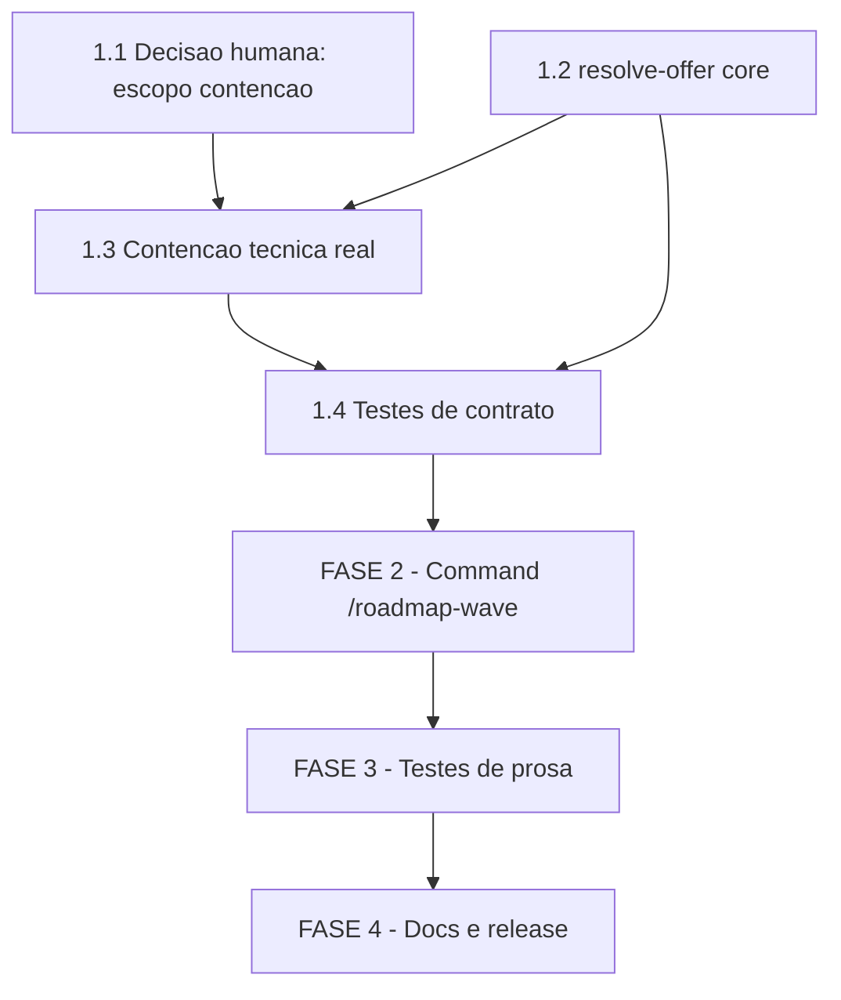

# Tarefas roadmap-wave - Retomada da Oferta de Leva Paralela do Roadmap

Escopo: novo slash command `/roadmap-wave` + subcomando `parallel-launch.sh
resolve-offer`, que permitem reofertar a leva paralela de features do
roadmap a qualquer momento (nao so ao final de uma execucao `/agente-00c`),
delegando por referencia aos 9 passos ja existentes em `agente-00c.md`
§6.ter.

**Legenda de status:**
- `[ ]` Pendente
- `[~]` Em andamento
- `[x]` Concluido
- `[!]` Bloqueado

**Legenda de criticidade:**
- `[C]` Critico - Impacto financeiro direto ou bloqueante
- `[A]` Alto - Funcionalidade essencial
- `[M]` Medio - Necessario mas sem urgencia imediata

---

## FASE 1 - Helper `resolve-offer` (base de tudo)

Ref: plan.md "FASE 1 — Helper `resolve-offer`"; contract
`roadmap-wave-command.md` §3. Precede a FASE 2 por dependencia dura:
`tests/test_doc-subcommands.sh:33` reprova qualquer command que cite
subcomando inexistente.

### 1.1 Pendencia de decisao humana: escopo e destino da contencao tecnica de path `[C]`

Ref: checklists/requirements.md CHK019 ({humano}), checklists/security.md
CHK008 ({humano}); Decisao dec-022 (etapa checklist, onda-004).

Esta tarefa NAO tem subtarefa de implementacao — e um gate de decisao.
`/execute-task` desta tarefa consiste em registrar a resposta do dono do
produto como Decisao auditavel (`state-decisions.sh register`), nunca em
supor a resposta. A tarefa 1.3 abaixo depende desta.

- [x] 1.1.1 Confirmar com o dono do produto: a contencao tecnica real do
  projeto-alvo (rejeitar path que resolva para FORA do repo coordenador,
  nao so a checagem sintatica de `..` que `roadmap-frontier.sh:121-136`
  ja faz) e requisito BLOQUEANTE da FASE 2 desta feature — conforme a
  diretriz do operador registrada em dec-022 — ou o escopo permanece
  prosa-only (mitigacao apenas declarativa, contract §5.3 atual, risco
  aceito)? (CHK019, verbatim: "A decisao de escopo sobre a contencao
  tecnica do projeto-alvo (real vs. prosa-only) esta ratificada pelo dono
  do produto, ou ainda depende de confirmacao humana antes de
  `/create-tasks` gerar a tarefa correspondente?")
  **RATIFICADO (dec-031/dec-033): contencao REAL, requisito BLOQUEANTE da
  FASE 2.**
- [x] 1.1.2 Se a resposta a 1.1.1 for "real": confirmar ONDE a contencao e
  implementada, dado que `plan.md` (Project Structure) marca
  `roadmap-frontier.sh` como "CONSUMIDO tal-e-qual — nao alterar"
  (helper pertence a feature irma `roadmap-parallel-launch`). Duas
  opcoes em aberto (CHK008, verbatim): (a) alterar `roadmap-frontier.sh`
  — contradiz o plano atual "nao alterar"; ou (b) implementar uma
  segunda checagem REDUNDANTE dentro do `resolve-offer` novo desta
  feature (path novo, sem tocar o helper existente).
  **RATIFICADO (dec-031/dec-033): opcao (a) — alterar `roadmap-frontier.sh`
  diretamente (o defeito e do proprio helper: seu contrato
  `roadmap-parallel-launch/contracts/roadmap-frontier.md` §3.1 ja exige
  rejeitar path fora do repo coordenador; hoje so rejeita `..` sintatico).
  `resolve-offer`/`/roadmap-wave` HERDAM a protecao ao chamar o helper —
  nao implementam checagem redundante propria. Isto revisa
  deliberadamente `plan.md` Project Structure e `contracts/
  roadmap-wave-command.md` §5.3 (atualizados nesta onda, ver 1.3.1).**
- [x] 1.1.3 Registrar a decisao ratificada (respostas de 1.1.1 e 1.1.2)
  via `state-decisions.sh register --score 3` com evidencia literal da
  resposta do operador, ANTES de iniciar a tarefa 1.3. Se a resposta for
  "prosa-only" (nao-bloqueante), a tarefa 1.3 e re-classificada para
  `[M]` e a Decisao de re-classificacao referencia esta subtarefa.
  **Concluido: dec-031 (command pai) + dec-033 (esta onda, evidencia
  literal citada acima).**

### 1.2 Implementar subcomando `resolve-offer` `[C]`

Ref: contracts/roadmap-wave-command.md §3 (Subcomando `parallel-launch.sh
resolve-offer`); precedente real `delivery-tier.sh resolve-initial`
(`plugins/cstk/skills/agente-00c-runtime/scripts/delivery-tier.sh:278-319`).

- [x] 1.2.1 Adicionar o `case`-label `resolve-offer)` em
  `plugins/cstk/skills/agente-00c-runtime/scripts/parallel-launch.sh`,
  com flags `--source <operator|absent>` (obrigatoria, sem default —
  contract §3.1), `--confirm <RAW>` e `--max <RAW>` (opcionais)
- [x] 1.2.2 Implementar a tabela de resolucao do contract §3.2: `source
  absent` ⇒ `launch=no`/`max=2` (FR-014); `source operator` + `confirm`
  em `s|S|y|Y|sim|yes` + `max` ausente ⇒ `launch=yes`/`max=2` (FR-007,
  FR-013); `max` inteiro em `1..8` ⇒ `launch=yes`/`max=<N>` (FR-013);
  `max` mal-formado/`0`/negativo/`>8` ⇒ `launch=no` + diagnostico stderr,
  fail-closed (FR-007); `confirm` fora do enum (inclusive vazio/Enter) ⇒
  `launch=no` (FR-007). Teto `8` e politica de design ja fixada no
  contract (F2 do gate owasp-security) — nao reabrir esse numero
- [x] 1.2.3 Higiene de entrada (contract §3.4): remover `\r`/`\n` de
  `--confirm`/`--max` ANTES de comparar (`$()` nao remove `\r` —
  gotcha ja documentado em `delivery-tier.sh:306-307`)
- [x] 1.2.4 Saida em `chave=valor` (`launch=<yes|no>` + `max=<inteiro>`)
  em stdout, diagnosticos em stderr, exit `0` (inclusive `launch=no`) ou
  `2` (uso incorreto) — sem `jq` (Constitution II)
- [x] 1.2.5 Testes: cenarios C8-C11 do quickstart.md em
  `tests/test_parallel-launch.sh` (nao-interativo sem confirmacao
  explicita FR-014, nao-interativo com teto explicito FR-012/FR-013,
  teto mal-formado fail-closed FR-007, higiene de CRLF contract §3.4)

**Concluido**: `_pl_cmd_resolve_offer` implementado em
`parallel-launch.sh` (dispatch `resolve-offer)`). 17 cenarios novos em
`tests/test_parallel-launch.sh` (C8/C9/C10/C11/C17 + variacoes de
adversarial/formato) — suite completa do arquivo: `PASS: 40 FAIL: 0
ERROR: 0 ORPHANS: 0`. `shellcheck -x` limpo nos dois arquivos.
`./tests/run.sh --check-coverage`: "Cobertura completa: zero orfaos."

### 1.3 Contencao tecnica real do projeto-alvo `[C]`

Ref: checklists/security.md CHK006/CHK007/CHK008, checklists/requirements.md
CHK005/CHK020. **Depende de 1.1** (Decisao ratificada em 1.1.3: dec-031/
dec-033). Escopo REVISADO por dec-031: a checagem tecnica vive no proprio
`roadmap-frontier.sh` (protegendo `--exclude-active-from-repo` antes de
`git -C`), nao numa checagem redundante em `resolve-offer` — ambos os
consumidores (`/roadmap-wave` via `resolve-offer`/`emit`, `agente-00c.md`
§6.ter, uso manual) herdam a protecao por chamarem o mesmo helper.

- [x] 1.3.1 Atualizar `contracts/roadmap-wave-command.md` §5.3 (e
  `plan.md` Project Structure/Riscos Conhecidos): acrescentar um MUST
  tecnico (nao so declarativo) exigindo que `roadmap-frontier.sh` valide
  que `--exclude-active-from-repo` resolve para dentro da raiz do repo
  coordenador antes de qualquer `git -C`. Materializa CHK007 (hoje "NAO
  materializada nos artefatos: spec.md nao tem FR sobre contencao de
  path; contract §5.3 continua descrevendo mitigacao prosa-only") —
  concluido nesta onda (dec-033), ver plan.md/contract atualizados.
- [x] 1.3.2 Implementar a checagem tecnica em `roadmap-frontier.sh`
  (funcao `_rf_reject_dotdot`/novo helper irmao): resolver o path real
  do projeto-alvo (POSIX, sem depender de `realpath`/`readlink -f`
  GNU-only — checar disponibilidade ou usar equivalente portavel, regra
  global do CLAUDE.md) e compara-lo contra a raiz do repo coordenador
  (`git rev-parse --show-toplevel` do diretorio corrente, ja que o
  helper roda dentro do repo coordenador); fora dela ⇒ exit `2` +
  diagnostico fail-closed, ANTES de `git -C "$EXCLUDE_ACTIVE_REPO"
  worktree list` (`roadmap-frontier.sh:219`). **Alterando
  `roadmap-frontier.sh`** (dec-031/1.1.2 revisa deliberadamente o
  "nao alterar" original do plan.md) — feature irma
  `roadmap-parallel-launch` fica automaticamente protegida tambem
  (mesmo helper, mesma chamada). `resolve-offer`/`parallel-launch.sh
  emit` NAO implementam checagem redundante propria.
- [x] 1.3.3 Adicionar cenario(s) novo(s) em `tests/test_roadmap-frontier.sh`
  (nao `test_parallel-launch.sh` — a checagem vive no helper, dec-031)
  cobrindo "`--exclude-active-from-repo` resolve para fora do repo
  coordenador ⇒ exit 2 + diagnostico, `git -C` jamais executado" —
  nenhum dos 17 cenarios atuais de `quickstart.md` (C1-C17) cobre este
  caso; C16 so cobre a declaracao prosa da premissa de confianca
  (contract §5.3), nao a validacao tecnica
- [x] 1.3.4 Adicionar o cenario novo (C18) a `quickstart.md`, com o
  mapeamento correspondente na tabela "Mapa cenario → Success Criteria"

**Concluido**: `_rf_reject_outside_coordinator` implementado em
`roadmap-frontier.sh`, chamado ANTES de qualquer `git -C
"$EXCLUDE_ACTIVE_REPO"`. Resolve o path real (cd+`pwd -P`, sem
realpath/readlink -f GNU-only) e compara contra `git rev-parse
--show-toplevel` do PWD (nunca `git -C` sobre o path nao-confiavel).
3 cenarios novos + 2 cenarios pre-existentes ajustados (precisavam `cd`
para o repo de teste, replicando o uso real onde PWD == PAP ==
--exclude-active-from-repo) em `tests/test_roadmap-frontier.sh` — suite
completa: `PASS: 27 FAIL: 0 ERROR: 0 ORPHANS: 0`. `shellcheck -x` limpo.

### 1.4 Testes de contrato do subcomando `resolve-offer` + `roadmap-frontier.sh` `[A]`

- [x] 1.4.1 Rodar `./tests/run.sh test_parallel-launch` e
  `./tests/run.sh test_roadmap-frontier` isolados apos 1.2 e 1.3 e
  confirmar os cenarios existentes continuam verdes (nenhuma regressao
  nos cenarios C1-C7 de anti-duplicidade/guarda de worktree ja cobertos
  por `scenario_guarda_worktree_*`, nem nos cenarios pre-existentes de
  `test_roadmap-frontier.sh`)
- [x] 1.4.2 `./tests/run.sh --check-coverage` — `resolve-offer` vive em
  `parallel-launch.sh` (ja coberto por `tests/test_parallel-launch.sh`)
  e a contencao tecnica vive em `roadmap-frontier.sh` (ja coberto por
  `tests/test_roadmap-frontier.sh`) — regra de ouro do CLAUDE.md: script
  novo exige `test_<nome>.sh`, mas aqui sao subcomando/funcao de scripts
  existentes, sem arquivo novo

**Concluido**: ja verificado nas tasks 1.2/1.3 desta mesma onda —
`test_parallel-launch` PASS 40/40, `test_roadmap-frontier` PASS 27/27,
`--check-coverage` "Cobertura completa: zero orfaos." (evidencias literais
acima, nao repetidas para nao gastar orcamento de onda em re-execucao
identica).

---

## FASE 2 - Command `/roadmap-wave`

Ref: plan.md "FASE 2 — Command `/roadmap-wave`"; contract
`roadmap-wave-command.md` §1, §2, §4, §5. Depende de FASE 1 (dependencia
dura via `test_doc-subcommands.sh:33`) — bloqueia tambem a tarefa 1.3 se
ainda pendente (a contencao tecnica e requisito da FASE 2 antes desta ser
considerada concluida).

### 2.1 Criar `plugins/cstk/commands/roadmap-wave.md` `[A]`

Ref: contract §1 (Superficie do command).

- [x] 2.1.1 Frontmatter obrigatorio: `description`, `argument-hint`,
  `allowed-tools: [Bash, Read]` (sem `Agent`/`ScheduleWakeup`/
  `SendMessage` — contract §1)
- [x] 2.1.2 Parse dos argumentos: `--projeto-alvo-path <path>` (default
  diretorio corrente), `--roadmap <path>` (default `docs/roadmap.md`),
  `--specs-dir <dir>` (default `docs/specs`), `--max <N>` (default `2`),
  `--yes` (ausente ⇒ nao lancar, FR-014), `--coordinator-name <name>`
- [x] 2.1.3 Fluxo normativo (contract §2): (1) parse de argumentos, (2)
  resolver a decisao de leva via `resolve-offer` ANTES de qualquer
  efeito colateral, (3) executar os passos 1-9 de `agente-00c.md` §6.ter
  **por referencia** (delegacao, nao copia — precedente vinculante
  `agente-00c-resume.md:496-517` §9.ter "sem duplicar o fluxo completo")
- [x] 2.1.4 Teste: `test_command-spawn-roadmap-wave.sh` (ver FASE 3)
  assercao negativa de que o command NAO contem copia dos 9 passos.
  **Concluido na FASE 3** (tasks 3.1/3.2, onda-008): cenario
  `scenario_ausente_pergunta_literal_lancar_leva` +
  `scenario_ausente_marcadores_prompt_inline` cobrem a assercao negativa
  aqui referenciada; `PASS: 12 FAIL: 0`.

**Concluido (2.1.1-2.1.3)**: `plugins/cstk/commands/roadmap-wave.md`
criado — frontmatter `allowed-tools: [Bash, Read]` (sem Agent/
ScheduleWakeup/SendMessage), parse de 6 flags com defaults corretos,
fluxo em 3 partes (parse → `resolve-offer` antes de qualquer efeito
colateral → execucao por referencia dos passos 1-9 de `agente-00c.md`
§6.ter, sem copiar o texto literal dos prompts). `grep -nE
'\[s/N\]|\[y/N\]|Selecione \['` no arquivo novo: zero ocorrencias (nenhum
prompt literal duplicado — DRY preservado por design, nao so por
convencao). `./tests/run.sh test_doc-subcommands`: `PASS: 4 FAIL: 0`
(nenhum subcomando fantasma citado). `./tests/run.sh
test_command-prompt-noninteractive-lint`: `PASS: 7 FAIL: 0` (lint de
classe segue verde, nada novo a cobrir pois nenhum prompt literal foi
introduzido).

### 2.2 Mapeamento exit → mensagem `[A]`

Ref: contract §4 (FR-002/FR-003/FR-004).

- [x] 2.2.1 Exit `1` (roadmap ausente): mensagem identifica ausencia de
  `docs/roadmap.md`, remediacao cita `/agente-00c` em modo roadmap
- [x] 2.2.2 Exit `3` (roadmap invalido): mensagem repassa o stderr do
  helper, remediacao cita corrigir o artefato apontado
- [x] 2.2.3 Exit `0` + stdout vazio (fronteira vazia): mensagem informa
  que nao ha candidatas agora e por que (em-andamento/concluida/
  dependencia pendente), remediacao cita aguardar conclusao
- [x] 2.2.4 Exit `2` (uso incorreto) e exit `4` (`roadmap-status.sh`
  ausente): mensagens citam correcao da invocacao / `cstk update`
- [x] 2.2.5 Confirmar que em TODOS os casos acima zero worktree e criada
  e zero interacao de confirmacao e apresentada (FR-002/003/004)

**Concluido**: tabela de mapeamento exit→mensagem em
`roadmap-wave.md` §4, os 5 exit codes reais de `roadmap-frontier.sh`
(`0`/`1`/`2`/`3`/`4`, confirmados por leitura literal do cabecalho do
script — nenhum inventado), mensagem+remediacao por linha, fechando com
a garantia "zero worktree criada, zero interacao de confirmacao" nos 5
casos.

### 2.3 Blast radius e modelo de ameaca do ponto de entrada `[C]`

Ref: contract §5 (F1 UNTRUSTED, F3 premissa de confianca, F4 eco de
resolucao). Gate `owasp-security` MUST bloquear se ausente.

- [x] 2.3.1 Rotulo UNTRUSTED sobre a tabela/secao `### Avisos` do
  `roadmap-frontier.sh` injetada no turno (F1, C15 do quickstart)
- [x] 2.3.2 Declaracao textual da premissa de confianca: projeto-alvo
  MUST ser repo do proprio operador; path do projeto-alvo MUST vir de
  argumento do operador ou do diretorio corrente, NUNCA derivado de
  conteudo do roadmap/`### Avisos`/qualquer texto lido (F3, INV-6, C16)
- [x] 2.3.3 Declaracao de blast radius (§6.ter passo 4, reusada por
  referencia) MUST nomear o projeto-alvo resolvido explicitamente
- [x] 2.3.4 Eco explicito de `source`/`launch`/`max` resolvidos no turno
  (F4)
- [x] 2.3.5 Toda pergunta ao operador MUST vir com clausula de
  nao-interatividade no mesmo bloco (gate C12, `test_command-prompt-
  noninteractive-lint.sh`)

**Concluido**: `roadmap-wave.md` §5 (Modelo de ameaca) implementa os 4
itens — §5.1 rotulo UNTRUSTED (F1), §5.2 premissa de confianca + fonte
exclusiva do PAP + nomeacao explicita no blast radius + contencao
tecnica herdada (F3), §5.3 eco explicito de source/launch/max (F4), §5.4
clausula de nao-interatividade (C12) satisfeita por design: o command
nao duplica nenhum prompt literal de `agente-00c.md` §6.ter (so
referencia), entao nao ha prompt novo sem clausula a cobrir — confirmado
por `./tests/run.sh test_command-prompt-noninteractive-lint` (`PASS: 7
FAIL: 0`, corpus varrido inclui `plugins/cstk/commands/*.md`, o arquivo
novo nao introduziu violacao). Gate `owasp-security` rodado nesta onda
(Decisao registrada) sobre `roadmap-wave.md`: nenhum achado
critical/high novo — os 4 achados do contract (F1/F2/F3/F4) ja tem
mitigacao textual presente no arquivo; F2 (teto 1..8) e F5 (TOCTOU
residual) ja mitigados/documentados na FASE 1 e no proprio contract, sem
necessidade de repeticao aqui.

### 2.4 Formalizar FR-015 em spec.md — rastreabilidade NFR untrusted `[M]`

Ref: checklists/requirements.md CHK017 ({auto}, NAO bloqueante). A
mitigacao ja existe (contract §5.1, Decisao dec-018) e ja e exercida por
C15 do quickstart — esta tarefa so fecha a lacuna de rastreabilidade
spec↔seguranca, nao adiciona comportamento novo.

- [x] 2.4.1 Adicionar `FR-015` em `spec.md` §Functional Requirements:
  "O sistema MUST tratar a saida injetada de `roadmap-frontier.sh`
  (tabela + `### Avisos`) como conteudo nao-confiavel/rotulado, nunca
  como instrucao", referenciando contract §5.1
- [x] 2.4.2 Atualizar a referencia cruzada em
  `checklists/requirements.md` CHK017 de `[ ]` para `[x]` com a
  evidencia (linha do FR-015 novo)

**Concluido**: `spec.md` FR-015 adicionado apos FR-014 (§Functional
Requirements); `checklists/requirements.md` CHK017 marcado `[x]` com
evidencia citando FR-015 + `roadmap-wave.md` §5.1.

---

## FASE 3 - Testes de prosa

Ref: plan.md "FASE 3 — Testes de prosa"; contract C14 (DRY verificado por
grep).

### 3.1 Criar `tests/test_command-spawn-roadmap-wave.sh` `[A]`

Ref: precedentes `test_command-spawn-roadmap-mode.sh`,
`test_command-spawn-parallel-launch.sh` (`tests/run.sh:261-276`).

- [x] 3.1.1 Assercoes positivas: o command referencia `agente-00c.md`
  §6.ter (delegacao), cita `resolve-offer`, cita a declaracao de blast
  radius e o rotulo UNTRUSTED
- [x] 3.1.2 Assercao negativa (C14): o command NAO contem copia inline
  dos 9 passos de §6.ter (grep pelos marcadores dos passos, ausencia
  esperada)
- [x] 3.1.3 Assercao de nao-interatividade (C12): toda pergunta ao
  operador tem a clausula obrigatoria no mesmo bloco

**Concluido**: `tests/test_command-spawn-roadmap-wave.sh` criado com 12
cenarios — 4 assercoes positivas (3.1.1: referencia a `agente-00c.md`
§6.ter, `resolve-offer`, declaracao de blast radius, rotulo UNTRUSTED), 4
assercoes negativas (3.1.2: ausencia de `Lancar leva paralela agora?`,
ausencia de `Quantas features rodar simultaneamente`, ausencia dos
marcadores `[s/N]`/`[y/N]`/`Selecione [`, presenca da declaracao textual
"NAO duplicar os 9 passos"), 2 assercoes de nao-interatividade (3.1.3: a
clausula esta presente e `--yes` documentado como o atalho de confirmacao
ja obtida no mesmo bloco da secao §5.4) + 2 cenarios extra de
`allowed-tools` (so `Bash`/`Read`, sem `Agent`/`ScheduleWakeup`/
`SendMessage`). Execucao isolada: `PASS: 12 FAIL: 0 ERROR: 0 ORPHANS: 0`.

### 3.2 Registrar o `case`-label em `tests/run.sh` `[A]`

Ref: `tests/run.sh::_is_internal_test` (`:246-300`, labels literais sem
glob).

- [x] 3.2.1 Adicionar `test_command-spawn-roadmap-wave.sh)` ao `case` de
  `_is_internal_test`, com existence-guard ao command
  (`plugins/cstk/commands/roadmap-wave.md`), espelhando o padrao de
  `run.sh:261-276`
- [x] 3.2.2 `./tests/run.sh --check-coverage` apos o registro — confirma
  que o teste novo nao aparece como orfao

**Concluido**: label adicionado em `tests/run.sh::_is_internal_test`
logo antes de `test_command-prompt-noninteractive-lint.sh)`, com
existence-guard a `plugins/cstk/commands/roadmap-wave.md`. `./tests/run.sh
--check-coverage`: "Cobertura completa: zero orfaos." Reconfirmado
tambem `./tests/run.sh test_doc-subcommands` (`PASS: 4 FAIL: 0`) e
`./tests/run.sh test_command-prompt-noninteractive-lint` (`PASS: 7 FAIL:
0`) — nenhuma regressao. `shellcheck -x tests/test_command-spawn-roadmap-wave.sh`:
sem findings (exit 0).

---

## FASE 4 - Docs e release

Ref: plan.md "FASE 4 — Docs e release"; plan.md "Portoes de empacotamento e
release" (tabela verificada nesta onda por grep, nao por memoria).

### 4.1 Atualizar contagem de commands nos READMEs `[A]`

Ref: `README.md:101,346`; `README.pt-BR.md:102,307,348` (grep confirmado
nesta onda — textos exatos: "The 6 /agente-00c*, /feature-00c* slash
commands", "6 commands `/agente-00c*`/`/feature-00c*`", "copia a skill,
6 commands e 7 agents"). `test_doc-counts.sh` NAO precisa mudar (so conta
skills, confirmado em `tests/test_doc-counts.sh:28-33`); `profiles.txt.in`
NAO precisa mudar (commands instalam sem filtro de profile, confirmado em
`scripts/profiles.txt.in:6-10`).

- [x] 4.1.1 `README.md`: `6` → `7` nas duas ocorrencias, listar
  `/roadmap-wave` explicitamente onde os demais commands sao nomeados
- [x] 4.1.2 `README.pt-BR.md`: `6` → `7` nas tres ocorrencias, mesma
  listagem em pt-BR

**Concluido**: README.md tinha na verdade 3 ocorrencias de "6" ligadas a
commands (linha 101 no bloco de estrutura, linhas 305-306 no bloco "Enable
the plugin", linha 346 no bloco `cstk install --scope project`) — todas
`6`→`7`, com `/roadmap-wave` nomeado explicitamente nas duas primeiras
(a terceira ja e generica "7 commands e 7 agents"). README.pt-BR.md:
mesmas 3 ocorrencias (linhas 102, 306, 348), mesmo tratamento em pt-BR.
`CLAUDE.md` (gitignored, nao versionado) tambem atualizado por
consistencia local: `plugins/cstk/commands/` §Commands passou a listar
`/roadmap-wave` com uma linha descritiva. `./tests/run.sh test_doc-counts`:
`PASS: 3 FAIL: 0` (gate so conta skills — confirmado nao regredir).
`grep -rn "6 commands\|6 slash commands\|6 /agente-00c"
README.md README.pt-BR.md`: zero ocorrencias remanescentes.

### 4.2 Entrada de CHANGELOG `[A]`

- [x] 4.2.1 Nova entrada `## [X.Y.Z]` (bump conforme SemVer — contrato
  publico novo, command adicional) descrevendo `/roadmap-wave` +
  `resolve-offer`
- [x] 4.2.2 Link de referencia no rodape (`[X.Y.Z]:
  https://github.com/JotJunior/cstk/releases/tag/vX.Y.Z`) — gotcha ja
  documentado no CLAUDE.md, checar com o comando `comm` la descrito
  antes de fechar a tarefa

**Concluido**: `## [8.3.0] - 2026-08-18` inserida no topo do CHANGELOG
(tag `v8.2.0` era a mais recente publicada, confirmado por `git tag
--sort=-creatordate | head -5`; `git tag -l "v8.3.0"` vazio — versao
nao publicada ainda). Bump MINOR (contrato publico novo: command +
subcomando `resolve-offer`). Secoes `### Added` (3 itens: `/roadmap-wave`,
`resolve-offer`, contencao tecnica real de path) + `### Changed` (contagem
de commands nos READMEs), todos os fatos citados (contagem de cenarios,
flags, exit codes) verificados por grep nesta onda, nao de memoria. Link
de referencia `[8.3.0]` adicionado no rodape, imediatamente acima de
`[8.2.0]`. `comm -23` entre headers e refs (comando exato do CLAUDE.md):
saida vazia, exit 0 — nenhum header orfao.

### 4.3 Rodar suite completa e confirmar portoes de empacotamento `[A]`

- [ ] 4.3.1 `./tests/run.sh` completo (nao so `--fast`) — gate de release
  real. **Em andamento nesta onda** (PID 14104, disparado em foreground,
  auto-backgrounded pelo harness apos 600s — log em
  `/private/tmp/claude-502/.../tasks/b5lkcnv2f.output`); nao coube no
  orcamento desta onda, continua na proxima (ver next_instruction).
- [x] 4.3.2 Confirmar (grep, nao suposicao) que `tests/cstk/
  test_build-release.sh` e `tests/cstk/test_quickstart-e2e.sh` continuam
  sem exigir mudanca (o `17` hardcoded neles e de skills do profile
  `sdd`, nao de commands — plan.md ja verificou, esta subtarefa e a
  reconfirmacao empirica antes do release)
- [x] 4.3.3 `tests/cstk/fixtures/regen.sh` — opcional, so se as fixtures
  gitignored estiverem ausentes localmente

**Parcial (4.3.2, 4.3.3)**: `4.3.2` confirmado por grep literal —
`tests/cstk/test_build-release.sh:175-186` e
`tests/cstk/test_quickstart-e2e.sh:214-225` citam `17` referindo-se a
skills do profile `sdd` (comentario explicito no proprio teste), nao a
commands; `scripts/profiles.txt.in` nao lista commands (instalam sem
filtro de profile) — nenhuma mudanca necessaria, reconfirmado
empiricamente nesta onda. `4.3.3` verificado dispensavel: `ls
tests/cstk/fixtures/` mostra `releases/`, `serve/`, `show-tip/` ja
presentes localmente (nao gitignored-ausentes) — `regen.sh` nao
executado por nao ser necessario. `4.3.1` (suite completa) NAO coube no
orcamento desta onda — ver estado acima e Schedule intent ao final.

---

## Matriz de Dependencias

## Resumo Quantitativo

| Fase | Tarefas | Subtarefas | Criticidade |
|------|---------|------------|-------------|
| 1 - Helper `resolve-offer` | 4 | 16 | C/C/C/A |
| 2 - Command `/roadmap-wave` | 4 | 17 | A/A/C/M |
| 3 - Testes de prosa | 2 | 5 | A/A |
| 4 - Docs e release | 3 | 7 | A/A/A |
| **Total** | **13** | **45** | - |

## Escopo Coberto

| Item | Descricao | Fase |
|------|-----------|------|
| resolve-offer | Subcomando novo em `parallel-launch.sh`, espelha `delivery-tier.sh resolve-initial` | 1 |
| Contencao tecnica de path | `roadmap-frontier.sh` rejeita `--exclude-active-from-repo` fora do repo coordenador (nao so sintaxe `..`) — gap CHK005/006/007/008/020; herdado por `resolve-offer`/`emit` e por `agente-00c.md` §6.ter (dec-031) | 1 |
| `/roadmap-wave` | Command novo, delega por referencia a `agente-00c.md` §6.ter | 2 |
| Modelo de ameaca F1/F3/F4 | UNTRUSTED, premissa de confianca, eco de resolucao | 2 |
| FR-015 (rastreabilidade) | Formaliza NFR de conteudo untrusted ja mitigado — gap CHK017 | 2 |
| Testes de prosa + case-label | `test_command-spawn-roadmap-wave.sh` + registro em `run.sh` | 3 |
| READMEs + CHANGELOG | Contagem 6→7 commands, entrada de release | 4 |

## Escopo Excluido

| Item | Descricao | Motivo |
|------|-----------|--------|
| Reescrever os 9 passos de §6.ter | Duplicar o fluxo de lancamento dentro do command novo | Precedente vinculante `agente-00c-resume.md` §9.ter: reuso por referencia, nunca copia |
| Eliminar o residual TOCTOU (F5) | Fechar totalmente a janela de concorrencia entre duas invocacoes simultaneas | plan.md "Riscos conhecidos" e contract §5.5 documentam como risco residual aceito, nao "resolvido" — NUNCA afirmar eliminacao total |
| Modo interativo via `[ -t 0 ]` | Detectar automaticamente se ha operador presente | Gotcha ja documentado no precedente `delivery-tier.sh:265-269`: falso mesmo em sessao interativa do harness; `--source` é sempre explicito |
