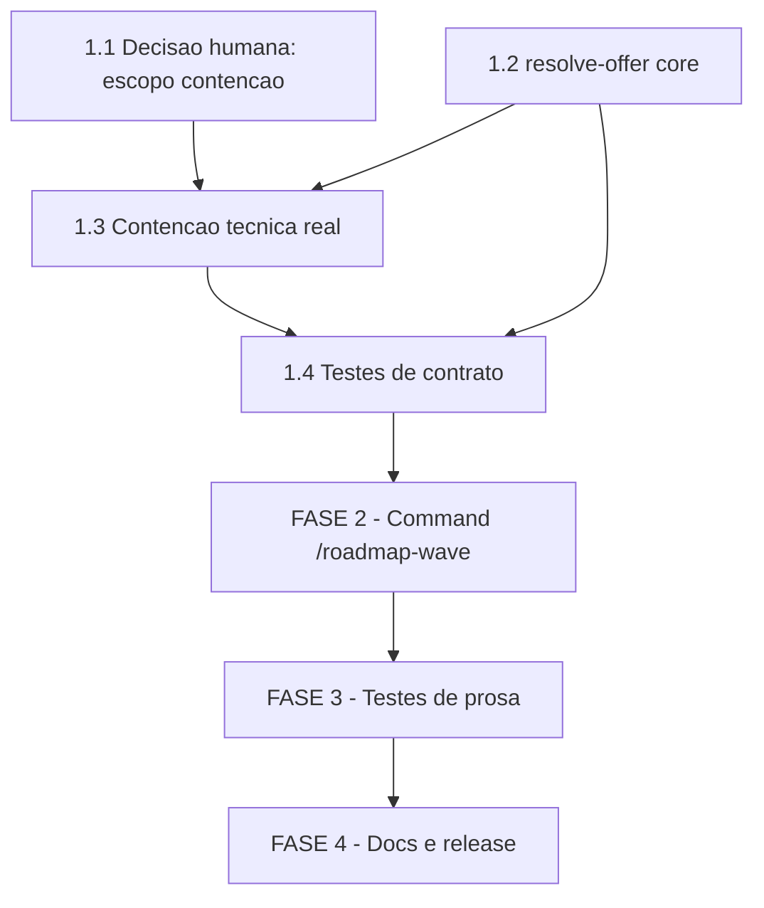

# Tarefas roadmap-wave - Retomada da Oferta de Leva Paralela do Roadmap

Escopo: novo slash command `/roadmap-wave` + subcomando `parallel-launch.sh
resolve-offer`, que permitem reofertar a leva paralela de features do
roadmap a qualquer momento (nao so ao final de uma execucao `/agente-00c`),
delegando por referencia aos 9 passos ja existentes em `agente-00c.md`
§6.ter.

**Legenda de status:**
- `[ ]` Pendente
- `[~]` Em andamento
- `[x]` Concluido
- `[!]` Bloqueado

**Legenda de criticidade:**
- `[C]` Critico - Impacto financeiro direto ou bloqueante
- `[A]` Alto - Funcionalidade essencial
- `[M]` Medio - Necessario mas sem urgencia imediata

---

## FASE 1 - Helper `resolve-offer` (base de tudo)

Ref: plan.md "FASE 1 — Helper `resolve-offer`"; contract
`roadmap-wave-command.md` §3. Precede a FASE 2 por dependencia dura:
`tests/test_doc-subcommands.sh:33` reprova qualquer command que cite
subcomando inexistente.

### 1.1 Pendencia de decisao humana: escopo e destino da contencao tecnica de path `[C]`

Ref: checklists/requirements.md CHK019 ({humano}), checklists/security.md
CHK008 ({humano}); Decisao dec-022 (etapa checklist, onda-004).

Esta tarefa NAO tem subtarefa de implementacao — e um gate de decisao.
`/execute-task` desta tarefa consiste em registrar a resposta do dono do
produto como Decisao auditavel (`state-decisions.sh register`), nunca em
supor a resposta. A tarefa 1.3 abaixo depende desta.

- [!] 1.1.1 Confirmar com o dono do produto: a contencao tecnica real do
  projeto-alvo (rejeitar path que resolva para FORA do repo coordenador,
  nao so a checagem sintatica de `..` que `roadmap-frontier.sh:121-136`
  ja faz) e requisito BLOQUEANTE da FASE 2 desta feature — conforme a
  diretriz do operador registrada em dec-022 — ou o escopo permanece
  prosa-only (mitigacao apenas declarativa, contract §5.3 atual, risco
  aceito)? (CHK019, verbatim: "A decisao de escopo sobre a contencao
  tecnica do projeto-alvo (real vs. prosa-only) esta ratificada pelo dono
  do produto, ou ainda depende de confirmacao humana antes de
  `/create-tasks` gerar a tarefa correspondente?")
- [!] 1.1.2 Se a resposta a 1.1.1 for "real": confirmar ONDE a contencao e
  implementada, dado que `plan.md` (Project Structure) marca
  `roadmap-frontier.sh` como "CONSUMIDO tal-e-qual — nao alterar"
  (helper pertence a feature irma `roadmap-parallel-launch`). Duas
  opcoes em aberto (CHK008, verbatim): (a) alterar `roadmap-frontier.sh`
  — contradiz o plano atual "nao alterar"; ou (b) implementar uma
  segunda checagem REDUNDANTE dentro do `resolve-offer` novo desta
  feature (path novo, sem tocar o helper existente). Precedente
  estrutural ja existente que aponta para (b), citado aqui apenas como
  CONTEXTO — nao como resposta assumida: contract
  `roadmap-wave-command.md` §5.3 ja redige o MUST atual como "mitigacao
  no ponto de entrada, **sem alterar o helper**"; `plan.md` Project
  Structure ja lista `roadmap-frontier.sh` como "nao alterar" e
  `parallel-launch.sh` como "ALTERADO: + subcomando resolve-offer".
- [ ] 1.1.3 Registrar a decisao ratificada (respostas de 1.1.1 e 1.1.2)
  via `state-decisions.sh register --score 3` com evidencia literal da
  resposta do operador, ANTES de iniciar a tarefa 1.3. Se a resposta for
  "prosa-only" (nao-bloqueante), a tarefa 1.3 e re-classificada para
  `[M]` e a Decisao de re-classificacao referencia esta subtarefa.

### 1.2 Implementar subcomando `resolve-offer` `[C]`

Ref: contracts/roadmap-wave-command.md §3 (Subcomando `parallel-launch.sh
resolve-offer`); precedente real `delivery-tier.sh resolve-initial`
(`plugins/cstk/skills/agente-00c-runtime/scripts/delivery-tier.sh:278-319`).

- [ ] 1.2.1 Adicionar o `case`-label `resolve-offer)` em
  `plugins/cstk/skills/agente-00c-runtime/scripts/parallel-launch.sh`,
  com flags `--source <operator|absent>` (obrigatoria, sem default —
  contract §3.1), `--confirm <RAW>` e `--max <RAW>` (opcionais)
- [ ] 1.2.2 Implementar a tabela de resolucao do contract §3.2: `source
  absent` ⇒ `launch=no`/`max=2` (FR-014); `source operator` + `confirm`
  em `s|S|y|Y|sim|yes` + `max` ausente ⇒ `launch=yes`/`max=2` (FR-007,
  FR-013); `max` inteiro em `1..8` ⇒ `launch=yes`/`max=<N>` (FR-013);
  `max` mal-formado/`0`/negativo/`>8` ⇒ `launch=no` + diagnostico stderr,
  fail-closed (FR-007); `confirm` fora do enum (inclusive vazio/Enter) ⇒
  `launch=no` (FR-007). Teto `8` e politica de design ja fixada no
  contract (F2 do gate owasp-security) — nao reabrir esse numero
- [ ] 1.2.3 Higiene de entrada (contract §3.4): remover `\r`/`\n` de
  `--confirm`/`--max` ANTES de comparar (`$()` nao remove `\r` —
  gotcha ja documentado em `delivery-tier.sh:306-307`)
- [ ] 1.2.4 Saida em `chave=valor` (`launch=<yes|no>` + `max=<inteiro>`)
  em stdout, diagnosticos em stderr, exit `0` (inclusive `launch=no`) ou
  `2` (uso incorreto) — sem `jq` (Constitution II)
- [ ] 1.2.5 Testes: cenarios C8-C11 do quickstart.md em
  `tests/test_parallel-launch.sh` (nao-interativo sem confirmacao
  explicita FR-014, nao-interativo com teto explicito FR-012/FR-013,
  teto mal-formado fail-closed FR-007, higiene de CRLF contract §3.4)

### 1.3 Contencao tecnica real do projeto-alvo em `resolve-offer` `[C]`

Ref: checklists/security.md CHK006/CHK007/CHK008, checklists/requirements.md
CHK005/CHK020. **Depende de 1.1** (nao iniciar sem a Decisao ratificada em
1.1.3). Se 1.1 concluir com "prosa-only", esta tarefa e re-classificada
`[M]` e suas subtarefas de implementacao (1.3.2/1.3.3/1.3.4) sao
substituidas por uma unica subtarefa "registrar risco aceito no plan.md
Riscos Conhecidos com data e Decisao".

- [ ] 1.3.1 Atualizar `contracts/roadmap-wave-command.md` §5.3: acrescentar
  um MUST tecnico (nao so declarativo) exigindo que `resolve-offer`
  valide que o `--repo`/projeto-alvo resolve para dentro da raiz do repo
  coordenador antes de qualquer `git -C`/`emit`. Materializa CHK007
  (hoje "NAO materializada nos artefatos: spec.md nao tem FR sobre
  contencao de path; contract §5.3 continua descrevendo mitigacao
  prosa-only")
- [ ] 1.3.2 Implementar a checagem tecnica em `resolve-offer`
  (`parallel-launch.sh`): resolver o path real do projeto-alvo (POSIX,
  sem depender de `realpath`/`readlink -f` GNU-only — checar
  disponibilidade ou usar equivalente portavel, regra global do
  CLAUDE.md) e compara-lo contra a raiz do repo coordenador; fora dela ⇒
  `launch=no` + diagnostico fail-closed. **Sem alterar
  `roadmap-frontier.sh`** (fica fora do escopo desta feature, pertence a
  `roadmap-parallel-launch`) — a checagem e redundante e vive so no
  `resolve-offer` novo, exceto se 1.1.2 tiver ratificado o contrario
- [ ] 1.3.3 Adicionar cenario(s) novo(s) em `tests/test_parallel-launch.sh`
  cobrindo "projeto-alvo resolve para fora do repo coordenador ⇒
  `launch=no`" — nenhum dos 17 cenarios atuais de `quickstart.md` (C1-C17)
  cobre este caso; C16 so cobre a declaracao prosa da premissa de
  confianca (contract §5.3), nao a validacao tecnica
- [ ] 1.3.4 Adicionar o cenario novo (C18) a `quickstart.md`, com o
  mapeamento correspondente na tabela "Mapa cenario → Success Criteria"

### 1.4 Testes de contrato do subcomando `resolve-offer` `[A]`

- [ ] 1.4.1 Rodar `./tests/run.sh test_parallel-launch` isolado apos 1.2 e
  1.3 e confirmar os 25+ cenarios existentes continuam verdes (nenhuma
  regressao nos cenarios C1-C7 de anti-duplicidade/guarda de worktree ja
  cobertos por `scenario_guarda_worktree_*`)
- [ ] 1.4.2 `./tests/run.sh --check-coverage` — `resolve-offer` vive em
  `parallel-launch.sh`, ja coberto por `tests/test_parallel-launch.sh`
  (regra de ouro do CLAUDE.md: script novo exige `test_<nome>.sh`, mas
  aqui e subcomando de script existente, sem arquivo novo)

---

## FASE 2 - Command `/roadmap-wave`

Ref: plan.md "FASE 2 — Command `/roadmap-wave`"; contract
`roadmap-wave-command.md` §1, §2, §4, §5. Depende de FASE 1 (dependencia
dura via `test_doc-subcommands.sh:33`) — bloqueia tambem a tarefa 1.3 se
ainda pendente (a contencao tecnica e requisito da FASE 2 antes desta ser
considerada concluida).

### 2.1 Criar `plugins/cstk/commands/roadmap-wave.md` `[A]`

Ref: contract §1 (Superficie do command).

- [ ] 2.1.1 Frontmatter obrigatorio: `description`, `argument-hint`,
  `allowed-tools: [Bash, Read]` (sem `Agent`/`ScheduleWakeup`/
  `SendMessage` — contract §1)
- [ ] 2.1.2 Parse dos argumentos: `--projeto-alvo-path <path>` (default
  diretorio corrente), `--roadmap <path>` (default `docs/roadmap.md`),
  `--specs-dir <dir>` (default `docs/specs`), `--max <N>` (default `2`),
  `--yes` (ausente ⇒ nao lancar, FR-014), `--coordinator-name <name>`
- [ ] 2.1.3 Fluxo normativo (contract §2): (1) parse de argumentos, (2)
  resolver a decisao de leva via `resolve-offer` ANTES de qualquer
  efeito colateral, (3) executar os passos 1-9 de `agente-00c.md` §6.ter
  **por referencia** (delegacao, nao copia — precedente vinculante
  `agente-00c-resume.md:496-517` §9.ter "sem duplicar o fluxo completo")
- [ ] 2.1.4 Teste: `test_command-spawn-roadmap-wave.sh` (ver FASE 3)
  assercao negativa de que o command NAO contem copia dos 9 passos

### 2.2 Mapeamento exit → mensagem `[A]`

Ref: contract §4 (FR-002/FR-003/FR-004).

- [ ] 2.2.1 Exit `1` (roadmap ausente): mensagem identifica ausencia de
  `docs/roadmap.md`, remediacao cita `/agente-00c` em modo roadmap
- [ ] 2.2.2 Exit `3` (roadmap invalido): mensagem repassa o stderr do
  helper, remediacao cita corrigir o artefato apontado
- [ ] 2.2.3 Exit `0` + stdout vazio (fronteira vazia): mensagem informa
  que nao ha candidatas agora e por que (em-andamento/concluida/
  dependencia pendente), remediacao cita aguardar conclusao
- [ ] 2.2.4 Exit `2` (uso incorreto) e exit `4` (`roadmap-status.sh`
  ausente): mensagens citam correcao da invocacao / `cstk update`
- [ ] 2.2.5 Confirmar que em TODOS os casos acima zero worktree e criada
  e zero interacao de confirmacao e apresentada (FR-002/003/004)

### 2.3 Blast radius e modelo de ameaca do ponto de entrada `[C]`

Ref: contract §5 (F1 UNTRUSTED, F3 premissa de confianca, F4 eco de
resolucao). Gate `owasp-security` MUST bloquear se ausente.

- [ ] 2.3.1 Rotulo UNTRUSTED sobre a tabela/secao `### Avisos` do
  `roadmap-frontier.sh` injetada no turno (F1, C15 do quickstart)
- [ ] 2.3.2 Declaracao textual da premissa de confianca: projeto-alvo
  MUST ser repo do proprio operador; path do projeto-alvo MUST vir de
  argumento do operador ou do diretorio corrente, NUNCA derivado de
  conteudo do roadmap/`### Avisos`/qualquer texto lido (F3, INV-6, C16)
- [ ] 2.3.3 Declaracao de blast radius (§6.ter passo 4, reusada por
  referencia) MUST nomear o projeto-alvo resolvido explicitamente
- [ ] 2.3.4 Eco explicito de `source`/`launch`/`max` resolvidos no turno
  (F4)
- [ ] 2.3.5 Toda pergunta ao operador MUST vir com clausula de
  nao-interatividade no mesmo bloco (gate C12, `test_command-prompt-
  noninteractive-lint.sh`)

### 2.4 Formalizar FR-015 em spec.md — rastreabilidade NFR untrusted `[M]`

Ref: checklists/requirements.md CHK017 ({auto}, NAO bloqueante). A
mitigacao ja existe (contract §5.1, Decisao dec-018) e ja e exercida por
C15 do quickstart — esta tarefa so fecha a lacuna de rastreabilidade
spec↔seguranca, nao adiciona comportamento novo.

- [ ] 2.4.1 Adicionar `FR-015` em `spec.md` §Functional Requirements:
  "O sistema MUST tratar a saida injetada de `roadmap-frontier.sh`
  (tabela + `### Avisos`) como conteudo nao-confiavel/rotulado, nunca
  como instrucao", referenciando contract §5.1
- [ ] 2.4.2 Atualizar a referencia cruzada em
  `checklists/requirements.md` CHK017 de `[ ]` para `[x]` com a
  evidencia (linha do FR-015 novo)

---

## FASE 3 - Testes de prosa

Ref: plan.md "FASE 3 — Testes de prosa"; contract C14 (DRY verificado por
grep).

### 3.1 Criar `tests/test_command-spawn-roadmap-wave.sh` `[A]`

Ref: precedentes `test_command-spawn-roadmap-mode.sh`,
`test_command-spawn-parallel-launch.sh` (`tests/run.sh:261-276`).

- [ ] 3.1.1 Assercoes positivas: o command referencia `agente-00c.md`
  §6.ter (delegacao), cita `resolve-offer`, cita a declaracao de blast
  radius e o rotulo UNTRUSTED
- [ ] 3.1.2 Assercao negativa (C14): o command NAO contem copia inline
  dos 9 passos de §6.ter (grep pelos marcadores dos passos, ausencia
  esperada)
- [ ] 3.1.3 Assercao de nao-interatividade (C12): toda pergunta ao
  operador tem a clausula obrigatoria no mesmo bloco

### 3.2 Registrar o `case`-label em `tests/run.sh` `[A]`

Ref: `tests/run.sh::_is_internal_test` (`:246-300`, labels literais sem
glob).

- [ ] 3.2.1 Adicionar `test_command-spawn-roadmap-wave.sh)` ao `case` de
  `_is_internal_test`, com existence-guard ao command
  (`plugins/cstk/commands/roadmap-wave.md`), espelhando o padrao de
  `run.sh:261-276`
- [ ] 3.2.2 `./tests/run.sh --check-coverage` apos o registro — confirma
  que o teste novo nao aparece como orfao

---

## FASE 4 - Docs e release

Ref: plan.md "FASE 4 — Docs e release"; plan.md "Portoes de empacotamento e
release" (tabela verificada nesta onda por grep, nao por memoria).

### 4.1 Atualizar contagem de commands nos READMEs `[A]`

Ref: `README.md:101,346`; `README.pt-BR.md:102,307,348` (grep confirmado
nesta onda — textos exatos: "The 6 /agente-00c*, /feature-00c* slash
commands", "6 commands `/agente-00c*`/`/feature-00c*`", "copia a skill,
6 commands e 7 agents"). `test_doc-counts.sh` NAO precisa mudar (so conta
skills, confirmado em `tests/test_doc-counts.sh:28-33`); `profiles.txt.in`
NAO precisa mudar (commands instalam sem filtro de profile, confirmado em
`scripts/profiles.txt.in:6-10`).

- [ ] 4.1.1 `README.md`: `6` → `7` nas duas ocorrencias, listar
  `/roadmap-wave` explicitamente onde os demais commands sao nomeados
- [ ] 4.1.2 `README.pt-BR.md`: `6` → `7` nas tres ocorrencias, mesma
  listagem em pt-BR

### 4.2 Entrada de CHANGELOG `[A]`

- [ ] 4.2.1 Nova entrada `## [X.Y.Z]` (bump conforme SemVer — contrato
  publico novo, command adicional) descrevendo `/roadmap-wave` +
  `resolve-offer`
- [ ] 4.2.2 Link de referencia no rodape (`[X.Y.Z]:
  https://github.com/JotJunior/cstk/releases/tag/vX.Y.Z`) — gotcha ja
  documentado no CLAUDE.md, checar com o comando `comm` la descrito
  antes de fechar a tarefa

### 4.3 Rodar suite completa e confirmar portoes de empacotamento `[A]`

- [ ] 4.3.1 `./tests/run.sh` completo (nao so `--fast`) — gate de release
  real
- [ ] 4.3.2 Confirmar (grep, nao suposicao) que `tests/cstk/
  test_build-release.sh` e `tests/cstk/test_quickstart-e2e.sh` continuam
  sem exigir mudanca (o `17` hardcoded neles e de skills do profile
  `sdd`, nao de commands — plan.md ja verificou, esta subtarefa e a
  reconfirmacao empirica antes do release)
- [ ] 4.3.3 `tests/cstk/fixtures/regen.sh` — opcional, so se as fixtures
  gitignored estiverem ausentes localmente

---

## Matriz de Dependencias

## Resumo Quantitativo

| Fase | Tarefas | Subtarefas | Criticidade |
|------|---------|------------|-------------|
| 1 - Helper `resolve-offer` | 4 | 16 | C/C/C/A |
| 2 - Command `/roadmap-wave` | 4 | 17 | A/A/C/M |
| 3 - Testes de prosa | 2 | 5 | A/A |
| 4 - Docs e release | 3 | 7 | A/A/A |
| **Total** | **13** | **45** | - |

## Escopo Coberto

| Item | Descricao | Fase |
|------|-----------|------|
| resolve-offer | Subcomando novo em `parallel-launch.sh`, espelha `delivery-tier.sh resolve-initial` | 1 |
| Contencao tecnica de path | Rejeitar projeto-alvo fora do repo coordenador (nao so sintaxe `..`) — gap CHK005/006/007/008/020 | 1 |
| `/roadmap-wave` | Command novo, delega por referencia a `agente-00c.md` §6.ter | 2 |
| Modelo de ameaca F1/F3/F4 | UNTRUSTED, premissa de confianca, eco de resolucao | 2 |
| FR-015 (rastreabilidade) | Formaliza NFR de conteudo untrusted ja mitigado — gap CHK017 | 2 |
| Testes de prosa + case-label | `test_command-spawn-roadmap-wave.sh` + registro em `run.sh` | 3 |
| READMEs + CHANGELOG | Contagem 6→7 commands, entrada de release | 4 |

## Escopo Excluido

| Item | Descricao | Motivo |
|------|-----------|--------|
| Alterar `roadmap-frontier.sh` | Modificar o helper consumido (`--roadmap`/`--specs-dir`/`--exclude-active-from-repo`) | Pertence a feature irma `roadmap-parallel-launch`; plan.md marca "CONSUMIDO tal-e-qual — nao alterar". Só reabre se a tarefa 1.1.2 ratificar a opcao (a) |
| Reescrever os 9 passos de §6.ter | Duplicar o fluxo de lancamento dentro do command novo | Precedente vinculante `agente-00c-resume.md` §9.ter: reuso por referencia, nunca copia |
| Eliminar o residual TOCTOU (F5) | Fechar totalmente a janela de concorrencia entre duas invocacoes simultaneas | plan.md "Riscos conhecidos" e contract §5.5 documentam como risco residual aceito, nao "resolvido" — NUNCA afirmar eliminacao total |
| Modo interativo via `[ -t 0 ]` | Detectar automaticamente se ha operador presente | Gotcha ja documentado no precedente `delivery-tier.sh:265-269`: falso mesmo em sessao interativa do harness; `--source` é sempre explicito |
