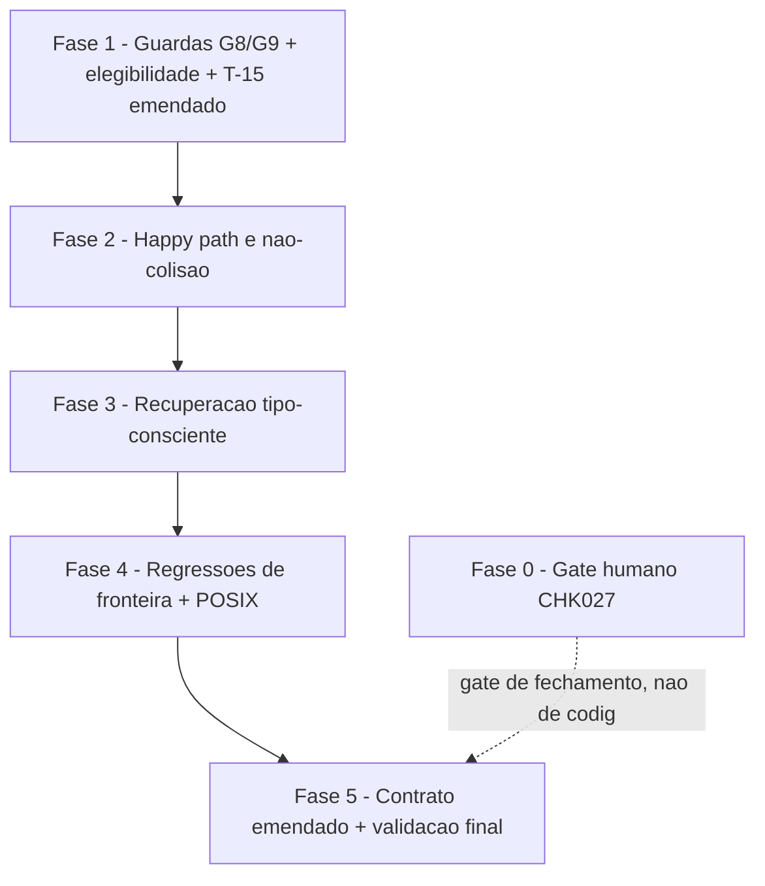

# Tarefas round-scoped-backups - Escopar `backups/` na rotacao de round

Escopo: corrigir a issue #150 fazendo `state-rounds.sh rotate` mover o
diretorio de snapshots de onda (`backups/`) para dentro do round preservado,
na mesma operacao atomica que ja move o estado transacional — preservando
auditoria de rounds anteriores apos reaberturas (`--reopen`) e garantindo
que roll-forward/roll-back e purge tratem `backups/` com as mesmas garantias
ja existentes para `state.json`/`state.db`.

**Legenda de status:**
- `[ ]` Pendente
- `[~]` Em andamento
- `[x]` Concluido
- `[!]` Bloqueado

**Legenda de criticidade:**
- `[C]` Critico - Impacto financeiro direto ou bloqueante
- `[A]` Alto - Funcionalidade essencial
- `[M]` Medio - Necessario mas sem urgencia imediata

---

## FASE 0 - Decisao de negocio pre-requisito (gate humano)

### 0.1 Aceitacao formal da perda historica irrecuperavel `[A]`

Ref: `docs/specs/round-scoped-backups/checklists/requirements.md` CHK027;
`spec.md` §Clarifications Q1; `plan.md` §Fora de escopo

Esta tarefa **nao e executavel por agente**. O checklist marcou CHK027 como
`{humano}`: a spec ja registra a decisao tecnica de clarify (sem mecanismo de
backfill), mas a aceitacao formal de que a perda dos snapshots das ondas 1-11
(rounds ja rotacionados antes desta correcao, issue #150) e definitiva —
sem expectativa futura de reparo — e julgamento de apetite de risco do dono
do produto, nao verificavel apenas com os artefatos.

- [x] 0.1.1 Apresentar ao dono do produto o gap documentado em `spec.md`
  §Edge Cases ("rounds que ja foram rotacionados antes desta correcao
  existir") e `plan.md` §Fora de escopo ("Backfill/reparo de rounds ja
  rotacionados sem snapshots")
- [x] 0.1.2 Obter aceite explicito (registro escrito — comentario na issue
  #150, ADR ou equivalente) de que a perda historica das ondas 1-11 e
  permanente e nenhum mecanismo de backfill sera construido
  <!-- aceite do dono do produto em 2026-08-21, via prompt interativo do
  command pai /feature-00c; registrado como dec-036 no state auditavel da
  execucao round-scoped-backups (ingerido na knowledge.db); este commit e o
  registro escrito equivalente -->
- [x] 0.1.3 Marcar CHK027 como `[x]` em
  `docs/specs/round-scoped-backups/checklists/requirements.md` citando a
  evidencia do aceite (link/data), **somente apos** o registro do item 0.1.2
  existir

**Gate**: a FASE 1 (implementacao) pode comecar em paralelo — o codigo em si
nao depende deste aceite, pois nao implementa backfill algum. Mas **fechar a
feature** (transicionar `review-task` para concluido) requer 0.1.3 marcada,
para que a auditoria trace no backlog que o risco de negocio foi assumido
por um humano, nao silenciosamente absorvido pelo agente.

---

## FASE 1 - Guardas de elegibilidade e montagem do conjunto movido (P1, P2)

### 1.1 Guarda G8 (anti-symlink + anti-TOCTOU) `[C]`

Ref: `plan.md` §Pontos de mudanca P2; `contracts/state-rounds-backups.md` §6
(G8); `data-model.md` Entity ConjuntoMovido; `state-rounds.sh` bloco
`# G4 (pre): state-dir nao-symlink` (linha ~404)

Impacto de seguranca (achado do gate `owasp-security`, low, defesa em
profundidade): um `backups/` symlinkado moveria o link para dentro do round,
quebrando o confinamento ao state-dir. Criticidade `[C]` porque a janela
TOCTOU e o vetor de ataque identificado no plan.

- [x] 1.1.1 No bloco de guardas pre-escrita do `rotate` (junto de `# G4
  (pre): state-dir nao-symlink`), adicionar checagem `[ -L
  "$_RT_STATE_DIR/backups" ]` ⇒ recusar com exit `1` antes de qualquer
  escrita (journal, staging)
- [x] 1.1.2 Adicionar re-assercao `[ ! -L ]` imediatamente antes do `mv` do
  item `backups` no passo `f` (laco de `mv`) — fecha a janela TOCTOU entre
  avaliacao de elegibilidade (1.2) e o deslocamento
- [x] 1.1.3 Apos o `mv`, assertar no staging `[ -d
  "$_RT_STAGING/backups" ] && [ ! -L "$_RT_STAGING/backups" ]`
- [x] 1.1.4 Escrever cenario T-25 em `tests/test_state-rounds.sh`
  (`backups/` symlink ⇒ `rotate` recusa; nenhum journal, nenhum staging,
  `rounds/r01` inexistente, `SD/state.db` intocado, alvo do symlink
  intocado) conforme `quickstart.md` T-25

### 1.2 Elegibilidade de `backups/` no CSV do journal `[A]`

Ref: `plan.md` §Pontos de mudanca P1; `contracts/state-rounds-backups.md` §2
(tabela Elegibilidade); `data-model.md` Entity ConjuntoMovido;
`state-rounds.sh` bloco `# backend + arquivos transacionais` (linha ~432)

- [x] 1.2.1 Apos montar `_RT_FILES_CSV` transacional (json/sqlite), avaliar
  elegibilidade de `backups`: existe (`[ -e ]`) && nao-symlink (`[ ! -L ]`,
  reusa a guarda de 1.1.1) && `ls -A1` no-vazio
- [x] 1.2.2 Quando elegivel, anexar `backups` ao **fim** do CSV
  `_RT_FILES_CSV` (itens transacionais primeiro, `backups` por ultimo —
  ordem normativa do data-model.md)
- [x] 1.2.3 Quando ausente ou vazio, NAO anexar — `rotate` conclui exit `0`
  sem tratar a ausencia/vazio como erro (FR-006); dir vazio permanece
  intocado na raiz
- [x] 1.2.4 Escrever cenario T-19 (`backups/` ausente: rotacao normal,
  `rounds/r01/backups` nao existe, nenhum erro em stderr) conforme
  `quickstart.md` T-19
- [x] 1.2.5 Escrever cenario T-20 (`backups/` vazio: nao vira dir vazio no
  round; `SD/backups` permanece na raiz; `recover` pos-rotate ⇒
  `RECOVER|none|-`) conforme `quickstart.md` T-20

### 1.3 Guarda G9 (permissao restritiva do `backups/` preservado) `[M]`

Ref: `plan.md` §Pontos de mudanca P2; `contracts/state-rounds-backups.md` §6
(G9); `data-model.md` Entity RoundPreservado

- [x] 1.3.1 Adicionar `chmod 700` best-effort (paridade com G7 — nao falhar
  a rotacao se `chmod` nao for suportado pelo filesystem) sobre
  `"$_RT_STAGING/backups"` apos o `mv`, antes do commit (passo `h1`)
- [x] 1.3.2 Escrever cenario T-28 (`SD/backups` com permissoes permissivas
  `755`/`644` pre-existentes ⇒ apos `rotate`, `rounds/r01/backups` com modo
  `700`; degrada sem falhar em filesystem sem suporte a `chmod`) conforme
  `quickstart.md` T-28

### 1.4 Emendar cenario T-15 (remove assercao que contradiz FR-001) `[A]`

Ref: `quickstart.md` §"T-15 (existente) — emenda, nao cenario novo";
`tests/test_state-rounds.sh` `scenario_T15_artefatos_nao_transacionais_permanecem`
(linha ~325)

**Ordem de execucao critica** (plan.md §Ordem de implementacao item 2): esta
subtarefa MUST rodar antes de 2.1, senao a suite fica vermelha durante toda
a FASE 1/2 restante e perde valor de sinal.

- [x] 1.4.1 Remover as duas linhas de `scenario_T15_artefatos_nao_transacionais_permanecem`
  que asserta `[ -f "$_sd/backups/wave-001.json" ]` apos `rotate` (o oposto
  de FR-001) — preservar `mkdir -p "$_sd/backups"` + `printf` da fixture
  como carga do cenario
- [x] 1.4.2 Manter integralmente as demais assercoes do cenario
  (`enforcement-log.jsonl`, `commit-baseline.txt`, `state-history/`,
  `.lock/`, e a assercao de nao-vazamento `[ ! -f
  "$_sd/rounds/r01/enforcement-log.jsonl" ]`)
- [x] 1.4.3 Rodar `./tests/run.sh test_state-rounds` isoladamente e
  confirmar T-15 verde apos a emenda (ainda sem P1/P2 implementados —
  cenario deve continuar passando pois so deixou de negar o comportamento
  novo, nao passou a exigi-lo)

---

## FASE 2 - Happy path e nao-colisao entre rounds (P1, P2 aplicados)

### 2.1 `rotate` move `backups/` para dentro do round (happy path) `[C]`

Ref: `spec.md` FR-001, SC-001; `quickstart.md` T-17; `plan.md` §Ordem de
implementacao item 3

Depende de: 1.1, 1.2, 1.4 (guardas montadas + T-15 corrigido).

- [x] 2.1.1 Confirmar que o passo `f` (laco de `mv` sobre `_RT_FILES_CSV`)
  ja move `backups` corretamente sem mudanca estrutural (o mesmo `mv --`
  move diretorio tao bem quanto arquivo quando o destino nao existe) — se
  precisar de ajuste (ex: `mv --` recusando por algum motivo especifico de
  diretorio), aplicar aqui
- [x] 2.1.2 Escrever cenario T-17: montar `SD` terminal (backend `sqlite`)
  com `backups/wave-001.json` e `wave-002.json` de conteudos distintos;
  `rotate`; assertar exit `0`, `rounds/r01/backups/wave-00{1,2}.json`
  `cmp`-identicos aos originais, `SD/backups` **nao existe mais**,
  `rounds/r01/state.db` presente
- [x] 2.1.3 No mesmo cenario T-17, assertar que stdout casa **exatamente**
  `ROUND|r01|sqlite|state.db|<id>|<status>` — regressao do consumidor
  `plugins/cstk/commands/feature-00c.md` §2.bis/7.c (nenhum campo novo)

### 2.2 Nao-colisao entre rounds sucessivos `[C]`

Ref: `spec.md` FR-002, SC-001; `quickstart.md` T-18

Impacto financeiro/auditoria direto — e o proprio defeito da issue #150;
criticidade `[C]`.

- [x] 2.2.1 Escrever cenario T-18: rotacionar um `SD` com
  `backups/wave-001.json` conteudo `A` ⇒ `r01`; recriar estado terminal +
  `backups/wave-001.json` conteudo `B`; `rotate` ⇒ `r02`
- [x] 2.2.2 Assertar `rounds/r01/backups/wave-001.json` continua com `A`
  (`cmp` contra fixture original) e `rounds/r02/backups/wave-001.json` tem
  `B` — zero sobrescrita entre rounds
- [x] 2.2.3 Rodar `./tests/run.sh test_state-rounds` e confirmar T-17/T-18
  verdes junto com toda a suite existente (T-01..T-16 emendado)

---

## FASE 3 - Recuperacao tipo-consciente (P3, P4)

### 3.1 Predicado de staging completo por tipo `[C]`

Ref: `plan.md` §Pontos de mudanca P3; `contracts/state-rounds-backups.md`
§5.2; `data-model.md` Entity JournalDeRotacao (tabela "Predicado de presenca
no staging"); `state-rounds.sh` `_sr_staging_complete` (linha ~163)

Criticidade `[C]`: base da recuperacao de rotacao interrompida — falha aqui
corrompe o layout do state-dir (FR-004, FR-008).

- [x] 3.1.1 Em `_sr_staging_complete`, alterar a iteracao sobre `FILES_CSV`
  para checar `backups` com `[ -d ]` e os demais nomes com `[ -f ]`
  (dispatch por nome literal, sem inferencia de tipo por `stat`)
- [x] 3.1.2 Escrever cenario T-21 (interrupcao apos staging completo,
  incluindo `backups/` completo no staging, `rounds/r01/` ainda inexistente
  ⇒ `recover` produz `RECOVER|forward|r01` exit `0`; segunda invocacao ⇒
  `RECOVER|none|-`, idempotente) conforme `quickstart.md` T-21

### 3.2 Validacao J4 admite `backups` como literal `[C]`

Ref: `plan.md` §Pontos de mudanca P4; `contracts/state-rounds-backups.md`
§5.1; `data-model.md` Entity JournalDeRotacao (regra J4); `state-rounds.sh`
`case "$_rc_f" in ...` dentro de `recover` (~linha 356 em diante)

Criticidade `[C]`: guarda contra journal adulterado apontando para caminhos
arbitrarios — regressao de seguranca se relaxada incorretamente (ver Risco
"J4 relaxada por engano" no plan.md).

- [x] 3.2.1 Adicionar `backups` ao `case` de validacao do conjunto fechado
  de `files` em `recover`, mantendo os literais existentes (`state.json`,
  `state.json.sha256`, `state.db`) — **nunca** substituir por padrao/glob
- [x] 3.2.2 Escrever cenario T-24: journal a mao com
  `files=state.db,../../etc/passwd` ⇒ exit `1`, mensagem "arquivo fora do
  fechado", nada movido (controle negativo); e journal com
  `files=state.db,backups` ⇒ **aceito** (controle positivo, prova que a
  ampliacao e por literal, nao por relaxamento) conforme `quickstart.md`
  T-24

### 3.3 Roll-back tipo-consciente de `backups/` (anti-aninhamento) `[C]`

Ref: `plan.md` §Pontos de mudanca P4, §Riscos (mv de diretorio aninha
silenciosamente); `contracts/state-rounds-backups.md` §5.3;
`state-rounds.sh` ramo `rollback` dentro de `recover` (linha ~359 em diante)

Criticidade `[C]`: evidencia empirica em Darwin (research.md Decision 5) de
que `mv` de diretorio sobre destino existente **aninha silenciosamente com
exit 0** — um sucesso falso que corromperia o state-dir numa rotina de
recuperacao. Merge e `rm -rf` do destino sao proibidos por contrato.

- [x] 3.3.1 No ramo `rollback`, antes de mover `backups` do staging de
  volta para a raiz, assertar `[ ! -e "$_RT_STATE_DIR/backups" ]`
- [x] 3.3.2 Se o destino esta ausente: `mv -- "<staging>/backups"
  "<state-dir>/backups"` (comportamento normal)
- [x] 3.3.3 Se o destino existe (qualquer tipo): **exit `1`** com
  diagnostico em stderr citando o destino existente; nada movido; staging
  e journal preservados para inspecao (nunca merge, nunca `rm -rf`)
- [x] 3.3.4 Escrever cenario T-22 (interrupcao no meio dos `mv`: `state.db`
  ja no staging, `backups/` ainda na raiz, journal `phase=moving` com
  `files=state.db,backups` ⇒ `RECOVER|rollback|r01` exit `0`; `SD/state.db`
  de volta na raiz; `SD/backups/` intacto; staging e journal removidos;
  `rounds/r01` inexistente; conjunto na raiz `cmp`-identico ao pre-rotacao)
  conforme `quickstart.md` T-22
- [x] 3.3.5 Escrever cenario T-23 (roll-back com `backups/` preexistente na
  raiz — estado anomalo — ⇒ exit `1` com diagnostico citando destino
  existente; **nenhum** `SD/backups/backups/` criado — assercao explicita
  anti-aninhamento; staging e journal preservados) conforme `quickstart.md`
  T-23

---

## FASE 4 - Regressoes de fronteira (purge, list) e conformidade POSIX

### 4.1 Purge do abort nao toca rounds preservados `[C]`

Ref: `spec.md` FR-005, SC-003; `quickstart.md` T-26; `plan.md` §Fora de
escopo ("Guarda defensiva nova no `--purge-backups`" — cobertura por teste,
nao por codigo novo, ja que o path ja e derivado de `AGENTE_00C_STATE_DIR` e
nao alcanca `rounds/`)

Criticidade `[C]`: e a User Story 2 da spec — sem esta garantia explicita, a
correcao da FASE 1-3 criaria um risco novo de perda de dados mais ampla.

- [x] 4.1.1 Escrever cenario T-26: montar `SD` com
  `rounds/r01/backups/wave-001.json` **e** `SD/backups/wave-001.json`
  (execucao corrente); executar o purge exatamente como
  `plugins/cstk/commands/feature-00c-abort.md` §8 faz (`rm -rf -- "$SD/backups"`)
- [x] 4.1.2 Assertar `SD/backups` removido e
  `rounds/r01/backups/wave-001.json` **intacto**, `cmp`-identico a fixture
- [x] 4.1.3 Confirmar (leitura, sem alterar codigo) que
  `plugins/cstk/commands/feature-00c-abort.md` §8 continua escopado a
  `"$AGENTE_00C_STATE_DIR/backups"` — nenhuma mudanca de codigo requerida
  nesta subtarefa, apenas o teste de regressao

### 4.2 `list` inalterado com round contendo `backups/` `[M]`

Ref: `contracts/state-rounds-backups.md` §1 (assinaturas de CLI
inalteradas); `quickstart.md` T-27

- [x] 4.2.1 Escrever cenario T-27: rotacionar um `SD` com snapshots (⇒
  `rounds/r01/backups/`); `SR list --state-dir "$SD"`; assertar exit `0` e
  exatamente uma linha no formato
  `r01|sqlite|state.db|<id>|<status>|<finished_at>` — presenca de
  `backups/` nao altera deteccao de backend nem numero de campos

### 4.3 Emenda do comentario/invariante T-06 `[M]`

Ref: `contracts/state-rounds-backups.md` §7; `state-rounds.sh` bloco `# T-06:`
que precede `rm -f -- "$_RT_TARGET/state.db-wal" ...` (linha ~568)

- [x] 4.3.1 Reescrever o comentario `# T-06:` em `state-rounds.sh` para
  refletir a intencao real (impedir sidecars WAL divergentes entre
  macOS/Ubuntu de entrar no round), nao mais "round contem so state.db"
  (que deixou de ser verdade com `backups/` sendo movido)
- [x] 4.3.2 Confirmar que o cenario T-06 existente em
  `tests/test_state-rounds.sh` continua verde com a formulacao "nao contem
  `state.db-wal` nem `state.db-shm`" (sem mudanca de asserts necessaria, so
  validacao de que a semantica bate)

### 4.4 Conformidade POSIX (shellcheck) `[A]`

Ref: `plan.md` Constitution Check Principio II; `quickstart.md` §"T-16
(existente) — cobre a conformidade POSIX"; `docs/constitution.md`
Principio II

- [x] 4.4.1 Rodar `shellcheck -s sh
  plugins/cstk/skills/agente-00c-runtime/scripts/state-rounds.sh` e
  confirmar zero erro/warning novo introduzido pelas mudancas das FASE 1-3
- [x] 4.4.2 Confirmar ausencia de bashismo/GNU-only nas linhas novas
  (`local`, arrays, `[[ ]]`, `ls --` flags GNU-only) — cenario T-16
  existente cobre isso automaticamente via `shellcheck -s sh`

---

## FASE 5 - Emenda do contrato base e validacao final

### 5.1 Emendar `docs/specs/feature-reopen/contracts/state-rounds.md` `[A]`

Ref: `spec.md` FR-003; `contracts/state-rounds-backups.md` (delta completo,
secoes 1-7); `plan.md` §Ordem de implementacao item 6

Depende de: FASE 1-4 concluidas (o contrato deve refletir o comportamento
JA implementado, nunca proposta nao verificada — Principio VI).

- [x] 5.1.1 Aplicar a emenda da tabela "Conjunto movido por backend"
  (§2 do delta): `backups/` entra como item movido para ambos os backends,
  com a tabela de elegibilidade
- [x] 5.1.2 Aplicar a emenda da lista "Nunca movidos" (§3 do delta):
  remover `backups/` dessa lista, mantendo os outros nove itens
- [x] 5.1.3 Aplicar a emenda da sequencia do `rotate` (§4 do delta): passos
  b2 (G8), b3 (elegibilidade), d/f (journal/mv incluindo backups)
- [x] 5.1.4 Aplicar a emenda de `recover` (§5 do delta): J4, staging
  completo, roll-back de `backups`, matriz de decisao
- [x] 5.1.5 Aplicar a emenda de guardas (§6 do delta): adicionar G8 e G9 a
  tabela G1..G7 do contrato base
- [x] 5.1.6 Aplicar a emenda do invariante T-06 (§7 do delta)
- [x] 5.1.7 Remover as marcacoes `[PROPOSTA]` do texto copiado — no
  contrato base emendado, o comportamento e REAL/em vigor, nao mais
  proposta

### 5.2 Validacao final da suite completa `[C]`

Ref: `plan.md` §Ordem de implementacao item 7; `CLAUDE.md` §Como testar
scripts shell

- [ ] 5.2.1 Rodar `./tests/run.sh test_state-rounds` isolado e confirmar
  T-01..T-28 (com T-15 emendado) 100% verdes
- [ ] 5.2.2 Rodar `./tests/run.sh --check-coverage` e confirmar que
  `state-rounds.sh` continua mapeado para `tests/test_state-rounds.sh` sem
  orfaos
- [ ] 5.2.3 Rodar a suite completa (`./tests/run.sh`, sem filtro) para
  garantir zero regressao em consumidores indiretos (`feature-00c.md`
  §2.bis/7.c, `feature-00c-abort.md` §8) que dependem do formato `ROUND|...`
  e do comportamento de purge

---

## Matriz de Dependencias

Nota: FASE 0 nao bloqueia tecnicamente FASE 1-4 (nenhuma delas implementa
backfill), mas bloqueia o fechamento da feature em `review-task` — ver FASE 0
§Gate.

## Resumo Quantitativo

| Fase | Tarefas | Subtarefas | Criticidade |
|------|---------|------------|-------------|
| 0 - Gate humano | 1 | 3 | A |
| 1 - Guardas e elegibilidade | 4 | 15 | C/A/M |
| 2 - Happy path e nao-colisao | 2 | 6 | C |
| 3 - Recuperacao tipo-consciente | 3 | 11 | C |
| 4 - Regressoes de fronteira + POSIX | 4 | 9 | C/M/A |
| 5 - Contrato emendado + validacao | 2 | 10 | A/C |
| **Total** | **16** | **54** | - |

## Escopo Coberto

| Item | Descricao | Fase |
|------|-----------|------|
| FR-001 | `rotate` move `backups/` para dentro do round na mesma operacao atomica | 1, 2 |
| FR-002 | Snapshots de rounds anteriores preservados sem sobrescrita apos reabertura | 2 |
| FR-003 | Contrato `state-rounds.md` atualizado refletindo o novo conjunto movido | 5 |
| FR-004 | `recover` (roll-forward/roll-back) suporta diretorio inteiro de `backups/` | 3 |
| FR-005 | Purge do abort restrito a `backups/` da execucao corrente, nunca rounds | 4 |
| FR-006 | `backups/` ausente ou vazio: rotacao conclui normalmente | 1 |
| FR-007 | Escritores de snapshot continuam gravando no mesmo local relativo | 4 (regressao, sem mudanca de codigo) |
| FR-008 | Atomicidade da rotacao preservada mesmo com `backups/` multi-arquivo | 1, 3 |
| G8 | Guarda anti-symlink + anti-TOCTOU sobre `backups/` | 1 |
| G9 | `chmod 700` best-effort no `backups/` preservado | 1 |
| CHK027 | Gate humano de aceitacao da perda historica (issue #150, ondas 1-11) | 0 |

## Escopo Excluido

| Item | Descricao | Motivo |
|------|-----------|--------|
| Backfill/reparo de rounds ja rotacionados sem snapshots | Reconstruir/recuperar ondas 1-11 da issue #150 | Decisao de clarify (spec §Clarifications Q1): capacidade nova, sem fonte recuperavel — perda historica documentada e permanente |
| Mudanca em qualquer escritor de snapshot | Orquestradores, `mcp/state-server/src/tools/close_wave.ts`, `feature-00c-abort.md` | FR-007 exige que continuem gravando em `<state-dir>/backups/wave-NNN.json` — sem mudanca |
| Guarda defensiva nova no codigo do `--purge-backups` | Alterar `feature-00c-abort.md` §8 | Path ja derivado de `AGENTE_00C_STATE_DIR`, nao alcanca `rounds/`; cobertura via teste (FASE 4.1), nao codigo novo |
| Compactacao/retencao dos snapshots dentro dos rounds | Limitar crescimento de `rounds/*/backups/` | Fora da spec; rounds crescem monotonicamente por desenho da `feature-reopen` |
| Fechar G6 (lock com liveness fraca) | Reforcar deteccao de lock morto | Divida ja registrada no contrato base `feature-reopen`, independente desta feature |
