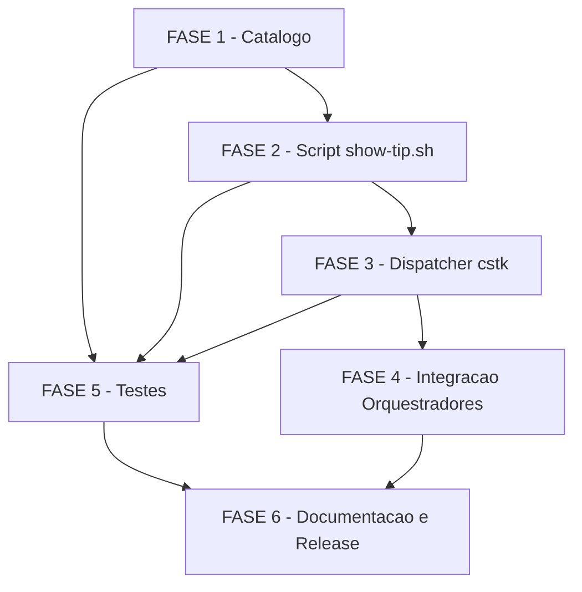

# Backlog: show-tips

**Feature**: `show-tips`
**Spec**: [spec.md](./spec.md) | **Plan**: [plan.md](./plan.md) | **Research**: [research.md](./research.md)
**Created**: 2026-05-27
**Scope**: CLI POSIX para exibicao de dicas das skills do toolkit — catalogo, mecanismo, integracao e testes.

## Legendas

### Status
- `[ ]` Pendente
- `[x]` Concluido
- `[~]` Em andamento
- `[!]` Bloqueado

### Criticidade
- `[C]` Critico — impacto direto em CI, contrato de outros componentes, ou confiabilidade do pipeline
- `[A]` Alto — funcionalidade core sem a qual a feature nao opera
- `[M]` Medio — necessario mas adiavel sem impacto imediato

---

## FASE 1 - Catalogo de Dicas

> Fonte de conteudo da feature. Deve existir antes do mecanismo de exibicao
> para que testes possam ser escritos contra dados reais.
> Ref: spec §FR-001, §FR-002, §FR-007, §FR-008; plan §Technical Context

### 1.1 Estrutura do catalogo `tips/catalog.md` [A]

Ref: spec §FR-007, data-model.md §Entity:Tip, research.md Decision 2

- [x] 1.1.1 Criar diretorio `tips/` na raiz do repositorio
- [x] 1.1.2 Criar `tips/catalog.md` com cabecalho de formato e instrucoes para mantenedor (encoding UTF-8, separador exato `---`, campos obrigatorios)
- [x] 1.1.3 Documentar o formato de entrada no cabecalho: `skill:`, `category:` (enum: uso|gotcha|avancado), `text:` (max 2 frases), corpo com exemplos em fence de codigo
- [x] 1.1.4 Incluir uma entrada de exemplo comentada mostrando frontmatter + corpo com fence de codigo
- [x] 1.1.5 Verificar que o arquivo e parseavel por `awk` POSIX (testar leitura manual com script de prova de conceito)

### 1.2 Dicas para skills globais (23 skills) [A]

Ref: spec §FR-002, §SC-001; plan §Technical Context (23 skills em `global/skills/`)
Skills: advisor, agente-00c-runtime, analyze, apply-insights, briefing, bugfix, checklist, clarify, constitution, create-tasks, create-use-case, decision-tree, execute-task, image-generation, initialize-docs, model-selector, owasp-security, plan, review-features, review-task, specify, validate-docs-rendered, validate-documentation

- [x] 1.2.1 Adicionar >= 2 dicas (categorias `uso` + `gotcha`) para cada uma das 23 skills globais — cada dica com >= 1 exemplo concreto
- [x] 1.2.2 Verificar que nenhuma skill global ficou sem entrada (contagem manual: 23 skills × 2 = 46 entradas minimas)
- [x] 1.2.3 Adicionar pelo menos 1 dica categoria `avancado` para as 5 skills de maior uso (review-task, execute-task, specify, plan, bugfix)

### 1.3 Dicas para skills Go (7 skills) [A]

Ref: spec §FR-002, §SC-001; plan §Technical Context (7 skills em `language-related/go/skills/`)
Skills: commit, go-add-consumer, go-add-entity, go-add-migration, go-add-test, go-review-pr, go-review-service

- [x] 1.3.1 Adicionar >= 2 dicas (categorias `uso` + `gotcha`) para cada uma das 7 skills Go — cada dica com >= 1 exemplo concreto
- [x] 1.3.2 Verificar cobertura: 7 skills × 2 = 14 entradas minimas

### 1.4 Dicas para skills .NET (8 skills) [A]

Ref: spec §FR-002, §SC-001; plan §Technical Context (8 skills em `language-related/dotnet/skills/`)
Skills: dotnet-create-entity, dotnet-create-feature, dotnet-create-project, dotnet-create-test, dotnet-hexagonal-architecture, dotnet-infrastructure, dotnet-review-code, dotnet-testing

- [x] 1.4.1 Adicionar >= 2 dicas (categorias `uso` + `gotcha`) para cada uma das 8 skills .NET — cada dica com >= 1 exemplo concreto
- [x] 1.4.2 Verificar cobertura: 8 skills × 2 = 16 entradas minimas

### 1.5 Validacao inicial do catalogo [C]

Ref: spec §SC-001, §SC-004; contracts/cli-show-tip.md §Modo audit

- [x] 1.5.1 Executar `grep -c "^skill:" tips/catalog.md` e confirmar >= 76 entradas (23+7+8 × 2 minimo)
- [x] 1.5.2 Verificar que nenhuma entrada tem `category:` fora do enum (grep para valores != uso|gotcha|avancado)
- [x] 1.5.3 Verificar que nenhuma entrada tem corpo vazio (sem linha de exemplo apos o frontmatter)

---

## FASE 2 - Script de Exibicao `cli/lib/show-tip.sh`

> Mecanismo core da feature. POSIX sh puro, fail-silent, selecao pseudoaleatoria.
> Ref: spec §FR-003, §FR-004, §FR-005, §FR-006; contracts/cli-show-tip.md; research.md Decision 1

### 2.1 Scaffold e estrutura do script [A]

Ref: plan §Project Structure; contracts/cli-show-tip.md §Convencoes herdadas

- [x] 2.1.1 Criar `cli/lib/show-tip.sh` com shebang `#!/bin/sh`, `set -eu`, bloco de comentario descritivo
- [x] 2.1.2 Implementar resolucao do diretorio de lib e path do catalogo (padrao `tips/catalog.md` relativo a raiz; override por `--catalog PATH`)
- [x] 2.1.3 Implementar parsing de argumentos: `[SKILL]` posicional, `--phase FASE`, `--audit`, `--catalog PATH`, `-h`/`--help`
- [x] 2.1.4 Garantir que todo output de erro/diagnostico vai para stderr; dados (Tip Block, relatorio) vao para stdout
- [x] 2.1.5 Executar `shellcheck -s sh cli/lib/show-tip.sh` e confirmar zero warnings

### 2.2 Parser POSIX do catalogo (maquina de estados awk) [A]

Ref: research.md Decision 2; contracts/cli-show-tip.md §Seguranca (A05)

- [x] 2.2.1 Implementar funcao `_parse_catalog` em `awk` com maquina de estados: estados `out` / `frontmatter` / `body`; transicao em linha `---` isolada
- [x] 2.2.2 Extrair campos `skill`, `category`, `text` do frontmatter via regex `^skill: `, `^category: `, `^text: ` — valores passados como variavel `-v skill="$SKILL"` (NUNCA interpolados no programa awk — OWASP A05)
- [x] 2.2.3 Acumular corpo (exemplos) ate o proximo `---`; tratar linhas de fence (```) como corpo opaco
- [x] 2.2.4 Implementar filtro por `skill` (quando SKILL fornecido) usando `-v` para prevenir injecao de codigo awk; usar `grep -F` para match literal de nome de skill
- [x] 2.2.5 Retornar lista de entradas candidatas (indices 0..N-1) para o mecanismo de selecao

### 2.3 Selecao pseudoaleatoria POSIX [A]

Ref: research.md Decision 1; spec §FR-003; contracts/cli-show-tip.md §Selecao da dica
DECISAO DEFERIDA CHK031 — fallback sem /dev/urandom: usar `date +%s | awk` como fallback POSIX

- [x] 2.3.1 Implementar `_rng_pick N`: leia 4 bytes de `/dev/urandom` via `od -An -N4 -tu4 /dev/urandom` e use como seed para `awk 'BEGIN{srand(SEED); print int(rand()*N)}'`
- [x] 2.3.2 Implementar fallback: quando `/dev/urandom` indisponivel (test -r falhar), usar `date +%s` como seed: `awk -v n="$N" 'BEGIN{srand(); print int(rand()*n)}'`
- [x] 2.3.3 Garantir que `_rng_pick N` com N=0 retorna vazio (sem divisao por zero — catalogo vazio)
- [x] 2.3.4 Garantir que `_rng_pick N` com N=1 retorna 0 (unica entrada disponivel, sem operacao RNG desnecessaria)
- [x] 2.3.5 Testar empiricamente: 5 invocacoes consecutivas produzem indices variados (nao todos iguais)

### 2.4 Mapeamento fase→skill (`--phase`) [M]

Ref: contracts/cli-show-tip.md §Argumentos; data-model.md §Entity:Display Trigger

- [x] 2.4.1 Implementar tabela de mapeamento `fase → skill` (case list POSIX): specify→specify, clarify→clarify, plan→plan, create-tasks→create-tasks, execute-task→execute-task, review-task→review-task, checklist→checklist
- [x] 2.4.2 Implementar fallback aleatorio global quando fase nao mapeada ou SKILL nao encontrada no catalogo (FR-010)
- [x] 2.4.3 Garantir que `--phase` e `SKILL` posicional sao mutuamente complementares (SKILL prevalece se ambos presentes)

### 2.5 Formatacao do Tip Block (FR-004) [A]

Ref: contracts/cli-show-tip.md §Saida de sucesso; spec §FR-004
DECISAO DEFERIDA CHK032 — delimitadores ASCII apenas, sem ANSI: linhas `========` e `--------`

- [x] 2.5.1 Implementar `_format_tip`: linha superior `========...`, cabecalho ` Dica: skill \`SKILL\`  [CATEGORY]`, separador `--------...`, corpo com texto e exemplos identados, linha inferior `========...`
- [x] 2.5.2 Garantir largura fixa de 56 caracteres para os separadores (largura portavel em terminais 80 colunas)
- [x] 2.5.3 Garantir que caracteres especiais Markdown (backtick, asterisco) no corpo nao corrompem a saida de terminal
- [x] 2.5.4 Garantir que saida e identica em TTY e pipe (sem deteccao de TTY nesta fase — CHK032 resolvido: sem ANSI)

### 2.6 Fail-silent e tratamento de erros (FR-006) [C]

Ref: spec §FR-006, §SC-003; contracts/cli-show-tip.md §Exit codes

- [x] 2.6.1 Envolver toda logica de leitura de catalogo em `|| true` ou subshell com redirect `2>/dev/null`: catalogo ausente = stdout vazio, exit 0
- [x] 2.6.2 Implementar comportamento diferenciado para skill sem dicas: modo automatico (`--phase` ou sem args) → stdout vazio, exit 0; modo explicito (SKILL fornecido pelo usuario) → mensagem amigavel em stdout + lista de skills disponiveis, exit 0
- [x] 2.6.3 Garantir que nenhum `exit N` com N != 0 existe no caminho de exibicao (modo nao-audit)
- [x] 2.6.4 Testar cenario de catalogo ausente: `show-tip.sh --catalog /nao/existe` deve retornar exit 0 e stdout vazio

### 2.7 Modo `--audit` (SC-004) [A]

Ref: spec §SC-004; contracts/cli-show-tip.md §Modo audit; research.md Decision 4

- [x] 2.7.1 Implementar descoberta dinamica do universo de skills: `find global/skills -maxdepth 1 -mindepth 1 -type d | xargs -I{} basename {}` + `find language-related -name SKILL.md -exec dirname {} \; | xargs -I{} basename {}`
- [x] 2.7.2 Implementar contagem de entradas por skill no catalogo via `awk` (agrupar por valor de `skill:`)
- [x] 2.7.3 Implementar cross-check universo vs catalogo: listar skills com < 2 entradas ou sem categorias `uso`+`gotcha`
- [x] 2.7.4 Retornar exit 0 quando cobertura completa; exit 1 com lista de gaps em stdout quando incompleta; exit 2 para uso incorreto

### 2.8 Funcao `show_tip_main` (entry point) [A]

Ref: contracts/cli-show-tip.md §Despacho; plan §Project Structure

- [x] 2.8.1 Implementar `show_tip_main "$@"` como funcao de entrada; script pode ser tanto sourced (por cstk) quanto invocado diretamente
- [x] 2.8.2 Garantir idempotencia de sourcing: guard `_SHOW_TIP_LOADED` analogamente a `recall.sh`
- [x] 2.8.3 Testar invocacao direta `sh cli/lib/show-tip.sh --help` e sourced via `cli/cstk show-tip --help`

---

## FASE 3 - Integracao no Dispatcher `cli/cstk`

> Adicionar `show-tip` como subcomando reconhecido pelo dispatcher.
> Ref: contracts/cli-show-tip.md §Despacho; plan §Project Structure

### 3.1 Registro do subcomando no dispatcher [A]

Ref: plan §Project Structure; contratos herdados de `cstk recall`

- [x] 3.1.1 Adicionar `show-tip)` ao `case` do `_dispatch` em `cli/cstk`, seguindo o padrao exato de `recall)` (resolve `cli/lib/show-tip.sh`, source, chama `show_tip_main "$@"`)
- [x] 3.1.2 Adicionar `show-tip` a lista de comandos validos na mensagem de erro de comando desconhecido (`printf 'Comandos validos: ...'`)
- [x] 3.1.3 Adicionar entrada de help em `_cmd_help` para `show-tip` (uma linha descritiva, referencia ao contrato)
- [x] 3.1.4 Testar `cstk show-tip --help` retorna descricao e sai com exit 0
- [x] 3.1.5 Testar `cstk show-tip` (sem args) retorna um Tip Block ou string vazia, exit 0

---

## FASE 4 - Integracao com Orquestradores

> Ponto de gatilho automatico no inicio de onda (US1/US4).
> DECISAO DE ESCOPO (research.md Decision 3): a invocacao e EXPLICITA pelo orquestrador
> (nao hook automatico do runtime), preservando Principio IV e blast radius limitado.
> Ref: spec §US1, §US4; contracts/cli-show-tip.md §Contrato de integracao com orquestrador

### 4.1 Integracao no `agente-00c-orchestrator` [M]

Ref: spec §US4; contracts/cli-show-tip.md §Contrato de integracao

- [x] 4.1.1 Identificar o ponto exato no Loop principal do `agente-00c-orchestrator.md` onde a dica deve ser exibida (apos `state-ondas.sh start`, antes do primeiro Skill())
- [x] 4.1.2 Adicionar invocacao fail-silent ao orchestrator: `TIP=$(cstk show-tip --phase "$FASE" 2>/dev/null) || TIP=""; [ -n "$TIP" ] && printf '%s\n' "$TIP"`
- [x] 4.1.3 Verificar que a invocacao nao bloqueia nem introduz dependency de `show-tip.sh` como MUST — deve ser `|| TIP=""` sempre
- [x] 4.1.4 Testar que uma onda completa com `cstk show-tip` ausente/inacessivel nao falha (SC-003)

### 4.2 Integracao no `feature-00c-orchestrator` [M]

Ref: spec §US4; contracts/cli-show-tip.md §Contrato de integracao

- [x] 4.2.1 Identificar o ponto equivalente no `agente-00c-feature-orchestrator.md` (Loop principal, apos start da onda)
- [x] 4.2.2 Adicionar invocacao fail-silent identica ao padrao de 4.1.2
- [x] 4.2.3 Verificar que a invocacao respeita FR-006 (nao interrompe onda)

---

## FASE 5 - Testes Automatizados

> Cobertura de testes para o mecanismo, catalogo e integracao.
> Ref: plan §Testing; spec §SC-002, §SC-003, §SC-004; quickstart.md

### 5.1 Setup do arquivo de testes [A]

Ref: plan §Testing; convencao `tests/cstk/test_<nome>.sh`

- [x] 5.1.1 Criar `tests/cstk/test_show-tip.sh` com shebang `#!/bin/sh`, imports de helpers de teste (padrão do projeto) e estrutura de `it_<scenario>` / `assert_*`
- [x] 5.1.2 Verificar que o arquivo e descoberto automaticamente por `tests/run.sh` (ou adicionar entry explícita no run.sh, seguindo o padrao de `test_recall.sh`)
- [x] 5.1.3 Adicionar `test_show-tip.sh` a qualquer lista de exclusao de CI slow se aplicavel (verificar convencao em `tests/run.sh`)

### 5.2 Testes do mecanismo de exibicao [A]

Ref: spec §US1, §US3; contracts/cli-show-tip.md; quickstart.md

- [x] 5.2.1 Teste: invocacao sem args com catalogo de fixture retorna exit 0 e stdout nao-vazio (dica selecionada)
- [x] 5.2.2 Teste: invocacao com `--catalog /nao/existe` retorna exit 0 e stdout vazio (fail-silent FR-006)
- [x] 5.2.3 Teste: invocacao com SKILL presente no catalogo retorna dica daquela skill
- [x] 5.2.4 Teste: invocacao com SKILL ausente do catalogo (modo automatico `--phase`) retorna exit 0 e stdout vazio
- [x] 5.2.5 Teste: invocacao com SKILL ausente do catalogo (modo explicito) retorna mensagem amigavel em stdout e exit 0
- [x] 5.2.6 Teste: invocacao com `--phase specify` retorna dica da skill `specify` (mapeamento fase→skill)
- [x] 5.2.7 Teste: invocacao com `--phase fase-inexistente` retorna exit 0 (fallback aleatorio, nao erro)
- [x] 5.2.8 Teste: 3 invocacoes consecutivas com catalogo de N>1 entradas nao retornam todas a mesma dica (variacao RNG)

### 5.3 Testes do modo `--audit` [A]

Ref: spec §SC-004; contracts/cli-show-tip.md §Modo audit

- [x] 5.3.1 Teste: `--audit` com catalogo completo (fixture cobrindo todas as skills de teste) retorna exit 0
- [x] 5.3.2 Teste: `--audit` com catalogo incompleto (skill sem 2 dicas) retorna exit 1 e stdout lista a skill faltante
- [x] 5.3.3 Teste: `--audit` com catalogo ausente retorna exit 1 (catalogo ausente = cobertura 0%)

### 5.4 Testes de seguranca POSIX (prevencao de injecao A05) [C]

Ref: contracts/cli-show-tip.md §Seguranca (A05)

- [x] 5.4.1 Teste: SKILL com metacaracteres awk (`; print "INJECTED"`) nao injeta codigo — saida nao contem "INJECTED"
- [x] 5.4.2 Teste: SKILL com metacaracteres shell (`;`, `$(...)`, backtick) e passado literalmente sem execucao
- [x] 5.4.3 Teste: `--catalog` com path contendo espacos e caracteres especiais e tratado com aspas corretas

### 5.5 Lint estatico [C]

Ref: plan §Testing; constitution §Quality Standards

- [x] 5.5.1 Executar `shellcheck -s sh cli/lib/show-tip.sh` e confirmar zero warnings ou errors
- [x] 5.5.2 Verificar que `show-tip.sh` passa no workflow `.github/workflows/shellcheck.yml` existente
- [x] 5.5.3 Executar `shellcheck -s sh tests/cstk/test_show-tip.sh` e confirmar zero warnings

### 5.6 Teste de performance (SC-002) [M]

Ref: spec §SC-002 (<1s por invocacao)

- [x] 5.6.1 Medir tempo de `cstk show-tip` com catalogo completo (76+ entradas) em macOS e ubuntu CI: `time cstk show-tip`
- [x] 5.6.2 Confirmar que tempo wall-clock e < 1s em ambos os ambientes (dado empirico para SC-002)

---

## FASE 6 - Documentacao e Release

> CHANGELOG, versao MINOR, notas para mantenedor.
> Ref: plan §Proximos Passos; constitution §Quality: SemVer + CHANGELOG

### 6.1 Entrada no CHANGELOG (MINOR) [M]

Ref: constitution §Quality: SemVer + CHANGELOG; CHANGELOG.md (formato Keep a Changelog)

- [x] 6.1.1 Determinar proximo numero de versao MINOR (atual: `0.0.0-dev` em dev, ultima release `4.4.0` → proxima: `4.5.0`)
- [x] 6.1.2 Adicionar secao `## [4.5.0] - YYYY-MM-DD` no `CHANGELOG.md` com entradas `### Added` descrevendo: `cstk show-tip` subcomando, `tips/catalog.md`, `cli/lib/show-tip.sh`, integracao nos orquestradores
- [x] 6.1.3 Verificar que a entrada do CHANGELOG segue o formato Keep a Changelog do projeto (nao emojis, texto em portugues, bullets concisos)

### 6.2 Atualizacao do `VERSION` [M]

Ref: CHANGELOG.md; contracts/cli-show-tip.md §Summary

- [x] 6.2.1 Atualizar `cli/VERSION` de `0.0.0-dev` para o numero da release (quando no branch de release) — nao alterar em branch de feature
- [x] 6.2.2 Verificar que `CSTK_EMBEDDED_VERSION` em `cli/cstk` esta sincronizado com `cli/VERSION` (boot-check da FR-006c)

### 6.3 Documentacao para mantenedor [M]

Ref: spec §SC-005 (< 5 min para adicionar dica); spec §FR-008

- [x] 6.3.1 Adicionar secao "Como adicionar dicas" em `tips/catalog.md` (cabecalho explicando o formato, campos obrigatorios e exemplo completo)
- [x] 6.3.2 Verificar que `docs/specs/show-tips/quickstart.md` esta atualizado com o fluxo de uso de `cstk show-tip` (ja criado na onda-003; apenas revisar se reflete a implementacao final)

---

## Matriz de Dependencias



**Detalhes de dependencia**:
- FASE 2 depende de FASE 1 (catalogo deve existir para testes manuais durante desenvolvimento)
- FASE 3 depende de FASE 2 (dispatcher so adiciona o case quando o script existe)
- FASE 4 depende de FASE 3 (orquestradores invocam via `cstk show-tip`, nao path direto)
- FASE 5 pode comecar em paralelo com FASE 2 (fixtures de teste criadas independentemente do catalogo real); testes de auditoria (5.3) dependem de FASE 1
- FASE 6 depende de FASE 4 e FASE 5 (release so apos testes passando)

**Caminho critico**: FASE 1 → FASE 2 → FASE 3 → FASE 4 → FASE 5 → FASE 6

---

## Resumo Quantitativo

| Fase | Descricao | Tarefas | Subtarefas | Criticas [C] | Altas [A] | Medias [M] |
|------|-----------|---------|------------|--------------|-----------|------------|
| 1 | Catalogo de Dicas | 5 | 16 | 1 | 3 | 1 |
| 2 | Script show-tip.sh | 8 | 38 | 2 | 5 | 1 |
| 3 | Dispatcher cstk | 1 | 5 | 0 | 1 | 0 |
| 4 | Integracao Orquestradores | 2 | 7 | 0 | 0 | 2 |
| 5 | Testes Automatizados | 6 | 26 | 2 | 3 | 1 |
| 6 | Documentacao e Release | 3 | 9 | 0 | 0 | 3 |
| **Total** | | **25** | **101** | **5** | **12** | **8** |

---

## Escopo Coberto

- Catalogo de dicas `tips/catalog.md` (Markdown + frontmatter YAML, 38 skills, >= 76 entradas)
- Script POSIX `cli/lib/show-tip.sh` com parser awk, RNG POSIX, formatacao de Tip Block
- Subcomando `cstk show-tip` no dispatcher
- Modo `--audit` para validacao de cobertura (SC-004)
- Integracao explicita nos orquestradores `agente-00c` e `feature-00c` (inicio de onda)
- Testes automatizados em `tests/cstk/test_show-tip.sh` (cenarios de exibicao, audit, seguranca, lint, performance)
- Entrada CHANGELOG versao MINOR 4.5.0

## Escopo Excluido

- Hook automatico de integracao (research.md Decision 3 — acoplamento desnecessario; integracao e invocacao explicita)
- Cores ANSI / deteccao de TTY (CHK032 resolvido: ASCII apenas nesta versao)
- Estado persistente entre sessoes (sem historico de dicas vistas — aceito por design, spec §Edge Cases)
- Atualizacao automatica do catalogo quando nova skill e adicionada (SC-004/`--audit` detecta o gap; adicao e manual, SC-005)
- Subcomando dedicado `cstk show-tip --list-skills` (coberto indiretamente por `--audit`)
- Traducao de dicas (catalogo em portugues, idioma do toolkit)
- Integracao com sistema de notificacao ou output HTML

---

## Notas de Implementacao

### Resolucao CHK036/037 (conflito FR-006 vs US3 cenario 2)

**DECISAO**: dois modos operacionais distintos, sem conflito:
- Modo automatico (onda, `--phase`, sem args): FR-006 prevalece — fail-silent absoluto, stdout vazio, exit 0
- Modo sob-demanda explicito (SKILL fornecido pelo usuario): mensagem amigavel em stdout ("Sem dicas cadastradas para `<skill>`. Skills disponiveis: ...") + exit 0

Detectar o modo: se `$SKILL` foi passado como argumento posicional pelo usuario, ativar modo sob-demanda; se veio de mapeamento `--phase`, modo automatico.

### Resolucao CHK031 (fallback sem /dev/urandom)

Fallback implementado em 2.3.2: `date +%s | awk 'BEGIN{...}'` — POSIX puro (sem bash-isms, `date +%s` e POSIX.1-2008). Documentado em research.md como fallback aceitavel (frequencia de invocacao real baixa torna colisao improvavel em ambientes sem `/dev/urandom`).

### Resolucao CHK032 (cor/mono no terminal)

Delimitadores ASCII puro: `========` (56 chars) e `--------` (56 chars). Sem escape ANSI, sem deteccao de TTY. Renderizavel em qualquer terminal, pipe ou captura de stdout pelo orquestrador. Consistente com o contrato de integracao (contracts/cli-show-tip.md §Saida de sucesso).
