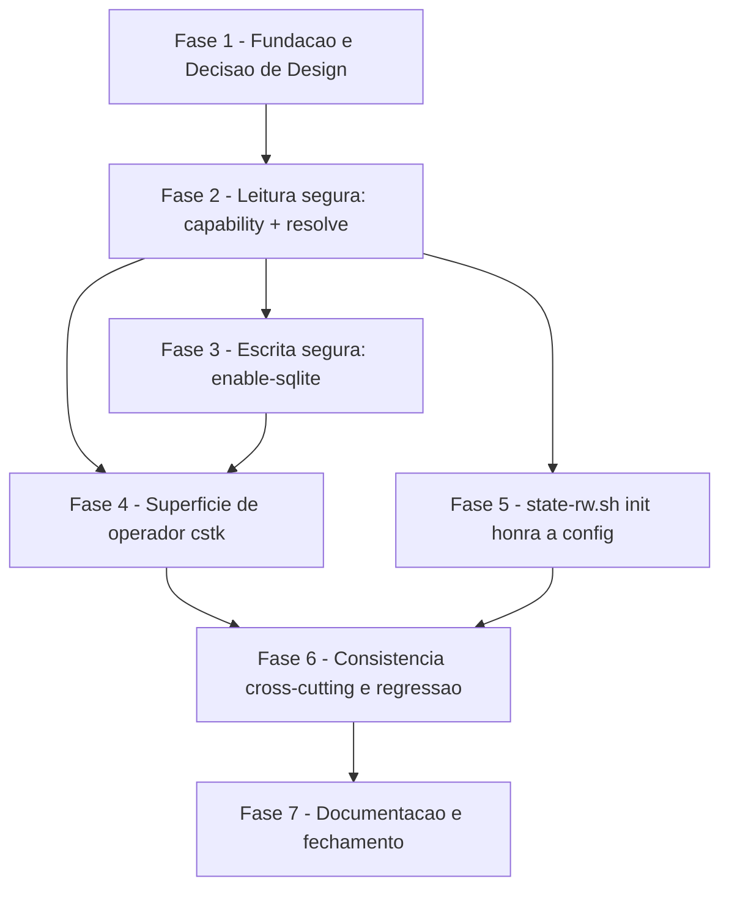

# Tarefas Configuração de Backend do state.db - Cutover Fase 2

Escopo: introduzir a configuração global por-usuário `~/.claude/cstk/config`,
o comando `cstk state enable-sqlite` (ativação com fail-fast), o diagnóstico
`cstk doctor --deps` (gate de CI) e o consumo dessa configuração por
`state-rw.sh init` — fechando o cutover iniciado pela `state-db-foundation`
(Fase 1, `v6.0.0-alpha.1`). Fonte única de leitura em
`global/skills/agente-00c-runtime/scripts/state-backend.sh` (research.md
Decision 2), à qual o binário `cstk` delega via `cli/lib/config.sh`.

**Legenda de status:**
- `[ ]` Pendente
- `[~]` Em andamento
- `[x]` Concluido
- `[!]` Bloqueado

**Legenda de criticidade:**
- `[C]` Critico - Impacto financeiro direto ou bloqueante
- `[A]` Alto - Funcionalidade essencial
- `[M]` Medio - Necessario mas sem urgencia imediata

---

## FASE 1 - Fundação e Decisão de Design

### 1.1 Decisão de design: conteúdo da mensagem de diagnóstico do `enable-sqlite` `[A]`

Ref: checklists/security.md CHK010 (`[Conflict]`); contracts/state-backend-runtime.md
P8; contracts/cli-surface.md §Diagnósticos de recusa; plan.md §SEC-03

Resolve o `[Conflict]` do CHK010: nem `FR-004A` nem a tabela "Diagnósticos de
recusa" de `cli-surface.md` listam hoje "caminho validado" como conteúdo
obrigatório da mensagem, embora P8/SEC-03 exijam isso. Esta tarefa fecha essa
lacuna com uma decisão concreta ANTES de codificar `enable-sqlite` (FASE 3).

- [x] 1.1.1 Decidir e registrar (Decisão auditável) o formato literal: toda
      mensagem de `enable-sqlite` (sucesso e recusa por "Runtime incapaz")
      MUST citar explicitamente qual caminho foi validado —
      `<catalogo-instalado|arvore-do-repo>` + path absoluto — usando o
      template `cstk state enable-sqlite: capability verificado via <origem>
      (<path>)`, seguido da linha de resultado (ativação/no-op) ou da
      instrução `cstk update`/`cstk self-update` (FR-004A, texto literal)
- [x] 1.1.2 Atualizar `contracts/cli-surface.md` — tabela "Diagnósticos de
      recusa" (caso "Runtime incapaz") passa a incluir "caminho validado
      (repo vs catálogo instalado)" como conteúdo obrigatório; a seção
      "Comportamento" (caminho de sucesso) passa a mencionar a mesma linha
- [x] 1.1.3 Atualizar `contracts/state-backend-runtime.md` — nota de P8
      (linhas próximas a L147-150) referenciando a decisão acima e removendo
      o `[Conflict]`
- [x] 1.1.4 Marcar CHK010 como resolvido em `checklists/security.md`
      (`[x]`), citando os dois artefatos atualizados acima

### 1.2 Scaffold do script `state-backend.sh` (novo) `[A]`

Ref: research.md Decision 1, Decision 2; contracts/state-backend-runtime.md
(caminho projetado); data-model.md §BackendConfig

- [x] 1.2.1 Criar `global/skills/agente-00c-runtime/scripts/state-backend.sh`
      com header POSIX (`#!/bin/sh`) e dispatcher de subcomandos
      (`capability`, `resolve`, `enable-sqlite`), seguindo o padrão de
      header/usage/`_log.sh` dos demais scripts do runtime
- [x] 1.2.2 Declarar como constantes únicas no topo do script: a versão
      mínima exigida de `sqlite3` (`3.45.1` — research.md Decision 4, piso
      herdado de `docs/specs/state-db-foundation/research.md:320-336`, NÃO
      da constitution — ver correção de citação em spec.md FR-003) e o token
      de capability versionado (research.md Decision 5)
- [x] 1.2.3 Implementar comparação numérica campo-a-campo de versão
      (`IFS='.'`, expansão de parâmetro; sem `sort -V`, sem `awk`) — research.md
      Decision 4
- [x] 1.2.4 Aplicar o GOTCHA `set -e` + captura (forma
      `if x=$(cmd); then ... else ... fi`, nunca `x=$(cmd); rc=$?`) em toda
      captura de saída externa (`sqlite3 --version`, resolução de path) —
      research.md Decision 8

---

## FASE 2 - Leitura segura da config: `capability` + `resolve`

### 2.1 Parsing seguro do arquivo de config (P1, P2, P5) `[C]`

Ref: contracts/state-backend-runtime.md P1/P2/P5; plan.md §SEC-01;
checklists/security.md CHK001, CHK003, CHK004

- [x] 2.1.1 Implementar parser linha-a-linha SEM `.`/`source`/`eval` sobre o
      arquivo de config (P1) — split no primeiro `=` via expansão de
      parâmetro, nunca `eval`
- [x] 2.1.2 Tratar `#` no início da linha como comentário, linha em branco
      ignorada, linha sem `=` marca a config inteira como inválida (P2)
- [x] 2.1.3 Citar toda expansão de variável (`"$var"`), sem exceção (P5)
- [x] 2.1.4 Confirmar que `.shellcheckrc`/`shellcheck.yml` (glob `**/*.sh`,
      sem exclusão para `agente-00c-runtime/scripts/`) cobrem
      `state-backend.sh` automaticamente, e rodar `shellcheck` local
      confirmando 0 achados `SC2086` (variável não citada) — critério
      objetivo e automatizável para P5, resolve CHK004 (nenhum mecanismo
      novo de lint necessário; o advisory existente já cobre o arquivo por
      ser `.sh` sob o repositório)
- [x] 2.1.5 Criar `tests/test_state-backend.sh` cobrindo parsing: comentário
      ignorado, linha em branco ignorada, linha sem `=` invalida a config

### 2.2 Validação de valor e allowlist (P3, P4) `[C]`

Ref: contracts/state-backend-runtime.md P3/P4; data-model.md §BackendConfig;
checklists/security.md CHK002, CHK006, CHK007

- [x] 2.2.1 Validar `state_backend` contra a allowlist `sqlite`\|`json`
      ANTES de qualquer uso; valor fora do domínio ⇒ `config-invalida` ⇒
      fallback `json` (P3, SEC-02, FR-008)
- [x] 2.2.2 Ignorar chave desconhecida sem erro, mantendo o arquivo
      extensível (P4)
- [x] 2.2.3 Adicionar `quickstart.md` Scenario 2.5 "Payload de injeção na
      config nunca é executado" (ex.: `state_backend=$(touch /tmp/pwned)`)
      validando que o valor é tratado como fora-da-allowlist (fallback
      `json`), NUNCA sourceado/executado — resolve CHK002 (contrapartida de
      teste para P1/SEC-01, severidade Alta pré-mitigação)
- [x] 2.2.4 Adicionar `quickstart.md` Scenario 2.6 "Valor sintaticamente
      válido porém fora da allowlist" (`state_backend=mysql`), distinto do
      cenário de "linha sem `=`" do Scenario 7 — resolve CHK006
- [x] 2.2.5 Adicionar `quickstart.md` Scenario 2.7 "Chave desconhecida é
      ignorada" (`chave_nova=valor` coexistindo com `state_backend=sqlite`
      válido) confirmando que a chave desconhecida não quebra o parse nem é
      reportada como erro — resolve CHK007
- [x] 2.2.6 Estender `tests/test_state-backend.sh` cobrindo os 3 cenários
      acima (2.2.3-2.2.5): payload de injeção, valor fora da allowlist,
      chave desconhecida

### 2.3 Subcomando `resolve` `[A]`

Ref: contracts/state-backend-runtime.md §Subcommand resolve; data-model.md
§DependencyDiagnosticReport (domínio de `reason`)

- [x] 2.3.1 Implementar `state-backend.sh resolve`: lê a config + versão de
      `sqlite3` detectada, imprime `effective_backend` (`sqlite`\|`json`) +
      `reason` em stdout, SEMPRE exit 0 (contrato de não-falha, FR-008) —
      inclusive quando o resultado é o fallback `json`
- [x] 2.3.2 Cobrir os 6 valores do domínio de `reason`
      (`nunca-configurado`, `config-invalida`,
      `configurado-dependencia-adequada`,
      `configurado-dependencia-abaixo-do-minimo`,
      `configurado-dependencia-ausente`, `json-explicito`) em
      `tests/test_state-backend.sh`

### 2.4 Subcomando `capability` `[A]`

Ref: contracts/state-backend-runtime.md §Subcommand capability; research.md
Decision 5

- [x] 2.4.1 Implementar `state-backend.sh capability`: imprime o token de
      capability versionado (task 1.2.2) em stdout, exit 0
- [x] 2.4.2 Cobrir os 3 casos que o chamador MUST tratar como a mesma
      decisão ("recusar a ativação"): script ausente, subcomando não
      reconhecido (exit não-zero), token abaixo do mínimo (research.md
      Decision 5)
- [x] 2.4.3 Estender `tests/test_state-backend.sh` cobrindo `capability`
      (sucesso e os 3 casos de incapacidade acima, simulados)

---

## FASE 3 - Escrita segura da config: `enable-sqlite`

### 3.1 Pré-condições e checagem de capability priorizando o catálogo instalado (P8) `[C]`

Ref: contracts/cli-surface.md §Pré-condições verificadas; contracts/state-backend-runtime.md
P8; plan.md §SEC-03; task 1.1 (decisão de mensagem)

- [x] 3.1.1 Implementar a verificação em ordem — (1) `sqlite3` presente no
      `PATH`, (2) versão ≥ `3.45.1`, (3) capability do runtime instalado —
      NENHUMA escrita ocorre antes de as 3 passarem (FR-004, FR-004A,
      SC-002 por construção)
- [x] 3.1.2 Implementar a checagem de capability priorizando
      `$HOME/.claude/skills/agente-00c-runtime/scripts/state-backend.sh`
      (catálogo instalado) quando existir, com fallback ao layout de repo
      (`CSTK_LIB/../../global/skills/agente-00c-runtime/scripts/`) apenas
      quando o catálogo instalado NÃO existir — divergência DELIBERADA do
      resolvedor padrão `PATH`→repo→instalado usado para delegação de
      execução normal (P8, SEC-03; a config é por-usuário e serve às
      execuções 00c reais, que consomem o catálogo instalado)
- [x] 3.1.3 Emitir as mensagens de diagnóstico conforme o formato decidido
      na tarefa 1.1 (linha explícita do caminho validado) nos 3 casos de
      recusa: `sqlite3` ausente, versão insuficiente, runtime incapaz —
      cada mensagem MUST citar o que foi observado e o que era exigido
      (cli-surface.md §Diagnósticos de recusa)
- [x] 3.1.4 Adicionar `quickstart.md` Scenario 4.5 "Coexistência repo +
      catálogo instalado com capabilities divergentes" (catálogo instalado
      sem `state-backend.sh`/com token antigo; repo com o script
      novo/token atual) confirmando que o catálogo instalado prevalece e a
      ativação é recusada — resolve CHK009 (único risco severidade Média
      sem contrapartida de teste)
- [x] 3.1.5 Estender `tests/test_state-backend.sh` cobrindo os Scenarios 2,
      3, 4 e 4.5 do quickstart: recusa por versão baixa, recusa por
      ausência (GOTCHA: stub de `PATH` não esconde binário em `/usr/bin` —
      desacoplar o lookup do SUT), recusa por runtime incapaz, recusa por
      coexistência divergente

### 3.2 Escrita atômica e idempotente (P6, P7) `[C]`

Ref: contracts/state-backend-runtime.md P6/P7; research.md Decision 7;
plan.md §SEC-05/SEC-06

- [x] 3.2.1 Criar `$HOME/.claude/cstk/` com permissão `700` (se ausente) e
      escrever o arquivo de config com `600`, reusando o padrão de
      `_state_db_secure_perms` (`_state-db.sh:147-152`, já aplica `600` ao
      `state.db`)
- [x] 3.2.2 Implementar escrita via `mktemp` NO MESMO diretório + `mv`
      (write-temp-then-rename, mesmo padrão de `state-rw.sh:407`);
      atualização de uma chave já presente reescreve a linha existente em
      vez de acrescentar — NUNCA `>>` (duplicaria entrada), NUNCA
      `sed -i` (sintaxe GNU/BSD incompatível, não-atômico)
- [x] 3.2.3 Implementar idempotência: reativar quando `state_backend=sqlite`
      já declarado e deps OK é sucesso silencioso (no-op), exit 0, sem
      duplicar linha (FR-009-INFRA-IDEMP)
- [x] 3.2.4 Adicionar `quickstart.md` Scenario 5.5 "Permissões e
      atomicidade" verificando `700`/`600` no diretório/arquivo após
      `enable-sqlite`, e a ausência de arquivo temporário residual após uma
      execução normal — resolve CHK013
- [x] 3.2.5 Estender `tests/test_state-backend.sh` cobrindo o Scenario 5
      (idempotência — exatamente uma linha `state_backend=`, sem
      duplicação) e o Scenario 5.5 (permissões `700`/`600`)

---

## FASE 4 - Superfície de operador: `cli/lib/config.sh`, `cstk state enable-sqlite`, `cstk doctor --deps`

### 4.1 Criar `cli/lib/config.sh` (delegação pura) `[A]`

Ref: research.md Decision 2; cli/lib/state.sh (`_state_migrate_script_path`,
padrão a reusar)

- [x] 4.1.1 Criar `cli/lib/config.sh` com resolvedor de 3 camadas — (1)
      `PATH` via `command -v`, (2) layout de repo relativo a `CSTK_LIB`
      (`$CSTK_LIB/../../global/skills/agente-00c-runtime/scripts/`), (3)
      layout instalado (`$HOME/.claude/skills/agente-00c-runtime/scripts/`)
      — para localizar `state-backend.sh`, espelhando
      `_state_migrate_script_path` (`cli/lib/state.sh`)
- [x] 4.1.2 Expor funções de delegação pura (uma por subcomando de
      `state-backend.sh`) que repassam argumentos e exit code VERBATIM —
      ZERO reimplementação de parsing ou de lógica de decisão de backend
      (é isso que torna SC-004 verdadeiro por construção)
- [x] 4.1.3 Criar `tests/cstk/test_config.sh` cobrindo o resolvedor de 3
      camadas (`PATH`, repo via `CSTK_LIB`, instalado) e a delegação
      verbatim de exit code para cada subcomando

### 4.2 Estender `cli/lib/state.sh`: subcomando `enable-sqlite` `[A]`

Ref: contracts/cli-surface.md §Command cstk state enable-sqlite;
cli/lib/state.sh (`state_main`, padrão do subcomando `migrate` já existente)

- [x] 4.2.1 Adicionar `enable-sqlite)` ao `case` de `state_main`, delegando
      via `cli/lib/config.sh` a `state-backend.sh enable-sqlite` e
      repassando o exit code verbatim (mesmo padrão do `migrate`
      existente: `0` sucesso, `1` falha, `2` uso incorreto, `3` recusado
      por pré-condição)
- [x] 4.2.2 Atualizar `_state_usage` (texto de `-h`/`--help`) listando
      `enable-sqlite` junto de `migrate`
- [x] 4.2.3 Estender `tests/cstk/test_state.sh` cobrindo
      `cstk state enable-sqlite`: sucesso, as 3 recusas (FR-004/FR-004A),
      idempotência (FR-009-INFRA-IDEMP), `-h`/`--help`

### 4.3 Estender `cli/lib/doctor.sh`: flag `--deps` `[A]`

Ref: contracts/cli-surface.md §Command cstk doctor --deps; data-model.md
§DependencyDiagnosticReport; research.md Decision 6

- [x] 4.3.1 Adicionar a flag `--deps` (ADITIVA a `--fix`/`--scope`
      existentes) em `_doctor_parse_args`, sem alterar o comportamento das
      flags atuais
- [x] 4.3.2 Implementar o modo `--deps`: delega a `state-backend.sh
      resolve` (via `cli/lib/config.sh`) e reporta, no mínimo, presença +
      versão detectada de `sqlite3` e `jq`, o `effective_backend` e o
      `reason` — relatório emitido em stdout TANTO no caminho de sucesso
      quanto no de anomalia (um gate de CI que falha precisa dizer o que
      falhou na mesma execução)
- [x] 4.3.3 Exit code: `0` quando nenhuma anomalia é detectada, não-zero
      quando há ao menos uma (dependência ausente ou abaixo do mínimo
      suportado); "nunca configurado" NUNCA é anomalia — é o default
      legítimo de qualquer instalação que não optou pelo SQLite
      (research.md Decision 6, FR-008)
- [x] 4.3.4 Estender `tests/cstk/test_doctor.sh` cobrindo os 3 sub-cenários
      do quickstart Scenario 6 (6a sem anomalia, 6b com anomalia — relatório
      ainda emitido, 6c nunca configurado ⇒ exit 0) e confirmar que
      `--fix`/`--scope` continuam com comportamento inalterado

---

## FASE 5 - `state-rw.sh init` honra a configuração (FR-005)

### 5.1 Consultar `resolve` antes de decidir o que criar `[C]`

Ref: contracts/state-backend-runtime.md §Consumo por state-rw.sh init;
research.md Decision 3; state-rw.sh (guardas existentes, próximo às linhas
citadas em plan.md L390-395/L397-400)

- [x] 5.1.1 Em `_sr_cmd_init`, ANTES das guardas existentes de criação,
      invocar `state-backend.sh resolve` (resolução de path via mesmo
      padrão de 3 camadas do runtime) e ramificar por `effective_backend`
- [x] 5.1.2 Preservar INTACTAS as guardas existentes: recusa se `state.db`
      já existe (`"init: state.db ja existe em $_sd..."`) e recusa se
      `state.json` já existe (`"init: state.json ja existe em $_sd..."`) —
      nenhuma guarda relaxada; a mudança é só sobre qual arquivo `init`
      cria quando NENHUM dos dois existe ainda
- [x] 5.1.3 Quando `effective_backend=sqlite`: criar `state.db` via
      `state-db-schema.sh create --db <state-dir>/state.db` (reusa o
      criador canônico — aplica DDL + `PRAGMA journal_mode=WAL` +
      `_state_db_secure_perms`) e popular a execução diretamente nele — SEM
      passar por `state.json`/migração (research.md Decision 3: a
      migração recusa `.execution.status = em_andamento`, que é
      exatamente o status que `init` sempre escreve — logo "init → migrate"
      é estruturalmente impossível)
- [x] 5.1.4 Quando `effective_backend=json` (qualquer motivo, incluindo
      fallback por config ausente/inválida): comportamento atual
      inalterado — cria `state.json`
- [x] 5.1.5 Aplicar o GOTCHA de `PRAGMA busy_timeout` (ecoa o valor no
      stdout do `sqlite3` CLI) — qualquer captura de stdout de `sqlite3`
      no caminho novo MUST usar `.output`/descartar, sob pena de
      contaminar o valor lido (research.md Decision 8)

### 5.2 Testes de `state-rw.sh init` honrando a config `[C]`

Ref: quickstart.md Scenario 1, Scenario 7, Scenario 8a/8b

- [x] 5.2.1 Estender `tests/test_state-rw.sh`: config `state_backend=sqlite`
      + deps OK ⇒ `init` cria `state.db`, NÃO cria `state.json` (Scenario
      1, passos 5-6)
- [x] 5.2.2 Estender `tests/test_state-rw.sh`: config ausente ou inválida
      (lixo não-interpretável) ⇒ `init` cria `state.json` normalmente, sem
      falhar (Scenario 7, passos 4-5)
- [x] 5.2.3 Estender `tests/test_state-rw.sh`: projeto com `state.json` OU
      `state.db` pré-existente ⇒ guardas de recusa preservadas
      independentemente da configuração global (Scenario 8a/8b, FR-006 —
      config global nunca dispara migração)

---

## FASE 6 - Consistência cross-cutting e regressão (SC-004, SC-005)

### 6.1 Roundtrip de consistência binário↔runtime (SC-004) `[C]`

Ref: quickstart.md Scenario 9; contracts/state-backend-runtime.md
§Invariante de consistência

- [ ] 6.1.1 Escrever teste automatizado (`tests/cstk/test_config.sh` ou
      arquivo dedicado) que, para as 6 combinações de config×ambiente do
      Scenario 9 (config ausente/json/sqlite × sqlite3 adequado/abaixo do
      mínimo/ausente, + config inválida), compara EMPIRICAMENTE o backend
      resolvido por `cstk doctor --deps` (caminho do binário) contra o
      arquivo efetivamente criado por `state-rw.sh init` num state-dir
      limpo (caminho do runtime) — 0% de divergência nas 6 combinações
- [ ] 6.1.2 Validar que o teste é sensível a regressão: introduzir
      temporariamente um drift sintético (ex.: hardcode local no caminho do
      CLI) e confirmar que o teste FALHA; reverter antes de commitar —
      prova de que a unicidade de `resolve` (research.md Decision 2) é
      contrato testado, não apenas convenção
- [ ] 6.1.3 Documentar no cabeçalho do teste a referência a SC-004 e ao
      Scenario 9, para que uma reintrodução futura de parser paralelo no
      CLI seja identificada imediatamente pelo nome do teste

### 6.2 Regressão zero e projetos existentes intocados (SC-005, FR-006) `[A]`

Ref: quickstart.md Scenario 8c; tests/README.md; CLAUDE.md §Como testar
scripts shell

- [ ] 6.2.1 Rodar `./tests/run.sh --check-coverage` confirmando que
      `state-backend.sh`, `cli/lib/config.sh` e as extensões de
      `state.sh`/`doctor.sh`/`state-rw.sh` têm teste mapeado pela
      convenção (nenhum órfão)
- [ ] 6.2.2 Rodar a suíte completa `LC_ALL=C ./tests/run.sh` em background
      (GOTCHA: ~12min reais, não rodar em foreground nem via subagente
      efêmero — ver memória do projeto) confirmando 0 regressões
      atribuíveis a esta feature (Scenario 8c)
- [ ] 6.2.3 Registrar no relatório de conclusão da fase (execute-task) o
      resultado do 6.2.2 (contagem de cenários, 0 falhas atribuíveis) como
      evidência de SC-005

---

## FASE 7 - Documentação e fechamento

### 7.1 Atualizar documentação operacional `[M]`

Ref: CLAUDE.md §CHANGELOG: link de referência por versão; CHANGELOG.md

- [ ] 7.1.1 Adicionar entrada no `CHANGELOG.md` descrevendo o cutover Fase 2
      (config global `~/.claude/cstk/config`, `cstk state enable-sqlite`,
      `cstk doctor --deps`), com o link de referência correspondente no
      rodapé (`[X.Y.Z]: https://github.com/JotJunior/cstk/releases/tag/vX.Y.Z`)
- [ ] 7.1.2 Adicionar seção breve em `CLAUDE.md` documentando
      `cstk state enable-sqlite` e `cstk doctor --deps`, e a localização de
      `$HOME/.claude/cstk/config`, seguindo o padrão das seções existentes
      ("Modo atomic-commit", "Painel Web")
- [ ] 7.1.3 Documentar explicitamente a divisão de sincronização: mudanças
      em `cli/lib/config.sh`/`state.sh`/`doctor.sh` exigem `cstk
      self-update` (runtime do binário); mudanças em `state-backend.sh`
      (skill/runtime `agente-00c-runtime`) exigem `cstk update`/`cstk
      install --from` (catálogo) — reforça o GOTCHA já registrado no
      `CLAUDE.md` ("cstk install vs self-update"), evitando que a cópia
      instalada fique com metade do cutover aplicado

### 7.2 `/analyze` de fechamento `[M]`

Ref: skill `analyze` (consistência cross-artifact, read-only)

- [ ] 7.2.1 Rodar `/analyze` cross-artifact (spec.md, plan.md, tasks.md,
      checklists/security.md) antes de iniciar `execute-task`
- [ ] 7.2.2 Corrigir quaisquer inconsistências apontadas pelo `/analyze`
      (ex.: referência quebrada, requisito órfão) antes de iniciar a
      execução do backlog
- [ ] 7.2.3 Registrar o resultado do `/analyze` (0 inconsistências, ou as
      corrigidas) como referência para a fase `execute-task`

---

## Matriz de Dependencias

## Resumo Quantitativo

| Fase | Tarefas | Subtarefas | Criticidade |
|------|---------|------------|-------------|
| 1 - Fundação e Decisão de Design | 2 | 8 | A |
| 2 - Leitura segura (capability + resolve) | 4 | 16 | C |
| 3 - Escrita segura (enable-sqlite) | 2 | 10 | C |
| 4 - Superfície de operador (`cstk`) | 3 | 10 | A |
| 5 - `state-rw.sh init` honra a config | 2 | 8 | C |
| 6 - Consistência cross-cutting e regressão | 2 | 6 | C/A |
| 7 - Documentação e fechamento | 2 | 6 | M |
| **Total** | **17** | **64** | - |

## Escopo Coberto

| Item | Descricao | Fase |
|------|-----------|------|
| FR-001, FR-002 | Config global por-usuário, formato `key=value` sem parser YAML/JSON | 1, 2 |
| FR-003, FR-004 | Comando de ativação com fail-fast por versão/ausência de `sqlite3` | 3 |
| FR-004A | Checagem ativa de capability do runtime instalado antes de escrever | 1, 3 |
| FR-005 | `init` honra a config, mesmo resultado nos dois caminhos (binário/runtime) | 4, 5, 6 |
| FR-006 | Projetos existentes (`state.json`/`state.db`) intocados pela config global | 5 |
| FR-007 | Diagnóstico `cstk doctor --deps`, exit code como gate de CI | 4 |
| FR-008 | Config ausente/inválida ⇒ fallback `json`, nunca falha init/diagnóstico | 2, 5 |
| FR-009-INFRA-IDEMP | Ativação idempotente, sem duplicar entrada | 3 |
| P1-P8 (contrato) | Parsing seguro, allowlist, capability priorizando catálogo, permissões, escrita atômica | 2, 3 |
| CHK002, CHK006, CHK007, CHK009, CHK013 | Gaps de cobertura de teste do checklist de segurança | 2, 3 |
| CHK004 | Verificação objetiva de P5 via shellcheck advisory existente | 2 |
| CHK010 | Decisão de design do conteúdo da mensagem de diagnóstico (P8) | 1 |
| SC-001..SC-005 | Critérios de sucesso mensuráveis (ativação, recusa, diagnóstico, consistência, regressão zero) | 3, 4, 5, 6 |

## Escopo Excluído

| Item | Descricao | Motivo |
|------|-----------|--------|
| Comando de desativação | Reverter uma ativação (SQLite → nunca-configurado) | Fora do escopo — spec.md Edge Cases declara explicitamente que não há comando de desativação especificado nesta feature |
| Parser YAML/JSON para a config | Formato estruturado alternativo a `key=value` | Rejeitado por FR-002 e pelo Princípio II (POSIX puro); `key=value` é o único formato que roda sem `jq`, necessário para o próprio diagnóstico poder reportar ausência de `jq` |
| Migração automática de projetos existentes | Disparar `state-db-migrate.sh` a partir da config global | Proibido por FR-006 — a config global nunca dispara nem força migração; migração continua explícita via `cstk state migrate` |
| Mutex multi-réplica, backup/restore da config, rotação de chave, refresh de token externo | Mecanismos de robustez adicionais para o arquivo de config | N/A explícito em spec.md (seção "Decisões de infraestrutura auditáveis") — arquivo local de máquina, sem segredo, sem concorrência multi-réplica, integralmente re-derivável rodando `enable-sqlite` novamente |
