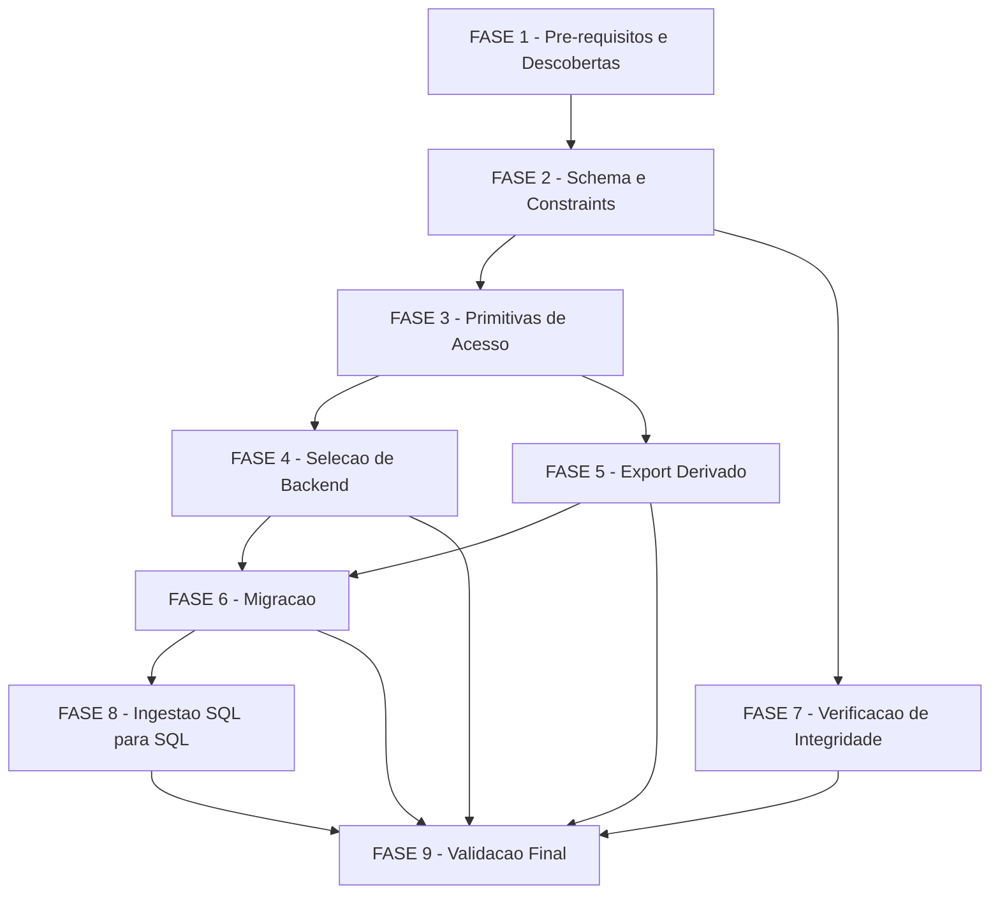

# Tarefas Fundação state.db - state-db-foundation

Escopo: substituir `state.json` por um banco SQLite (`state.db`) por
projeto como fonte de verdade transacional das execuções 00c, movendo as
invariantes hoje mantidas por convenção de script para constraints
declarativas do banco, com migração explícita, export de compatibilidade
e ingestão SQL→SQL do `knowledge.db` como capacidades adicionais.

Ref: [spec.md](./spec.md), [plan.md](./plan.md), [research.md](./research.md),
[data-model.md](./data-model.md), [quickstart.md](./quickstart.md),
[contracts/primitives.md](./contracts/primitives.md),
[contracts/export.md](./contracts/export.md),
[contracts/migration.md](./contracts/migration.md),
[checklists/requirements.md](./checklists/requirements.md)

**Legenda de status:**
- `[ ]` Pendente
- `[~]` Em andamento
- `[x]` Concluído
- `[!]` Bloqueado

**Legenda de criticidade:**
- `[C]` Crítico - Impacto financeiro direto ou bloqueante
- `[A]` Alto - Funcionalidade essencial
- `[M]` Médio - Necessário mas sem urgência imediata

**Decisões fechadas nesta rodada (create-tasks, onda-006)**: CHK009 (correção
editorial "cinco"→"seis" campos, dec-031), D7-a (ATTACH mode=ro, dec-037),
E5-a (ambos os gatilhos, dec-032), M1-a (permitir `aguardando_humano`,
dec-033), CHK005 (subcomando `cstk state migrate` delegando a script
dedicado, dec-034), CHK015 (critério de amostra do teste de equivalência,
dec-035), CHK027 (nenhum SC novo de performance de escrita, dec-036).
D4-a já estava fechada (dec-025, `PRAGMA integrity_check` apenas).

---

## ⚠️ GATE BLOQUEANTE — Amendment 1.3.0 da constitution

**Nenhuma tarefa das FASES 2-9 pode ser iniciada via `/execute-task` antes
da FASE 1.1 estar concluída.** O Princípio II (POSIX puro, NON-NEGOTIABLE)
proíbe dependência externa obrigatória sem fallback; `sqlite3` é
exatamente isso para o `state.db`. `plan.md` §Constitution Check é
explícito: "nenhuma task que implemente escrita ou leitura do `state.db`
pode ser considerada pronta para execução antes do amendment 1.3.0 ser
ratificado." O pipeline `feature-00c` **não inclui** a etapa `constitution`
— a ratificação é ação externa a esta execução (operador humano, ou uma
execução `/agente-00c` separada que inclua a etapa `constitution`).

---

## FASE 1 - Pré-requisitos e Descobertas

### 1.1 Amendment 1.3.0 da constitution (sqlite3 obrigatório) `[C]`

Ref: spec.md §Clarifications Session 2026-07-30 (Q1); plan.md §Constitution
Check + §Complexity Tracking; dec-020 (execução original desta feature).
**BLOQUEIA todas as FASES 2-9.**

- [ ] 1.1.1 Verificar `docs/constitution.md` (rodapé `**Version**`) — se já
  `>= 1.3.0` e o Princípio II já cita a exceção da camada de estado
  transacional, marcar esta tarefa concluída e liberar as fases seguintes
- [ ] 1.1.2 Se a versão ainda for `1.2.0` (ou o Princípio II não citar a
  exceção), registrar bloqueio humano via `bloqueios.sh register`
  solicitando que o operador conduza o amendment MINOR (1.2.0 → 1.3.0)
  fora deste pipeline — via `/agente-00c` (que inclui a etapa
  `constitution`) sobre o projeto `cstk`, ou edição direta ratificada por
  humano — reconhecendo `sqlite3` como dependência obrigatória e sem
  fallback da camada de estado transacional, análoga ao gate já existente
  de `jq` (`state-rw.sh` L116-118)
- [ ] 1.1.3 Após ratificação, revalidar que `docs/constitution.md` cita a
  exceção explicitamente e que o rodapé de versão reflete `1.3.0` (ou
  superior) antes de desbloquear a FASE 2
- [ ] 1.1.4 Registrar Decisão auditável confirmando a liberação do gate
  (referenciando a versão ratificada da constitution)

### 1.2 Descoberta da versão mínima de `sqlite3` suportada `[A]`

Ref: checklists/requirements.md CHK004; data-model.md L227-231 (JSON1);
contracts/primitives.md §C8 (C8-a, `.param set`)

- [ ] 1.2.1 Levantar a versão mínima de `sqlite3` que o toolkit passa a
  exigir — usar como piso a menor versão presente nos ambientes reais já
  documentados no repo (macOS local: `3.51.0`, `research.md` Decision 1) e
  a versão mínima do runner de CI (verificar `.github/workflows/*.yml`)
- [ ] 1.2.2 Confirmar suporte a `JSON1`/`json_valid`/`json_array_length` na
  versão mínima levantada (presente por padrão desde SQLite 3.38, 2022) —
  se a versão mínima real for anterior a 3.38, registrar Decisão sobre o
  degrade documentado em data-model.md (`CHECK (length(options_considered)
  > 2)` + validação em script)
- [ ] 1.2.3 Confirmar disponibilidade de parâmetros nomeados (`.param set`)
  na versão mínima levantada — fecha C8-a: se disponível, adotar como
  otimização sobre o piso já obrigatório (`strip_nul`+`sql_escape`,
  contracts/primitives.md §C8); se indisponível, documentar que o piso
  permanece a única forma de escape
- [ ] 1.2.4 Documentar a versão mínima resultante e o veredito de C8-a em
  `research.md` (nova subseção) ou `data-model.md`, com fonte citada
  (output real de `sqlite3 --version` / `.param` no ambiente verificado)
- [ ] 1.2.5 Registrar Decisão auditável com a versão mínima escolhida e
  evidência (`--score 3`, exigindo saída literal do comando verificador)

---

## FASE 2 - Schema e Constraints do Banco `[C]`

Ref: data-model.md (schema completo); spec.md FR-001, FR-002

### 2.1 DDL definitivo das 9 entidades `[C]`

Ref: data-model.md §Entity execution/wave/decision/human_block/task_outcome/
event/skill_invocation/migration_run

- [ ] 2.1.1 Escrever o DDL de `execution` com as 4 `CHECK` de status/
  finished_at/subagent_depth/cycles/retro (data-model.md linhas 86-103)
- [ ] 2.1.2 Escrever o DDL de `wave` com `ux_wave_single_open` (índice
  único parcial) e `trg_wave_close_once` (trigger)
- [ ] 2.1.3 Escrever o DDL de `decision` com as 6 `CHECK` dos campos
  obrigatórios (agent/stage/choice/context/rationale/options_considered) e
  a trava de score 3 exigindo evidência
- [ ] 2.1.4 Escrever o DDL de `human_block` com `FOREIGN KEY` para
  `decision(id)` e `CHECK` de status×answered_at
- [ ] 2.1.5 Escrever o DDL de `task_outcome` com PK composta
  `(execution_id, task_id)` e `CHECK` de outcome/tests
- [ ] 2.1.6 Escrever o DDL de `event`, `skill_invocation` (com `CHECK kind
  IN ('skill','gate')`) e `migration_run`
- [ ] 2.1.7 Decidir granularidade dos campos `[PROPOSTA]` de `execution`
  (budgets/accumulated_metrics/whitelist/circular_movement_history/
  prerequisites/caches/push_pr_result) — colunas adicionais vs. tabelas
  satélite — e registrar Decisão auditável antes de fechar o DDL
- [ ] 2.1.8 Script de criação idempotente (`CREATE TABLE IF NOT EXISTS`) +
  aplicação de `PRAGMA journal_mode=WAL` uma única vez na criação

### 2.2 Testes de invariantes do FR-002 `[C]`

Ref: quickstart.md; spec.md US1 AS-1, AS-2, AS-4

- [ ] 2.2.1 Teste: segunda tentativa de abrir onda com onda já aberta falha
  (`ux_wave_single_open`)
- [ ] 2.2.2 Teste: tentativa de fechar onda já fechada falha
  (`trg_wave_close_once`)
- [ ] 2.2.3 Teste: registro de decisão com campo obrigatório ausente/vazio
  é rejeitado pela própria constraint (não pelo script chamador)
- [ ] 2.2.4 Teste: registro de bloqueio humano com `decision_id` inexistente
  é rejeitado por `FOREIGN KEY` (com `PRAGMA foreign_keys=ON` ativo)
- [ ] 2.2.5 Teste: tentativa de `enter` de spawn acima do teto configurado
  é rejeitada por `CHECK (subagent_depth <= max_recursion)`
- [ ] 2.2.6 Teste: `--score 3` sem `--evidencia` >= 20 chars é rejeitado na
  camada de banco

---

## FASE 3 - Primitivas de Acesso `[C]`

Ref: spec.md FR-003, FR-004, FR-011; contracts/primitives.md §C1, C4-C10

### 3.1 Helpers compartilhados de conexão e escape `[C]`

Ref: contracts/primitives.md §C5 (PRAGMAs), §C8 (escape), §C9 (permissões)

- [ ] 3.1.1 Extrair `sql_escape`/`strip_nul` de `cli/lib/recall.sh` para um
  ponto compartilhável consumível pelos scripts de `agente-00c-runtime`
  (reuso, não reimplementação — per C8)
- [ ] 3.1.2 Implementar wrapper de invocação `sqlite3` que emite sempre
  `PRAGMA foreign_keys=ON; PRAGMA busy_timeout=<ms>;` antes do SQL da
  mutação (C5)
- [ ] 3.1.3 Implementar `chmod 600` explícito após criação de `state.db` e
  seus sidecars `-wal`/`-shm` (C9, finding S3), seguindo o padrão já usado
  em `otel-usage.sh:262`
- [ ] 3.1.4 Reaproveitar o padrão de retry sob lock de
  `recall_apply_sql_with_retry` (`cli/lib/recall.sh`) — MAS com contrato de
  falha diferente: lock persistente após retries MUST sair não-zero, nunca
  degradar silenciosamente (C6, diferença deliberada face ao `recall.sh`)
- [ ] 3.1.5 Teste: payload de texto livre contendo `'; DROP TABLE decision;
  --` e apóstrofo simples é persistido literalmente, a tabela `decision`
  continua existindo e `state-validate.sh` sai 0 (C8, paridade com
  `tests/test_model-routing.sh`)

### 3.2 Adaptar `state-rw.sh` para backend dual `[C]`

Ref: contracts/primitives.md §C1 (paridade), §C2 (seleção de backend)

- [ ] 3.2.1 Implementar seleção de backend por presença de arquivo (existe
  `<state-dir>/state.db` ⇒ SQLite; senão ⇒ JSON atual) em `init`
- [ ] 3.2.2 Adaptar `read`/`get`/`set`/`write` preservando stdout/exit code
  idênticos ao comportamento JSON atual (C1)
- [ ] 3.2.3 Adaptar `sha256-update`/`sha256-verify` para, sob backend
  SQLite, delegar à FASE 7 (`PRAGMA integrity_check`) mantendo nome e
  contrato de exit code
- [ ] 3.2.4 Teste de paridade: cada subcomando de `state-rw.sh` produz o
  mesmo stdout/exit code sob os dois backends, para os mesmos dados

### 3.3 Adaptar `state-ondas.sh` `[C]`

Ref: contracts/primitives.md tabela de subcomandos `state-ondas.sh`

- [ ] 3.3.1 Adaptar `start`/`end`/`wave-status`/`current-id` — declarar
  explicitamente a mudança de comportamento autorizada por C3: `start` com
  onda já aberta passa a **falhar** (hoje duplica silenciosamente)
- [ ] 3.3.2 Adaptar `record-skill`/`record-task`/`reconcile-tasks` — PK
  composta de `task_outcome` substitui o upsert em `jq` por
  `INSERT ... ON CONFLICT DO UPDATE`
- [ ] 3.3.3 Adaptar `tool-call-tick`/`git-commit`
- [ ] 3.3.4 Teste: guarda `wave-status` do orquestrador continua válida
  como defesa em profundidade (não mais requisito único) sob o novo erro
  de `start`

### 3.4 Adaptar `state-decisions.sh` `[C]`

- [ ] 3.4.1 Adaptar `register` para inserir via transação `BEGIN
  IMMEDIATE`, preservando impressão de `dec-NNN` em stdout
- [ ] 3.4.2 Adaptar `count`/`next-id`/`list`
- [ ] 3.4.3 Teste: `register` sob concorrência (duas invocações
  simultâneas) não perde nenhuma decisão e não colide em `next-id`

### 3.5 Adaptar `bloqueios.sh` `[C]`

- [ ] 3.5.1 Adaptar `register` para gravar o bloqueio **e** mudar
  `.execution.status` na mesma transação (C4 — hoje são dois RMW
  separados)
- [ ] 3.5.2 Adaptar `respond`/`list`/`count`/`next-id`/`get`
- [ ] 3.5.3 Teste: `register` com `--decisao-id` inexistente falha por FK
  (US1 AS-4)

### 3.6 Adaptar `spawn-tracker.sh` `[C]`

- [ ] 3.6.1 Adaptar `check`/`enter`/`leave`/`current` preservando exit 3 no
  teto (paridade C1)
- [ ] 3.6.2 Teste: `enter` acima do teto não grava (paridade com hoje)

### 3.7 Testes de atomicidade e concorrência (SC-002, US1 AS-3) `[C]`

Ref: spec.md SC-002; contracts/primitives.md §C4, C6

- [ ] 3.7.1 Teste de carga: duas mutações concorrentes distintas (ex.:
  registrar decisão + fechar onda) aplicadas em paralelo — nenhuma
  atualização perdida, 0% de taxa de perda
- [ ] 3.7.2 Teste de interrupção simulada (kill -9 no meio de uma
  transação) — verificar que o `state.db` não fica com escrita parcial
  (rollback automático do SQLite)
- [ ] 3.7.3 Teste de leitura concorrente durante escrita em andamento — sem
  bloqueio, sem leitura parcial (C6, WAL)

---

## FASE 4 - Seleção de Backend e Compatibilidade `[A]`

Ref: spec.md FR-012, SC-003; contracts/primitives.md §C2, C11

### 4.1 Lógica de seleção de backend em todos os scripts de escrita `[A]`

- [ ] 4.1.1 Aplicar a lógica de C2 (presença de `state.db` decide o
  backend) uniformemente nos 6 scripts adaptados na FASE 3
- [ ] 4.1.2 Confirmar que um projeto sem `state.db` continua operando
  exatamente como hoje (backend JSON, FR-012) sem qualquer mudança de
  comportamento observável

### 4.2 Regressão da suíte para projeto não migrado (SC-003) `[A]`

- [ ] 4.2.1 Rodar `./tests/run.sh` completo sobre o estado atual (sem
  `state.db`) e confirmar 0 regressões atribuíveis a esta feature
- [ ] 4.2.2 Adicionar cenários novos ao harness (`tests/test_<script>.sh`)
  cobrindo o branch de seleção de backend explicitamente, por script
  adaptado

### 4.3 Preservar `state-lock.sh` como camada opcional `[M]`

Ref: contracts/primitives.md §C11 (o que NÃO muda)

- [ ] 4.3.1 Confirmar que `state-lock.sh` não é removido e sua superfície
  não muda — segue disponível como camada extra opcional, não mais como
  requisito de serialização
- [ ] 4.3.2 Atualizar a prosa dos orquestradores (`agente-00c-orchestrator.md`,
  `agente-00c-feature-orchestrator.md`) e commands que hoje descrevem o
  lock como serializador primário, refletindo que WAL é o mecanismo
  primário sob backend `state.db` (FR-011) — **fora desta feature de
  runtime**, mas necessário para a prosa não ficar desatualizada; abrir
  como nota de sugestão se não couber nesta task

---

## FASE 5 - Export Derivado `[A]`

Ref: spec.md FR-007, FR-013-INFRA-BACKUP; contracts/export.md; dec-032 (E5-a)

### 5.1 Implementar o export (opção A — reusar `state-rw.sh read`) `[A]`

Ref: contracts/export.md §Interface do comando (opção A preferida)

- [ ] 5.1.1 Sob backend SQLite, `state-rw.sh read` produz o `state.json`
  equivalente descrito em E1-E4 (schema_version, todos os campos de topo,
  nomes/IDs preservados literalmente, `accumulated_metrics` derivado por
  agregação das tabelas)
- [ ] 5.1.2 Preservar distinção ausente-vs-null (`canonical_project`/
  `session_name` ausentes quando não setados) — E3
- [ ] 5.1.3 Teste E1: export passa em `state-validate.sh --state-dir <dir>`
  com exit 0
- [ ] 5.1.4 Teste E2/E3: fidelidade de nomes/IDs e ordem/aninhamento
  (`skills_invoked` volta a ficar aninhado em `.waves[N]`)

### 5.2 Gatilho automático ao fim da onda `[A]`

Ref: dec-032 (E5-a: ambos os gatilhos); export.md §E5, E6

- [ ] 5.2.1 Disparar a geração do export dentro de `state-ondas.sh end`, no
  mesmo ponto onde o snapshot de `state-history/` é gerado hoje —
  reaproveita o export como mecanismo de FR-013-INFRA-BACKUP sem
  introduzir backup nativo do SQLite (research.md Decision 6)
- [ ] 5.2.2 Implementar E6: falha na geração do export (disco cheio,
  interrupção) MUST ser reportada em stderr e MUST NOT reverter nem
  impedir o commit da transação que fechou a onda
- [ ] 5.2.3 Teste SC-004: export reflete uma mutação em até 5 segundos após
  aplicada
- [ ] 5.2.4 Teste E6: simular falha de escrita do export (ex.: diretório
  sem permissão) e confirmar que o fechamento de onda no `state.db` não é
  revertido

### 5.3 Gatilho sob demanda `[A]`

- [ ] 5.3.1 Expor comando explícito para regenerar o export a qualquer
  momento (consumido por auditoria/debug manual e por FASE 6 M3.2)
- [ ] 5.3.2 Teste: export sob demanda gerado após múltiplas mutações
  reflete o estado corrente completo

### 5.4 Teste de restauração a partir do export (FR-013-INFRA-BACKUP) `[A]`

- [ ] 5.4.1 Validar que a restauração a partir de um snapshot em
  `state-history/` (export serializado) é operável — "com a restauração
  validada por teste antes de ser considerada disponível" (FR-013-INFRA-BACKUP,
  literal)

---

## FASE 6 - Migração state.json → state.db `[C]`

Ref: spec.md FR-005, FR-006, FR-014-INFRA-IDEMP; contracts/migration.md;
dec-033 (M1-a), dec-034 (CHK005)

### 6.1 Interface do comando de migração `[C]`

Ref: dec-034 (subcomando `cstk state migrate` delegando a `state-db-migrate.sh`)

- [ ] 6.1.1 Criar `global/skills/agente-00c-runtime/scripts/state-db-migrate.sh`
  como script dedicado (evita colisão com `state-rw.sh migrate`, que migra
  schema interno do JSON — migration.md §Nomeação)
- [ ] 6.1.2 Expor `cstk state migrate --state-dir <dir>` no CLI, delegando
  ao script acima
- [ ] 6.1.3 Criar `tests/test_state-db-migrate.sh` seguindo a convenção do
  harness (`--check-coverage` deve reconhecer o script novo)

### 6.2 Pré-condições M1 `[C]`

Ref: migration.md §M1; dec-033 (M1-a: permitir `aguardando_humano`)

- [ ] 6.2.1 Recusar com diagnóstico claro se `.execution.status ==
  "em_andamento"` (FR-005, literal) — **permitir** `aguardando_humano`
  (dec-033)
- [ ] 6.2.2 Recusar se `state-validate.sh --state-dir <dir>` sair != 0
  (reaproveita o verificador existente — cobre SC-006/bloqueio órfão sem
  código novo)
- [ ] 6.2.3 Recusar se `state-rw.sh sha256-verify --state-dir <dir>` sair
  != 0 (integridade divergente)
- [ ] 6.2.4 Recusar se `state.json` ausente/ilegível
- [ ] 6.2.5 Recusar (não sobrescrever) se já existe `state.db` de
  `execution.id` diferente da origem — ver 6.5 (idempotência)

### 6.3 Sequência de migração (M2) `[C]`

Ref: migration.md §M2; primitives.md §C10 (mktemp, finding S4)

- [ ] 6.3.1 Criar arquivo temporário via `mktemp` no `<state-dir>` (mesmo
  filesystem) — MUST NOT usar nome derivado de PID (C10)
- [ ] 6.3.2 Aplicar o schema (FASE 2) + PRAGMAs ao temporário
- [ ] 6.3.3 Inserir os dados na ordem imposta pelas FKs: `execution` →
  `wave` → `decision` → `human_block`/`skill_invocation`/`task_outcome`/
  `event` → `migration_run`, preservando IDs e timestamps originais sem
  renumeração
- [ ] 6.3.4 Publicar por `mv` atômico do temporário para `state.db`
  (dentro do mesmo filesystem)

### 6.4 Verificação pós-migração M3 (FR-006, SC-001) `[C]`

Ref: migration.md §M3.1, M3.2

- [ ] 6.4.1 M3.1 — contagem por entidade: `COUNT(*)` no destino == `length`
  do array de origem, para as 6 entidades listadas (decisions, waves,
  human_blocks, tasks, events, skill_invocation), gravado em
  `migration_run.counts_source`/`counts_target`
- [ ] 6.4.2 M3.2 — gerar o export (FASE 5) a partir do `state.db` recém-
  construído e comparar campo-a-campo com o `state.json` de origem, ambos
  canonicalizados (`jq -S .`) — divergência ⇒ migração recusada, temporário
  removido
- [ ] 6.4.3 Teste: `state.json` que falha na validação (bloqueio órfão) é
  recusado com diagnóstico apontando o registro problemático (SC-006, US2
  AS-3)
- [ ] 6.4.4 Teste: interrupção simulada entre construção e publicação —
  `state.json` original permanece intacto e o projeto continua operável
  (US2 AS-4)

### 6.5 Idempotência (FR-014-INFRA-IDEMP, M5) `[C]`

Ref: migration.md §M5

- [ ] 6.5.1 Chave de idempotência = `.execution.id` — reexecutar sobre
  projeto já migrado (mesmo `execution.id`) não duplica nem corrompe
  (reconstrução completa + republicação atômica)
- [ ] 6.5.2 `state.db` pré-existente com `execution.id` diferente da
  origem ⇒ recusar, exigindo intervenção humana
- [ ] 6.5.3 Registrar toda tentativa (inclusive recusadas) em
  `migration_run` com `result` ∈ `success`\|`refused`\|`failed`
- [ ] 6.5.4 Teste: migração executada duas vezes seguidas sobre o mesmo
  projeto produz o mesmo resultado, sem duplicação (US2 AS-2)

### 6.6 Garantias M4/M6 e cobertura dos 7 cenários do contrato `[C]`

Ref: migration.md §M4, M6, §Cenários de teste (tabela final)

- [ ] 6.6.1 Confirmar M6: migração nunca dispara automaticamente numa
  invocação de orquestrador (nenhum caminho de `/agente-00c`,
  `/feature-00c` ou resumes a chama)
- [ ] 6.6.2 Confirmar M6: `state.json`, `state.json.sha256` e
  `state-history/` nunca são apagados pela migração
- [ ] 6.6.3 Rodar a suíte completa dos 7 cenários de
  `contracts/migration.md` §Cenários de teste como teste de aceitação
  final da FASE 6

---

## FASE 7 - Verificação de Integridade `[A]`

Ref: spec.md FR-010; contracts/primitives.md §C7; research.md Decision 4
(D4-a fechada, dec-025)

### 7.1 `sha256-update`/`sha256-verify` sob backend SQLite `[A]`

- [ ] 7.1.1 Implementar `sha256-update`/`sha256-verify`, sob backend
  `state.db`, delegando a `PRAGMA integrity_check` (ou `quick_check` no
  caminho quente), preservando nome e contrato de exit code do comando
- [ ] 7.1.2 Teste: corrupção estrutural simulada (truncar o arquivo) é
  detectada por `integrity_check`
- [ ] 7.1.3 Teste de regressão **documentado e esperado** (dec-025): uma
  edição externa bem-formada via `UPDATE` direto não é detectada — cenário
  7.a do quickstart.md, confirmando que o comportamento aceito está
  implementado como decidido, não como falha

---

## FASE 8 - Ingestão SQL→SQL no knowledge.db `[M]`

Ref: spec.md FR-008, FR-009; research.md Decision 7 (D7-a fechada,
dec-037); dec-035 (CHK015, critério de amostra)

### 8.1 Caminho de ingestão SQL→SQL em `cli/lib/recall.sh` `[M]`

- [ ] 8.1.1 Implementar `ATTACH DATABASE 'file:<path do state.db>?mode=ro'
  AS src;` seguido de `INSERT ... SELECT` para cada entidade (executions,
  waves, decisions, blocks, tasks, events, skills), preservando a mesma
  proveniência (`project`/`feature`/`onda`/data) e a mesma idempotência
  (`UNIQUE(project, feature, wave, source_id)` + `ON CONFLICT DO UPDATE`)
  do caminho JSON atual
- [ ] 8.1.2 Aplicar o mesmo filtro `kind == 'gate'` na exclusão da tabela
  `skills` (paridade com o caminho JSON)
- [ ] 8.1.3 Preservar FR-009: nenhuma escrita direta no `knowledge.db` por
  outro caminho; `ATTACH ... mode=ro` garante que o processo de ingestão
  não pode escrever acidentalmente no `state.db` de origem

### 8.2 Preservar o caminho JSON legado intacto (FR-012, US4 AS-2) `[M]`

- [ ] 8.2.1 Detectar presença de `state.db` para escolher o caminho
  SQL→SQL; ausência mantém o caminho JSON atual sem alteração
- [ ] 8.2.2 Teste: projeto ainda não migrado (`state.json` apenas) ingere
  exatamente como hoje, sem regressão

### 8.3 Testes de equivalência SQL vs JSON (SC-005) `[M]`

Ref: dec-035 (critério de amostra)

- [ ] 8.3.1 Fixtures sintéticas cobrindo os 3 casos de dec-035 (vazio/
  mínimo: 0 decisões e 1 onda; médio: ~10 decisões/3 ondas; grande: ~50+
  decisões/10+ ondas) — ingerir via os dois caminhos (JSON exportado vs
  SQL direto) e comparar as entidades resultantes no `knowledge.db`
- [ ] 8.3.2 Incluir, quando disponíveis no ambiente de teste local, os
  state-dirs reais já existentes (ex.: este próprio
  `.claude/feature-00c-state/state-db-foundation` após migrado) como
  amostra adicional, sem depender exclusivamente deles
- [ ] 8.3.3 Confirmar 100% de equivalência de entidades entre os dois
  caminhos de ingestão na amostra (SC-005)

---

## FASE 9 - Validação Final e Regressão `[C]`

Ref: spec.md SC-002, SC-003, SC-005, SC-006; checklists/requirements.md

### 9.1 Suíte completa e cobertura `[C]`

- [ ] 9.1.1 Rodar `./tests/run.sh` completo (não `--fast`) e confirmar 0
  regressões atribuíveis a esta feature (SC-003)
- [ ] 9.1.2 Rodar `./tests/run.sh --check-coverage` e confirmar que todo
  script novo (`state-db-migrate.sh`, helpers extraídos) tem teste
  correspondente na convenção do harness

### 9.2 Gates de consistência final `[A]`

- [ ] 9.2.1 Rodar `/analyze` sobre spec/plan/tasks para confirmar
  consistência cruzada após a implementação completa
- [ ] 9.2.2 Revalidar os itens `{humano}` do checklist (CHK005, CHK015,
  CHK023, CHK027, CHK029, CHK031) contra as decisões fechadas nesta rodada
  (dec-031 a dec-037) — confirmar que nenhum ficou sem tratamento

### 9.3 Teste de carga concorrente final (SC-002) `[C]`

- [ ] 9.3.1 Reexecutar o teste de carga concorrente (3.7.1) como critério
  de aceitação de toda a feature, não apenas da FASE 3 isolada — 0% de
  taxa de atualização perdida

---

## Matriz de Dependências

## Resumo Quantitativo

| Fase | Tarefas | Subtarefas | Criticidade |
|------|---------|------------|-------------|
| 1 - Pré-requisitos e Descobertas | 2 | 9 | C/A |
| 2 - Schema e Constraints | 2 | 14 | C |
| 3 - Primitivas de Acesso | 7 | 24 | C |
| 4 - Seleção de Backend | 3 | 6 | A/M |
| 5 - Export Derivado | 4 | 12 | A |
| 6 - Migração | 6 | 21 | C |
| 7 - Verificação de Integridade | 1 | 3 | A |
| 8 - Ingestão SQL→SQL | 3 | 8 | M |
| 9 - Validação Final | 3 | 5 | C/A |
| **Total** | **31** | **102** | - |

## Escopo Coberto

| Item | Descrição | Fase |
|------|-----------|------|
| FR-001, FR-002 | Persistência relacional + invariantes na camada de armazenamento | 2 |
| FR-003, FR-004, FR-011 | Atomicidade + primitivas de acesso + concorrência WAL | 3 |
| FR-012, SC-003 | Compatibilidade com projeto não migrado | 4 |
| FR-007, FR-013-INFRA-BACKUP | Export derivado + backup por onda | 5 |
| FR-005, FR-006, FR-014-INFRA-IDEMP | Migração idempotente com verificação | 6 |
| FR-010 | Verificação de integridade (`integrity_check`) | 7 |
| FR-008, FR-009 | Ingestão SQL→SQL aditiva ao knowledge.db | 8 |
| SC-002, SC-005, SC-006 | Validação de carga, equivalência e recusa | 9 |
| CHK004, CHK009, CHK005, CHK015, CHK027, CHK029 | Gaps do checklist consumidos | 1, 6, 8, 9 |
| Amendment 1.3.0 da constitution | Gate bloqueante externo materializado como tarefa | 1 |

## Escopo Excluído

| Item | Descrição | Motivo |
|------|-----------|--------|
| Servidor de acesso tipado | API/servidor dedicado sobre o `state.db` | spec.md §Contexto — fase futura explícita, fora desta "Fase 1 (fundação)" |
| Inversão de verificação | Mover verificação de invariantes para fora do banco (ou vice-versa em outro sentido arquitetural) | spec.md §Contexto — fase futura |
| Telemetria ao vivo | Streaming de eventos do `state.db` para consumidores externos em tempo real | spec.md §Contexto — fase futura |
| Driver nativo SQLite (better-sqlite3/node:sqlite/python) | Acesso ao banco via binding de linguagem em vez de CLI `sqlite3` | research.md Decision 1 — introduziria runtime de linguagem hospedeira, contra a arquitetura POSIX sh |
| Mecanismo de backup nativo do SQLite (`VACUUM INTO`, `.backup`) | Backup binário do arquivo `.db` | research.md Decision 6 — export serializado já cobre FR-013-INFRA-BACKUP sem mecanismo novo |
| Hash-chain de auditoria / sha256 do export como camada extra de integridade | Opções 2/3 de D4-a | dec-025 — regresso de detecção de adulteração aceito e documentado; desproporcional ao modelo de ameaça (operador local confiável) |
| Reescrita dos ~24 consumidores atuais de `state.json` | Adaptar cada consumidor para ler `state.db`/`knowledge.db` diretamente | contracts/export.md — o export FR-007 os protege sem reescrita nesta fase |
| SC novo de performance de escrita por mutação | Meta formal de latência do `BEGIN IMMEDIATE`/`COMMIT` | dec-036 (CHK027) — sem sinal de que overhead de I/O local é gargalo frente ao tempo dominado por chamadas de LLM por onda |
