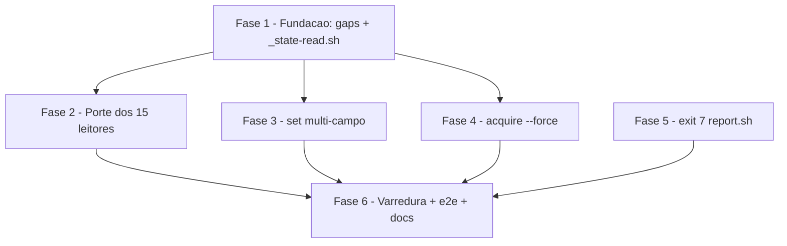

# Tarefas cstk - Paridade do runtime 00c com o backend SQLite (state-db-runtime-parity)

Escopo: fechar a lacuna de paridade das fases 1/2 do cutover `state.json` →
`state.db` — porte dos 15 leitores do runtime para a interface canonica via
sibling `_state-read.sh`, `set` multi-campo atomico, `acquire --force`,
exit 7 contratual do `report.sh` e varredura anti-regressao em 2 camadas.
Origem: [spec.md](./spec.md) (FR-001..FR-012) + [plan.md](./plan.md) (F1-F6).

**Legenda de status:**
- `[ ]` Pendente
- `[~]` Em andamento
- `[x]` Concluido
- `[!]` Bloqueado

**Legenda de criticidade:**
- `[C]` Critico - Impacto financeiro direto ou bloqueante
- `[A]` Alto - Funcionalidade essencial
- `[M]` Medio - Necessario mas sem urgencia imediata

---

## FASE 1 - Fundacao: gaps de requisito + helper `_state-read.sh`

### 1.1 Fechar gaps de requisito do checklist `[A]`

Ref: checklists/api.md CHK008/CHK009; checklists/security.md CHK016; checklists/operational.md CHK032

- [x] 1.1.1 CHK009: definir semantica do MESMO `--field` repetido no lote multi-campo (last-wins vs erro de uso exit 2) e registrar a decisao no contract §1 + spec FR-005
- [x] 1.1.2 CHK016: especificar o mecanismo da allowlist de prosa da camada estatica (onde vive — arquivo ou padrao no teste; como um item novo e adicionado; criterio codigo-real-vs-prosa de FR-010) e registrar no contract/research
- [x] 1.1.3 CHK032: definir a fixture minima do state-dir SQLite da varredura dinamica (entidades por leitor: ondas/decisoes/bloqueios/tasks; `retro.sh` exige retro-execucoes? `drift.sh` exige `key_aspects`?) para que os 15 leitores exercitem caminho real, nao vazio-trivial
- [x] 1.1.4 CHK008: definir o protocolo de validacao das assinaturas `[PROPOSTA]` do contract — cada tarefa implementadora (1.2.6, 3.1.7, 4.2.5) valida a assinatura contra o codigo real e remove o marcador no MESMO commit
- [x] 1.1.5 Marcar CHK008/CHK009/CHK016/CHK032 como resolvidos nos checklists com citacao da evidencia

### 1.2 Implementar sibling sourceable `_state-read.sh` `[A]`

Ref: research.md Decision 1; contracts/runtime-interfaces.md §4; spec FR-001/FR-003/FR-004/FR-012

- [x] 1.2.1 Implementar `state_read_materialize`: state-dir JSON devolve o proprio `state.json` (zero mudanca, FR-004); state-dir SQLite materializa via `state-rw.sh read` em `mktemp` 0600 FORA do state-dir (LOW/A04 do plan)
- [x] 1.2.2 Implementar `state_read_cleanup` + protocolo de trap `EXIT INT TERM` conforme contract §4
- [x] 1.2.3 Sob SQLite com `sqlite3` ausente no host, propagar a falha rapida do `state-rw.sh read` (FR-012 — nunca degradar mudo)
- [x] 1.2.4 Garantir anti-mirror: o helper MUST NOT criar arquivo dentro do state-dir (FR-003)
- [x] 1.2.5 Criar `tests/test__state-read.sh` (precedente de sibling: `tests/test__state-ondas-db.sh`): JSON direto, SQLite via read, anti-mirror, `sqlite3` ausente, state-dir vazio
- [x] 1.2.6 Validar assinatura `[PROPOSTA]` do contract §4 contra a implementacao e remover o marcador (Ref: CHK008)

---

## FASE 2 - Porte dos 15 leitores para a interface canonica

### 2.1 Lote guardas leitoras: budget, drift, state-validate, pipeline `[A]`

Ref: spec FR-001/FR-002/FR-011; research.md Decision 6 (classe reader)

- [x] 2.1.1 Portar `budget.sh` (`_bd_state_file()` builder direto) para `_state-read.sh`; jq pipelines internos INALTERADOS
- [x] 2.1.2 Adicionar cenarios sqlite em `tests/test_budget.sh` (veredito equivalente ao backend JSON — SC-003)
- [x] 2.1.3 Portar `drift.sh` (`check`/`extract`) para `_state-read.sh`
- [x] 2.1.4 Adicionar cenarios sqlite em `tests/test_drift.sh`
- [x] 2.1.5 Portar `state-validate.sh` (schema check sobre doc materializado) para `_state-read.sh`
- [x] 2.1.6 Adicionar cenarios sqlite em `tests/test_state-validate.sh`
- [x] 2.1.7 Portar `pipeline.sh` para `_state-read.sh`
- [x] 2.1.8 Adicionar cenarios sqlite em `tests/test_pipeline.sh`

### 2.2 Lote guardas mutadoras: cycles, circular, retro `[A]`

Ref: spec FR-001/FR-002/FR-011; research.md Decision 6 (classe read-write — escrita roteia por `state-rw.sh set`)

- [x] 2.2.1 Portar leitura de `cycles.sh` para `_state-read.sh` e rotear a mutacao do `tick` por `state-rw.sh set`
- [x] 2.2.2 Adicionar cenarios sqlite em `tests/test_cycles.sh`
- [x] 2.2.3 Portar leitura de `circular.sh` e rotear a mutacao do `push` por `state-rw.sh set`
- [x] 2.2.4 Adicionar cenarios sqlite em `tests/test_circular.sh`
- [x] 2.2.5 Portar leitura de `retro.sh` e rotear a mutacao do `consume` por `state-rw.sh set`
- [x] 2.2.6 Adicionar cenarios sqlite em `tests/test_retro.sh`

### 2.3 Lote leitores de relatorio/roteamento: wave-usage-report, model-routing, model-routing-report `[M]`

Ref: spec FR-001/FR-011; research.md Decision 6 (classe reader)

- [x] 2.3.1 Portar `wave-usage-report.sh` (19 hits — maior contagem) para `_state-read.sh`
- [x] 2.3.2 Adicionar cenarios sqlite em `tests/test_wave-usage-report.sh`
- [x] 2.3.3 Portar `model-routing.sh` (`idempotent-check`/`wave-select`) para `_state-read.sh`
- [x] 2.3.4 Adicionar cenarios sqlite em `tests/test_model-routing.sh`
- [x] 2.3.5 Portar `model-routing-report.sh` (`aggregate`) para `_state-read.sh`
- [x] 2.3.6 Adicionar cenarios sqlite em `tests/test_model-routing-report.sh`

### 2.4 Lote read-write auxiliares: suggestions, state-cache, state-decisions-reconcile, issue `[M]`

Ref: spec FR-001/FR-011; research.md Decision 6 (classe read-write)

- [ ] 2.4.1 Portar `suggestions.sh` (leitura via helper; `register` muta via `state-rw.sh set`)
- [ ] 2.4.2 Adicionar cenarios sqlite em `tests/test_suggestions.sh`
- [ ] 2.4.3 Portar `state-cache.sh` (`get-resumo` le; `metrics-bump` muta via set)
- [ ] 2.4.4 Adicionar cenarios sqlite em `tests/test_state-cache.sh`
- [ ] 2.4.5 Portar `state-decisions-reconcile.sh` (`check` le; `repair --apply` muta via set)
- [ ] 2.4.6 Adicionar cenarios sqlite em `tests/test_state-decisions-reconcile.sh`
- [ ] 2.4.7 Portar `issue.sh` (registro de issue no state via set)
- [ ] 2.4.8 Adicionar cenarios sqlite em `tests/test_issue.sh`

### 2.5 Portar `state-lock.sh check-execution-busy` `[A]`

Ref: spec FR-010 (codigo real, nao prosa); research.md Decision 6

- [ ] 2.5.1 Portar a leitura de estado do `check-execution-busy` para `_state-read.sh`
- [ ] 2.5.2 Adicionar cenarios sqlite em `tests/test_state-lock.sh`
- [ ] 2.5.3 Assertar caminho JSON inalterado (comportamento identico ao atual — FR-004)

### 2.6 Migrar `report.sh` + `feature-00c-preflight.sh` para o helper comum `[A]`

Ref: plan.md F2 (elimina as 2 copias locais do padrao a06e747, v6.2.2)

- [ ] 2.6.1 Substituir a copia local de materializacao do `report.sh` por `_state-read.sh`
- [ ] 2.6.2 Substituir a copia local do `feature-00c-preflight.sh` por `_state-read.sh`
- [ ] 2.6.3 Confirmar testes existentes verdes (`tests/test_report.sh`, `tests/test_feature-00c-preflight.sh`) com cenarios sqlite mantidos

---

## FASE 3 - `state-rw.sh set` multi-campo atomico

### 3.1 Parser N pares + envelope transacional unico `[A]`

Ref: spec FR-005/FR-006; contracts/runtime-interfaces.md §1; research.md Decision 2; plan §Security Review LOW/A05

- [ ] 3.1.1 Estender o parser de `_sr_cmd_set` (state-rw.sh:649) para acumular N pares `--field/--value`; `--value` sem `--field` previo ou `--field` sem `--value` ao fim => exit 2 (uso)
- [ ] 3.1.2 Aplicar a semantica de `--field` duplicado no lote decidida em 1.1.1 (Ref: CHK009)
- [ ] 3.1.3 Backend JSON: aplicar todos os setpaths num UNICO write do documento
- [ ] 3.1.4 Backend SQLite: 1 transacao `BEGIN IMMEDIATE...COMMIT` em `_sr_db_set` (:657); fragmentos compostos EXCLUSIVAMENTE pelos helpers existentes (`_sr_sql_literal`, `_sr_exec_col_lookup`, `_sr_sql_quote`) — nunca interpolar `--field`/`--value` crus (LOW/A05)
- [ ] 3.1.5 Rejeicao por invariante (CHECK do schema, ex. C2): exit 1 + diagnostico citando invariante + campos do lote, estado intacto sem escrita parcial (FR-006)
- [ ] 3.1.6 Testes em `tests/test_state-rw.sh`: promocao terminal canonica sob C2 (status+finished_at+termination_reason), rejeicao com estado intacto, retrocompat 1 par byte-identica (FR-004), erros de uso exit 2, campo duplicado
- [ ] 3.1.7 Validar assinatura `[PROPOSTA]` do contract §1 contra a implementacao e remover o marcador (Ref: CHK008)

---

## FASE 4 - `state-lock.sh acquire --force`

### 4.1 Decisao humana CHK019: apetite de risco TOCTOU `[C]`

Ref: checklists/security.md CHK019; plan §Security Review MEDIUM/ASI02-03; CHK072 (herdado)

- [ ] 4.1.1 Registrar bloqueio humano com contexto: aceitar a janela TOCTOU herdada (CHK072) vs mitigar (ex. lock com dono/PID verificado) no freio de emergencia `--force`
- [ ] 4.1.2 Aplicar a resposta: atualizar checklists/security.md CHK019 e, se mitigacao exigida, refletir em spec/plan
- [ ] 4.1.3 Se mitigacao exigida, inserir sub-FASE emergente ANTES de 4.2 no mesmo commit da Decisao

### 4.2 Implementar `acquire --force` auditavel `[C]`

Ref: spec FR-007; contracts/runtime-interfaces.md §2; research.md Decision 3; feature-00c-abort.md:91 (contrato shipado)

- [ ] 4.2.1 Flag `--force` no `acquire`: lock ausente = identico ao acquire normal (mkdir, exit 0); lock detido = `rmdir` + `mkdir` na MESMA invocacao, exit 0
- [ ] 4.2.2 Todo force-acquire sobre lock detido emite `diag_emit lock-force-acquired` (auditavel — MEDIUM/ASI02-03)
- [ ] 4.2.3 `acquire` SEM `--force` permanece byte-identico ao atual (exit 3 se detido)
- [ ] 4.2.4 Testes em `tests/test_state-lock.sh`: lock orfao force-adquirido, sem-force exit 3, lock ausente, assert do evento `diag_emit`, falha de rmdir/mkdir com exit != 0
- [ ] 4.2.5 Validar semantica `[PROPOSTA]` do contract §2 contra a implementacao e remover o marcador (Ref: CHK008)

---

## FASE 5 - Exit 7 contratual do `report.sh`

### 5.1 Exit 7 por estado ausente em `generate` e `emit` `[A]`

Ref: spec FR-008; contracts/runtime-interfaces.md §3; research.md Decision 4; checklists/api.md CHK010

- [ ] 5.1.1 `generate`: trocar exit 1 por exit 7 na morte por estado ausente (report.sh:452) + diagnostico em stderr, estado (se algum) preservado
- [ ] 5.1.2 `emit`: idem na morte por estado ausente (report.sh:552)
- [ ] 5.1.3 Preservar exit 2 (uso) e exit 1 (falhas genericas) sem sobreposicao nos DOIS subcomandos (CHK010)
- [ ] 5.1.4 Testes de contrato em `tests/test_report.sh`: state-dir sem `state.json` E sem `state.db` legivel => exit 7, nos dois backends e nos dois subcomandos

---

## FASE 6 - Varredura anti-regressao, validacao end-to-end e encerramento

### 6.1 Varredura FR-009 em 2 camadas: `tests/test_state-parity-sweep.sh` `[A]`

Ref: spec FR-009/FR-010; research.md Decision 5; checklists CHK016/CHK032

- [ ] 6.1.1 Camada estatica: grep por acesso direto a `state.json` fora da interface canonica, com allowlist de prosa no mecanismo definido em 1.1.2 (Ref: CHK016)
- [ ] 6.1.2 Camada dinamica: manifest dos 15 leitores executados contra state-dir SQLite populado com a fixture definida em 1.1.3 (Ref: CHK032); assert de veredito nao-degradado por leitor
- [ ] 6.1.3 Registrar o sweep em `_is_internal_test` (`tests/run.sh`) para nao falsear o orphan check
- [ ] 6.1.4 Rodar `./tests/run.sh --check-coverage` e confirmar verde (novos `test__state-read.sh` + sweep reconhecidos)

### 6.2 Validacao end-to-end (quickstart.md) `[A]`

Ref: quickstart.md cenarios 1-6 + roundtrip; spec SC-001..SC-005

- [ ] 6.2.1 Executar cenarios 1-2: helper de orcamento sob SQLite + equivalencia de veredito entre backends
- [ ] 6.2.2 Executar cenarios 3-4: promocao terminal multi-campo (happy + error) + force-acquire de lock orfao
- [ ] 6.2.3 Executar cenarios 5-6: exit contratual do relatorio + varredura detecta reintroducao
- [ ] 6.2.4 Executar o roundtrip end-to-end real (nao mock) do quickstart
- [ ] 6.2.5 Rodar os testes dos scripts tocados (filtro por pattern) e a suite completa APENAS em background — NUNCA suite completa em foreground

### 6.3 Documentacao `[M]`

Ref: plan.md §Project Structure; CLAUDE.md do repo; convencao de docs do runtime

- [ ] 6.3.1 Adicionar secao no CLAUDE.md do repo documentando a paridade do runtime com o backend SQLite (helper `_state-read.sh`, set multi-campo, `--force`, exit 7)
- [ ] 6.3.2 Atualizar SKILL.md/README do `agente-00c-runtime` com as interfaces novas
- [ ] 6.3.3 Verificacao final: nenhum marcador `[PROPOSTA — a validar na implementacao]` restante em contracts/runtime-interfaces.md (fecha CHK008)

### 6.4 Decisao CHK031: priorizacao da feature dedicada de hooks `[M]`

Ref: checklists/operational.md CHK031; spec §Out of Scope; dec-010

- [ ] 6.4.1 Registrar a decisao/bloqueio de priorizacao da feature dedicada de hooks (`posttooluse-tool-call-tick.sh` nunca dispara sob SQLite hoje)
- [ ] 6.4.2 Refletir a resposta em checklists/operational.md CHK031
- [ ] 6.4.3 Se priorizada, registrar entrada de backlog/sugestao para a feature dedicada com dono e gatilho

---

## Matriz de Dependencias

Notas de ordem real: 3.1.2 depende de 1.1.1 (CHK009); 6.1.1 de 1.1.2 (CHK016);
6.1.2 de 1.1.3 (CHK032); 4.2 depende da decisao humana 4.1 (CHK019). F5 nao
tem dependencia de fase anterior (report.sh ja migra em 2.6, mas o exit 7 e
delta independente); F3/F4/F5 podem rodar apos F1 em paralelo logico — a
execucao segue F1..F6 sequencial por simplicidade de ondas.

## Resumo Quantitativo

| Fase | Tarefas | Subtarefas | Criticidade |
|------|---------|------------|-------------|
| 1 - Fundacao: gaps + helper | 2 | 11 | A |
| 2 - Porte dos 15 leitores | 6 | 34 | A/M |
| 3 - set multi-campo | 1 | 7 | A |
| 4 - acquire --force | 2 | 8 | C |
| 5 - exit 7 report.sh | 1 | 4 | A |
| 6 - Varredura + e2e + docs | 4 | 15 | A/M |
| **Total** | **16** | **79** | - |

## Escopo Coberto

| Item | Descricao | Fase |
|------|-----------|------|
| FR-001/FR-003/FR-012 | Helper sourceable `_state-read.sh` (materializacao canonica, anti-mirror, falha rapida) | 1 |
| CHK008/CHK009/CHK016/CHK032 | Gaps de requisito do checklist fechados como tarefas rastreaveis | 1 |
| FR-001/FR-002/FR-011 | Porte dos 14 leitores + `check-execution-busy` com cenarios sqlite por script | 2 |
| FR-004 | Retrocompat JSON byte-identica (suite existente inalterada) | 2, 3 |
| FR-005/FR-006 | `set` multi-campo atomico + rejeicao por invariante com estado intacto | 3 |
| CHK019 (humano) + FR-007 | Decisao de apetite de risco TOCTOU + `acquire --force` auditavel | 4 |
| FR-008 | Exit 7 contratual em `report.sh generate` e `emit` | 5 |
| FR-009/FR-010 | Varredura anti-regressao 2 camadas + registro no harness | 6 |
| SC-001..SC-005 | Validacao end-to-end via quickstart (6 cenarios + roundtrip) | 6 |
| CHK031 (humano) | Registro de priorizacao da feature dedicada de hooks | 6 |

## Escopo Excluido

| Item | Descricao | Motivo |
|------|-----------|--------|
| Hooks do harness | `posttooluse-tool-call-tick.sh`, `pretooluse-bash-guard.sh` | Feature separada (dec-010; plan §Technical Context); CHK031 registra a priorizacao |
| `cli/lib/00c-bootstrap.sh` | Porte de codigo | Unico hit (:446) e prosa de mensagem — auditado em research Decision 6; entra so na allowlist estatica |
| Schema SQLite / mapper | Alteracao estrutural de `references/state-db-schema.sql` ou `_state-rw-db.sh` | Fora de escopo — apenas o envelope transacional do `set` e refatorado (plan §Convencoes de Borda) |
| Mirror persistente `state.json` | Materializar espelho dentro do state-dir SQLite | Proibido por FR-003 (anti-padrao que mascararia a paridade) |
