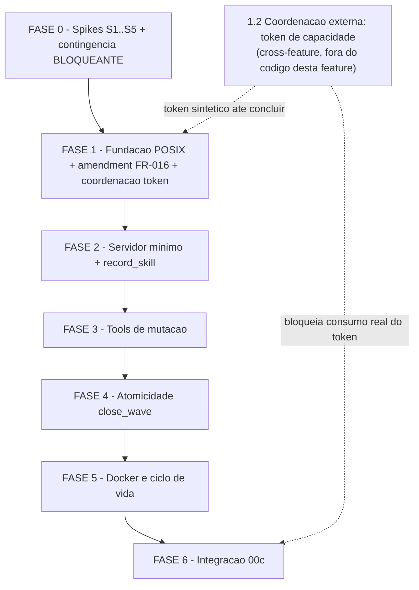

# Tarefas state-mcp-server - Servidor MCP de Estado das Execucoes 00C

Escopo: expor as mutacoes de estado de `agente-00c`/`feature-00c` (decisoes,
ondas, tasks, bloqueios humanos, skills invocadas) como tools MCP com
contrato validado, delegando sempre aos helpers POSIX ja existentes em
`global/skills/agente-00c-runtime/scripts/` — nunca reimplementando regra de
estado em TypeScript. Backlog derivado de `spec.md` + `plan.md` +
`research.md` + `data-model.md` + `quickstart.md` + `contracts/*` e dos
achados acionaveis dos 3 checklists (`checklists/api.md`,
`checklists/security.md`, `checklists/operational.md`).

**Legenda de status:**
- `[ ]` Pendente
- `[~]` Em andamento
- `[x]` Concluido
- `[!]` Bloqueado

**Legenda de criticidade:**
- `[C]` Critico - Impacto financeiro direto ou bloqueante
- `[A]` Alto - Funcionalidade essencial
- `[M]` Medio - Necessario mas sem urgencia imediata

**Legenda de ownership:**
- `{auto}` - executavel pelo `execute-task` sem intervencao humana
- `{humano}` - decisao que exige resposta do operador (bloqueio humano
  registrado via `bloqueios.sh register` antes de a fase seguinte iniciar)

---

## FASE 0 - Spikes Empiricos e Contingencia (BLOQUEANTE)

Nenhuma linha de codigo do servidor deve ser escrita antes destes spikes
(research.md §Spike Obrigatorio). S1 e o item decisivo: sem consumidor
(subagente) capaz de chamar a tool, a feature nao tem valor.

### 0.1 Decisao humana: contingencia se S1 falhar `[C]` {humano} — CONCLUIDO

Ref: checklists/operational.md CHK085

- [x] 0.1.1 Apresentar ao operador as duas alternativas identificadas em
      CHK085: (a) abandonar a feature, (b) reduzir escopo (ex.: so
      CLI/POSIX, sem consumidor subagente, mutacao continua so por Bash)
      — apresentado via `bloqueios.sh register` (block-002, onda 6)
- [x] 0.1.2 Registrar a decisao via `bloqueios.sh register` +
      `state-decisions.sh register` ANTES de iniciar a tarefa 0.3 (Spike S1)
      — respondido pelo operador via `/feature-00c-resume --resposta-bloqueio`
      (dec-033, onda 7): **A = reduzir-escopo**
- [x] 0.1.3 Criterio de escalada objetivo para 0.3 (resposta = "reduzir
      escopo"): se o Spike S1 falhar, a feature NAO e abandonada. Escopo
      passa a: tools MCP expostas como contrato equivalente ao CLI/POSIX
      atual (sem consumidor via subagente), mutacao de estado continua
      sendo feita via Bash pelos orquestradores como e hoje. **Nota da
      execucao de S1 (onda 7)**: o spike foi executado e teve resultado
      POSITIVO (subagente conseguiu chamar a tool MCP num processo `claude`
      novo — ver research.md §Resultados observados), entao esta
      contingencia NAO precisou ser acionada. Registrada aqui apenas como
      criterio ja resolvido.

### 0.2 Decisao humana: paralelizar F1 com F0 ou serializar `[M]` {humano} — CONCLUIDO

Ref: checklists/operational.md CHK084

- [x] 0.2.1 Apresentar ao operador o trade-off: F1 (fundacao POSIX,
      `mcp-session.sh` + `cstk mcp status`) nao depende do resultado de S1,
      mas o plano trata F0 como gate bloqueante da feature inteira
      (plan.md §Fases de implementacao) — apresentado via `bloqueios.sh
      register` (block-002, onda 6)
- [x] 0.2.2 Registrar a decisao via `state-decisions.sh register` —
      respondido pelo operador (dec-033, onda 7): **B = serializar**
- [x] 0.2.3 Aprovado **serializar**: FASE 1 aguarda F0 completa (spikes
      0.3-0.7 fechados) antes de iniciar. Nao ha paralelizacao.

### 0.3 Spike S1: subagente consegue chamar tool MCP? `[C]` {auto} — CONCLUIDO, RESULTADO: PASS

Ref: research.md §Spike Obrigatorio S1; quickstart.md Scenario 0.1;
plan.md §Riscos(1)

- [x] 0.3.1 Construido servidor stdio minimo com tools `ping`/`ping-raw`
      (`@modelcontextprotocol/sdk` + `zod`) em scratchpad da onda —
      descartavel, fora da arvore final e fora do repo cstk
- [x] 0.3.2 Registrado via `claude mcp add -s user` (escopo **user**, nao
      `project` — necessario para o servidor valer independente do cwd do
      processo `claude` de teste; ver desvio anotado abaixo) num
      projeto-alvo descartavel (`mktemp -d`)
- [x] 0.3.3 Spawnado subagente de teste: PRIMEIRO dentro desta MESMA sessao
      (via tool `Agent`) — resultado negativo, confundido por a sessao ja
      estar em curso antes do registro (ver S3). SEGUNDO, decisivo: processo
      `claude -p` NOVO (`--allowedTools "Task,mcp__state-mcp-spike-s1__ping"`)
      que usou a tool `Task` para spawnar um subagente `general-purpose`, que
      chamou a tool e reportou o literal `pong:subagent-nested-call`
- [x] 0.3.4 Decisao auditavel registrada (dec-035) com a saida observada
      como evidencia
- [x] 0.3.5 N/A — S1 NAO falhou; contingencia de 0.1 nao acionada

**Desvio do backlog original**: 0.3.2 previa `.mcp.json` em escopo
`project` no diretorio descartavel; usei `claude mcp add -s user` porque o
teste real precisa que o servidor esteja visivel independente do cwd da
sessao que o consome (a sessao/processo de teste roda separada do
diretorio do servidor). Escopo `project`/`.mcp.json` versionado e o alvo de
producao (FASE 1+); este spike so precisava confirmar o mecanismo de
descoberta de tool, que e o mesmo para ambos os escopos.

### 0.4 Spike S2: nome exato da tool na allowlist do subagente `[A]` {auto} — CONCLUIDO, RESULTADO: PASS

Ref: research.md §Spike Obrigatorio S2; quickstart.md Scenario 0.2

- [x] 0.4.1 Com S1 verde (no processo `claude -p` novo), pedido para listar
      (sem chamar) tools contendo "ping"/"mcp"/nome do servidor: retornou
      exatamente `mcp__state-mcp-spike-s1__ping`
- [x] 0.4.2 Allowlist restrita testada via `--allowedTools "mcp__state-mcp-spike-s1__ping"`
      (chamada direta no processo top-level) e via `--allowedTools "Task,mcp__state-mcp-spike-s1__ping"`
      (chamada indireta via subagente)
- [x] 0.4.3 Confirmado: chamada funciona com a allowlist restrita ao nome
      exato; nenhuma outra tool foi necessaria
- [x] 0.4.4 research.md atualizado: rotulo do padrao de nome mudou de
      `[NAO-VERIFICADO]` para `[OBSERVADO — CONFIRMADO]`; Decisao registrada
      (dec-036) com a evidencia literal

### 0.5 Spike S3: `.mcp.json` novo vale na sessao corrente? `[M]` {auto} — CONCLUIDO, RESULTADO: NAO (nao-bloqueante, como esperado)

Ref: research.md §Spike Obrigatorio S3 (nao-bloqueante); plan.md §Riscos(2)

- [x] 0.5.1 Com esta sessao ja aberta, registrado `claude mcp add -s user
      state-mcp-spike-s1 ...` e tentado usar via subagente spawnado na
      MESMA sessao (tool `Agent`)
- [x] 0.5.2 Resultado observado: a tool NAO apareceu no catalogo do
      subagente (`tools_relacionadas_encontradas: nenhuma`) — confirma que
      alteracoes de registro MCP nao valem em sessao ja em curso; reforca a
      necessidade da resolucao lazy por chamada (Decision 2 do research.md)
- [x] 0.5.3 Decisao registrada (dec-037) com a evidencia; nao bloqueou
      progresso (resultado esperado, desenho ja imune por construcao)

### 0.6 Spike S4: SDK aceita JSON Schema cru ou exige Zod? `[A]` {auto} — CONCLUIDO, RESULTADO: REJEITA (Zod obrigatorio)

Ref: research.md §Spike Obrigatorio S4; checklists/api.md CHK023

- [x] 0.6.1 Registrada tool `ping-raw` com `inputSchema` em JSON Schema
      cru: `McpServer.registerTool()` lancou
      `Error: inputSchema must be a Zod schema or raw shape, received an
      unrecognized object` em tempo de registro (antes de qualquer conexao)
- [x] 0.6.2 Registrada tool `ping` com `inputSchema` em Zod raw shape
      (`{ echo: z.string().optional() }`): funcionou normalmente
- [x] 0.6.3 Comparado: com Zod, chamada `{"echo": 123}` (tipo errado) foi
      rejeitada ANTES do handler (`isError:true`, `MCP error -32602: Input
      validation error...`); com JSON Schema cru nem chega a registrar
- [x] 0.6.4 Zod fixado como dependencia obrigatoria de
      `mcp/state-server/package.json` (nao ha alternativa via JSON Schema
      cru na API `registerTool()` de alto nivel); Decisao registrada
      (dec-038) com a evidencia (stack trace literal)

### 0.7 Spike S5: helpers POSIX sob busybox (alpine)? `[A]` {auto} — CONCLUIDO, RESULTADO: ALPINE CONFIRMADO

Ref: research.md §Spike Obrigatorio S5; quickstart.md Scenario 0.3;
plan.md §Riscos(3)

- [x] 0.7.1 Usada imagem `node:20-alpine` ja cacheada localmente (equivalente
      a "minima com jq/sqlite instalados" — pacotes instalados via
      `apk add --no-cache jq sqlite bash git coreutils` num container
      efemero, sem alterar a imagem base)
- [x] 0.7.2 Rodado dentro do container o subset `tests/run.sh
      state-rw|state-ondas|state-decisions|bloqueios`
- [x] 0.7.3 Comparado com o host: 1a rodada encontrou 2 falhas (root ignora
      `chmod` em teste de permissao; `otel-usage.sh` exige `curl`, ausente
      na imagem base) — ambas isoladas como artefatos do AMBIENTE DE TESTE
      (root + dependencia faltante), nao do codigo. Rodadas de confirmacao
      (usuario nao-root via `adduser -D`; `curl` instalado): **291/291
      cenarios passam, 0 fail** nos 4 arquivos
- [x] 0.7.4 N/A — nao houve divergencia real de comportamento sob
      busybox/alpine; base mantida
- [x] 0.7.5 Decisao final registrada (dec-039): alpine CONFIRMADO como base
      viavel para o Dockerfile de producao do `mcp/state-server`, com nota
      de que o Dockerfile precisa incluir `curl` no set de pacotes SE algum
      componente depender de `otel-usage.sh`

---

## FASE 1 - Fundacao POSIX e Coordenacao Externa

### 1.1 Amendment: reescrever FR-016 no spec.md `[A]` {auto}

Ref: checklists/security.md CHK036; dec-023 (onda-004); dec-021 (onda-003,
block-001)

- [x] 1.1.1 Reler o texto atual de FR-016 (spec.md, "cada uma MUST receber
      sua propria instancia/**porta** de servidor MCP isolada")
- [x] 1.1.2 Reescrever para a releitura ja aprovada pelo operador
      (dec-021): isolamento por **container + token de capacidade** em
      transporte `stdio` **sem porta**, preservando a garantia de
      confinamento de FR-008
- [x] 1.1.3 Adicionar nota de rastreabilidade da mudanca (referenciar
      dec-021/dec-023 no changelog da spec, se a spec tiver secao de
      historico; senao, deixar rastro so na Decisao desta task)
- [x] 1.1.4 Revisar `contracts/mcp-session-lifecycle.md` §Nota de
      autenticacao para confirmar que o texto ja reflete a mesma leitura
      (nao deve exigir mudanca, apenas checagem de consistencia)
- [x] 1.1.5 Rodar `analyze` (ou checagem manual equivalente) para
      confirmar que spec.md e plan.md deixaram de divergir apos o
      amendment

### 1.2 Coordenacao cross-feature: token de capacidade pelos commands pai `[C]` {humano}

Ref: checklists/security.md CHK031; plan.md §Bloqueio humano item 1;
dec-021 (aprovado em block-001)

- [x] 1.2.1 Registrar formalmente que a geracao e injecao do token de
      capacidade (SEC-H3: `session_id` >= 128 bits CSPRNG, `chmod 600`,
      injetado pelo pai no spawn do orquestrador) em
      `/agente-00c`, `/feature-00c` e seus `-resume` **nao e implementada
      dentro desta feature** — e uma dependencia externa cujo merito ja
      foi aprovado pelo operador (dec-021), mas cujo trabalho de artefato
      (editar `global/commands/agente-00c*.md`,
      `global/commands/feature-00c*.md`) fica fora do escopo de codigo de
      `state-mcp-server`
- [x] 1.2.2 Coordenar com o operador QUANDO essa mudanca nos commands pai
      sera feita (feature separada / PR separado) e se ha uma janela
      minima antes de F6 (Integracao 00c) precisar dela
- [x] 1.2.3 Registrar Decisao (`state-decisions.sh register`) apontando o
      short-name/PR de destino dessa coordenacao, ou o bloqueio explicito
      se ainda nao houver destino definido
- [x] 1.2.4 **Gate**: as tasks 1.3 (mcp-session.sh) e 6.2/6.3 (integracao
      com commands pai) MUST tratar a ausencia do token real como caso
      esperado durante o desenvolvimento desta feature (usar token
      sintetico nos testes) — a consumacao end-to-end do token real so e
      possivel apos esta coordenacao externa concluir

### 1.3 `mcp-session.sh`: resolucao da execucao ativa `[A]` {auto}

Ref: plan.md §Project Structure;
contracts/mcp-session-lifecycle.md §Resolucao da execucao ativa;
SEC-H3 (roteamento por capacidade, fail-closed)

- [x] 1.3.1 Criar `global/skills/agente-00c-runtime/scripts/mcp-session.sh`
      com subcomando de resolucao: dado um token/`session_id`, localizar o
      `state-dir` correspondente
- [x] 1.3.2 Implementar fail-closed: token ausente/invalido ⇒ erro
      explicito, nunca fallback silencioso para "execucao ativa por
      precedencia" (precedencia so vale para consulta read-only, nunca
      para mutacao — SEC-H3)
- [x] 1.3.3 Aceitar token sintetico via variavel de ambiente/arquivo para
      viabilizar testes sem depender da coordenacao externa (1.2)
- [x] 1.3.4 Criar `tests/test_mcp-session.sh` cobrindo: token valido,
      token ausente, token invalido, dois state-dirs concorrentes (nao
      deve haver vazamento entre eles)
- [x] 1.3.5 Rodar `./tests/run.sh test_mcp-session` e confirmar verde

### 1.4 `cstk mcp status` (fundacao de `cli/lib/mcp.sh`) `[A]` {auto}

Ref: plan.md §Project Structure; contracts/mcp-session-lifecycle.md
`cstk mcp status`; FR-015

- [x] 1.4.1 Criar `cli/lib/mcp.sh` com o subcomando `status
      [--state-dir DIR] [--project-path PATH]` (ativo / parado /
      indisponivel), sem exigir Docker rodando ainda (F5 adiciona o
      container real)
- [x] 1.4.2 Adicionar `mcp)` ao dispatch de `cli/cstk`
- [x] 1.4.3 Criar `tests/cstk/test_mcp.sh` cobrindo `status` nos 3 estados
- [x] 1.4.4 Rodar `./tests/run.sh --check-coverage` e confirmar que os
      dois `.sh` novos desta fase (`mcp-session.sh`, `mcp.sh`) tem teste
      correspondente

---

## FASE 2 - Servidor Minimo

### 2.1 Decisao humana: auto-atestacao do log e aceitavel? `[M]` {humano} — CONCLUIDO, RESULTADO: ACEITO

Ref: checklists/security.md CHK057; plan.md §Seguranca "Auto-atestacao do
log (limite conhecido)"

- [x] 2.1.1 Apresentar ao operador o limite conhecido: a linha de
      auditoria e escrita pelo mesmo processo que executa a mutacao; um
      servidor comprometido poderia suprimir o proprio rastro
- [x] 2.1.2 Perguntar se e aceitavel no modelo de ameaca atual (container
      confiavel por construcao, adversario = conteudo lido pelo LLM) ou se
      a auditoria exige testemunha externa (ex.: watcher de arquivo fora
      do container) antes do primeiro uso real
- [x] 2.1.3 Registrar Decisao; se "exige testemunha externa", abrir gap
      explicito a ser resolvido antes de F6 (nao implementado nesta
      feature se sair do MVP aprovado) — bloqueio block-003 registrado
      (dec-049) e RESPONDIDO pelo operador (dec-053):
      `aceitar-auto-atestacao-sem-testemunha`. Nenhum gap de testemunha
      externa aberto; o limite permanece documentado como aceito
      (ver 2.3.6)

### 2.2 Bootstrap `McpServer` + transporte stdio + tool `record_skill` `[A]` {auto}

Ref: plan.md §Fases de implementacao F2; contracts/mcp-tools.md
`record_skill`

- [x] 2.2.1 Inicializar `mcp/state-server/` com `package.json` +
      `package-lock.json` (lock obrigatorio — build falha sem ele),
      `@modelcontextprotocol/sdk` como dependencia — instalado via
      `docker run --network=host node:22.17.0 npm ci` (guard de
      package-manager do host bloqueia `npm install`/`npm ci` direto,
      mesmo caminho aprovado do spike S4/S5); versoes verificadas via
      `npm view` (`@modelcontextprotocol/sdk@1.30.0`, `zod@4.4.3`,
      `typescript@7.0.2` — latest real do dia, compilador nativo Go)
- [x] 2.2.2 Implementar `mcp/state-server/src/index.ts`: bootstrap do
      `McpServer` + transporte `stdio`, fail-closed no startup se a
      sessao nao resolver (SessionMismatchError)
- [x] 2.2.3 Implementar `mcp/state-server/src/session/resolve.ts`:
      le o token/`session_id` e delega a `mcp-session.sh` (1.3) — nenhuma
      reimplementacao da regra de resolucao em TS
- [x] 2.2.4 Implementar `mcp/state-server/src/runtime/exec.ts` (versao
      inicial): invocacao de helper POSIX via `execFile`/`spawn` com
      **array de argv** e `shell: false` (SEC-H1 — nunca `exec`,
      `execSync`, `shell: true` ou crase); inclui parser do envelope
      `DIAG|severity|code|message|fix` emitido por `_diag.sh`
- [x] 2.2.5 Implementar a tool `record_skill` (`mcp/state-server/src/tools/record_skill.ts`)
      delegando a `state-ondas.sh record-skill`, com `inputSchema`
      validando os campos allowlist (SEC-M2 — nenhum id inicia com `-`);
      corrigido `result.wave_id` (proposta) -> `result.skills_invoked_count`
      e a regex de allowlist para `^[A-Za-z0-9][A-Za-z0-9._-]{0,63}$`
      apos leitura do codigo real do helper (dec-050, contracts/mcp-tools.md
      atualizado no mesmo commit)
- [x] 2.2.6 Criar `mcp/state-server/test/` com `node:test` cobrindo o
      bootstrap e a tool `record_skill` (happy path + rejeicao de schema)
      — `index.test.ts`, `resolve.test.ts`, `record_skill.test.ts`, com
      fixtures POSIX reais em `test/fixtures/` (execFile de verdade, sem
      mocks); 21/21 testes verdes (`npm test` via docker node:22.17.0)
- [x] 2.2.7 Adicionar assercao estatica no teste: grep no codigo-fonte
      proibindo `exec(`, `execSync(`, `shell: true`, template string em
      chamada de processo (SEC-H1) — `test/static-security.test.ts`

### 2.3 `audit/log.ts`: enforcement-log.jsonl (scrub -> truncate) `[A]` {auto} — CONCLUIDO

Ref: plan.md §Summary item 5; SEC-M1; SEC-M3; contracts/mcp-tools.md
§Controles de seguranca

- [x] 2.3.1 Implementar `mcp/state-server/src/audit/log.ts`: linha de
      auditoria com `source` proprio, timestamp, ferramenta chamada,
      sessao/execucao de origem, resultado (aceita/rejeitada + motivo) —
      `appendAuditRecord()`, campos conforme data-model.md §Entity: Tool
      Invocation Audit Record (`source="mcp-state-tool"`)
- [x] 2.3.2 Aplicar a ordem obrigatoria **scrub -> truncate -> serialize**
      (research.md D6): nunca montar a linha por `printf`/concatenacao —
      usar serializador JSON real (SEC-M3, previne log injection via
      `"`/`\n`) — `JSON.stringify` real; scrub via
      `secrets-filter.sh scrub` (stdin, novo suporte em `runHelper` com
      `options.stdin`) ANTES de truncar `reason`/`arguments_digest`
- [x] 2.3.3 Truncar stderr do helper por code point a um teto de 2 KiB
      antes de devolver ao contexto do LLM (SEC-M1) — logica ja existente
      em `tools/record_skill.ts` (task 2.2.5, `sanitizeHelperReason`)
      extraida para `mcp/state-server/src/runtime/sanitize.ts`
      (`sanitizeForLlmContext`/`truncateUtf8ByteBudget`) e reusada por
      `audit/log.ts` para o `reason` persistido no log (FR-006 — mesma
      disciplina de sanitizacao aplicada ao que vai para disco)
- [x] 2.3.4 Bind-mount do **arquivo** `enforcement-log.jsonl` (nunca do
      diretorio `.claude`) — preparar a interface aqui; a montagem real
      do container e task 5.2 (SEC-H2) — `resolveEnforcementLogPath()`
      em `runtime/exec.ts`, default `/data/enforcement-log.jsonl`
      [VERIFICADO: `contracts/mcp-session-lifecycle.md` §Montagens],
      override via `CSTK_MCP_ENFORCEMENT_LOG_PATH`
- [x] 2.3.5 Testes `node:test`: linha serializada corretamente com
      caracteres hostis (`"`, `\n`, `\t`) no input; teto de 2 KiB
      respeitado; ordem scrub->truncate->serialize verificada por teste,
      nao so por leitura de codigo — `test/audit-log.test.ts` (10
      cenarios, incl. 2 adversariais: segredo na fronteira exata do teto
      de 2 KiB do `reason` e dos 500 code points do `arguments_digest`,
      confirmando que nenhum fragmento sobrevive) + `test/sanitize.test.ts`
      (8 cenarios das primitivas extraidas); 39/39 testes verdes
      (`npm test` via docker node:22.17.0)
- [x] 2.3.6 Aplicar a decisao de 2.1 (auto-atestacao) se ela introduziu
      algum requisito adicional de rastreabilidade — dec-053 confirma que
      NENHUM requisito adicional foi introduzido (nao exige testemunha
      externa); `audit/log.ts` documenta o limite aceito no cabecalho,
      sem implementar (nem simular) um watcher externo

---

## FASE 3 - Tools de Mutacao

### 3.1 Decisao humana: escopo correto das 6 tools do MVP `[M]` {humano} — CONCLUIDO

Ref: checklists/api.md CHK027

- [x] 3.1.1 Apresentar ao operador a lista das 6 tools (`record_skill` ja
      implementada em F2; `record_decision`, `open_wave`, `close_wave`,
      `record_task`, `register_human_block` restantes) e a lista de
      "nao-tools" declaradas em `contracts/mcp-tools.md`
      §Nao-tools (status do servidor, escrita em knowledge.db,
      lock, `state-rw.sh set` generico) — apresentado via block-004
- [x] 3.1.2 Perguntar se alguma operacao hoje listada como "nao-tool"
      deveria entrar antes do primeiro uso real — respondido via
      block-004 + clarificacao AskUserQuestion
- [x] 3.1.3 Registrar Decisao confirmando o escopo (ou ajustando-o) ANTES
      de iniciar 3.6-3.9 — dec-064 (score 3): escopo EXPANDIDO com
      exatamente UMA tool adicional, `get_status` (read-only, consulta
      status do servidor/execucao). As outras 3 nao-tools permanecem
      fora (knowledge.db read-only, lock do command pai, sem
      `state-rw set` generico)

### 3.2 Decisao humana: nivel de detalhe do `reason` de erro `[M]` {humano} — CONCLUIDO

Ref: checklists/api.md CHK026

- [x] 3.2.1 Apresentar ao operador o trade-off: `reason` = stderr do
      helper (scrubbed, <= 2 KiB) reintroduz mais texto no contexto do
      LLM (risco LLM05) vs. `reason` = so codigo de erro enumerado (menos
      informativo para o orquestrador decidir o proximo passo) —
      apresentado via block-004
- [x] 3.2.2 Registrar Decisao; o resultado direciona o formato de
      `Errors` a implementar em 3.6-3.9 e 4.1 — dec-064 (score 3):
      MANTER reason = stderr do helper scrubbed (SEC-M1), exigido pelo
      criterio de motivo acionavel de dec-059/FR-009

### 3.3 Resolver ambiguidade CHK007: criterio de "motivo acionavel" (FR-009) `[A]` {auto} — CONCLUIDO

Ref: checklists/api.md CHK007; spec.md FR-009

- [x] 3.3.1 Definir criterio objetivo e verificavel de equivalencia entre
      o erro do script manual e o erro da tool (ex.: mesmo codigo de
      invariante + mesma informacao minima, nao necessariamente o mesmo
      texto literal) — 3 condicoes verificaveis (invariante 1:1 citada,
      identificador preservado via padrao `${code}: ${diagnostico}`,
      stage correto)
- [x] 3.3.2 Documentar o criterio em `contracts/mcp-tools.md` (nova
      subsecao ou nota em cada `### Errors`) — nova subsecao "Criterio de
      equivalencia de `reason` (FR-009 / CHK007)"
- [x] 3.3.3 Registrar Decisao com o criterio adotado — dec-059

### 3.4 Resolver ambiguidade CHK025: quantificar o conjunto de SC-001 `[M]` {auto} — CONCLUIDO

Ref: checklists/api.md CHK025; spec.md SC-001

- [x] 3.4.1 Definir quantas execucoes de teste, quais fases e quais
      backends (json/sqlite) compoem o conjunto sobre o qual a taxa "cai a
      zero" e medida — 15 execucoes (Scenarios 1-9, exclui spikes 0.1-0.3;
      1/2/3/4/5/9 dual-backend + 6/7/8 backend default)
- [x] 3.4.2 Atualizar SC-001 no spec.md com a quantificacao — feito
- [x] 3.4.3 Registrar Decisao — dec-060

### 3.5 Gap CHK004: estrategia de versionamento de schema de tool `[M]` {auto} — CONCLUIDO

Ref: checklists/api.md CHK004

- [x] 3.5.1 Definir o que acontece quando um `inputSchema` muda e um
      orquestrador antigo chama a versao nova (ex.: campo novo opcional
      com default seguro nunca quebra; campo removido/renomeado exige
      bump de versao do servidor documentado em CHANGELOG) — SemVer via
      `SERVER_VERSION` ja existente; aditivo=PATCH/MINOR, breaking=MAJOR
- [x] 3.5.2 Documentar a politica em `contracts/mcp-tools.md` (nova
      secao "Versionamento de contrato") — feito
- [x] 3.5.3 Registrar Decisao — dec-061

### 3.6 Tool `record_decision` `[A]` {auto} — CONCLUIDO

Ref: contracts/mcp-tools.md §Tool: record_decision

- [x] 3.6.1 Implementar `mcp/state-server/src/tools/record_decision.ts`
      delegando a `state-decisions.sh register`
- [x] 3.6.2 `inputSchema` com allowlist de campos (SEC-M2) e validacao de
      score >= 3 exigindo `evidencia` (paridade com a trava do helper —
      dupla checagem no schema nao substitui a checagem do helper, apenas
      falha mais cedo) — via `.superRefine()`, exportado como
      `recordDecisionInputSchema` (schema completo, nao so a `shape` —
      necessario para o SDK aplicar o refine ANTES do handler)
- [x] 3.6.3 Mapear campos ingles -> flags portugues — inline no proprio
      handler (`record_decision.ts`), mesmo padrao ja usado por
      `record_skill.ts`; a consolidacao COMPLETA cross-tool em `exec.ts`
      permanece tarefa de 3.10 (nao feita nesta onda)
- [x] 3.6.4 Implementar `### Errors` do contrato (score 3 sem evidencia,
      etc) conforme o formato decidido em 3.2 — `EVIDENCE_REQUIRED`,
      `TEXT_TOO_SHORT`, `SCORE_OUT_OF_RANGE`, `CONSTITUTION_CONFLICT_SCORE`
- [x] 3.6.5 Testes `node:test`: happy path, score 3 sem evidencia
      (rejeicao), campos allowlist violados — 15 casos em
      `test/record_decision.test.ts`

### 3.7 Tool `open_wave` `[A]` {auto} — CONCLUIDO

Ref: contracts/mcp-tools.md §Tool: open_wave

- [x] 3.7.1 Implementar `mcp/state-server/src/tools/open_wave.ts`
      delegando a `state-ondas.sh start`
- [x] 3.7.2 `inputSchema` (so `session_id`) + mapeamento inline (ver nota
      3.6.3)
- [x] 3.7.3 Implementar `### Errors` (`WAVE_ALREADY_OPEN` via precondicao
      `wave-status`, `HELPER_FAILED`)
- [x] 3.7.4 Testes `node:test`: happy path, onda ja aberta (rejeicao,
      `start` nunca invocado), SESSION_MISMATCH, falha de leitura —
      5 casos em `test/open_wave.test.ts`

### 3.8 Tool `record_task` (+ fix CHK016) `[A]` {auto} — CONCLUIDO

Ref: contracts/mcp-tools.md §Tool: record_task; checklists/api.md CHK016;
spec.md FR-004 (idempotencia), FR-009

- [x] 3.8.1 Implementar `mcp/state-server/src/tools/record_task.ts`
      delegando a `state-ondas.sh record-task` (upsert idempotente por
      `task_id`)
- [x] 3.8.2 `inputSchema` (exportado como `recordTaskInputSchema` com
      `.superRefine()`, mesmo racional de 3.6.2) + mapeamento inline (ver
      nota 3.6.3)
- [x] 3.8.3 **Fechou o gap CHK016**: `WAVE_ID_NOT_FOUND` para `wave_id`
      explicito que nao corresponde a nenhuma onda existente — checado
      pela tool via `state-rw.sh get --field '(.waves // []) | map(.id)'`
      ANTES de delegar. Correcao adicional descoberta na implementacao
      (Principio VI): o helper `record-task` **nao** checa onda aberta
      sozinho [VERIFICADO: `state-ondas.sh:1026-1029`] — a tool tambem
      impos `NO_OPEN_WAVE` como precondicao (nao so `WAVE_ID_NOT_FOUND`)
- [x] 3.8.4 Atualizado `contracts/mcp-tools.md` §Tool: record_task
      §Errors com `WAVE_ID_NOT_FOUND` + `NO_OPEN_WAVE` corrigido +
      `result.operation` substituido por `result.tasks_total_count`
      (correcao empirica, mesmo padrao de `record_skill.ts`)
- [x] 3.8.5 Testes `node:test`: happy path, `NO_OPEN_WAVE`,
      `WAVE_ID_NOT_FOUND` (novo codigo), wave_id existente (prossegue),
      `TESTS_PASSED_EXCEEDS_RUN` (schema + defesa em profundidade),
      touched_files inseguro (absoluto/traversal) — 15 casos em
      `test/record_task.test.ts`

### 3.9 Tool `register_human_block` `[A]` {auto} — CONCLUIDO

Ref: contracts/mcp-tools.md §Tool: register_human_block

- [x] 3.9.1 Implementar `mcp/state-server/src/tools/register_human_block.ts`
      delegando a `bloqueios.sh register`
- [x] 3.9.2 `inputSchema` + mapeamento inline (ver nota 3.6.3). Correcao
      empirica (Principio VI): `question` exige >= 20 chars no helper real
      [VERIFICADO: `bloqueios.sh:155-158`], nao "min 1" como o contrato
      [PROPOSTA] original dizia — corrigido no schema e no contrato
- [x] 3.9.3 Implementar `### Errors` do contrato — `DECISION_NOT_FOUND`
      (deteccao por substring no stderr, sem envelope DIAG — nao
      alcancavel via `_diag.sh` neste helper)
- [x] 3.9.4 Testes `node:test`: happy path (com `execution_status`
      verificado), campos obrigatorios ausentes/curtos, SESSION_MISMATCH,
      DECISION_NOT_FOUND — 7 casos em `test/register_human_block.test.ts`

### 3.11 Tool `get_status` (read-only) `[A]` {auto} — CONCLUIDO

> Task nova, fora do backlog original de FASE 3: escopo aprovado pelo
> operador via block-004/dec-064 (task 3.1) DEPOIS de `tasks.md` ter sido
> gerado por `create-tasks` — nao existia FR/tarefa previa para esta tool.
> Registrada aqui para auditabilidade (Principio I: todo trabalho executado
> tem uma task rastreavel).

Ref: contracts/mcp-tools.md §Tool: get_status; dec-064

- [x] 3.11.1 Implementar `mcp/state-server/src/tools/get_status.ts`:
      compoe 5 leituras READ-ONLY (`state-rw.sh get` x2, `state-ondas.sh
      wave-status`/`current-id`, `bloqueios.sh count --pending-only`)
- [x] 3.11.2 `inputSchema` (so `session_id`) + documentar em
      `contracts/mcp-tools.md` (nova secao "Tool: get_status" + ajuste de
      §Nao-tools removendo a linha promovida)
- [x] 3.11.3 Implementar `### Errors` — `HELPER_FAILED` unico (qualquer
      leitura falhar rejeita o todo; nunca fabrica campo)
- [x] 3.11.4 Testes `node:test`: happy path (5 leituras compostas),
      SESSION_MISMATCH, falha de uma leitura — 4 casos em
      `test/get_status.test.ts`
- [x] 3.11.5 Registrar em `src/index.ts` (`SERVER_VERSION` 0.1.0 ->
      0.2.0, bump MINOR — mudanca aditiva, `contracts/mcp-tools.md`
      §Versionamento de contrato)

### 3.10 Mapper `exec.ts` completo + rejeicoes tipadas cross-tool `[A]` {auto} — CONCLUIDO (onda 13)

> **Nota de conclusao (onda 13)**: `runtime/identifiers.ts` (task 3.6) ja
> consolidava os padroes de allowlist (SEC-M2). Esta task consolidou o que
> faltava: `FIELD_TO_FLAG_TABLE` (tabela declarativa cross-tool, exportada
> por `exec.ts`) + `McpToolError`/`formatToolError` (tipo de erro comum). A
> logica IMPERATIVA de `args.push(...)` de cada tool foi mantida local a
> cada `tools/*.ts` (ja testada individualmente, 82/82 verdes) — a tabela e
> o REGISTRO auditavel verificado por teste de paridade
> (`test/exec-mapper-parity.test.ts`), nao o gerador do argv. `close_wave`
> ja entrou na tabela por antecipacao (mapeamento documentado ANTES do
> arquivo existir); a task 4.1 remove a excecao `TOOLS_WITHOUT_SOURCE_YET`
> ao criar `tools/close_wave.ts`.

Ref: plan.md §Convencoes de Borda "Mapper layer (tool <-> helper)"

- [x] 3.10.1 Consolidar em `exec.ts` a tabela explicita de mapeamento
      campo-ingles -> flag-portugues usada por todas as tools de 3.6-3.9
      (nao ha mapeamento automatico por convencao — e tabela explicita)
      <!-- FIELD_TO_FLAG_TABLE em src/runtime/exec.ts, cobre tambem
      record_skill (2.2), get_status (3.11) e close_wave (4.1, antecipado) -->
- [x] 3.10.2 Garantir que TODO campo opcional do schema chega ao helper
      quando presente (risco especifico documentado em plan.md
      §Convencoes de Borda: "falha em silencio" — schema aceita, helper
      grava sem o campo, nada quebra)
      <!-- test/exec-mapper-parity.test.ts: assercao estatica confirma que
      toda flag != null da tabela aparece como literal `args.push(...)` no
      arquivo-fonte da tool correspondente -->
- [x] 3.10.3 Teste de paridade: para cada tool, listar campos do
      `inputSchema` e confirmar que todos tem entrada na tabela de
      mapeamento (falha se algum campo ficar orfao)
      <!-- test/exec-mapper-parity.test.ts, 1 teste por tool + checagem de
      duplicata -->
- [x] 3.10.4 Definir tipo de erro comum (`McpToolError`) reutilizado por
      todas as tools, com `code` enumerado + `message` (formato decidido
      em 3.2)
      <!-- McpToolError + formatToolError em src/runtime/exec.ts;
      formato serializado "${code}: ${message}" identico ao anterior
      (dec-059/dec-064) — zero mudanca de comportamento observavel,
      82 testes pre-existentes continuam verdes -->

---

## FASE 4 - Atomicidade

### 4.1 Tool `close_wave` com pre-imagem/compensacao `[C]` {auto} — CONCLUIDO (onda 13)

Ref: contracts/mcp-tools.md §Tool: close_wave; plan.md §Summary item 3;
research.md D3; quickstart.md Scenario 5

> **Notas de correcao empirica (Principio VI, onda 13)** — `close_wave.ts`
> documenta as 3 no cabecalho do arquivo:
> 1. o backup da onda usa `state-rw.sh read` (backend-agnostico
>    [VERIFICADO: `_sr_cmd_read`]) em vez de `cat state.json` (so
>    funcionaria sob backend json).
> 2. `result.state_sha256` corrigido para `string | null` — `null` sob
>    backend sqlite (C7/dec-025: nao ha hash derivado a manter la).
> 3. A ORDEM implementada e a de research.md Decision 3 (pre-imagem ->
>    wave-backup -> `end` -> sha256-update), que ja REJEITA explicitamente
>    a ordem inversa ("Alternatives considered"). A task 4.2.3 original
>    descrevia o teste de falha simulada com fraseado que sugeria a ordem
>    inversa (end-entao-backup) — reescrita abaixo para casar com a ordem
>    realmente ratificada/implementada.

- [x] 4.1.1 Implementar `mcp/state-server/src/tools/close_wave.ts`
      delegando a `state-ondas.sh end`
- [x] 4.1.2 Implementar pre-imagem: capturar estado antes da mutacao
      (backup da onda + hash) para permitir compensacao caso qualquer um
      dos efeitos fora do banco (backup em disco, `sha256-update`) falhe
      apos a escrita no banco
      <!-- capturePreImage/restorePreImage: state.json+.sha256 (backend
      json) ou state.db+wal+shm (backend sqlite), mkdtemp em os.tmpdir() -->
- [x] 4.1.3 Implementar a logica de compensacao: se backup ou hash
      falharem apos o `state-ondas.sh end` gravar, reverter para um
      estado observavel consistente (nunca deixar o banco "fechado" com
      backup ausente ou hash desatualizado)
      <!-- rollback() restaura a pre-imagem e responde CLOSE_ROLLED_BACK;
      testado empiricamente (bytes em disco, nao so o retorno da tool) em
      test/close_wave.test.ts -->
- [x] 4.1.4 `inputSchema` + mapeamento de campos em `exec.ts`
      <!-- closeWaveInputShape (task 4.1) + FIELD_TO_FLAG_TABLE (task 3.10,
      antecipado) -->
- [x] 4.1.5 Implementar `### Errors` do contrato (onda ja fechada, etc)
      <!-- NO_OPEN_WAVE, INVALID_TERMINATION_REASON, INVALID_STAGE_TOKEN
      (schema + defesa em profundidade), CLOSE_ROLLED_BACK, HELPER_FAILED -->

### 4.2 Testes de atomicidade cross-backend `[A]` {auto} — CONCLUIDO (onda 13)

Ref: quickstart.md Scenario 5; plan.md Technical Context "Storage"

- [x] 4.2.1 Testes `node:test` de `close_wave` rodando contra backend
      `json`
- [x] 4.2.2 Testes `node:test` de `close_wave` rodando contra backend
      `sqlite` (state.db)
      <!-- deteccao de backend via presenca de state.db; result.state_sha256
      == null verificado -->
- [x] 4.2.3 Teste de falha simulada: interromper a sequencia ANTES da
      mutacao (falha no wave-backup ou na leitura backend-agnostica que o
      alimenta — nada em disco muda, `end` nunca e invocado) e DEPOIS da
      mutacao (falha no `sha256-update`; a fixture de `end` MUTA de
      verdade um `state.json` real em disco para provar que a compensacao
      restaura os bytes originais, nao so o retorno da tool) — confirmar
      compensacao observavel nos dois backends
      <!-- reescrita nesta onda para a ordem realmente implementada (ver
      nota de correcao empirica #3 em 4.1); backend sqlite coberto pelo
      teste 4.2.2 (mesmo codepath de rollback, backend-generico) -->
- [x] 4.2.4 Rodar `./tests/run.sh` (subset MCP) e confirmar verde nos
      dois backends
      <!-- `node --test dist/test/*.test.js` (build via docker, ver nota de
      execucao abaixo): 102/102 verdes, incluindo os 2 backends -->

---

## FASE 5 - Docker e Ciclo de Vida

### 5.1 Decisao humana: leitura da condicao (b) do carve-out 1.1.0 `[C]` {humano} — CONCLUIDO

Ref: checklists/operational.md CHK073; plan.md §Complexity Tracking linha
2; §Re-check de Constitution

RESULTADO (dec-074, resposta do operador a block-005, onda 14):
`leitura-permissiva-por-feature-sem-amendment` — condicao (b) e por PAR
(dependencia, feature); mencoes em guards/comentarios nao contam como
referenciar a dep; `mcp-docker.sh` pode ser criado SEM amendment. 5.1.3
(amendment) nao se materializa (leitura escolhida foi (a), nao (b)).
Nota de rastreabilidade tambem registrada em plan.md §Complexity Tracking.

- [x] 5.1.1 Apresentar ao operador as duas leituras possiveis da condicao
      "um unico arquivo identificavel" do carve-out 1.1.0 para a dep
      `docker`: (a) um arquivo **por feature** (precedente: `cstk serve`
      -> `serve-docker.sh`; esta feature -> `mcp-docker.sh`), ou (b) um
      arquivo **por dependencia** no repo inteiro (exigiria consolidar
      `serve-docker.sh` + `mcp-docker.sh`) — feito em block-005 (onda 14)
- [x] 5.1.2 Registrar Decisao com a leitura confirmada — dec-074
      (`leitura-permissiva-por-feature-sem-amendment`)
- [x] 5.1.3 **Se a leitura for (b)**: abrir amendment MINOR a
      constitution/carve-out ANTES de prosseguir para 5.2 — nao ha
      opt-out tacito de MUST (Decision Framework item 4); esta subtarefa
      so se materializa nesse cenario — N/A: operador adotou a leitura
      (a), amendment nao se aplica (dec-074)
- [x] 5.1.4 **Gate**: 5.2 (mcp-docker.sh) so inicia apos esta decisao
      estar registrada — liberado por dec-074

### 5.2 `mcp-docker.sh`: uso de Docker confinado `[A]` {auto} — CONCLUIDO

Ref: plan.md §Project Structure; §Analise do Principio II; SEC-H2

RESULTADO: `cli/lib/mcp-docker.sh` criado e validado empiricamente com
Docker real (daemon local, `--network=host`): build da imagem
(`node ci --ignore-scripts` + `npm run build`, sem toolchain nativo — deps
sao JS puro) e `docker run -d -i` com as 3 montagens contratadas
confirmadas em runtime (`/data/state` rw, `/opt/cstk/scripts` ro —
tentativa de escrita rejeitada pelo kernel, `/data/enforcement-log.jsonl`
rw com `chmod 600`), rootfs `--read-only` confirmado (escrita fora de
`/tmp` rejeitada), `/tmp` gravavel, usuario nao-root (`node`), zero porta
publicada. 25/25 cenarios verdes em `tests/cstk/test_mcp-docker.sh`
(`--check-coverage` verde).

- [x] 5.2.1 Criar `cli/lib/mcp-docker.sh` — TODO uso de `docker` desta
      feature fica confinado neste arquivo (condicao (b) do carve-out,
      conforme decisao de 5.1)
- [x] 5.2.2 Implementar montagens do container conforme
      `contracts/mcp-session-lifecycle.md` §Montagens: bind-mount do
      **arquivo** `enforcement-log.jsonl`, nunca do diretorio `.claude`
- [x] 5.2.3 Implementar teste estatico proibindo mount de `.claude`,
      `$HOME`, `/`, `docker.sock` (SEC-H2) — falha o build/teste se
      algum desses paths aparecer em qualquer chamada `docker run`/`-v`
- [x] 5.2.4 Aplicar `npm ci --ignore-scripts` (nunca `npm install`) no
      Dockerfile de build da imagem (SEC-M4); base pinada por digest
- [x] 5.2.5 Criar `tests/cstk/test_mcp-docker.sh` cobrindo as assercoes
      estaticas de flags proibidas (`--check-coverage` exige)

### 5.3 `cstk mcp start`/`stop` + health check `[A]` {auto} — CONCLUIDO

Ref: contracts/mcp-session-lifecycle.md `cstk mcp start`/`stop`;
§Health check; §status --live; FR-010, FR-011

RESULTADO: `cli/lib/mcp.sh` ganhou `start --state-dir DIR` e
`stop --state-dir DIR` (orquestram `mcp-docker.sh`, 5.2 — TODA invocacao
FUNCIONAL de `docker` permanece confinada la, dec-074) + `status --live`
(reverificacao de saude sem reiniciar, FR-010). Validado com **Docker
real** de ponta a ponta (build → run → health check MCP de verdade via
`get_status` → `stop` → `stopped` idempotente).

- **Gap 1 descoberto e corrigido** (bloqueava qualquer health check real):
  `mcp-session.sh resolve --project-path` faz tree-walk a partir do
  projeto-alvo, mas DENTRO do container so `/data/state` (flat) esta
  montado — o `CSTK_MCP_PROJECT_PATH` (path do HOST) nao existe la, entao
  o modo existente sempre falharia dentro do container. Corrigido de forma
  ADITIVA (zero regressao no modo `--project-path`): novo modo
  `mcp-session.sh resolve --state-dir DIR` (sem tree-walk, mesma
  autorizacao por token) + `resolve.ts` passa a usar esse modo quando
  `CSTK_MCP_STATE_DIR` esta presente no env + `_mcp_docker_run` exporta
  `CSTK_MCP_STATE_DIR=/data/state` no container.
- **Gap 2 descoberto e corrigido nesta task** (achado empirico com Docker
  real — `docker logs` de um container recem-subido acusando
  `SESSION_MISMATCH`): o processo PID1 (`index.ts::bootstrap`) resolve a
  propria sessao **uma vez no startup**, fail-closed — precisa achar
  `<state-dir>/mcp-server.json` com `session_id` ja no disco no instante
  em que o container sobe. `_mcp_cmd_start` foi corrigido para gravar o
  descritor **ANTES** do `docker run` (nao depois).
- **Gap 3 descoberto e corrigido nesta task** (mesma sonda real, 2a
  camada — `state-ondas.sh wave-status: state.json ausente em
  <path-do-host>`): `mcp-session.sh` no modo direto (`--state-dir`)
  ecoava `.state_dir` do PROPRIO descritor (sempre o path do HOST) em vez
  do `--state-dir` usado para localiza-lo (o mount `/data/state`, valido
  DENTRO do container). Toda tool MCP subsequente (que usa
  `session.stateDir`) recebia um path inexistente no container. Corrigido
  em `_ms_print_descriptor` (override opcional do `state_dir` impresso,
  aplicado so no modo direto — zero regressao no modo `--project-path`,
  sempre executado no HOST).
- **5.3.2 (health check) IMPLEMENTADO e calibrado empiricamente** (onda
  16, dec-081): `mcp/state-server/src/healthcheck.ts` — NUNCA
  `docker attach` ao PID1 real (mataria o servidor que deve sobreviver a
  execucao inteira, FR-010); sobe uma instancia EFEMERA como child
  process, handshake `initialize` + `tools/call get_status` real.
  `_mcp_docker_healthcheck` via `docker exec ... node dist/src/
  healthcheck.js`, timeout POSIX portavel, default **10s** (30s do
  contrato e o TETO, nao o default).
- **Primitiva de 5.4 adiantada** (onda 16): `_mcp_docker_list_managed` +
  label `cstk.mcp.state_dir=<host-path>` em `_mcp_docker_run` — pronta
  para a GC de orfaos (5.4.2).
- Testes: `tests/cstk/test_mcp.sh` estendido com 21 cenarios novos
  (start: docker-ausente/daemon-down/build-falho/run-falho/health-falho/
  contexto-ausente/happy-path/agente-00c vs feature-00c; stop: idempotente/
  ativo/bash-fallback; status --live: saudavel/morto-sem-reiniciar/sem-live-
  nao-chama-docker/mode-bash-fallback), todos com stub `docker` hermetico
  (mesma filosofia de `test_mcp-docker.sh`; PATH-sem-docker derivado
  dinamicamente do `PATH` real, nunca hardcoded — CLAUDE.md "PATH-stub nao
  esconde binario de /usr/bin"). `tests/test_mcp-session.sh` ajustado (1
  cenario) para o contrato corrigido do modo direto. 85/85 cenarios shell
  relacionados (`test_mcp.sh` 35 + `test_mcp-docker.sh` 32 + `test_mcp-
  session.sh` 18) + 109/109 `node:test` verdes; `--check-coverage` limpo;
  shellcheck limpo.

- [x] 5.3.1 Estender `cli/lib/mcp.sh` com `start --state-dir DIR` e
      `stop --state-dir DIR`, delegando a `mcp-docker.sh` (5.2) — gerar
      `session_id` CSPRNG >= 128 bits (`/dev/urandom`), escrever
      `mcp-server.json` (`chmod 600`), chamar
      `_mcp_docker_healthcheck` apos o `docker run` e ANTES de reportar
      sucesso (FR-011: "antes da primeira chamada de ferramenta");
      falha de health check ⇒ `mode=bash-fallback` +
      `unavailable_reason=health-timeout`, exit 3 (nunca aborta a
      execucao — FR-007)
- [x] 5.3.3 Implementar FR-010: sessao do servidor coextensiva com a
      execucao inteira — o servidor permanece ativo durante
      `Schedule intent` (pausas entre ondas); so encerra em estado
      terminal (`concluida`/`abortada`); em cada `-resume`,
      `status --live` reverifica saude SEM reiniciar
- [x] 5.3.4 Estender `tests/cstk/test_mcp.sh` com `start`/`stop`/health
      check (mock de `docker`, sem exigir Docker real na suite)

### 5.4 Gap CHK064: deteccao/limpeza de container orfao `[A]` {auto} — CONCLUIDO

Ref: checklists/operational.md CHK064; spec.md User Story 2

RESULTADO: **decisao (5.4.1)**: NAO replica a lacuna do lock (research.md:
"sem deteccao de stale") — custo assimetrico (lock preso so bloqueia a
proxima aquisicao; container orfao consome recursos do host indefinidamente
e sem sinal). `cstk mcp gc [--dry-run]` (comando DEDICADO, nao extensao de
`status` — remocao e mutante) implementado em `cli/lib/mcp.sh::_mcp_cmd_gc`,
reusando `_mcp_docker_list_managed`/label `cstk.mcp.state_dir` ja
disponiveis desde a task 5.3. Classifica cada container gerenciado por
estado do state-dir dono (terminal/ativo/ausente/sem-estado/sem-label) e
so remove os casos comprovadamente terminais ou sem state-dir — fail-safe
por design: container sem label OU com leitura de status indisponivel
NUNCA e removido por suposicao (Principio VI). Contrato documentado em
`contracts/mcp-session-lifecycle.md` §Limpeza de containers orfaos.
16/16 cenarios novos verdes em `tests/cstk/test_mcp.sh` (docker ausente/
daemon down/vazio/sem-label/state-dir-ausente/sem-estado/terminal
concluida+abortada/ativo-preservado/dry-run/rm-falha/rm-idempotente/
multiplos-agregados/flag invalida/wiring no `mcp_main`+usage); suite
completa do arquivo 52/52 (inclui tambem o cenario novo da task 5.5);
shellcheck limpo.

- [x] 5.4.1 Definir o mecanismo de deteccao de container remanescente
      quando o command pai termina sem chamar `stop` (crash, `kill -9`,
      sessao encerrada) — paridade com o lock, que hoje NAO tem deteccao
      de stale (research.md), entao esta feature decide se replica essa
      lacuna ou fecha
- [x] 5.4.2 Implementar limpeza (ex.: `cstk mcp status` ou um comando
      dedicado detecta containers com label da execucao cujo state-dir
      esta em estado terminal, e oferece/realiza cleanup)
- [x] 5.4.3 Atualizar `contracts/mcp-session-lifecycle.md` §Ciclo de vida
      documentando o caminho de limpeza
- [x] 5.4.4 Teste cobrindo deteccao de container orfao (mock de `docker
      ps`)

### 5.5 Gap CHK071: deteccao de queda do servidor no meio da onda `[A]` {auto} — CONCLUIDO

Ref: checklists/operational.md CHK071; spec.md FR-007, User Story 4
cenario 2

RESULTADO: contrato definido em `contracts/mcp-session-lifecycle.md`
§Deteccao de queda mid-onda: **gatilho** = tool MCP retorna erro de
transporte (nao um `outcome=rejected` de validacao normal); **tentativas**
= zero retries da MESMA chamada MCP + uma unica confirmacao via
`cstk mcp status --live` (reusa o health check real ja calibrado/testado
na task 5.3, sem reiniciar o container — FR-010); **comutacao** = se
confirmado indisponivel, o caminho Bash e usado para o RESTANTE da onda —
a mutacao que falhou nunca e reemitida via MCP, o orquestrador releh o
state.json antes de reemitir via Bash (idempotencia dos helpers). US4
cenario 2 ("estado nao fica pior") ja e satisfeito por dois mecanismos
PRE-EXISTENTES e agora citados explicitamente: (a) compensacao por
pre-imagem de `close_wave` (research.md Decision 3, verde desde a FASE 4)
cobre queda DENTRO da propria tool; (b) `reconcile-wave` (independente de
MCP) cobre o caso residual de o processo morrer sem chance de compensar —
nenhum mecanismo NOVO de recuperacao foi necessario, so a documentacao do
gatilho/tentativas/comutacao que faltava (a lacuna que CHK071 apontava).
Testes: `mcp/state-server/test/close_wave.test.ts` ganhou 1 cenario novo
(queda simulada apos a mutacao + nova tentativa fecha exatamente uma vez,
sem duplicar nem perder a mutacao — 11/11 verdes no arquivo, 110/110 na
suite `node:test` completa); `tests/cstk/test_mcp.sh` ganhou 1 cenario
novo provando que a confirmacao via `status --live` e uma UNICA sonda
`docker exec` (0 retries, nao um loop escondido).

- [x] 5.5.1 Definir o gatilho de deteccao (ex.: timeout de resposta da
      tool, ou falha de conexao stdio) para o caso em que a queda ocorre
      **apos** a primeira tool ja ter sido chamada nesta onda (FR-007 e
      US4 cenario 1 so cobrem deteccao **antes** de delegar)
- [x] 5.5.2 Definir o numero de tentativas e o ponto exato de comutacao
      para o caminho `Bash` — garantir que o estado nao fique pior (US4
      cenario 2)
- [x] 5.5.3 Documentar o gatilho + numero de tentativas em
      `contracts/mcp-session-lifecycle.md`
- [x] 5.5.4 Testes `node:test`/shell simulando queda no meio da onda e
      confirmando a comutacao sem duplicar nem perder mutacao

### 5.6 Decisao humana: aceitar SEC-M5/SEC-L1 no MVP? `[M]` {humano} — CONCLUIDO

Ref: checklists/security.md CHK056; plan.md §Seguranca linhas SEC-M5,
SEC-L1

RESULTADO: bloqueio `block-006` registrado (dec-091) com a analise
completa apresentada ao operador (texto literal de SEC-M5/SEC-L1 do
plan.md + CHK056), 2 opcoes e recomendacao nao-vinculante
(`aceitar-sem-mitigacao-adicional`, pelos controles compensatorios ja
verificados nesta feature — contrato de tool/enforcement-log/lock do pai
para SEC-M5; rotulo explicito "pos-MVP" no proprio plan.md para SEC-L1).
Operador respondeu `aceitar-sem-mitigacao-adicional` (dec-093, score 3,
block-006 `respondido`): SEC-M5 aceito com os controles compensatorios
existentes (contrato Zod da tool + `enforcement-log.jsonl` + lock do
pai cobrindo a onda inteira); SEC-L1 adiado para pos-MVP (sem teto de
chamadas por sessao; `budget.sh` ja orca a onda). FASE 6 liberada sem
subtask adicional de mitigacao.

- [x] 5.6.1 Apresentar ao operador: SEC-M5 (mutacao fora do
      `bash-guard`, mitigado por contrato de tool + enforcement-log +
      lock do pai) e SEC-L1 (sem teto de chamadas por tool/sessao,
      recomendado pos-MVP) — apresentado via block-006 (dec-091)
- [x] 5.6.2 Registrar Decisao de aceite de risco (ou de exigir mitigacao
      adicional antes de F6 liberar uso real) — dec-093,
      `aceitar-sem-mitigacao-adicional`, score 3

---

## FASE 6 - Integracao 00c

### 6.1 `cstk mcp install` (`.mcp.json`) `[A]` {auto} — CONCLUIDO

Ref: contracts/mcp-session-lifecycle.md `cstk mcp install`

RESULTADO: `_mcp_cmd_install` em `cli/lib/mcp.sh` reusa `merge_settings`/
`detect_jq`/`print_paste_block` de `hooks.sh` (sourced condicionalmente,
mesmo padrao de `mcp-docker.sh`) — `jq` permanece confinado a `hooks.sh`
(Constitution carve-out condicao b). `command` resolvido via
`_mcp_runtime_script_path mcp-launch.sh` (PATH -> repo -> `~/.claude`).
`mcp-launch.sh` resolve a sessao ativa por token de capacidade
(`mcp-session.sh resolve --project-path`, SEC-H3) e faz
`exec docker attach <container>`, entregando o stdio do harness
diretamente ao container detached subido por `cstk mcp start`. Validado
manualmente com stub `docker` (sucesso: `attach <container>`; falha:
sem token / token invalido / `mode=bash-fallback` / docker ausente —
todos exit != 0 sem chamar `docker attach`).

- [x] 6.1.1 Estender `cli/lib/mcp.sh` com
      `install [--project-path PATH] [--dry-run]`: grava a entrada
      `mcpServers` estatica no `.mcp.json` (escopo project) apontando
      para o entrypoint stdio
- [x] 6.1.2 Criar `global/skills/agente-00c-runtime/scripts/mcp-launch.sh`
      (entrypoint stdio do `.mcp.json`) — orquestra subir o
      container/processo e conectar o transporte
- [x] 6.1.3 Criar `tests/test_mcp-launch.sh` (exigido pelo
      `--check-coverage`) — 5 cenarios (sem token, token desconhecido,
      `mode=bash-fallback`, docker ausente, sucesso com attach)
- [x] 6.1.4 Estender `tests/cstk/test_mcp.sh` cobrindo `install`
      (idempotente, `--dry-run` nao escreve) — 7 cenarios novos

### 6.2 Integracao dos commands pai: chamada de status/start/stop `[A]` {auto}

Ref: plan.md §Fases de implementacao F6; §Fronteira lock+init
(CLAUDE.md); NAO inclui geracao/injecao do token (ver 1.2)

- [ ] 6.2.1 `/agente-00c` e `/feature-00c` (inicio): chamar `cstk mcp
      status`; se disponivel, `cstk mcp start` antes de spawnar o
      orquestrador
- [ ] 6.2.2 `/agente-00c-resume` e `/feature-00c-resume`: chamar `cstk mcp
      status` (paridade com FR-011) a cada retomada, sem
      parar/reiniciar o processo/container a cada pausa (FR-010)
- [ ] 6.2.3 Encerramento: `cstk mcp stop` somente quando a execucao
      atinge estado terminal (`concluida`/`abortada`)
- [ ] 6.2.4 Esta task **nao** implementa a geracao/injecao do token de
      capacidade (1.2, cross-feature) — usar o mesmo mecanismo de token
      sintetico de 1.3 ate a coordenacao externa concluir; documentar
      isso explicitamente no PR desta task

### 6.3 Fallback sem Docker (FR-007, FR-012, SC-004) `[A]` {auto}

Ref: quickstart.md Scenario 7; spec.md FR-007, FR-012

- [ ] 6.3.1 Confirmar que `cstk mcp status`/`start` retornando
      indisponivel faz o orquestrador cair no caminho `Bash` existente
      sem regressao funcional e sem intervencao manual
- [ ] 6.3.2 Testes cobrindo execucao headless/cron sem servidor MCP
      disponivel completando por `Bash` (SC-004)

### 6.4 Scenario 6 e Scenario 9: confinamento e roundtrip end-to-end `[C]` {auto}

Ref: quickstart.md Scenario 6, Scenario 9; FR-008, FR-016 (pos-amendment
1.1)

- [ ] 6.4.1 Scenario 6: duas execucoes concorrentes (`agente-00c` +
      `feature-00c`) no mesmo projeto-alvo — confirmar que nenhuma tool
      chamada numa sessao muta o estado da outra (com token real se 1.2
      ja tiver concluido; senao, com dois tokens sinteticos distintos
      simulando o isolamento)
- [ ] 6.4.2 Scenario 9: roundtrip completo preenchendo **todos** os
      campos opcionais de cada tool, comparando campo a campo nos
      **dois** backends (`json` e `sqlite`) — expõe o risco de campo
      opcional que nunca chega ao helper (plan.md §Convencoes de Borda)
- [ ] 6.4.3 Registrar Decisao com o resultado de ambos os cenarios

### 6.5 Suite completa verde + documentacao final `[A]` {auto}

Ref: CLAUDE.md §Como testar scripts shell; §Regra de ouro

- [ ] 6.5.1 Rodar `./tests/run.sh --check-coverage` completo (todos os
      `.sh` novos desta feature com teste correspondente:
      `mcp-session.sh`, `mcp.sh`, `mcp-docker.sh`, `mcp-launch.sh`)
- [ ] 6.5.2 Rodar a suite `node:test` completa de `mcp/state-server/`
- [ ] 6.5.3 Atualizar `global/skills/agente-00c-runtime/SKILL.md` com
      ponteiro para os scripts novos (`mcp-session.sh`, `mcp-launch.sh`)
- [ ] 6.5.4 Atualizar `CLAUDE.md` (secao curta apontando para
      `docs/specs/state-mcp-server/` e o comando `cstk mcp`), seguindo o
      padrao das demais features documentadas ali
- [ ] 6.5.5 Confirmar que nenhuma das convencoes de contagem gateadas
      (README "N skills globais", `test_build-release.sh`,
      `test_quickstart-e2e.sh`) foi afetada — esta feature nao adiciona
      skill nova nem altera `profiles.txt.in`, entao nenhum bump e
      esperado; se algum desses arquivos mudou incidentalmente, revisar

---

## Matriz de Dependencias

Nota: `TOKEN` (task 1.2) e uma dependencia **externa** — nao e uma fase
executada por esta feature, e uma coordenacao que corre em paralelo. F1 e
F3-F6 usam token sintetico durante o desenvolvimento; a consumacao real do
isolamento por capacidade (SEC-H3 em producao) so se completa quando 1.2
concluir, fora deste backlog.

## Resumo Quantitativo

| Fase | Tarefas | Subtarefas | Criticidade dominante |
|------|---------|------------|------------------------|
| 0 - Spikes e Contingencia | 7 | 27 | C (bloqueante) |
| 1 - Fundacao POSIX e Coordenacao Externa | 4 | 18 | A/C |
| 2 - Servidor Minimo | 3 | 16 | A |
| 3 - Tools de Mutacao | 10 | 36 | A |
| 4 - Atomicidade | 2 | 9 | C |
| 5 - Docker e Ciclo de Vida | 6 | 23 | A/C |
| 6 - Integracao 00c | 5 | 18 | A/C |
| **Total** | **37** | **147** | - |

## Escopo Coberto

| Item | Descricao | Fase |
|------|-----------|------|
| Spikes S1-S5 | Validacao empirica das 5 premissas [NAO-VERIFICADO]/[PARCIALMENTE VERIFICADO] do research.md | 0 |
| 6 tools MCP | `record_skill`, `record_decision`, `open_wave`, `record_task`, `register_human_block`, `close_wave` | 2, 3, 4 |
| Auditoria propria | `enforcement-log.jsonl`, scrub->truncate->serialize | 2 |
| Fallback sem Docker | Caminho `Bash` existente, sem regressao | 6 |
| Ciclo de vida do servidor | `cstk mcp install/status/start/stop`, health check, coextensivo com a execucao | 1, 5, 6 |
| Confinamento por sessao | Roteamento por token de capacidade, fail-closed (SEC-H3) | 1, 6 |
| Atomicidade de `close_wave` | Pre-imagem + compensacao para backup/hash fora do banco | 4 |
| Amendment FR-016 | Texto normativo alinhado ao desenho aprovado (container+capacidade, sem porta) | 1 |
| Gaps/ambiguidades do checklist | CHK004, CHK007, CHK016, CHK025, CHK064, CHK071 | 3, 5 |
| Decisoes humanas pendentes | CHK026, CHK027, CHK031, CHK056, CHK057, CHK073, CHK084, CHK085 | 0, 1, 2, 3, 5 |

## Escopo Excluido

| Item | Descricao | Motivo |
|------|-----------|--------|
| Geracao/injecao do token de capacidade nos commands pai | Edicao de `global/commands/agente-00c*.md` e `feature-00c*.md` para gerar e injetar o `session_id` no spawn | Cross-feature/coordenacao externa (CHK031); merito ja aprovado em dec-021, mas o artefato de codigo fica fora desta feature — ver task 1.2 |
| Escrita em `knowledge.db` | Qualquer tool mutando o indice cross-feature | FR-013: read-only por desenho; o container sequer monta o arquivo |
| Aquisicao/liberacao de lock pelo servidor | Tool dedicada a `state-lock.sh acquire/release` | research.md Decision 4: lock e nao-reentrante e ja e detido pelo command pai durante a onda inteira; um `acquire` do servidor sempre retornaria `exit 3` |
| `state-rw.sh set` generico como tool | Mutacao arbitraria de qualquer campo do state.json | Anularia o proposito da feature (contrato validado); escape hatch deliberadamente fora de escopo |
| Modo alternativo sem container (processo Node local) quando Docker ausente | Um segundo caminho de execucao alem do fallback Bash | FR-012: o fallback Bash ja satisfaz o carve-out de dependencia opcional; multiplicaria superficie de auditoria/health-check/isolamento sem ser exigido — reavaliavel como extensao futura |
| OAuth 2.1 / PKCE / RFC 8707 / DPoP | Mecanismos de autenticacao HTTP do checklist MCP oficial | SEC-I1: N/A justificado — transporte `stdio`, zero listener de rede; caduca so se um "plano B" HTTP for acionado no futuro |
