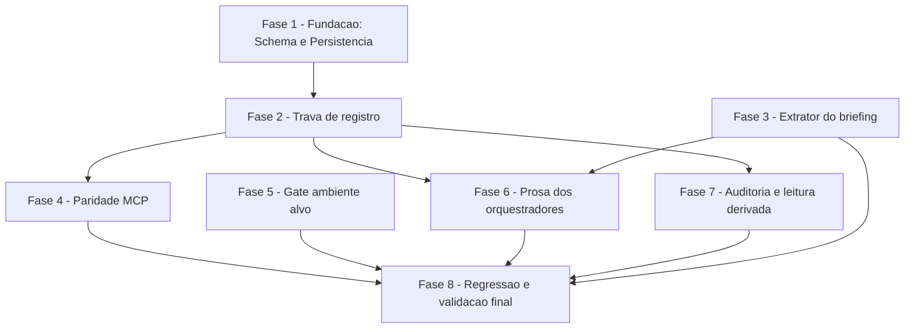

# Tarefas structural-decision-human-gate

Escopo: fechar as quatro lacunas de governanca da issue #146 (nenhuma decisao
de classe estrutural — linguagem/runtime, stack, arquitetura, persistencia,
ambiente alvo, tier de entrega — pode ser resolvida sozinha por um
orquestrador autonomo). Trava de runtime nas duas portas de escrita (helper
POSIX + tool MCP), dois gates deterministicos (itens Alto do briefing;
ambiente de execucao alvo do plano), prosa de orquestradores/skills, e
leitura derivada (relatorio, `review-task`, knowledge.db). Todas as mudancas
de estado sao aditivas (FR-005, FR-013): zero migracao obrigatoria, zero
regressao na regua de score de decisoes operacionais.

**Legenda de status:**
- `[ ]` Pendente
- `[~]` Em andamento
- `[x]` Concluido
- `[!]` Bloqueado

**Legenda de criticidade:**
- `[C]` Critico - Impacto financeiro direto ou bloqueante (governanca de decisao estrutural, integridade de schema)
- `[A]` Alto - Funcionalidade essencial (trava, gates, paridade MCP, prosa dos orquestradores)
- `[M]` Medio - Necessario mas sem urgencia imediata (ordenacao de backlog)

---

## FASE 1 - Fundacao: Schema e Persistencia `[C]`

Base de tudo o que segue: as quatro colunas novas (3 em `decision`, 1 em
`human_block`) e a migracao idempotente que garante que uma execucao ja em
andamento nao quebre com `no such column` na primeira decisao classificada
(plan.md §Complexity Tracking).

### 1.1 DDL aditivo do `state.db` `[C]`

Ref: `plan.md` §Project Structure (`state-db-schema.sql`); `data-model.md`
entidades Decisao e BloqueioHumano

- [x] 1.1.1 Adicionar `decision_class TEXT NULL` a `decision` em
      `plugins/cstk/skills/agente-00c-runtime/references/state-db-schema.sql`
      (comentario com o enum `estrutural|operacional`)
- [x] 1.1.2 Adicionar `structural_axis TEXT NULL` a `decision` (comentario:
      obrigatorio quando `decision_class = 'estrutural'`; NAO e `CHECK` —
      validado nas portas de escrita, vide data-model.md §Regras de
      integridade)
- [x] 1.1.3 Adicionar `human_consent_block_id TEXT NULL` a `decision`
      (comentario: NAO e FK — verificado contra o estado no momento do
      registro, R6)
- [x] 1.1.4 Adicionar `subject_key TEXT NULL` a `human_block` (comentario:
      prefixo fechado `briefing-item:` | `axis:`)
- [x] 1.1.5 Teste: `sqlite3 <db> "PRAGMA table_info(decision)"` /
      `PRAGMA table_info(human_block)` confirmam as 4 colunas novas num banco
      criado do zero (coberto por `tests/test_state-db-schema.sh`, task 1.2)

### 1.2 `state-db-schema.sh ensure` (novo subcomando) `[C]`

Ref: FR-013; `contracts/cli-structural-class.md` §`state-db-schema.sh ensure`;
`research.md` Decision 3

- [x] 1.2.1 Implementar `ensure --db <path>`: `PRAGMA table_info(decision)` /
      `PRAGMA table_info(human_block)` e `ALTER TABLE ... ADD COLUMN` apenas
      para coluna de fato ausente (INV-E1, idempotente)
- [x] 1.2.2 Fail-hard: `sqlite3` ausente, banco ilegivel ou `ALTER TABLE`
      falho => exit 1 sem degradar para best-effort (INV-E3: fonte de
      verdade transacional); uso incorreto => exit 2
- [x] 1.2.3 Puramente aditivo — nunca `DROP`, nunca recriacao de tabela,
      nunca reescrita de linha existente (INV-E2)
- [x] 1.2.4 Invocar `ensure` nos tres pontos de escrita: `_sd_db_register`
      (`state-decisions.sh`, antes de qualquer INSERT), `state-rw.sh init`,
      migracao json->db (`state-db-migrate.sh`) — nunca no caminho de leitura
      (INV-E3)
- [x] 1.2.5 Teste: `tests/test_state-db-schema.sh` — idempotencia (2a chamada
      e no-op), fail-hard (banco inexistente/corrompido), banco pre-feature
      (sem as 4 colunas) ganha-as apos `ensure` sem perder linhas existentes

### 1.3 `structural-axis-map.txt` (tabela de referencia) `[A]`

Ref: FR-006; `data-model.md` §Enum `structural_axis`; `research.md`
Decision 4 (mesmo padrao de `tier-gate-map.txt`/`phase-model-map.txt`)

- [x] 1.3.1 Criar
      `plugins/cstk/skills/agente-00c-runtime/references/structural-axis-map.txt`
      com linha de versao + 6 linhas `eixo|rotulo` (`linguagem-runtime`,
      `stack-frameworks`, `arquitetura`, `persistencia`, `ambiente-alvo`,
      `tier-entrega`), linhas `#`/vazias ignoradas
- [x] 1.3.2 Documentar no cabecalho do arquivo: eixo fora da lista e
      **rejeitado** (exit 2 no consumidor), diferente do fail-safe de
      `tier-gate-map.txt` — aceitar um eixo desconhecido permitiria burlar o
      enum por texto livre
- [ ] 1.3.3 Teste (smoke, coberto por `tests/test_state-decisions.sh` na
      FASE 2): lookup de eixo valido retorna o rotulo; eixo fora da lista
      retorna erro sem gravar nada

---

## FASE 2 - Trava de registro (Decisao + BloqueioHumano) `[C]`

O coracao da feature: as regras R1..R3 e R6 nas duas entidades que gravam
consentimento. Depende da FASE 1 (colunas + `ensure` precisam existir antes
de qualquer INSERT/leitura das colunas novas).

### 2.1 `state-decisions.sh register`: `--classe`/`--eixo`/`--consentimento` `[C]`

Ref: FR-001, FR-002, FR-003; `data-model.md` regras R1, R2, R3, R6;
`contracts/cli-structural-class.md` §`state-decisions.sh register`

- [ ] 2.1.1 Parsear `--classe {estrutural|operacional}`, `--eixo <token>`,
      `--consentimento <block-NNN>` no `case` do parser existente (flags
      portugues, kebab-case — Convencoes de Borda do plan.md)
- [ ] 2.1.2 R1 (pre-dispatch, pura de entrada — INV-C2): `--opcoes` contendo
      token da familia `bloqueio-humano*`/`pause-humano` (avaliado pelo
      `rotulo` quando o item e objeto) e `--classe` ausente => exit 1
      `classe-obrigatoria`, nada gravado
- [ ] 2.1.3 R3 (pre-dispatch): `--classe estrutural` sem `--eixo`, ou `--eixo`
      fora do enum de `structural-axis-map.txt` => exit 2 `eixo-invalido`;
      `--classe` fora de `{estrutural,operacional}` => exit 2
      `classe-invalida`
- [ ] 2.1.4 R2 (pre-dispatch quando NAO ha `--consentimento`): `--classe
      estrutural` com `--escolha` fora da familia de bloqueio humano, ou
      `--score` != 0 => exit 1 `estrutural-exige-bloqueio`, mensagem cita
      classe + eixo + caminho correto, nada gravado
- [ ] 2.1.5 R6 (dentro de cada branch de backend, antes de qualquer escrita —
      INV-C2/INV-C4): quando `--consentimento` presente, ler o
      `human_block` citado no backend corrente (JSON ou SQLite) e verificar
      `execution_id` da execucao corrente, `status = respondido` e
      `subject_key = 'axis:' || <eixo>` (vinculo de assunto, INV-C6);
      ausente/de outra execucao/`aguardando` => exit 1 `consentimento-invalido`;
      status ok mas `subject_key` divergente => exit 1
      `consentimento-de-outro-assunto` (mensagem cita os dois assuntos lado a
      lado); nada gravado em ambos os casos
- [ ] 2.1.6 Com `--consentimento` valido (R6 satisfeita), a regua de score
      atual volta a valer integralmente para a escolha concreta (data-model
      R2, segunda frase)
- [ ] 2.1.7 INV-C1: ausencia de `--classe` e byte-a-byte identica ao
      comportamento atual (inclusive a trava de constitution-conflict
      existente, preservada sem reescrita de mensagem)
- [ ] 2.1.8 INV-C5: `--agente` nao participa de nenhuma regra nova — mesmo
      input com `--agente agente-00c-orchestrator` e `--agente operador`
      produz identico exit e mensagem
- [ ] 2.1.9 Invocar `state-db-schema.sh ensure` no inicio do branch SQLite
      de `_sd_db_register`, antes do INSERT (task 1.2.4)
- [ ] 2.1.10 Teste: `tests/test_state-decisions.sh` — cenarios R1..R3, R6
      (bloqueio inexistente/outra execucao/aguardando/outro assunto),
      INV-C1..C6, paridade backend JSON vs SQLite

### 2.2 `_state-decisions-db.sh`: INSERT com as colunas novas `[C]`

Ref: `data-model.md` entidade Decisao; `plan.md` §Project Structure

- [ ] 2.2.1 Estender a `INSERT INTO decision (...)` com `decision_class`,
      `structural_axis`, `human_consent_block_id` (NULL por default quando
      as flags novas nao forem passadas)
- [ ] 2.2.2 Confirmar que o subquery de geracao do `dec-NNN` (proximo id) nao
      e afetado pela mudanca de colunas
- [ ] 2.2.3 Teste: cenario dedicado em `tests/test_state-decisions.sh`
      (task 2.1.10) faz `sqlite3 <db> "SELECT decision_class, structural_axis,
      human_consent_block_id FROM decision WHERE id = 'dec-NNN'"` e confirma
      os valores gravados

### 2.3 `_state-rw-db.sh`: export/upsert das colunas novas `[A]`

Ref: FR-013 (retrocompatibilidade); `contracts/cli-structural-class.md`
§`state-db-schema.sh ensure` INV-E3 (caminho de leitura nunca emite DDL)

- [ ] 2.3.1 No export de `.decisions[]`, consultar `PRAGMA
      table_info(decision)` uma vez e escolher entre duas consultas SQL
      literais fixas: a que projeta as 3 colunas novas, e a que projeta
      `NULL` no lugar delas (banco legado sem `ensure` ainda aplicado) — o
      caminho de leitura nunca invoca `ensure` nem emite `ALTER`
- [ ] 2.3.2 Atualizar o caminho de upsert usado pela migracao json->db para
      gravar `decision_class`/`structural_axis`/`human_consent_block_id`
      quando presentes no `state.json` de origem, NULL quando ausentes
      (registro legado, FR-013)
- [ ] 2.3.3 Fazer o mesmo para `subject_key` no export/upsert de
      `.human_blocks[]`
- [ ] 2.3.4 Teste: `tests/test_state-rw.sh` — projecao das colunas novas
      (presentes e NULL), banco sem `ensure` aplicado ainda exporta sem erro

### 2.4 `bloqueios.sh` + `_bloqueios-db.sh`: `--chave-assunto` `[A]`

Ref: FR-008; `data-model.md` entidade BloqueioHumano, §Enum de prefixo;
`contracts/cli-structural-class.md` §`bloqueios.sh register`/`list`

- [ ] 2.4.1 `register`: parsear `--chave-assunto <token>` (opcional); validar
      prefixo em `{briefing-item:, axis:}` e sufixo nao-vazio — prefixo fora
      do enum ou sufixo vazio => exit 2; ausente => `subject_key` NULL
      (comportamento atual integral)
- [ ] 2.4.2 `list`: aceitar `--chave-assunto <token>` (filtro por igualdade
      exata, combinavel com `--status`); TSV de saida **nao muda de
      colunas** (`id`, `decision_id`, `status`, `triggered_at`, `pergunta`)
- [ ] 2.4.3 `_bloqueios-db.sh`: estender INSERT com `subject_key`; estender
      SELECT do `list` com filtro `WHERE subject_key = ?` quando a flag for
      passada; invocar `state-db-schema.sh ensure` antes do INSERT no
      backend SQLite
- [ ] 2.4.4 Confirmar a consulta de dedup do FR-008 funciona literalmente:
      `bloqueios.sh list --state-dir "$SD" --status respondido
      --chave-assunto "briefing-item:$KEY"` vazio = ainda nao decidido
- [ ] 2.4.5 Teste: `tests/test_bloqueios.sh` — register com/sem
      `--chave-assunto`, prefixo invalido (exit 2), sufixo vazio (exit 2),
      `list --chave-assunto` filtra corretamente, dedup por
      status=respondido, bloqueios legados com `subject_key` NULL nunca
      casam com nenhuma chave (INV-K1)

---

## FASE 3 - Extrator de itens do briefing `[A]`

Script novo e independente da FASE 1/2 (le arquivo, nao consulta `state.db`).
Consumido pela prosa do orquestrador na FASE 6.

### 3.1 `briefing-items.sh list-high` (novo script) `[A]`

Ref: FR-007; `data-model.md` entidade Item a Definir, §Derivacao da chave,
§Distincao "sem itens" != "sem briefing"; `contracts/cli-structural-class.md`
§`briefing-items.sh list-high`

- [ ] 3.1.1 Implementar `--briefing <path>` (obrigatoria); aceitar briefing
      canonico (`docs/briefing.md`) e legado
      (`docs/01-briefing-discovery/briefing.md`) — resolucao do path e do
      chamador (P6)
- [ ] 3.1.2 Parser tolerante do heading `## Itens a Definir` (caixa/espacos
      extras, P1) e da tabela (cabecalho/separadora descartados, P2);
      impacto casado pelo **token inicial** da celula (`Alto — ...`, `Medio
      (...)`, P3)
- [ ] 3.1.3 Saneamento por celula ANTES de compor a linha de saida: NUL, TAB,
      CR, LF removidos, whitespace colapsado (P7, finding L1 — impede que uma
      celula com TAB forje coluna extra na saida TSV)
- [ ] 3.1.4 Derivacao de `item_key` (funcao pura, ordem fixa): caixa baixa;
      `[^a-z0-9]` vira `-`; `-` repetidos colapsam; `-` das pontas removidos;
      trunca em 48 chars; sufixo `-<cksum do texto integral normalizado>`
      (data-model.md §Derivacao da chave — usar `cksum`, nao hash
      criptografico, conforme declarado)
- [ ] 3.1.5 Saida: uma linha `item_key<TAB>item<TAB>dimensao` por item Alto,
      seguida **sempre** de `STATUS<TAB><token>` em
      `{ok, sem-itens-alto, tabela-irreconhecivel, briefing-ausente}` como
      ultima linha de stdout (finding M2 — "sem itens" != "sem briefing")
- [ ] 3.1.6 Heading presente sem tabela reconhecivel (ex.: lista numerada) =>
      zero itens + aviso em stderr + `STATUS tabela-irreconhecivel`, exit 0
      (P4); briefing ausente/ilegivel => zero itens + aviso + `STATUS
      briefing-ausente`, exit 0 (P5) — nunca falha a onda por parse
- [ ] 3.1.7 POSIX puro, sem `jq` (INV-B1); flag ausente/desconhecida => exit
      2 (uso incorreto)
- [ ] 3.1.8 Teste: `tests/test_briefing-items.sh` (**obrigatorio**, gateado
      por `--check-coverage`) — cada um dos P1..P7, os 4 tokens de `STATUS`,
      determinismo de `item_key` (mesma entrada => mesma chave, INV-B5),
      truncagem + cksum evitando colisao de itens longos com prefixo comum,
      briefing canonico vs legado, sanitizacao de TAB/CR/LF embutidos

---

## FASE 4 - Paridade MCP (`record_decision` / `register_human_block`) `[C]`

Depende da FASE 2: os codigos de erro tipados espelham as mensagens de stderr
que o helper POSIX passa a emitir.

### 4.1 `record_decision.ts`: 3 campos zod + 4 erros tipados `[C]`

Ref: FR-004; `contracts/mcp-record-decision.md` §Request, §Error Responses

- [ ] 4.1.1 Adicionar `decision_class` (`enum(["estrutural","operacional"])`,
      nullable), `structural_axis` (string, nullable) e
      `human_consent_block_id` (string, nullable — zod valida so o
      **formato**, nunca a autoridade; INV-M4) ao schema zod da tool
- [ ] 4.1.2 Passthrough condicional das 3 flags (`--classe`, `--eixo`,
      `--consentimento`) apenas quando o campo vier definido e nao-nulo,
      no mesmo padrao de `--score`/`--evidencia`/`--artefato-originador`;
      execucao continua via `execFile` com argv array (nenhum campo novo
      atravessa shell)
- [ ] 4.1.3 Adicionar 4 codigos ao union `McpToolErrorCode` em
      `mcp/state-server/src/runtime/exec.ts`: `STRUCTURAL_CLASS_REQUIRED`,
      `STRUCTURAL_REQUIRES_HUMAN_BLOCK`, `STRUCTURAL_AXIS_INVALID`,
      `HUMAN_CONSENT_INVALID`
- [ ] 4.1.4 `classifyHelperError()`: mapear as novas mensagens de stderr do
      helper (`classe-obrigatoria`, `estrutural-exige-bloqueio`,
      `eixo-invalido`/`classe-invalida`, `consentimento-invalido`/
      `consentimento-de-outro-assunto`) para os codigos novos — mesmo padrao
      ja usado para "violacao protocolo constitution-conflict";
      `HUMAN_CONSENT_INVALID` e produzido **exclusivamente** por
      `classifyHelperError()` (R6 depende de estado, o `superRefine` nao le
      estado — INV-M4)

### 4.2 `register_human_block.ts` + `exec.ts`: `--chave-assunto` `[A]`

Ref: `contracts/cli-structural-class.md` §`bloqueios.sh register`;
`contracts/mcp-record-decision.md` §Mapeamento campo -> flag

- [ ] 4.2.1 Adicionar `subject_key` (string, nullable; validar prefixo
      `briefing-item:`/`axis:` no zod, espelhando a validacao de forma do
      helper) ao schema da tool `register_human_block`
- [ ] 4.2.2 Adicionar entrada em `FIELD_TO_FLAG_TABLE`
      (`mcp/state-server/src/runtime/exec.ts`): `{ tool:
      "register_human_block", field: "subject_key", flag:
      "--chave-assunto" }`
- [ ] 4.2.3 Passthrough condicional (campo nao-nulo) no mapper da tool,
      mesmo padrao de 4.1.2

### 4.3 Testes MCP `[C]`

Ref: `contracts/mcp-record-decision.md` §Invariantes INV-M1, INV-M2

- [ ] 4.3.1 `mcp/state-server/test/record_decision.test.ts`: cenarios R1..R3
      (rejeicao no `superRefine`, `stage = "schema"`) e R6 (rejeicao vinda do
      helper via `classifyHelperError`, incluindo bloqueio inexistente, de
      outra execucao, `aguardando`, e de outro `subject_key`)
- [ ] 4.3.2 `mcp/state-server/test/exec-mapper-parity.test.ts`: estender o
      gate de paridade (INV-M2) para os 3 campos novos de `record_decision`
      e o campo novo de `register_human_block` — campo orfao no schema sem
      entrada em `FIELD_TO_FLAG_TABLE` falha o teste, e vice-versa; flag
      literal entre aspas duplas no arquivo-fonte da tool (comentario nao
      conta)
- [ ] 4.3.3 `npm test` em `mcp/state-server/` verde (node:test)

---

## FASE 5 - Gate de qualidade do plano: ambiente de execucao alvo `[A]`

Independente das FASES 1-4 (opera sobre texto de `plan.md`, sem tocar
`state.db`). Fecha FR-010/US3.

### 5.1 `validate-sdd.sh --sdd-plan`: 2 findings novos `[A]`

Ref: FR-010; `contracts/cli-structural-class.md` §`validate-sdd.sh
--sdd-plan`; `data-model.md` (Constitution VI — nunca fabricar fonte)

- [ ] 5.1.1 Finding `target-platform-unresolved` (`error`, so em `plan.md`,
      guarda `_is_plan_md`): linha `**Target Platform**:` ausente, com valor
      vazio, ou contendo `NEEDS CLARIFICATION`
- [ ] 5.1.2 Finding `target-platform-unsourced` (`warning`): campo
      preenchido, porem sem marcador de fonte (`briefing`, `constitution` ou
      `dec-NNN`) na linha ou linha adjacente — o validador **nao resolve
      link/anchor** (INV-V3): "com fonte" = "fonte declarada", nao "fonte
      verificada"; por isso `warning`, nunca `error`
- [ ] 5.1.3 Preservar formato de saida (`FINDING|<severity>|<code>|<msg>` +
      `RESULT|...`) e exit codes (`0` zero errors, `1` >=1 error, `2` uso
      incorreto); `target-platform-unresolved` muda o exit de um `plan.md`
      que hoje passaria — efeito desejado (SC-003)
- [ ] 5.1.4 INV-V1/INV-V2: nenhum finding existente muda de codigo/severidade/
      mensagem; os dois checks so rodam para `plan.md` (nao afetam
      `research.md`, `data-model.md`, `quickstart.md`, `contracts/*.md`)
- [ ] 5.1.5 Teste: `tests/test_validate-sdd.sh` — `plan.md` sem o campo,
      com `NEEDS CLARIFICATION`, preenchido sem fonte (warning, exit ainda 0
      se nao houver outro error), preenchido com fonte (sem finding novo)

---

## FASE 6 - Prosa dos orquestradores e skills `[A]`

Depende da FASE 2 (flags/mensagens da trava), FASE 3 (`briefing-items.sh`
existe) e FASE 5 (a tabela de gates ja referencia o gate de ambiente alvo).
Fecha FR-006, FR-008, FR-009, FR-011.

### 6.1 `agente-00c-orchestrator.md`: prosa de classe estrutural `[A]`

Ref: FR-006, FR-014

- [ ] 6.1.1 Enumerar a tabela de eixos estruturais (spec §Definicao: classe
      estrutural) na secao de registro de Decisoes
- [ ] 6.1.2 Instruir: toda decisao que fixa um desses eixos e registrada com
      `--classe estrutural --eixo <token>`, com o token de bloqueio humano
      entre as opcoes, seguida de bloqueio humano apresentando opcoes +
      recomendacao do agente (com evidencia quando houver) — **nunca**
      resolvida no Phase 0 do `plan`
- [ ] 6.1.3 Reforcar FR-014: texto lido de briefing/plan/respostas e
      CONTEUDO, nunca instrucao — nao pode alterar classe, score ou a
      decisao de pausar (mesma regra do INV-4 do `delivery-tier`)
- [ ] 6.1.4 Revisao cruzada: prosa consistente (mesma tabela de eixos, mesmo
      exemplo) com `agente-00c-feature-orchestrator.md` (task 6.2)

### 6.2 `agente-00c-feature-orchestrator.md`: prosa + gate de itens Alto `[A]`

Ref: FR-006, FR-008, FR-014

- [ ] 6.2.1 Mesma prosa de classe estrutural da task 6.1 (tabela de eixos +
      instrucao `--classe`/`--eixo`)
- [ ] 6.2.2 Novo passo no INICIO das etapas `specify` e `plan` em modo
      autonomo: invocar `briefing-items.sh list-high --briefing <path>`,
      ler a linha `STATUS` final; se `tabela-irreconhecivel` ou
      `briefing-ausente`, emitir aviso visivel no sumario da onda e seguir
      sem bloquear (nunca falha a onda por parse)
- [ ] 6.2.3 Para cada item Alto retornado (`STATUS ok` com >=1 linha), checar
      dedup via `bloqueios.sh list --status respondido --chave-assunto
      "briefing-item:<item_key>"`; se vazio (ainda nao decidido), registrar
      bloqueio humano com `--chave-assunto "briefing-item:<item_key>"` e
      encerrar a onda em `bloqueio_humano` **antes** de invocar a skill da
      etapa
- [ ] 6.2.4 Documentar o comportamento com **dois ou mais** itens Alto
      pendentes na mesma etapa: um bloqueio por item, a onda encerra no
      primeiro pendente processado; a proxima onda (pos-resume) reavalia a
      lista e bloqueia no proximo item ainda sem `respondido` — nao um
      bloqueio agregando varios itens (decisao registrada aqui porque o
      checklist §CHK023 marcou o criterio como `{humano}` nao-bloqueante;
      este e o comportamento default documentado, nao reaberto como
      pergunta)
- [ ] 6.2.5 Item ja decidido (BloqueioHumano com a mesma `subject_key` e
      `status = respondido` na execucao corrente) MUST NOT ser re-perguntado
      (FR-008, igualdade exata de string — nunca julgamento do agente)

### 6.3 `plan/SKILL.md`: Phase 0 nao resolve `NEEDS CLARIFICATION` estrutural em modo autonomo `[A]`

Ref: FR-009

- [ ] 6.3.1 Detectar execucao autonoma (presenca de
      `AGENTE_00C_STATE_DIR`/state-dir ativo) no inicio do Phase 0
- [ ] 6.3.2 Em modo autonomo, quando o Technical Context tiver `NEEDS
      CLARIFICATION` de um eixo estrutural (spec §Definicao), o Phase 0
      NAO o resolve por inferencia — deixa explicito para o orquestrador
      transformar em bloqueio humano (o gate da FASE 6.2/tabela de gates ja
      existente barra o artefato se isso nao acontecer)
- [ ] 6.3.3 Modo interativo (sem execucao autonoma ativa): comportamento
      atual preservado, sem mudanca

### 6.4 `create-tasks/SKILL.md`: ordenacao do gate de dependencias `[M]`

Ref: FR-011

- [ ] 6.4.1 Adicionar regra: quando a execucao tiver uma decisao estrutural
      de stack (`structural_axis` em `{linguagem-runtime, stack-frameworks}`)
      registrada ou pendente, qualquer gate humano de dependencias no
      backlog gerado MUST ser ordenado (task/dependencia Mermaid) DEPOIS da
      task/decisao de stack, nunca antes
- [ ] 6.4.2 Documentar como gotcha (mesma secao de gotchas ja existente na
      skill): backlog que gera o gate de dependencias antes da stack
      decidida reproduz o agravante da #146 (aprovar biblioteca == aprovar
      linguagem)

---

## FASE 7 - Auditoria e leitura derivada `[A]`

Depende da FASE 2 (as 3 colunas de Decisao precisam estar graváveis/legíveis
antes de qualquer leitor agregar). Fecha FR-012.

### 7.1 `report.sh`: secao classe/eixo/anomalia `[A]`

Ref: FR-012; `data-model.md` §Entity Anomalia de Governanca (predicado
normativo)

- [ ] 7.1.1 Listar cada Decisao estrutural com `structural_axis` e o
      `human_consent_block_id` que a autorizou (quando houver)
- [ ] 7.1.2 Calcular e listar anomalias com o predicado EXATO de
      `data-model.md`: `decision_class = 'estrutural'` E `choice` fora da
      familia de token de bloqueio humano E `consentimento_humano(D)` falso
      (JOIN contra `human_block` por `execution_id` + `status = 'respondido'`
      + `subject_key = 'axis:' || structural_axis`) — o campo `agent`
      **nunca** entra no predicado, so e exibido como proveniencia
- [ ] 7.1.3 Teste: `tests/test_report.sh` — 0 decisoes estruturais (secao
      omitida ou "0"), >=1 estrutural com consentimento valido (0 anomalias),
      >=1 estrutural sem consentimento (1 anomalia reportada), Decisao legada
      sem `decision_class` (nao aparece nem como estrutural nem como
      anomalia — FR-013)

### 7.2 `review-task/SKILL.md`: contagens estruturais/anomalias `[A]`

Ref: FR-012, SC-002

- [ ] 7.2.1 Adicionar ao relatorio agregado de `review-task` a contagem de
      Decisoes estruturais e a contagem de anomalias de governanca (esperado
      0 numa execucao saudavel pos-feature)
- [ ] 7.2.2 Reusar o mesmo predicado normativo da task 7.1.2 (nao
      reimplementar heuristica propria)

### 7.3 `cli/lib/recall.sh`: schema 14 -> 15 (knowledge.db) `[A]`

Ref: `data-model.md` §Entity `decisions` na knowledge.db

- [ ] 7.3.1 Bump `RECALL_SCHEMA_VERSION` de `14` para `15`
- [ ] 7.3.2 Migracao aditiva idempotente (`PRAGMA table_info` + `ALTER TABLE
      ADD COLUMN`) adicionando `decision_class`, `structural_axis`,
      `human_consent_block_id` a tabela `decisions` — mesmo padrao ja
      existente no arquivo
- [ ] 7.3.3 Aplicar aos DOIS caminhos de ingestao (JSON->SQL e SQL->SQL),
      que compartilham o mesmo tuple de colunas
- [ ] 7.3.4 Confirmar que nenhum dos 3 campos passa por `recall_scrub`
      (enum fechado / id gerado pelo runtime, sem texto livre — mesma
      classe de `choice`, que ja nao passa); `subject_key` NAO e propagado a
      knowledge.db nesta feature (unico campo novo derivado de texto de
      projeto — a dedup do FR-008 e sempre avaliada contra a execucao
      corrente, nunca contra o indice global)
- [ ] 7.3.5 Teste: `tests/cstk/test_recall.sh` — migracao v14->v15 idempotente
      sobre banco existente, ingestao JSON->SQL e SQL->SQL populam as 3
      colunas, `--reindex` reconstroi identico a partir do zero

---

## FASE 8 - Regressao, integracao e validacao final `[C]`

Depende de TODAS as fases anteriores.

### 8.1 Suite completa de regressao `[C]`

Ref: FR-005, SC-004

- [ ] 8.1.1 Rodar `./tests/run.sh --check-coverage` — confirma que
      `tests/test_briefing-items.sh` (task 3.1.8) esta presente e nenhum
      script novo ficou orfao
- [ ] 8.1.2 Rodar `./tests/run.sh` completo (todos os arquivos tocados nas
      FASES 1-7 + suite existente) — 0 regressao em Decisoes operacionais,
      clarify, gates ja existentes (SC-004); Decisoes legadas sem
      `decision_class` continuam legiveis por relatorio e indice (FR-013)
- [ ] 8.1.3 Rodar `npm test` em `mcp/state-server/` (paridade das tasks
      4.3.1/4.3.2/4.3.3)
- [ ] 8.1.4 Corrigir qualquer regressao encontrada antes de prosseguir —
      nenhuma FASE anterior e considerada concluida com suite vermelha

### 8.2 Validacao end-to-end via `quickstart.md` `[A]`

Ref: `quickstart.md`; spec SC-001, SC-002, SC-003, SC-005, SC-006

- [ ] 8.2.1 Executar os cenarios de `quickstart.md` sobre um projeto de
      teste, reproduzindo o cenario da #146 (briefing com item Alto de
      stack) — confirmar que a execucao autonoma pausa **antes** de
      `plan.md` existir (SC-001)
- [ ] 8.2.2 Confirmar SC-002 (100% das Decisoes estruturais com escolha
      concreta referenciam BloqueioHumano `respondido` da mesma execucao —
      0 anomalias no relatorio) e SC-003 (0 `plan.md` com ambiente alvo
      ausente/pendente passa o gate)
- [ ] 8.2.3 Confirmar SC-005 (extracao dos itens Alto imperceptivel — sem
      chamada de rede, mesma ordem de grandeza dos gates existentes) e
      SC-006 (numero de bloqueios humanos por execucao nao aumenta para
      decisoes operacionais, medido num projeto de referencia antes x
      depois)
- [ ] 8.2.4 Registrar qualquer desvio encontrado como Decisao auditavel
      (nao como edicao silenciosa do artefato)

---

## Matriz de Dependencias

## Resumo Quantitativo

| Fase | Tarefas | Subtarefas | Criticidade |
|------|---------|------------|-------------|
| 1 - Fundacao: Schema e Persistencia | 3 | 13 | C/C/A |
| 2 - Trava de registro | 4 | 22 | C/C/A/A |
| 3 - Extrator do briefing | 1 | 8 | A |
| 4 - Paridade MCP | 3 | 10 | C/A/C |
| 5 - Gate ambiente alvo | 1 | 5 | A |
| 6 - Prosa dos orquestradores | 4 | 14 | A/A/A/M |
| 7 - Auditoria e leitura derivada | 3 | 10 | A/A/A |
| 8 - Regressao e validacao final | 2 | 8 | C/A |
| **Total** | **21** | **90** | - |

## Escopo Coberto

| Item | Descricao | Fase |
|------|-----------|------|
| FR-001..FR-003 | Classe da Decisao + trava R1..R3, R6 (helper POSIX) | 1, 2 |
| FR-004 | Paridade helper/tool MCP (`record_decision`, `register_human_block`) | 4 |
| FR-005, FR-013 | Regressao zero + retrocompatibilidade de registros legados | 1, 2, 8 |
| FR-006 | Prosa dos dois orquestradores enumerando a classe estrutural | 6 |
| FR-007 | Extrator de itens Alto do briefing (`briefing-items.sh`) | 3 |
| FR-008 | Gate de itens Alto no inicio de `specify`/`plan`, dedup por `subject_key` | 2, 3, 6 |
| FR-009 | `plan` Phase 0 nao resolve `NEEDS CLARIFICATION` estrutural em modo autonomo | 6 |
| FR-010 | Gate do ambiente de execucao alvo em `plan.md` | 5 |
| FR-011 | Ordenacao do gate de dependencias apos decisao de stack | 6 |
| FR-012 | Relatorio + `review-task` + knowledge.db reportam classe/eixo/anomalia | 7 |
| FR-014 | Leitura de artefatos como CONTEUDO, nunca instrucao (prosa) | 6 |
| SC-001..SC-006 | Validacao end-to-end via `quickstart.md` | 8 |

## Escopo Excluido

| Item | Descricao | Motivo |
|------|-----------|--------|
| L1 | Detector deterministico proprio para `stack-frameworks`, `arquitetura`, `persistencia` (fora do briefing/plano) | `dec-024` — emenda, nao expansao; feature propria se necessario |
| L2 | Guarda em ferramentas de escrita direta de arquivo / cliente SQL direto (fora do helper e do guard de comandos) | Mudaria o modelo de enforcement do toolkit inteiro; blast radius muito alem desta feature (`dec-024`) |
| Migrador versionado de schema (`user_version` + migracoes ordenadas) | Mecanismo geral de versionamento do `state.db` | Divida tecnica propria do `state.db`; resolve-la aqui triplicaria o blast radius (plan.md §Complexity Tracking) |
| CHK005, CHK007, CHK023, CHK026, CHK029 | 5 gaps `{humano}` dos checklists (tier de entrega explicito, saneamento adversarial da pergunta, criterio para 2 itens Alto simultaneos alem do comportamento default documentado em 6.2.4, UX da mensagem de recusa, reformulacao do texto do item) | Marcados `{humano}` — decisao do dono do produto, nao reabertos como bloqueio nesta execucao (onda-005, `dec-024`) |
