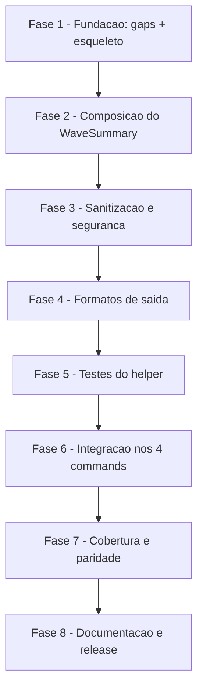

# Tarefas wave-close-summary - Resumo Deterministico de Fechamento de Onda

Escopo: implementar o helper POSIX `wave-summary.sh emit` (leitura read-only
do estado de uma onda ja fechada, via `_state-read.sh`), sua cobertura de
testes, a integracao nos 4 commands pai (`feature-00c`, `feature-00c-resume`,
`agente-00c`, `agente-00c-resume`) logo apos `reconcile-wave`, e o fechamento
dos 2 gaps de rastreabilidade formal abertos pelo checklist
(`checklists/requirements.md` CHK029, CHK032). Fora de escopo: painel web,
statusline, MCP resources (nenhuma tarefa cobre esses tres — ver "Escopo
Excluido").

**Legenda de status:**
- `[ ]` Pendente
- `[~]` Em andamento
- `[x]` Concluido
- `[!]` Bloqueado

**Legenda de criticidade:**
- `[C]` Critico - Impacto financeiro, regulatorio ou de seguranca
- `[A]` Alto - Funcionalidade core sem a qual o helper/integracao nao opera
- `[M]` Medio - Necessario mas pode ser adiado sem impacto imediato

---

## FASE 1 - Fundacao: Gaps de Requisito e Esqueleto do Helper

### 1.1 Fechar gap CHK029 — orcamento de latencia ausente do spec.md `[M]`

Ref: `checklists/requirements.md` CHK029; `plan.md` §Technical Context
"Performance Goals: < 2 s por invocacao"

- [x] 1.1.1 Adicionar em `spec.md` §Success Criteria um novo `SC-005`
      formalizando o teto de latencia (`< 2 s` por invocacao de
      `wave-summary.sh emit`, hoje so em `plan.md` §Technical Context) —
      redacao mensuravel, no mesmo padrao dos SC-001..SC-004 existentes
- [x] 1.1.2 Atualizar `checklists/requirements.md`: marcar `CHK029` como
      `[x]`, citando `spec.md §SC-005` na coluna de referencia (mesmo
      padrao dos itens `{auto}` ja fechados)
- [x] 1.1.3 Revisar a nota de rodape do checklist ("CHK029 e CHK032 sao
      gaps de fronteira spec-vs-design... nao bloqueiam o pipeline") para
      refletir que os dois gaps foram fechados nesta rodada

### 1.2 Fechar gap CHK032 — comportamento de enum desconhecido ausente da FR-003 `[M]`

Ref: `checklists/requirements.md` CHK032; `contracts/wave-summary-cli.md`
tabela "Rotulos de motivo (mapeamento fechado)" (linha "outro valor")

- [x] 1.2.1 Editar `FR-003` em `spec.md` para citar explicitamente o
      comportamento quando `termination_reason` assume um valor fora do
      enum conhecido: o sistema MUST exibir o valor cru, sem inventar
      rotulo (hoje esse comportamento so existe em
      `contracts/wave-summary-cli.md`, fora do FR)
- [x] 1.2.2 Atualizar `checklists/requirements.md`: marcar `CHK032` como
      `[x]`, citando `spec.md §FR-003` (revisado) na coluna de referencia
- [x] 1.2.3 Conferir que `requirement-coverage.sh` (gate deterministico ja
      rodado sobre a spec — `requirements=14 covered=14 errors=0`) segue
      exit 0 apos a edicao (FR-003 continua com cenario associado) —
      confirmado: `requirements=14 covered=14 errors=0` exit 0

### 1.3 Esqueleto do script `wave-summary.sh` `[A]`

Ref: `contracts/wave-summary-cli.md` §Invocacao; `plan.md` §Project
Structure ("Source Code"); estilo de referencia:
`plugins/cstk/skills/agente-00c-runtime/scripts/wave-usage-report.sh`

- [x] 1.3.1 Criar `plugins/cstk/skills/agente-00c-runtime/scripts/wave-summary.sh`
      com `#!/bin/sh` + `set -eu`, cabecalho de comentario referenciando
      `spec.md`/`plan.md`/`data-model.md`/`contracts/wave-summary-cli.md`
      (mesmo padrao de cabecalho de `wave-usage-report.sh`)
- [x] 1.3.2 Implementar dispatch de subcomando `emit` (unico subcomando do
      contrato); `-h`/`--help`/subcomando ausente ou desconhecido → uso em
      stderr, `exit 2`
- [x] 1.3.3 Parse de flags de `emit`: `--state-dir DIR` (obrigatorio),
      `--wave ID` (opcional, valida `^onda-[0-9]{3,}$`), `--json`
      (opcional, flag booleana) — flag desconhecida ou `--state-dir`
      ausente → uso em stderr, `exit 2`
- [x] 1.3.4 `chmod +x` no script; sourcing de `_state-read.sh` com
      `trap state_read_cleanup EXIT INT TERM` (mesmo padrao de
      `wave-usage-report.sh`) para materializar o estado do `--state-dir`
      informado
- [x] 1.3.5 Teste manual de fumaca: `sh -n wave-summary.sh` (checagem de
      sintaxe POSIX) e `wave-summary.sh --help` imprime uso e sai 2

---

## FASE 2 - Composicao do WaveSummary (leitura de estado)

### 2.1 Resolver a onda-alvo `[A]`

Ref: `research.md` Decision 4; `contracts/wave-summary-cli.md` §Exit codes
(exit 3)

- [x] 2.1.1 Sem `--wave`: onda-alvo = ultimo elemento de `.waves[]` do
      documento materializado
- [x] 2.1.2 Com `--wave ID`: localizar a entrada de `.waves[]` cujo `id`
      casa; se `.waves[]` vazio OU `--wave` nao encontrada → `exit 3` com
      exatamente 1 linha em stderr (`wave-summary: <motivo>`)
- [x] 2.1.3 Onda-alvo ainda aberta (`termination_reason == null`): seguir a
      composicao normalmente, com motivo "onda ainda aberta (nao fechada)"
      e duracao `nao medido` (nunca tratar como erro)

### 2.2 Extrair campos estruturados do estado `[A]`

Ref: `data-model.md` tabela de campos do `WaveSummary`; `research.md`
Decision 1 (lista de campos consumidos via `_state-read.sh`)

- [x] 2.2.1 Extrair da onda-alvo: `id`, `termination_reason`,
      `executed_stages`, `tool_calls`, `wallclock_seconds`, `otel_usage`
      (`total_tokens`, `total_cost_usd`)
- [x] 2.2.2 Extrair do documento: `.current_stage`, `.next_instruction`,
      `.execution.status`, `.execution.target_project_path`
- [x] 2.2.3 Contar `.decisions[]` cujo `wave_id` == onda-alvo
      (`decisions_count`)
- [x] 2.2.4 Contar `.human_blocks[]` com `status == "aguardando"` no
      escopo da EXECUCAO inteira (nao so da onda) e coletar so os `id`s
      (`pending_blocks.count` / `pending_blocks.ids`)
- [x] 2.2.5 Contar `.tasks[]` com `wave_id` == onda-alvo por `outcome`
      (`pass`/`fail`); determinar `tasks.applicable` (`execute-task` em
      `executed_stages` OU ha task com esse `wave_id`)

### 2.3 Aplicar a regra "nao medido" por campo `[A]`

Ref: `research.md` Decision 3 (tabela "Indicador | Medido quando | Senao");
`data-model.md` Invariante I-1

- [x] 2.3.1 Custo/tokens: medido somente quando `otel_usage` e objeto
      nao-nulo E o campo numerico correspondente e nao-nulo; senao `nao
      medido` (inclui `otel_usage` ausente)
- [x] 2.3.2 Duracao: medido somente quando a onda esta fechada E
      `wallclock_seconds` e numerico; senao `nao medido`
- [x] 2.3.3 Chamadas de ferramenta: medido quando `tool_calls > 0`, OU
      quando `tool_calls == 0` E `guard-hooks-status.sh tick-mode
      --projeto-alvo-path <target_project_path>` retorna `hook`; senao
      `nao medido`
- [x] 2.3.4 Tarefas: `tasks.applicable == false` renderiza "nao aplicavel"
      (nunca "nao medido" — ausencia de backlog na onda nao e falta de
      medicao)
- [x] 2.3.5 Garantir por construcao que todo campo numerico `null` implica
      `measured=false` e vice-versa (I-1) — nenhum `0` fabricado para
      metrica nao medida

---

## FASE 3 - Sanitizacao e seguranca da saida

### 3.1 Saneamento de `next_instruction` `[C]`

Ref: `research.md` Decision 5; `data-model.md` campo `next_instruction`
(`<= 200 chars, sem controle, scrubbed`)

- [x] 3.1.1 Remover caracteres de controle (inclusive ESC) de
      `next_instruction`
- [x] 3.1.2 Colapsar quebras de linha em espaco
- [x] 3.1.3 Aplicar `secrets-filter.sh scrub` (stdin→stdout); se
      `secrets-filter.sh` falhar/indisponivel, o campo sai como
      `nao disponivel (filtro indisponivel)` — fail-closed so nesse campo,
      nunca cru
- [x] 3.1.4 Truncar em 200 caracteres com sufixo `...`; remover crases do
      valor antes de envolver em inline code na saida Markdown (SEC-M1)

### 3.2 Validacao de tokens estruturados (SEC-L1) `[C]`

Ref: `research.md` Decision 9 (SEC-L1); `contracts/wave-summary-cli.md`
§Regras de seguranca da saida

- [x] 3.2.1 Validar `executed_stages`, `current_stage`, `execution_status`
      e cada `id` de bloqueio pendente contra `^[A-Za-z0-9._-]{1,64}$`
- [x] 3.2.2 Valor fora do padrao renderiza `(valor invalido omitido)`,
      nunca o valor cru
- [x] 3.2.3 Descartar stderr de sub-ferramentas internas (`jq`,
      `state-rw.sh`, `tick-mode`, `scrub`) para `/dev/null` (SEC-L3) — a
      unica linha de stderr em falha e a mensagem propria do helper

### 3.3 Zero texto livre de decisoes/bloqueios `[C]`

Ref: FR-012; `data-model.md` Invariante I-2

- [x] 3.3.1 Confirmar que nenhum campo de `context`/`rationale`/
      `evidence`/`options_considered`/`choice` (decisao) nem `question`/
      `context_for_answer`/`human_answer` (bloqueio) e lido ou impresso em
      nenhum ponto do script — apenas contagens e `id`s
      (`pending_blocks.ids`)
- [x] 3.3.2 `.execution.target_project_path` e repassado como argumento
      citado a `guard-hooks-status.sh tick-mode` — nunca via `eval` (SEC-I2)
- [x] 3.3.3 Garantir read-only total (I-4): nenhum arquivo criado dentro do
      `--state-dir`; tmp de materializacao fica em `$TMPDIR`, removido por
      `trap`; nenhum lock adquirido; nenhum acesso a rede

---

## FASE 4 - Formatos de saida (Markdown e JSON)

### 4.1 Renderizador Markdown (default) `[A]`

Ref: `contracts/wave-summary-cli.md` §Saida Markdown; tabela "Rotulos de
motivo (mapeamento fechado)"

- [x] 4.1.1 Montar o bloco `### Resumo da onda <wave_id>` com as 9 linhas
      do contrato (Termino, Etapas executadas/Etapa atual/Status,
      Decisoes, Bloqueios pendentes, Chamadas de ferramenta, Duracao,
      Consumo OTel, Tarefas, Proxima instrucao) — no maximo 14 linhas
      totais
- [x] 4.1.2 Aplicar o mapeamento fechado de rotulos de
      `termination_reason` (6 valores conhecidos + fallback "outro valor"
      → valor cru, sem inventar rotulo — fecha o gap CHK032 tambem no
      codigo, nao so na spec)
- [x] 4.1.3 Sufixo `[ATENCAO: requer resposta do operador]` somente quando
      `attention_required` (bloqueios pendentes > 0 OU
      `termination_reason == bloqueio_humano`)
- [x] 4.1.4 Linha de bloqueios pendentes sempre explicita
      (`Bloqueios pendentes: 0` quando zero — nunca omitida; fecha CHK012
      no comportamento observavel, mesmo sem alterar a wording da spec)

### 4.2 Renderizador `--json` `[A]`

Ref: `data-model.md` tabela de campos (chaves em ingles, regra global)

- [x] 4.2.1 Emitir objeto JSON com as chaves exatas de `data-model.md`
      (`wave_id`, `wave_closed`, `termination_reason`,
      `attention_required`, `executed_stages`, `current_stage`,
      `execution_status`, `next_instruction`, `decisions_count`,
      `pending_blocks.count`/`.ids`, `tool_calls.value`/`.measured`,
      `wallclock_seconds.value`/`.measured`, `cost.total_tokens`/
      `.total_cost_usd`/`.measured`, `tasks.applicable`/`.passed`/
      `.failed`)
- [x] 4.2.2 Validar com `jq -e .` que o JSON emitido e sempre parseavel
- [x] 4.2.3 Confirmar paridade campo-a-campo entre a saida Markdown e a
      saida `--json` para a mesma fixture (mesmos valores, apenas forma
      diferente)

### 4.3 Exit codes e streams `[A]`

Ref: `contracts/wave-summary-cli.md` §Exit codes e streams

- [x] 4.3.1 Exit 0: resumo composto, stdout = bloco (Markdown ou JSON),
      stderr vazio
- [x] 4.3.2 Exit 1: falha de leitura (estado ausente/corrompido, `jq`/
      `sqlite3` ausente, materializacao falhou) — stdout vazio, stderr
      exatamente 1 linha `wave-summary: <motivo>`
- [x] 4.3.3 Exit 2: uso incorreto — stdout vazio, uso em stderr
- [x] 4.3.4 Exit 3: onda inexistente — stdout vazio, stderr exatamente 1
      linha `wave-summary: <motivo>`
- [x] 4.3.5 Determinismo (I-3): duas invocacoes consecutivas com a mesma
      fixture produzem stdout byte-identico (nenhuma leitura de relogio/
      ambiente alem do estado e do `tick-mode`)

---

## FASE 5 - Testes do helper (`tests/test_wave-summary.sh`)

### 5.1 Fixtures sinteticas e cenarios de caminho feliz (Scenarios 1, 2, 3, 4, 6) `[A]`

Ref: `quickstart.md` Scenarios 1-4, 6

- [x] 5.1.1 Scenario 1 (onda normal): fixture `onda-002` fechada com
      `termination_reason=etapa_concluida_avancando`, 3 decisoes na onda +
      1 de `onda-001`, `otel_usage` preenchido, `tool_calls=18` — exit 0,
      stderr vazio, bloco cita `onda-002`, rotulo correto, `Decisoes
      registradas na onda: 3`
- [x] 5.1.2 Scenario 2 (limite operacional vs bloqueio humano): fixture A
      (`threshold_proxy_atingido`, 0 bloqueios) → "pausa por limite
      operacional" sem sufixo ATENCAO; fixture B (`bloqueio_humano`, 1
      bloqueio `aguardando` + 1 `respondido`) → "bloqueio humano pendente"
      + ATENCAO + `Bloqueios pendentes: 1 (block-001)`
- [x] 5.1.3 Scenario 3 (nao medido vs zero medido): fixture C
      (`otel_usage` ausente) → `Consumo (OTel): nao medido`,
      `cost.total_tokens=null`/`measured=false` em `--json`; fixture D
      (`total_tokens=0`, `total_cost_usd=0`) → `0 tokens`,
      `measured=true`; nenhuma saida de C contem `0 tokens`
- [x] 5.1.4 Scenario 4 (tool_calls=0 com/sem contador ativo): fixture com
      `tool_calls=0` e `tick-mode=manual` → `nao medido`; mesmo estado com
      `tick-mode=hook` → `Chamadas de ferramenta: 0`
- [x] 5.1.5 Scenario 6 (primeira onda, zero decisoes, tarefas): fixture com
      1 onda sem decisoes, `executed_stages=["execute-task"]`, 2 tasks
      `pass` + 1 `fail` da onda + 1 task de outra onda → `Decisoes
      registradas na onda: 0` sem erro, `Tarefas: 2 concluidas, 1
      falharam`; fixture sem `execute-task` nem tasks → `Tarefas: nao
      aplicavel`

### 5.2 Repeticao sob backend SQLite (marcados (S) no quickstart) `[A]`

Ref: `quickstart.md` (marcadores "(S)"); padrao `_sqlite3_adequate` de
`tests/test_state-parity-sweep.sh`

- [x] 5.2.1 Guard `_sqlite3_adequate` (skip com aviso quando `sqlite3`
      real >= versao minima nao disponivel) — mesmo padrao ja usado em
      `test_state-parity-sweep.sh`
- [x] 5.2.2 Repetir o Scenario 1 sob fixture com `state.db` (materializado
      via `_state-read.sh`) confirmando saida identica ao caminho JSON

### 5.3 Nenhum texto livre vaza (Scenario 5, FR-012, I-2) `[C]`

Ref: `quickstart.md` Scenario 5

- [x] 5.3.1 Fixture com decisao cujo `context` contem o canario
      `CANARY-DEC-CTX` e um segredo sintetico em formato de token;
      bloqueio com `question` contendo `CANARY-BLK-Q`; `next_instruction`
      com o mesmo segredo sintetico + `\033[31m`
- [x] 5.3.2 Rodar em Markdown e `--json`; confirmar que nenhum canario nem
      o segredo sintetico aparece em nenhuma das duas saidas
- [x] 5.3.3 Confirmar que `next_instruction` sai sem sequencia ESC e com o
      segredo substituido pelo marcador de `secrets-filter.sh`

### 5.4 Falhas sao best-effort (Scenario 7, US3, FR-011) `[A]`

Ref: `quickstart.md` Scenario 7

- [x] 5.4.1 `--state-dir` inexistente → exit 1, stdout vazio, stderr = 1
      linha
- [x] 5.4.2 Estado JSON corrompido → exit 1, mesmo formato de stderr
- [x] 5.4.3 `.waves` vazio / `--wave onda-999` → exit 3, 1 linha em stderr
- [x] 5.4.4 `jq` fora do PATH via shim de PATH com allowlist explicita de
      utilitarios (sem `jq`; NUNCA so prefixar PATH, senao falso-verde por
      `jq` do sistema — mesmo gotcha documentado no plan.md Riscos) → exit
      1, 1 linha

### 5.5 Determinismo, read-only, paridade de modos (Scenario 8, I-3/I-4/FR-014) `[A]`

Ref: `quickstart.md` Scenario 8

- [x] 5.5.1 Duas execucoes consecutivas com a mesma fixture → stdout
      byte-identico
- [x] 5.5.2 Hash do estado (`state-rw.sh sha256-verify` ou equivalente)
      identico antes/depois da execucao; nenhum arquivo novo dentro do
      `--state-dir`
- [x] 5.5.3 Mesmo documento de estado materializado sob layout
      `.claude/agente-00c-state/` e sob
      `.claude/feature-00c-state/<short>/` produz saida identica
      (paridade FR-014 entre os dois modos de execucao)

---

## FASE 6 - Integracao nos 4 commands pai

### 6.1 `feature-00c.md` — chamada apos `reconcile-wave` `[A]`

Ref: `research.md` Decision 6; `contracts/wave-summary-cli.md` §Uso pelo
command pai; `plugins/cstk/commands/feature-00c.md` (secao com
`reconcile-wave`, fim do §5)

- [x] 6.1.1 Inserir a chamada `wave-summary.sh emit --state-dir "$SD"`
      imediatamente APOS `reconcile-wave` e ANTES da captura do `Schedule
      intent`, com `2>&1` capturado e fallback `Resumo da onda
      indisponivel: <ultima linha do stderr>` em caso de exit != 0 — nunca
      `set -e` sobre essa chamada, nunca retry
- [x] 6.1.2 Incluir `$WS_OUT` verbatim na mensagem final entregue ao
      operador (fim do §5/§6), sem condicionar `ScheduleWakeup`/liberacao
      de lock/ingestao ao exit do helper

### 6.2 `feature-00c-resume.md` — chamada apos `reconcile-wave` `[A]`

Ref: mesma Decision 6; `plugins/cstk/commands/feature-00c-resume.md` §4
(secao com `reconcile-wave`)

- [x] 6.2.1 Mesmo padrao de 6.1.1 na secao §4 de `feature-00c-resume.md`
- [x] 6.2.2 Incluir `$WS_OUT` verbatim na mensagem final (fim de
      §4.ter/§5), mesma garantia de nao-condicionamento

### 6.3 `agente-00c.md` — chamada apos §5.pre, apresentada em §6 `[A]`

Ref: mesma Decision 6; `plugins/cstk/commands/agente-00c.md` §5.pre "Rede
de seguranca de fechamento de onda" e §6 "Apresentacao do resultado"

- [x] 6.3.1 Mesmo padrao de 6.1.1 em §5.pre de `agente-00c.md`
      (imediatamente apos a chamada a `reconcile-wave`)
- [x] 6.3.2 Incluir `$WS_OUT` verbatim em §6 "Apresentacao do resultado"

### 6.4 `agente-00c-resume.md` — chamada antes do §7, apresentada em §9 `[A]`

Ref: mesma Decision 6; `plugins/cstk/commands/agente-00c-resume.md` (secao
com `reconcile-wave`, antes do §7) e §9 "Apresentar resultado ao operador"

- [x] 6.4.1 Mesmo padrao de 6.1.1 na secao que chama `reconcile-wave` de
      `agente-00c-resume.md` (ainda com o lock ativo, antes do §7)
- [x] 6.4.2 Incluir `$WS_OUT` verbatim em §9 "Apresentar resultado ao
      operador"

### 6.5 Teste estatico interno de integracao (Scenario 9) `[A]`

Ref: `quickstart.md` Scenario 9

- [x] 6.5.1 Criar `tests/test_command-wave-summary.sh`: para cada um dos 4
      `plugins/cstk/commands/{feature-00c,feature-00c-resume,agente-00c,
      agente-00c-resume}.md`, checar (via grep/awk posicional, sem
      dependencia de renderizacao) que `wave-summary.sh emit` aparece
      DEPOIS de `reconcile-wave` e ANTES de `ScheduleWakeup` na ordem do
      texto
- [x] 6.5.2 Checar presenca do fallback `Resumo da onda indisponivel` nos
      4 arquivos
- [x] 6.5.3 Checar que nenhuma das 4 secoes condiciona `ScheduleWakeup`,
      liberacao de lock ou ingestao ao exit do helper (grep negativo por
      padroes como `wave-summary.sh emit && ` seguido de
      `ScheduleWakeup`/`state-lock`/`recall --ingest` na mesma linha)

---

## FASE 7 - Cobertura e paridade (`--check-coverage`)

### 7.1 Estender `tests/test_state-parity-sweep.sh` `[A]`

Ref: `plan.md` §Project Structure ("Source Code" → `tests/`); manifest
dinamico atual de 16 leitores em `_sweep_manifest()`

- [x] 7.1.1 Adicionar entrada `wave-summary-emit|0|$R/wave-summary.sh emit
      --state-dir $SWEEP_SD` (ou `0 3`, se a fixture padrao do sweep nao
      garantir onda fechada — verificar contra a fixture real antes de
      fixar os exits aceitos) em `_sweep_manifest()` — verificado
      empiricamente: a fixture padrao termina com onda-002 ABERTA (ultimo
      elemento de `.waves[]`), e `wave-summary.sh emit` sem `--wave` trata
      onda aberta como caso normal (`termination_reason=null` -> "onda
      ainda aberta (nao fechada)"), exit 0 — nao exit 3; exits aceitos:
      `0` apenas
- [x] 7.1.2 Atualizar a asserção de contagem de `[ "$_count" = 16 ]` para
      `17` em `scenario_dinamica_16_leitores_sqlite_sem_degradacao` (e
      renomear a funcao/comentarios que citam "16 leitores" para "17
      leitores", mantendo consistencia)
- [x] 7.1.3 Rodar `tests/test_state-parity-sweep.sh` isolado e confirmar
      que `wave-summary.sh` nao degrada sob backend SQLite (mesma garantia
      dos 16 leitores existentes) — confirmado:
      `scenario_dinamica_17_leitores_sqlite_sem_degradacao` ok, 4/4
      scenarios verdes (`./tests/run.sh state-parity`)

### 7.2 Allowlist estatica CHK016, se inevitavel `[M]`

Ref: `plan.md` §Riscos e mitigacoes ("Parity-sweep reprovar o helper —
literal do arquivo de estado em prosa/erro")

- [x] 7.2.1 Rodar a camada estatica de `tests/test_state-parity-sweep.sh`
      (CHK016) sobre `wave-summary.sh` apos a implementacao da FASE 1-4 —
      `scenario_estatica_sem_acesso_direto_fora_da_allowlist` ok (o glob
      `"$R"/*.sh` ja cobre `wave-summary.sh`)
- [x] 7.2.2 Se houver reprovacao por mencao literal a `state.json`/
      `state.db` em mensagem de erro/prosa (inevitavel, ex.: diagnostico
      de materializacao falha), adicionar entrada
      `wave-summary.sh:prosa` a `_static_allowlist()` no MESMO commit, com
      comentario de justificativa (mesmo padrao de `wave-usage-report.sh:prosa`)
      — N/A, ver 7.2.3
- [x] 7.2.3 Se nao houver reprovacao, nenhuma acao adicional (nao criar
      entrada de allowlist preventiva sem necessidade real) — confirmado:
      `wave-summary.sh` nao construiu nenhum path literal `/state\.json`
      (usa so `_state-read.sh`/materializacao), scenario passou sem
      entrada nova na allowlist

### 7.3 Registrar o novo teste interno em `tests/run.sh` `[A]`

Ref: `tests/run.sh` funcao `_is_internal_test`; convencao de FASE 9.3
(script sob `plugins/cstk/skills/*/scripts/` exige `tests/test_<nome>.sh`
correspondente)

- [x] 7.3.1 Confirmar que `tests/test_wave-summary.sh` (FASE 5) satisfaz a
      convencao 1:1 com `wave-summary.sh` automaticamente (nao precisa de
      entrada em `_is_internal_test` — e o teste "dono" do script)
- [x] 7.3.2 Adicionar `test_command-wave-summary.sh` ao `case` de
      `_is_internal_test` em `tests/run.sh`, com comentario explicando que
      cobre os 4 `plugins/cstk/commands/*.md` (prosa, sem script `.sh`
      "dono" sob a convencao de FASE 9.3) — mesmo padrao de
      `test_specify-reopen-shortcut.sh` — feito na FASE 6 task 6.5

### 7.4 Validacao final de cobertura `[A]`

- [x] 7.4.1 Rodar `./tests/run.sh --check-coverage` e confirmar exit 0
      (nenhum script orfao, nenhum teste orfao) — confirmado: "Cobertura
      completa: zero orfaos."
- [x] 7.4.2 Rodar `./tests/run.sh wave-summary` e confirmar todos os
      cenarios verdes (inclui `test_wave-summary.sh` e
      `test_command-wave-summary.sh`, ambos casados pelo substring
      `wave-summary`) — confirmado: `PASS: 46  FAIL: 0  ERROR: 0
      ORPHANS: 0`

---

## FASE 8 - Documentacao e Release

### 8.1 CHANGELOG.md `[M]`

Ref: `plan.md` §Constitution Check (Principio I: "bump MINOR no CHANGELOG
na entrega")

- [x] 8.1.1 Adicionar entrada de versao MINOR nova em `CHANGELOG.md`
      descrevendo o resumo de fechamento de onda (helper `wave-summary.sh`
      + integracao nos 4 commands pai)
- [x] 8.1.2 Adicionar o link-reference correspondente no bloco de rodape
      do `CHANGELOG.md` (mesma disciplina de "CHANGELOG: link de
      referencia por versao" do `CLAUDE.md` do repo — conferir com o
      comando `comm -23` documentado la antes de finalizar)

### 8.2 Validacao final completa `[A]`

- [~] 8.2.1 Rodar `./tests/run.sh` completo (suite inteira) e confirmar
      exit 0 (suite em execucao em background pelo command pai desde
      ~00:16 — `full-suite.log` ainda sem linha `exit=`; pendente-do-pai)
- [x] 8.2.2 Validar `wave-summary.sh` com `shellcheck` (advisory, config
      `.shellcheckrc` do repo) sem findings novos
- [x] 8.2.3 Conferir que nenhum arquivo fora do escopo desta feature foi
      tocado (painel, statusline, MCP resources — ver "Escopo Excluido")

---

## Matriz de Dependencias

---

## Resumo Quantitativo

| Fase | Tarefas | Subtarefas | Criticidade predominante |
|------|---------|------------|---------------------------|
| FASE 1 - Fundacao | 3 | 11 | A/M |
| FASE 2 - Composicao do WaveSummary | 3 | 13 | A |
| FASE 3 - Sanitizacao e seguranca | 3 | 10 | C |
| FASE 4 - Formatos de saida | 3 | 12 | A |
| FASE 5 - Testes do helper | 5 | 17 | A/C |
| FASE 6 - Integracao nos 4 commands | 5 | 11 | A |
| FASE 7 - Cobertura e paridade | 4 | 10 | A/M |
| FASE 8 - Documentacao e release | 2 | 5 | A/M |
| **Total** | **28** | **89** | — |

## Escopo Coberto

- Helper POSIX `wave-summary.sh emit` (Markdown + `--json`), read-only
  sobre `_state-read.sh`, sem instrumentacao/persistencia nova
- Regra "nao medido" por campo (custo, duracao, chamadas de ferramenta,
  tarefas) e saneamento de `next_instruction` via `secrets-filter.sh scrub`
- Cobertura de testes: `tests/test_wave-summary.sh` (10 cenarios do
  quickstart, JSON + SQLite quando aplicavel), `tests/test_command-wave-summary.sh`
  (integracao estatica nos 4 commands)
- Integracao identica nos 4 commands pai (`feature-00c.md`,
  `feature-00c-resume.md`, `agente-00c.md`, `agente-00c-resume.md`), sempre
  apos `reconcile-wave` e antes do `Schedule intent`/`ScheduleWakeup`
- Extensao de `tests/test_state-parity-sweep.sh` (17o leitor) e registro em
  `tests/run.sh::_is_internal_test`
- Fechamento dos 2 gaps `{auto}` do checklist (CHK029: SC de latencia;
  CHK032: comportamento de enum desconhecido na FR-003)
- CHANGELOG.md (entrada MINOR + link-ref)

## Escopo Excluido

- **Painel web** (`cstk serve`/cstk-panel): fora de escopo por decisao
  explicita do plan/resume desta feature; o resumo e entregue so na
  conversa do operador (mensagem final dos 4 commands), nunca no painel
- **Statusline**: fora de escopo; nenhuma integracao com o hook de
  statusline existente
- **MCP resources**: fora de escopo; o resumo nao e exposto como resource/
  tool MCP, apenas como texto na mensagem final do command pai
- Os 2 itens `{humano}` do checklist (`CHK008` — apetite por mais
  indicadores de volume; `CHK012` — wording de FR-005) permanecem `[ ]`
  aguardando decisao do dono do produto; NAO viram tarefa autonoma nesta
  rodada (o comportamento observavel de CHK012 ja fica coberto pela
  subtarefa 4.1.4, mas a wording da spec em si segue aberta)
- Nenhuma instrumentacao/medicao nova (FR-006, FR-007 proibem
  explicitamente — todo campo reusa mecanismo ja existente)
