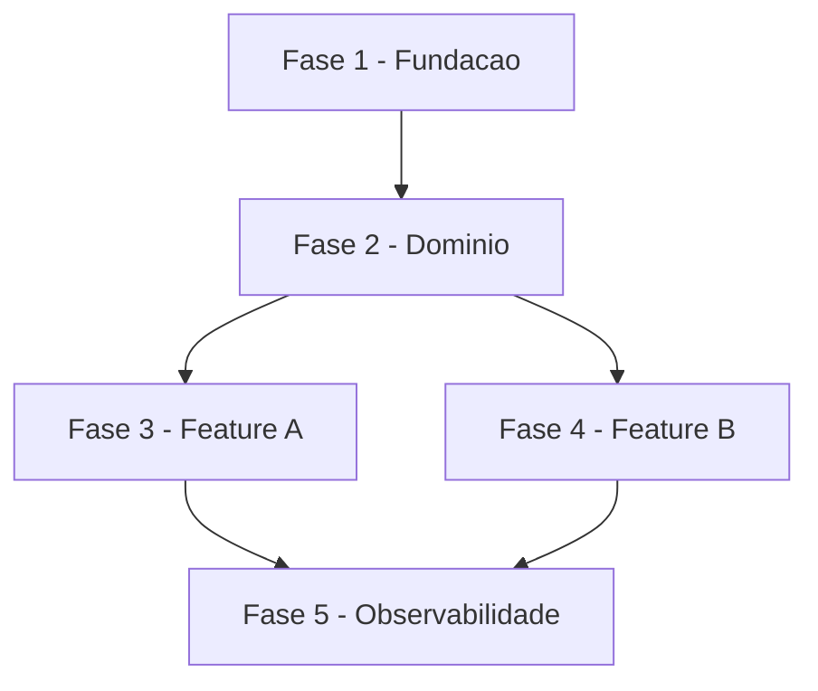

# Skill: Criar Backlog de Tarefas

Crie um documento de backlog de tarefas tecnicas seguindo o padrao estruturado abaixo.

## Pre-requisitos

**Recomendado (fluxo SDD)**: `plan.md` e `spec.md` ja existentes em
`docs/specs/{feature}/`. Com eles, o backlog se liga a fases tecnicas claras.

**Alternativa standalone**: descricao textual do escopo ou lista de features.
Neste caso, salva em `docs/tasks-{nome-escopo}.md`.

## Proximos passos

1. `/analyze` — validar consistencia entre spec, plan e tasks
2. `/execute-task {id}` — comecar execucao pela primeira tarefa critica
3. `/review-task` — acompanhar progresso conforme tarefas sao concluidas

## Argumentos

$ARGUMENTS

## Instrucoes

Analise o argumento fornecido. Ele pode ser:
1. **Descricao do escopo**: Uma descricao textual do que o MVP/projeto deve cobrir
2. **Documento de referencia**: Um arquivo existente com requisitos, casos de uso ou especificacoes
3. **Lista de funcionalidades**: Lista de features/modulos a serem organizados em tarefas

### Deteccao de Origem (Spec vs Standalone)

**ANTES de iniciar**, determine se o argumento se origina de uma especificacao:

1. **Verifique se o argumento referencia um arquivo em `docs/specs/`** (ex: `docs/specs/foo/spec.md`)
2. **Verifique se o argumento menciona o nome de uma spec existente** — liste `docs/specs/*/spec.md` com Glob
3. **Se o contexto da conversa indica que uma spec foi criada/usada recentemente**, considere-a como origem

**Se originado de uma spec** (`docs/specs/{spec-name}/spec.md`):
- Salvar em: `docs/specs/{spec-name}/tasks.md`
- Usar o conteudo da spec como documento de referencia principal

**Se chamado de forma isolada** (sem spec associada):
- Manter o comportamento padrao: `docs/tasks-{nome-escopo}.md`

### Deteccao de reabertura (feature-00c `--reopen`) — continuidade de backlog

Aplicavel **somente** quando o state da execucao corrente tem
`.previous_round` preenchido (contexto de reabertura via
`/feature-00c --reopen` — mesma deteccao usada por
`plugins/cstk/skills/specify/SKILL.md` §0.0/0.5) **e** o `tasks.md`-alvo
(`docs/specs/{spec-name}/tasks.md`) **ja existe** (preservado/restaurado
de round anterior, com fases/checkboxes concluidos). Fora desses dois
criterios simultaneos, ignore esta secao e siga o fluxo normal
(`feature-reopen` FR-015, Decision 11 de `research.md`: mesmo padrao ja
praticado pela skill `converge` sobre `tasks.md` existente).

`$SD` = `AGENTE_00C_STATE_DIR` (setada pelo orquestrador), ou
`<projeto-alvo>/.claude/feature-00c-state/<short>/` quando a variavel nao
estiver presente:

```bash
_PREV=$(~/.claude/skills/agente-00c-runtime/scripts/state-rw.sh get \
  --state-dir "$SD" --field '.previous_round' 2>/dev/null) || _PREV="null"
```

Quando `_PREV` e diferente de `null`/vazio **e** o `tasks.md`-alvo existe:

1. **NUNCA regenerar** o documento do zero. O `tasks.md` restaurado/
   existente e preservado exatamente como esta — sem reescrever, sem
   renumerar fases anteriores, sem alterar nenhuma marcacao `[x]` ja
   concluida (6.2.1).
2. **Decompor apenas o incremento**: o trabalho a decompor e o(s) novo(s)
   `FR-NNN` que a §0.5 do `specify` acabou de apender a
   `### Functional Requirements`/`## Delta Requirements` de `spec.md` —
   nunca o escopo inteiro da feature de novo.
3. **Idempotencia (6.2.3)**: antes de apender, `grep` o `tasks.md`-alvo
   pelos IDs `FR-NNN` do incremento (ex: `Ref:.*FR-023`) — se ja
   referenciados em alguma fase existente, a decomposicao ja rodou
   (retomada apos onda interrompida); nao apendar de novo.
4. **Calcular o proximo numero de FASE** de forma deterministica:
   ```bash
   NEXT_PHASE=$(bash skills/create-tasks/scripts/next-task-id.sh \
     --phase "docs/specs/{spec-name}/tasks.md")
   ```
5. **Apender** (via Edit, ao final do arquivo, antes das secoes de rodape
   Matriz/Resumo/Escopo se elas existirem no fim — ou apos, se essas
   secoes forem regeneradas por ultimo) um bloco `## FASE {NEXT_PHASE} -
   {Nome do incremento}` completo, seguindo as MESMAS regras de
   Nomenclatura/Granularidade/Criticidade desta skill, com `Ref:
   docs/specs/{spec-name}/spec.md FR-NNN..FR-MMM (incremento round N)` —
   o mesmo padrao ja praticado pela skill `converge` ao apendar fase de
   convergencia (6.2.2, nunca inventar um segundo mecanismo de
   acrescimo).
6. **Atualizar Resumo Quantitativo/Matriz de Dependencias** para refletir
   a fase nova, preservando os totais das fases anteriores — nunca
   subtraindo ou renumerando o que ja existia.
7. Rodar `scripts/validate-tasks-template.sh` no `tasks.md` resultante
   (mesmo pre-gate ja usado pelos orquestradores apos `create-tasks`) como
   auto-checagem antes de reportar concluido.

### Consumir gaps abertos do checklist (origem SDD)

Se a origem e uma spec, ANTES de decompor leia
`docs/specs/{name}/checklists/*.md` e colete os items ainda abertos marcados
`[Gap]` ou `[Conflict]` (e `{humano}` pendentes que impliquem trabalho). Cada um
vira uma tarefa de resolucao de requisito no backlog — tipicamente numa FASE
inicial de fundacao/requisitos — com `Ref: checklists/{dominio}.md CHK0NN`.

Razao: o `checklist` roda depois do `clarify` no pipeline, entao os gaps que ele
revela nao tem outra fase natural para serem fechados a nao ser esta. Sem este
consumo, o gap morre no checklist (write-only) e a feature e implementada sobre
um requisito que ninguem fechou. Fecha o loop checklist -> backlog sem reordenar
o pipeline.

### Fluxo de Criacao

```
1. ANALISE       Entender escopo, requisitos e documentacao existente
     |
2. ESTRUTURA     Definir fases, dependencias e caminho critico
     |
3. DECOMPOSICAO  Quebrar em tarefas e subtarefas tecnicas
     |
4. PRIORIZACAO   Classificar criticidade e ordenar execucao
     |
5. GERACAO       Produzir documento no formato padrao
     |
6. VALIDACAO     Verificar completude e consistencia
```

---

## Padrao do Documento

### Estrutura Obrigatoria

O documento DEVE conter todas as secoes abaixo, nesta ordem:

1. **Cabecalho** com titulo, escopo e legendas
2. **Fases** numeradas sequencialmente (FASE 1, FASE 2, ...)
3. **Tarefas** dentro de cada fase (numeracao hierarquica: 1.1, 1.2, ...)
4. **Subtarefas** como checkboxes (numeracao: 1.1.1, 1.1.2, ...)
5. **Matriz de Dependencias** (diagrama ASCII ou Mermaid)
6. **Resumo Quantitativo** (tabela com totais por fase)
7. **Cobertura** (o que esta incluido e excluido do escopo)

### Template Completo

Ver `templates/tasks.md` (mesmo diretorio desta skill). Estrutura:

- Cabecalho com escopo + legendas de status e criticidade
- Fases numeradas (FASE 1, FASE 2, ...)
- Tarefas com numeracao hierarquica (1.1, 1.2, ...) e tag `[C]`/`[A]`/`[M]`
- Subtarefas como checkboxes numerados (1.1.1, 1.1.2, ...)
- Matriz de Dependencias (Mermaid flowchart)
- Resumo Quantitativo, Escopo Coberto, Escopo Excluido

---

## Regras de Decomposicao

### Nomenclatura

| Nivel | Formato | Exemplo |
|-------|---------|---------|
| Fase | `FASE {N} - {Nome}` | `FASE 1 - Fundacao e Infraestrutura` |
| Tarefa | `{N}.{M} {Nome} [{Criticidade}]` | `1.1 Setup do Projeto [A]` |
| Subtarefa | `{N}.{M}.{K} {Descricao}` | `1.1.1 Criar solution com estrutura hexagonal` |

### Granularidade

| Nivel | Criterio | Tamanho Ideal |
|-------|----------|---------------|
| Fase | Agrupamento logico por dominio ou camada | 3-8 tarefas |
| Tarefa | Entregavel coeso e independente | 3-15 subtarefas |
| Subtarefa | Acao atomica executavel em 1-4 horas | 1 checkbox |

### Principios

1. **Cada subtarefa deve ser atomica**: uma acao clara e verificavel
2. **Cada tarefa deve ser coesa**: subtarefas relacionadas ao mesmo entregavel
3. **Cada fase deve ser sequenciavel**: dependencias claras entre fases
4. **Criticidade herda para baixo**: subtarefas herdam criticidade da tarefa pai
5. **Referencia a documentacao**: vincular tarefas a UCs, ADRs ou specs quando existirem
6. **Testes sao subtarefas**: toda tarefa de implementacao deve ter subtarefa de teste

### Classificacao de Criticidade

| Nivel | Criterio | Quando Usar |
|-------|----------|-------------|
| `[C]` Critico | Impacto financeiro, regulatorio ou de seguranca | Operacoes monetarias, compliance, SLAs |
| `[A]` Alto | Funcionalidade core sem a qual o sistema nao opera | APIs principais, integracao, persistencia |
| `[M]` Medio | Necessario mas pode ser adiado sem impacto imediato | Dashboards, relatorios, cache, observabilidade |

### Organizacao de Fases

Fases devem seguir ordem logica de construcao. Os exemplos abaixo sao
ilustrativos — adaptar a estrutura as camadas reais do projeto:

```
Exemplo para projeto com backend + persistencia + frontend:

FASE 1 - Fundacao (infra, setup, CI/CD, migrations iniciais)
FASE 2 - Dominio (entidades, regras, contratos)
FASE 3 - Backend (persistencia, servicos, handlers/endpoints)
FASE 4 - Integracao (mensageria, storage, clientes externos)
FASE 5 - Frontend (tipos, chamadas API, componentes, paginas)
FASE 6 - Testes e Qualidade (unit, integracao, lint, review)
FASE 7 - Observabilidade (logs, metricas, dashboards, alertas)

Exemplo para biblioteca/CLI:

FASE 1 - Fundacao (estrutura do projeto, build, CI)
FASE 2 - Dominio (tipos, interfaces publicas)
FASE 3 - Implementacao (funcionalidades core)
FASE 4 - Testes (unit, contract, property-based)
FASE 5 - Documentacao e release
```

**Para projetos multi-modulo**: Use Agent para ler documentacao de multiplos
modulos/servicos em paralelo ao analisar o escopo. Isso economiza tempo ao
gerar tarefas que cruzam fronteiras.

### Divisao binaria nuvem/nao-nuvem por tier de entrega (FR-006 — delivery-tier)

> Origem: feature `delivery-tier`, Fase D item 12. Aplica-se SOMENTE
> quando o backlog e gerado no fluxo `/agente-00c` e o tier de entrega
> vigente e citado nos `args` da invocacao (dec-011 — `/feature-00c`
> nunca pergunta nem propaga o tier; sem o tier nos `args`, gere o
> backlog completo, comportamento atual intacto).

Quando o tier de entrega estiver presente nos `args` da invocacao,
aplique a divisao BINARIA a seguir (nao ha lista de fases distinta por
tier alem desta divisao — dec-013):

| Tier | Fases de infra de producao no backlog |
|---|---|
| `local` | **omitidas** |
| `internal-network` | **omitidas** |
| `cloud-internal` | completo (todas as fases) |
| `cloud-public` | completo (todas as fases) |

**"Fases de infraestrutura de producao"** = deploy em nuvem,
escalabilidade e observabilidade de producao — entendida aqui
especificamente como dashboards, SLO/SLI, APM/tracing, alertas e
autoescala/multi-regiao/CDN de escala operacional.

**Carve-out obrigatorio (finding F4, OWASP A09 — NUNCA omitir)**: log de
autenticacao/autorizacao e trilha de auditoria **NUNCA** entram nessa
omissao, em qualquer tier — mesmo em `local`/`internal-network`, tarefas
de logging de authn/authz e audit trail permanecem no backlog. A
omissao cobre exclusivamente escala operacional, nunca rastreabilidade
de seguranca.

Ao aplicar a divisao, registre o tier usado na geracao na secao "Escopo
Coberto/Excluido" (ja obrigatoria pelo template — ver
`### Estrutura Obrigatoria` abaixo), mesmo padrao aplicado no proprio
`tasks.md` desta feature (ex.: linha "Tier de entrega usado na geracao
deste backlog").

### Ordenacao do gate de dependencias apos decisao estrutural de stack (FR-011 — structural-decision-human-gate)

> Origem: feature `structural-decision-human-gate`, issue #146 (agravante:
> "aprovar biblioteca == aprovar linguagem" — um gate humano de escolha de
> dependencia foi aprovado ANTES de a linguagem/stack estar decidida,
> fazendo a aprovacao da biblioteca valer, na pratica, como aprovacao
> silenciosa da stack inteira).

Quando a execucao tiver uma decisao estrutural de stack registrada OU
pendente (`structural_axis` em `{linguagem-runtime, stack-frameworks}` —
ver `## Definicao: classe estrutural` da spec desta feature), qualquer gate
humano de dependencias no backlog gerado (task/subtarefa que pede aprovacao
de biblioteca, framework ou pacote) MUST ser ordenado — na Matriz de
Dependencias Mermaid e na numeracao de FASE/task — DEPOIS da task/decisao
que fixa a stack, nunca antes. Concretamente: se o backlog inclui uma FASE
de "Fundacao"/"Setup" com a escolha de linguagem/stack ainda em aberto
(`NEEDS CLARIFICATION` no `plan.md`, ou Decisao com `--classe estrutural`
ainda sem `--consentimento`), nenhuma task de aprovacao de dependencia pode
apontar como pre-requisito satisfeito antes dessa FASE.

### Matriz de Dependencias

Use formato Mermaid ou ASCII para expressar dependencias:



---

## Sincronizacao com Codigo

`tasks.md` e fonte de verdade declarada, mas em execucoes longas o
codigo e o documento drifam — historicamente 11 ondas consecutivas
tiveram FASE marcada `[ ]` enquanto o codigo ja existia, com testes,
no repositorio. Sub-FASEs criadas via Decisao nunca voltaram ao
`tasks.md`. O custo: `/review-task` re-processa tarefas concluidas
e o agente perde tempo re-investigando estado ja resolvido.

### Protocolo de sincronizacao

A sincronizacao acontece em TRES pontos do ciclo de vida da tarefa,
cada um com responsabilidade clara:

**1. Antes de executar (Etapa 2 do `/execute-task`)**

Para cada subtarefa `[ ]` da tarefa-alvo, fazer `grep -l` (ou Glob) por
arquivos canonicos antes de comecar:

```bash
# Exemplo: subtarefa "1.1.3 Implementar UserRepository" — checar antes
test -f src/repositories/UserRepository.ts \
  && grep -q "class UserRepository" src/repositories/UserRepository.ts \
  && echo "JA EXISTE — marcar [x] com nota 'validado empiricamente onda-NNN'"
```

Se ja existe, marcar `[x]` ANTES de prosseguir, com nota inline:

```markdown
- [x] 1.1.3 Implementar UserRepository <!-- validado empiricamente onda-042 -->
```

**2. Decisao cria sub-FASE (sub-tarefas emergentes)**

Quando uma Decisao tomada durante execucao cria trabalho novo (ex:
"emergiu sub-FASE 6.4 para Helper de payload"), o agente DEVE inserir
o novo bloco no `tasks.md` no MESMO commit que registra a Decisao.
Nao deixar como "vou anotar depois" — essa intencao morre na proxima
onda.

Formato sugerido (insercao na fase apropriada):

```markdown
### N.M.K-bis {Nome da Sub-FASE Emergente} `[criticidade]`

Ref: dec-NNN (sub-FASE emergiu durante execucao de N.M.K)

- [ ] N.M.K-bis.1 {subtarefa nova}
- [ ] N.M.K-bis.2 {subtarefa nova}
```

**3. Hook pos-onda (orquestrador)**

Apos cada onda, o orquestrador compara `git diff --name-only HEAD~1..HEAD`
contra checkboxes do `tasks.md` afetados. Se ha arquivos modificados
que correspondem a checkboxes ainda `[ ]`, emite aviso na trilha de
decisao (nao bloqueia). Ver `agente-00c-orchestrator.md` §Loop principal.

### Paridade de tipos compartilhados

Quando uma FASE replica tipos em outro pacote (ex: Zod local em `web/`
vs `packages/shared-types/`), incluir subtarefa obrigatoria:

```markdown
- [ ] N.M.K Replicar tipo Foo em web/src/types/foo.ts
- [ ] N.M.K+1 Verificar paridade EXATA com packages/shared-types/src/foo.ts
- [ ] N.M.K+2 Teste smoke: comparar z.enum().options entre os dois pacotes
```

Razao: a execucao-fonte teve drift snake_case vs camelCase descoberta
40 ondas depois porque os testes parseavam mocks (nao payload real),
mascarando a divergencia. Paridade exigida explicitamente no backlog
forca verificacao antes do drift se acumular.

---

## Checklist de Qualidade

Antes de finalizar o documento, verifique:

- [ ] Todas as fases tem pelo menos 1 tarefa
- [ ] Todas as tarefas tem pelo menos 3 subtarefas
- [ ] Todas as tarefas tem tag de criticidade `[C]`, `[A]` ou `[M]`
- [ ] Subtarefas de teste existem para tarefas de implementacao
- [ ] Numeracao hierarquica esta consistente (sem saltos)
- [ ] Matriz de dependencias reflete ordem real de execucao
- [ ] Resumo quantitativo bate com contagem real
- [ ] Escopo coberto e excluido estao documentados
- [ ] Referencias a documentacao existente estao corretas

---

## Saida Esperada

1. **Detecte a origem** — verifique se o argumento vem de uma spec em `docs/specs/`
2. **Analise o escopo** fornecido nos argumentos
3. **Leia documentacao existente** no projeto (UCs, ADRs, specs, DER) para extrair requisitos
4. **Proponha a estrutura de fases** ao usuario antes de detalhar
5. **Gere o documento completo** no formato padrao
6. **Salve o arquivo** no caminho correto:
   - Se originado de spec: `docs/specs/{spec-name}/tasks.md`
   - Se standalone: `docs/tasks-{nome-escopo}.md`
   - Ou caminho sugerido pelo usuario (override manual sempre prevalece)

### Pergunte ao usuario se necessario:

- Se ha documentacao de referencia para consultar
- Escopo que deve ser incluido/excluido
- Preferencia de granularidade (mais ou menos subtarefas)

### Configuracao

`config.json` (mesmo diretorio desta skill) pode customizar:
- `criticality_levels` — tags customizadas alem de [C]/[A]/[M]
- `output_paths.spec_derived` e `output_paths.standalone` — onde salvar
- `phase_prefix` — default "FASE", pode ser "PHASE", "STAGE", etc.
- `subtask_granularity_hours` — janela esperada de esforco por subtarefa

Se config.json ausente, usar defaults documentados no template.

### Scripts auxiliares

- `scripts/next-task-id.sh` — calcula proximo ID hierarquico dentro de uma
  fase ou tarefa em um tasks.md existente (util para append deterministico):
  ```bash
  bash skills/create-tasks/scripts/next-task-id.sh 1 tasks.md     # → 1.3
  bash skills/create-tasks/scripts/next-task-id.sh 1.2 tasks.md   # → 1.2.4
  ```

- `scripts/validate-tasks-template.sh` — gate **deterministico** de
  fidelidade ao template. Verifica se um tasks.md gerado conforma a
  `templates/tasks.md`: prefixo de fase (`phase_prefix`), checkboxes
  `- [ ]`, tag de criticidade nas tarefas, legendas, Matriz de
  Dependencias, Resumo Quantitativo, Escopo Coberto/Excluido. Emite
  `FINDING|<severity>|<code>|<msg>` (`critical` quebra downstream;
  `warning` e drift de metadados) e um `RESULT`. Exit 0 conformante,
  1 drift, 2 uso/arquivo:
  ```bash
  bash skills/create-tasks/scripts/validate-tasks-template.sh \
    docs/specs/foo/tasks.md --config skills/create-tasks/config.json
  ```
  Os orquestradores `agente-00c`/`feature-00c` o rodam como pre-gate
  apos a etapa `create-tasks` (antes do `validate-docs-rendered`):
  `critical` vira Decisao + tentativa de Edit re-normalizando ao
  template; `warning` vira Decisao informativa.

---

## Gotchas

### Deteccao de origem e OBRIGATORIA antes de escolher o path de salvamento

Se a chamada veio de uma spec em `docs/specs/{name}/`, o `tasks.md` vai em `docs/specs/{name}/tasks.md`, NAO em `docs/tasks-*.md`. Criar o arquivo fora do diretorio da spec quebra a composicao SDD — as skills downstream (analyze, execute-task) nao encontram o backlog.

### Toda tarefa de implementacao precisa de subtarefa de teste

Decomposicao sem teste e incompleta. Se a tarefa e "Implementar endpoint X", deve haver uma subtarefa "Escrever testes de integracao para endpoint X". A skill checa isso — nao relaxe.

### Criticidade `[C]/[A]/[M]` em TODAS as tarefas

Tarefa sem criticidade nao permite priorizacao pelo `/review-task`. `[C]` nao e "critico em geral" — e "impacto financeiro/regulatorio/SLA direto". `[A]` e funcionalidade core sem a qual o sistema nao opera. `[M]` e o resto.

### Granularidade: subtarefa = 1-4 horas de trabalho atomico

Subtarefa gigante (multi-dia) e tarefa disfarcada. Se aparece "1.2.1 Implementar autenticacao OAuth2 completa", decomponha mais: setup do provider, handlers de callback, validacao de token, logout, cada um vira subtarefa separada.

### Referenciar documentacao existente (UCs, ADRs, specs) em Ref:

Tarefa orfa sem `Ref:` dificulta entender contexto quando alguem executa semanas depois. Se existe `UC-XXX`, `ADR-YYY` ou spec que origina a tarefa, referencie explicitamente.

### Matriz de dependencias deve refletir ordem REAL de execucao

Diagrama Mermaid desenhado "como deveria ser" mas que contradiz a ordem das fases (ex: Fase 5 depende de Fase 7) indica que a estrutura esta errada. Revisite a ordenacao antes de publicar.

### Nao confundir "escopo excluido" com "fora do MVP"

Escopo excluido = explicitamente NAO faz parte deste backlog (documentar porque). Fora do MVP = pode fazer parte no futuro mas fora desta rodada. Sao colunas diferentes do relatorio final.

### Gerar o backlog inline "esquecendo" o template e um drift silencioso

Quando o backlog e produzido inline (sub agente que registra a skill mas gera
o conteudo de cabeca), e facil omitir o skeleton: checkboxes `- [ ]`, o
prefixo `FASE`, as legendas, a Matriz de Dependencias, o Resumo Quantitativo e
as secoes Escopo Coberto/Excluido. O gate `validate-docs-rendered` NAO pega
isso — ele so checa render (Mermaid, links, frontmatter). Quem pega e o gate
deterministico `validate-tasks-template.sh` (ver Scripts auxiliares). Rode-o
sempre que gerar um tasks.md fora do fluxo interativo da skill; sem ele o
backlog malformado segue para `execute-task`/`review-task` e quebra a contagem
de metricas (subtarefas sem checkbox contam 0).

### Gate de dependencias antes da stack decidida reproduz o agravante da #146

Gerar o gate humano de aprovacao de biblioteca/framework ANTES (na Matriz de
Dependencias ou na numeracao de FASE) da task/decisao que fixa
linguagem/stack faz a aprovacao da dependencia valer, na pratica, como
aprovacao silenciosa da stack inteira — "aprovar biblioteca == aprovar
linguagem", o defeito central da issue #146. Ver "### Ordenacao do gate de
dependencias apos decisao estrutural de stack" acima: sempre que houver
decisao estrutural de `linguagem-runtime`/`stack-frameworks` registrada ou
pendente, o gate de dependencias fica depois dela, nunca antes.