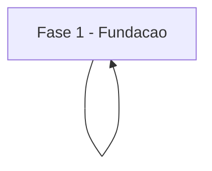

# Tarefas Projeto Exemplo - MVP

Escopo: backlog minimo conformante ao template canonico da skill create-tasks.

**Legenda de status:**
- `[ ]` Pendente
- `[~]` Em andamento
- `[x]` Concluido
- `[!]` Bloqueado

**Legenda de criticidade:**
- `[C]` Critico - Impacto financeiro direto ou bloqueante
- `[A]` Alto - Funcionalidade essencial
- `[M]` Medio - Necessario mas sem urgencia imediata

---

## FASE 1 - Fundacao

### 1.1 Setup do projeto `[A]`

- [ ] 1.1.1 criar repo
- [ ] 1.1.2 configurar CI
- [ ] 1.1.3 escrever testes de fundacao

### 1.2 Schema inicial `[C]`

- [ ] 1.2.1 migration base
- [ ] 1.2.2 seed de dados
- [ ] 1.2.3 testes de migration

---

## Matriz de Dependencias

## Resumo Quantitativo

| Fase | Tarefas | Subtarefas | Criticidade |
|------|---------|------------|-------------|
| 1 - Fundacao | 2 | 6 | C/A |
| **Total** | **2** | **6** | - |

## Escopo Coberto

| Item | Descricao | Fase |
|------|-----------|------|
| F1 | Fundacao e schema | 1 |

## Escopo Excluido

| Item | Descricao | Motivo |
|------|-----------|--------|
| auth | Autenticacao | Fora do MVP |
